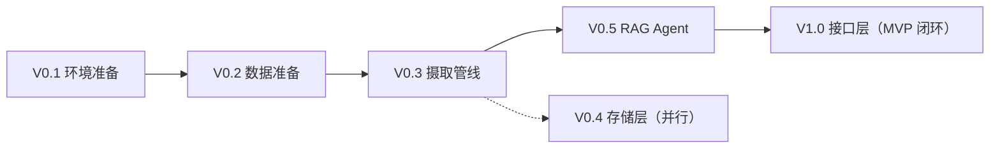

# CLAUDE.md — 给 Claude 的开发指导

> 本文件是 Gaokao RAG 项目的开发交接文档。**代码实现由 Claude 负责**，文档（README、docs/*、本文件）由 WorkBuddy 维护。修改文档需同步。

## 项目一句话

Gaokao RAG：帮助高中学生备考的 AI 助手（核心目的），MVP 聚焦数学。技术上基于 tRPC-Agent-Python 的多模态 RAG 系统，摄入真题 PDF + 专题讲义 + 错题，用 VLM 理解图形。具体功能（真题检索、知识点关联、复习建议、周报/月报）为候选方向，MVP 迭代中逐步明确。

## 分工边界

| 事项 | 负责方 |
| ------ | -------- |
| 代码实现（src/、scripts/、tests/） | Claude |
| 文档维护（README、docs/*、CLAUDE.md、config 骨架） | WorkBuddy |
| 框架参考 | 本地 tRPC-Agent 源码 `D:\AI_study\learn\trpc-agent-python` |
| 数据源 | ima「高考2026」知识库（233 条，含试卷/专题/错题） |

**规则**：

- 文档和代码有冲突时，先改代码对齐文档，或找 WorkBuddy 更新文档
- 新增架构级决策（新模块、改存储 schema、换模型）时，先同步给 WorkBuddy 更新文档再实现
- 代码里不要写死模型名/API Key，统一走环境变量 + config.toml

## 技术栈（已定，不要改）

- Python 3.13（由 uv 管理，与 `pyproject.toml` 一致）
- Agent 框架：**tRPC-Agent-Python**（`trpc-agent-py`），不是 LangChain 框架本体，但 Knowledge 层基于 LangChain 组件
- LLM：DeepSeek 官方 API（开发期写死 V4-Flash），OpenAI 兼容协议，通过 `OpenAIModel` 接入；**模型中立**，不绑定厂商
- VLM：Qwen 官方 API（DashScope），开发期写死 Qwen3.7-Flash（主力）/ Qwen3.7-Plus（复杂图形推理）；开源 Qwen3-VL-8B/32B 保留为备选通道（模型中立/自部署）
- 嵌入：Qwen3-Embedding-4B（DashScope API，与 VLM 同厂商一套 Key）；向量库：Chroma；元数据索引：SQLite
- PDF：PyMuPDF（主力）+ MinerU2.5-Pro（兜底）
- **用户入口：trpc-claw（QQ 官方 API + nanobot 通道适配器扩展）**，CLI + MCP + FastAPI 保留为开发/外部 Agent 接口

## 配置体系（config/logger 组合方案，2026-08-13 定）

**分层原则**：

- **敏感信息**（api-key/AppSecret）→ 环境变量（.env，gitignore）；**公开信息**（model/base_url/存储路径）→ `config.toml` 明文（可提交 git）
- **桥接**：config.toml 里写 `${VAR}` 占位符，运行时由 `_expand()` 从环境变量替换（沿用 AlgoNotes config.py 的设计）
- **组合方案**：框架 configs（RunConfig/重试/限制，管"Agent 怎么跑"）+ 自研 config.py（管"系统是什么"：模型/存储/QQ）——两者互补
- **日志**：MVP 开发期**直接用框架 logger，不自研**：`from trpc_agent_sdk.log import logger`，函数式 API（`logger.info/debug/warning/error/fatal`，支持 `extra={}` 自定义字段、`with_fields()` 绑定上下文）；V0.5 需要性能分析时再移植 AlgoNotes 双通道 logger（app.log 运营 + perf.log 性能，JSON Lines，trace_id 注入——LangSmith 换 Langfuse），通过 `set_logger()` 全局替换（实现 `BaseLogger` 接口）
- config.toml 草案见 [数据模型](docs/data_model.md) 或实现时参照：llm/vlm/embedding/mineru（模型+base_url+`${KEY}`）/qq（AppID/Secret）/store（路径）/logging

## 参考文档（先读这些再动手）

| 文档 | 内容 | 对应实现模块 |
| ------ | ------ | ------------- |
| `docs/architecture.md` | 系统架构、TeamAgent 编排、三层存储 | src/ 整体 |
| `docs/data_model.md` | SQLite schema、知识点树、Chroma metadata | src/store/ |
| `docs/ingestion/README.md` | PDF 摄取管线 7 阶段 | src/ingestion/ |
| `docs/agent/README.md` | TeamAgent 子 Agent 分工、委派策略、Prompt | src/agent/ |
| `docs/vlm_strategy.md` | VLM 选型、Prompt、描述粒度 | src/api/ + src/ingestion/ |
| `docs/mcp_interface.md` | MCP 工具清单 | scripts/ |
| `docs/im_interface.md` | trpc-claw QQ 接入（nanobot 通道适配器扩展） | scripts/ + 部署 |
| `docs/test.md` | **pytest 测试规范**（命名/fixture/mock/覆盖率——每个模块实现即测） | tests/ |
| `docs/onboarding.md` | 协作者学习路径（含 AI 搜索关键词） | 非实现文档，新人先读 |

## 版本路线（详见 docs/roadmap.md）



当前状态：**V0.1 进行中**（文档已完成，代码未开始）。

## 目录结构约定

```tree
gaokao_rag/
├── config.toml                # 系统配置
├── src/
│   ├── config.py              # 配置加载
│   ├── api/                   # 模型客户端层
│   ├── ingestion/             # 多模态摄取管线
│   ├── store/                 # 三层存储 + 知识点图谱
│   ├── rag/                   # RAG Agent 与检索器
│   ├── tools/                 # 自定义工具（VLM、知识点查询等）
│   └── mcp/                   # MCP Server
├── scripts/
│   ├── ingest.py              # 摄取 CLI
│   ├── chat.py                # 对话 CLI（开发调试）
│   └── mcp_server.py          # MCP Server 入口
├── data/
│   ├── raw/                   # 原始 PDF
│   ├── processed/             # 处理后的结构化数据
│   ├── chroma_db/             # 向量数据库
│   └── gaokao.db              # SQLite 索引
└── tests/                     # 测试
```

## 代码规范

- 所有异步操作使用 `async def`（tRPC-Agent 节点要求，防阻塞 EventLoop）
- Python 3.13 语法
- 类型注解完整
- docstring 中文，说明参数和返回值
- 配置从 `config.toml` + 环境变量读取，不硬编码
- 业务环境变量按模块命名（如 `DEEPSEEK_API_KEY`、`DASHSCOPE_API_KEY`、`MINERU_API_KEY`），不与 OpenClaw 的 `TRPC_AGENT_` 前缀冲突

## 关键决策记录（想改先问）

1. **项目愿景全科，MVP 聚焦数学单科** —— 学科是一级架构维度（存储/路由/图谱均含 subject 字段），MVP 只实现数学，扩科是数据+配置问题而非架构问题
2. **VLM 摄取时调用** —— 描述入库，查询时不重复调用
3. **知识点树形结构 + 动态构建** —— 路径枚举（Materialized Path：path 列 + 尾斜杠，防环 O(1)、子树前缀查询、移动批量替换），非扁平 tag；**树是数据驱动的**（LLM 开放式提取 → 归位/合并/挂载），非预定义 seed；**MVP 单用户一棵树**
4. **Chroma 单 Collection + metadata 过滤** —— 不按学科分 Collection
5. **tRPC-Agent 的 AgenticLangchainKnowledgeSearchTool** —— 让 LLM 自动构建过滤条件，不手写路由
6. **用户入口是 IM（QQ 主力）而非 MCP/CLI** —— 高考生零学习成本、无电脑也能用；TeamAgent 作为主 Agent 直接注册进 trpc-claw；QQ 通道走**官方 API（AppID/AppSecret）+ nanobot 原生 QQ channel + trpc-claw `_qq.py` 适配器扩展**（2026-08 调研修正：社区版 OpenClaw 的 `openclaw-qqbot` 插件与 trpc-claw 不兼容）；无封号风险
7. **模型中立，不国产化** —— 无比赛背书需求，架构上不绑定任何模型厂商（OpenAI 兼容协议抽象）；**开发期后台写死默认模型**：LLM = DeepSeek 官方 API（V4-Flash），VLM = Qwen 官方 API（DashScope），嵌入 = Qwen3-Embedding-4B（DashScope，2026-08 调研：中文 CMTEB 68.09 碾压 bge-m3、32k 长上下文整文档嵌入、与 VLM 同厂商一套 Key）；模型名/API Key 全部走 config.toml + 环境变量，用户理论上可自选模型
8. **MVP 单用户** —— 只服务作者的高三朋友；`user_id` 字段保留（固定单一值）为未来多用户预留，不做隔离逻辑
9. **数据源自给自足，不接题库网站** —— 只摄入"用户自己拥有的数据"（ima 导入 + 用户拍照/作业 + 用户上传解析）；不爬取组卷网等第三方题库（版权风险 + 无必要，解析可用户上传或 AI 生成）
10. **统一摄入范式** —— 任意文档上传（试卷/专题/作业/笔记）都走同一条逻辑：提取内容 → LLM 区分讲解段/题目段 → 回显题目清单（每题一句话概括）→ 用户批量决定去向（入库/错题/跳过）。系统不替用户做主
11. **知识点讲解 = 纯文本 RAG** —— 讲解段存 `knowledge_notes` 表（关联 topic_id），向量化为 knowledge_point chunk；不需要 VLM，比带图题目更简单
12. **检索不分"题目/知识点"意图** —— 两种 chunk 在同一 Collection 混合召回，LLM 综合组织（搜题目可总结方法，搜方法配例题）；ROUTER 只分 question/review/report/browse/ingest，不拆 knowledge
13. **TeamAgent 多 Agent 协作（主架构）** —— 一个 Leader 自由委派**查询侧 5 个 + 摄入侧 4 个**专业子 Agent：查询侧（意图识别/搜索信息/VLM 理解/聚合数据/输出整理）读数据，摄入侧（文档识别/结构识别/知识整理/入库决策）写数据；Leader 按需决定调谁/调几个/顺序，非固定模板。与 AlgoNotes 单 Agent 形成对比点。**已实测验证（2026-08-12，官方 examples/team）**：自由委派/多轮记忆/指令约束均通过；Leader prompt 必须写清完成标准 + 成员调用上限 + prompt 自洽。**2026-08-25 更新：GraphAgent 备用方案已移除**（trpc-agent 源码确认 TeamAgent 可用；`docs/agent/graph_fallback.md` 已删，REPORT_GEN 逻辑迁至 `docs/agent/retrieval/aggregate.md`）
13a. **摄入侧 Agent 化（2026-08-13 补充）** —— 摄入分两入口：**批量摄入**（ima 导出 PDF）走 CLI 脚本 `scripts/ingest.py`（开发者初始化）；**即时摄入**（学生 QQ 发照片/作业）走摄入侧 Agent（文档识别 → 结构识别 → 知识整理 → 入库决策），回显确认由入库决策 Agent 完成——学生侧唯一的资料录入入口
14. **可观测性 = Langfuse（自托管）** —— 框架内置 OpenTelemetry（invocation/agent_run/call_llm/execute_tool span 链），官方 `server/langfuse/` 模块对接 Langfuse（LangSmith 开源替代品）；V0.5 接入，自托管保证学生数据不出服务器
15. **Session 用 SqlSessionService（SQLite）** —— V0.5 接入，替代 quickstart 的内存版；长对话摘要机制（SummarizerSessionManager）V1.1 点亮；MemoryService 承接跨会话用户画像（V1.1+）；**给 LLM 传信息靠 prompt 不靠 session.state**（模型只看到 instruction + tools + events + 摘要）
