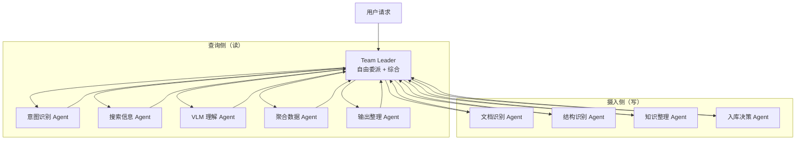
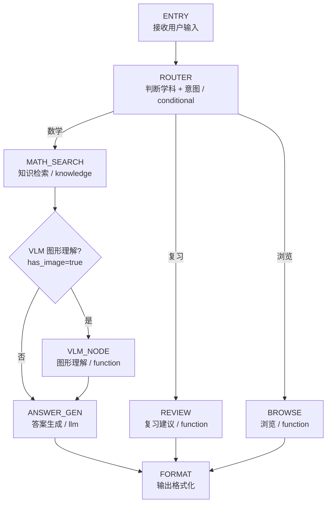

# Agent 编排与设计

## 概述

Gaokao RAG 的 Agent 层基于 tRPC-Agent-Python 的 **TeamAgent** 构建（多 Agent 协作模式）。这是与 AlgoNotes RAG（单 RAG Agent）拉开差距的核心差异点。

**核心架构**：一个 **Team Leader**（LLM）接收用户请求，**自由委派**任务给 5 个专业子 Agent（意图识别/搜索信息/VLM 理解/聚合数据/输出整理），再汇总成员结果生成最终答案。Leader 看问题灵活决定调谁、调几个、什么顺序——不是固定流程模板。

**为什么用 TeamAgent 而非 GraphAgent**：

- 职责解耦：每个子 Agent 独立测试/替换/升级（如换 VLM 模型只动 VLM Agent）
- 复杂度可管理：每个 Agent 的 prompt 只聚焦一个职责
- 灵活委派：Leader 按需调用，不同场景走不同成员组合
- **项目叙事**：单 Agent → 多 Agent 协作，是 README 亮点（对比 AlgoNotes）

> 注：GraphAgent 仍可作 TeamAgent 成员或底层编排，但主架构是 TeamAgent。

## TeamAgent 设计

### 团队结构

团队分**查询侧**（读数据，产生回答）和**摄入侧**（写数据，接收学生资料），共用同一个 Leader：



### 成员职责

**查询侧（读）**：

| 子 Agent | 职责 | 挂载能力 |
| --------- | ------ | --------- |
| **意图识别 Agent** | 判断用户意图（question/review/report/browse/**ingest**） | LLM 分类 |
| **搜索信息 Agent** | 混合检索（Chroma + SQLite，不分子意图） | LangchainKnowledgeSearchTool |
| **VLM 理解 Agent** | 图形描述（有图才调用） | VLM FunctionTool |
| **聚合数据 Agent** | 错题/作答统计、周报聚合（**读写** SQLite：errors/exam_attempts 统计 + periodic_reports 落库） | SQLite 查询/写入工具 |
| **输出整理 Agent** | 格式化 + 分片发送 | 纯 LLM |

**摄入侧（写）**：

| 子 Agent | 职责 | 挂载能力 |
| --------- | ------ | --------- |
| **文档识别 Agent** | 接收照片/PDF → 提取内容（图片走 VLM，PDF 走 PyMuPDF） | VLM + PyMuPDF 工具 |
| **结构识别 Agent** | 区分讲解段 vs 题目段 → **语义划分每题「题目/答案/解析」**（不依赖关键词）→ 生成题目清单（每题一句话概括） | LLM 分类 |
| **知识整理 Agent** | 知识点开放式提取 → 动态树归位/合并/挂载（写 topics） | 树维护工具（knowledge_tree FunctionTool） |
| **入库决策 Agent** | 回显题目清单 → 收集学生选择（入库/错题/跳过）→ 写 questions/errors | SQLite 写入工具 |

**设计要点**：

- 查询侧与摄入侧**共用底层工具**（VLM、SQLite），但职责相反——查询侧读、摄入侧写
- **批量摄入**（ima 导出 20 份 PDF）走 CLI 脚本 `scripts/ingest.py`（开发者初始化用），不占 Agent 团队
- **即时摄入**（学生 QQ 发作业/错题照片）走摄入侧 Agent——这是学生侧唯一的资料录入入口

### 知识整理 Agent 详解（动态树维护）

摄入链路的"树管家"。树的核心逻辑（路径枚举、防环、状态机）封装在 `store/db/topics.py`（独立模块，可单独测试），本 Agent 通过 FunctionTool 调用，**模块独立、Agent 不独立**——避免两个 Agent 管一棵树的职责重叠。

**动态构建四步**（与 `topics` 表设计对应）：

1. **开放式提取**：LLM 读取题目/讲解段，提取知识点名（不预定义候选集，允许树外新节点）
2. **查树归位**：`search_topic` 按 name/aliases 查——命中复用已有节点；未命中 `create_topic` 新建（挂根，status=pending）
3. **语义合并**：同义/近义表述（"离心率" vs "e=c/a"）`merge_topic` 归并到同一节点，**旧名归档进 aliases**（防树膨胀 + 保检索）
4. **挂载父节点**：`move_topic` 判定层级挂载（status=pending → active）

**Tool 清单（8 个，挂在本 Agent）**：

| Tool | 签名 | 用途 | 内建约束 |
| ---- | ---- | ---- | -------- |
| `search_topic` | (keyword, subject) → [node] | 按名字/别名模糊查节点 | 归位第一步，防重复创建 |
| `get_topic_subtree` | (node_id) → 子树 | 浏览/校验 | path 前缀查询 |
| `get_topic_ancestors` | (node_id) → 祖先链 | 挂载前校验 | 防环辅助 |
| `list_topics` | (subject, level, status) | tag 浏览/调试 | 按状态过滤 |
| `create_topic` | (name, parent_id, subject) → id | 新增节点 | 内部先 search 去重；新节点 status=pending |
| `add_alias` | (node_id, alias) | 同义表述归并 | 别名查重（防别名挂两个节点）|
| `merge_topic` | (source_id, target_id) | 语义合并 | 旧名→target aliases；merged 节点锁死 |
| `move_topic` | (node_id, new_parent_id) | 挂载/移动 | **防环强制**：新父 path 不以自身 path 开头（O(1)）|

**软删**：不提供 `delete_topic`（真删要级联处理子树 + 题目引用 + metadata），只用 `deactivate_topic`（status → inactive）。

**检索侧配合（树展开上卷）**：查询侧不走 Agent 调树——检索时直接调 `store/db/topics.py` 的 `expand_tag_names(node)`，取子树所有节点 name+aliases 并集作为过滤词，交给 `AgenticLangchainKnowledgeSearchTool` 对 `metadata.topic_tags` 做匹配，实现"问圆锥曲线 → 搜到椭圆/双曲线/抛物线的题"。

**4 条内建约束（写在 tool 内部，不依赖 LLM 自觉）**：防环（挂载前 O(1) path 比较）/ 防重（create 前强制 search，name+aliases 全局唯一）/ 合并幂等（merged 节点不可再操作）/ 软删（只 deactivate 不真删）。

### 委派策略（Leader 自由决定）

Leader 根据用户请求内容，自主决定：

- **调谁**：题目查询 → 意图+搜索+(VLM)+输出；周报 → 意图+聚合+输出；复习 → 意图+聚合+搜索+输出；**发题入库 → 意图+文档识别+结构识别+(知识整理)+入库决策**
- **调几个**：简单问题可只走 1-2 个成员；复杂问题多成员协作
- **什么顺序**：无固定模板，Leader 动态编排

**示例**：

- "椭圆离心率最值怎么求" → Leader 委派：意图识别 → 搜索信息 →（检测到图）VLM 理解 → 输出整理
- "生成周报" → Leader 委派：意图识别 → 聚合数据 → 输出整理
- "我的薄弱知识点" → Leader 委派：意图识别 → 聚合数据 →（找推荐题）搜索信息 → 输出整理
- "帮我存这道题/这道题我不会" → Leader 委派：意图识别（ingest）→ 文档识别 → 结构识别 → 回显清单 → 入库决策 → 输出整理

### 实现要点

```python
from trpc_agent_sdk.teams import TeamAgent
from trpc_agent_sdk.agents import LlmAgent

# 查询侧：5 个专业子 Agent
intent_agent = LlmAgent(name="intent", model=model, instruction=INTENT_PROMPT)
search_agent = LlmAgent(name="search", model=model, tools=[KnowledgeSearchTool()], ...)
vlm_agent = LlmAgent(name="vlm", model=model, tools=[VLMUnderstandTool()], ...)
aggregate_agent = LlmAgent(name="aggregate", model=model, tools=[ErrorStatsTool()], ...)
format_agent = LlmAgent(name="format", model=model, instruction=FORMAT_PROMPT)

# 摄入侧：4 个专业子 Agent
doc_agent = LlmAgent(name="doc_ingest", model=model, tools=[PDFExtractTool(), VLMImageTool()], ...)
struct_agent = LlmAgent(name="struct", model=model, instruction=STRUCT_PROMPT)
knowledge_agent = LlmAgent(name="knowledge_mgr", model=model, tools=[TopicWriteTool()], ...)
store_agent = LlmAgent(name="store", model=model, tools=[QuestionWriteTool(), ErrorWriteTool()], ...)

# Team Leader 自由委派（查询 + 摄入共用）
gaokao_team = TeamAgent(
    name="gaokao_team",
    leader=LlmAgent(model=model, instruction=LEADER_PROMPT),
    members=[intent_agent, search_agent, vlm_agent, aggregate_agent, format_agent,
             doc_agent, struct_agent, knowledge_agent, store_agent],
)

### 实现注意事项

1. **Leader 委派机制依赖 tRPC-Agent 的 TeamAgent 原生能力**：`trpc_agent_sdk.teams.TeamAgent` 的 leader 自动具备自由委派能力，不需要手写路由逻辑
2. **子 Agent 间通过 TeamAgent 内部消息传递共享结果**：每个子 Agent 的返回值自动汇入 Leader 的上下文，Leader 综合后决定下一步委派
3. **State 设计沿用 `GaokaoState`**：字段不变（subject / query_type / retrieved_docs / vlm_descriptions / answer / review_suggestion），reducer 字段 `execution_history` 记录子 Agent 委派链
4. **GraphAgent 保留为备用**：若 TeamAgent 在 tRPC-Agent 当前版本中不可用，退回 GraphAgent 条件路由方案（见下方"备用方案"）
5. **子 Agent 的 tools 是 FunctionTool**：VLM、知识点查询、错题统计等业务工具以 FunctionTool 形式挂到对应子 Agent，不走 MCP（MCP 仅对外暴露接口）

### 实测验证（2026-08-12，基于官方 `examples/team` + DeepSeek V4-Flash）

官方 team 示例（Leader + researcher/writer 协作）跑通，验证了 TeamAgent 三个关键能力：

| 验证项 | 观察结果 | 对设计的影响 |
|--------|---------|-------------|
| **Leader 自由委派** | Leader 自主决定"先取日期 → 派 researcher → 派 writer"，`delegate_to_member` 动态调用 | ✅ 主架构成立，"自由委派"是 Leader 自我状态检查 + 指令遵守 + 历史记忆的结合 |
| **多轮上下文记忆** | Turn 2 记得"上轮任务已完成/派过谁/日期已取过"（share_team_history 生效） | ✅ 学生追问"第二问呢"时 Leader 能记住题目上下文 |
| **指令约束执行** | Leader 引用 instruction 的 "delegate once per user request" 并遵守 | ✅ **Leader prompt 里的约束会被可靠执行** |

**Leader prompt 设计要点（实测得出的 3 条铁律）**：

1. **必须写清"任务完成的判断标准"**——实测 Leader 每一步会检查"还差什么"（"task is NOT finished, I need to..."）。不写清完成标准，Leader 可能提前收工或无限续派。示例："题目查询必须在给出带溯源的完整解题步骤后结束"
2. **必须写清"每个意图的成员调用上限"**——实测 Leader 会引用并遵守 "delegate to researcher only once"。示例："周报生成只派聚合+输出，不派 VLM；每个成员最多调用一次"
3. **子 Agent 的 prompt 必须自洽**——实测 researcher 的 instruction 写了 "keep reply within 50 characters"，与任务要求"详细总结"冲突，Agent 花大量推理纠结矛盾。**不要给子 Agent 互相矛盾的要求**

**可观测性（Langfuse）**：框架内置 OpenTelemetry（`invocation` span → `agent_run` / `call_llm` / `execute_tool` 子 span），官方提供 `server/langfuse/` 模块可对接 **Langfuse（LangSmith 的开源替代品，可自托管）**。V0.5 接入——TeamAgent 多 Agent 委派链用终端事件流看不清楚，Langfuse 的 trace 视图是调试刚需；自托管保证学生数据不出服务器。

## GraphAgent 设计（备用方案 / Fallback）

### 图结构



### 节点定义

#### 1. ENTRY 节点

```python
async def entry_node(state: GaokaoState) -> dict:
    """入口节点：接收用户输入"""
    user_input = state[STATE_KEY_USER_INPUT]
    return {
        "query": user_input,
        "execution_history": [{"node": "entry", "input": user_input}]
    }
```

#### 2. ROUTER 节点（学科路由 + 意图识别）

```python
async def subject_router(state: GaokaoState) -> dict:
    """
    LLM 节点：判断用户问题的学科和意图类型。
    MVP 阶段学科固定为"数学"（全科愿景下扩科时由 LLM 动态判断 subject）。
    """
    user_input = state[STATE_KEY_USER_INPUT]
    
    # 用 LLM 判断意图
    intent = await llm_classify_intent(user_input)
    # intent ∈ {"question", "review", "browse"}
    
    return {
        "subject": "数学",  # MVP 固定；扩科后改为 llm_classify_subject(user_input)
        "query_type": intent,
    }

def route_choice(state: GaokaoState) -> str:
    """条件路由函数"""
    intent = state["query_type"]
    if intent == "question":
        return "math_search"
    elif intent == "review":
        return "review_gen"
    elif intent == "report":
        return "report_gen"
    elif intent == "browse":
        return "browse"
    return "math_search"  # 默认
```

**路由逻辑**：

| 用户输入示例 | 意图 | 路由到 |
| ------------ | ------ | ------- |
| "帮我看看这道椭圆题怎么做" | question | math_search → vlm → answer_gen |
| "我的错题主要集中在哪些知识点" | review | review_gen |
| "帮我生成这周的周报" | report | report_gen |
| "这个月的月报怎么样" | report | report_gen |
| "列出2026年南昌一模的所有题目" | browse | browse |

#### 3. MATH_SEARCH 节点（混合知识检索）

```python
async def math_search_node(state: GaokaoState) -> dict:
    """
    Knowledge 节点：调用 LangchainKnowledgeSearchTool 检索。
    tRPC-Agent 的 AgenticLangchainKnowledgeSearchTool 会自动
    根据用户问题构建 KnowledgeFilterExpr。
    """
    # 这部分由 tRPC-Agent 的 knowledge node 自动处理
    # GraphAgent 支持 add_agent_node 或 add_knowledge_node
    # 检索结果写入 state.retrieved_docs
    pass
```

> **混合检索（设计说明）**：不区分"搜题目"还是"搜知识点"——题目 document 和讲解 document 在同一个 Collection，一起召回，由 LLM 综合组织答案：
>
> - 搜"离心率最值怎么求" → 可能命中题目 + 讲解，LLM 既给解法又总结方法
> - 搜"什么是分离参数法" → 命中讲解为主，LLM 自动带上相关例题
> - 搜题目也能总结方法，搜方法也要配例题——**两者天然互补，无需按意图拆分检索**

#### 4. VLM 节点（图形理解，条件触发）

```python
async def vlm_understand_node(state: GaokaoState) -> dict:
    """
    Function 节点：如果检索结果含有图像引用，
    调用 VLM 生成图形的文本描述。
    """
    descriptions = []
    for doc in state["retrieved_docs"]:
        if doc.get("has_image"):
            # Chroma metadata 不存 image_file_ids（SQLite 权威，见 data_model.md「Metadata 设计」）：
            # 用 doc_id 回查 questions 表取图片 file_id，再经 files 表解析路径
            image_file_ids = question_db.get_image_file_ids(doc["doc_id"])
            for file_id in image_file_ids:
                desc = await vlm_understand_image(
                    file_id, 
                    doc["content"]  # 题目文本作为上下文
                )
                descriptions.append(desc)
    
    return {"vlm_descriptions": descriptions}
```

**条件触发**：如果 `retrieved_docs` 中没有 `has_image=True` 的文档，跳过此节点。

#### 5. ANSWER_GEN 节点（答案生成）

```python
async def answer_generate_node(state: GaokaoState) -> dict:
    """
    LLM 节点：基于检索结果 + VLM 描述，生成解题思路。
    """
    # 构建上下文
    context = format_retrieved_docs(state["retrieved_docs"])
    vlm_context = "\n".join(state.get("vlm_descriptions", []))
    
    prompt = f"""你是一位经验丰富的高中数学教师。请基于以下检索到的题目和知识点，回答用户的问题。

要求：
1. 给出清晰的解题思路，分步骤说明
2. 如果涉及图形，结合图形描述分析
3. 每个关键步骤标注知识点来源
4. 如果检索结果不足，说明缺少什么信息

检索结果：
{context}

图形描述：
{vlm_context or "无图形"}

用户问题：{state[STATE_KEY_USER_INPUT]}
"""
    answer = await llm_generate(prompt)
    return {"answer": answer}
```

#### 6. REVIEW_GEN 节点（复习建议生成）

```python
async def review_generate_node(state: GaokaoState) -> dict:
    """
    Function 节点：基于用户错题分布，生成复习建议。
    """
    user_id = state.get("user_id", "default")
    
    # 从 SQLite 查询错题分布
    error_stats = query_error_distribution(user_id)
    # {topic_name: error_count, ...}
    # 可选增强：附带 error_summary 列表（LLM 生成的错因总结），
    # 让复习建议基于"具体错因"而非仅"错题数量"
    
    # 找出薄弱知识点
    weak_topics = find_weak_topics(error_stats)
    
    # 生成建议
    suggestion = await llm_generate_review_suggestion(weak_topics, error_stats)
    
    return {"review_suggestion": suggestion}
```

#### 7. REPORT_GEN 节点（周报 / 月报生成）

**用户需求**：新高三的朋友最想体验的功能——"通过指令唤起周报/月报，给出建议针对性练习的知识点"。

```python
async def report_generate_node(state: GaokaoState) -> dict:
    """
    Function 节点：按周期（周/月）聚合错题，生成复习报告。
    指令示例："生成周报" / "这个月的月报" / "上周的学习报告"
    """
    user_id = state.get("user_id", "default")
    period_type = state["period_type"]      # "weekly" | "monthly"，由 ROUTER 解析
    period_start, period_end = resolve_period_window(period_type)
    
    # ① 幂等检查：同周期已生成过，直接返回缓存
    cached = get_report(user_id, period_type, period_start, period_end)
    if cached:
        return {"report": cached}
    
    # ② 聚合窗口内错题统计（errors 表）
    stats = aggregate_errors(user_id, period_start, period_end)
    # {total_errors, resolved_errors, resolve_rate, by_topic: [{topic, error_count}]}
    
    # ②b 聚合窗口内整卷作答（exam_attempts 表）
    attempt_stats = aggregate_attempts(user_id, period_start, period_end)
    # {attempt_count, avg_score, weak_question_types: [{qtype, lost_score}]}
    
    # ③ 对比上一周期 → 趋势
    prev_stats = aggregate_errors(user_id, prev_period(period_start, period_end))
    trend = compute_trend(stats, prev_stats)
    
    # ④ LLM 生成针对性练习建议（结合知识点图谱 + 作答失分分析）
    recommendation = await llm_generate_report_recommendation(stats, attempt_stats, trend)
    
    # ⑤ 写入 periodic_reports 表（UNIQUE 幂等）
    report = save_report(user_id, period_type, period_start, period_end,
                         stats, trend, recommendation)
    
    return {"report": report}
```

**报告结构**（Markdown 渲染）：

```markdown
## 📊 数学学习周报（8.4 - 8.10）

### 本周概况
- 新增错题：12 道 | 已掌握：4 道 | 掌握率：33%
- 较上周：错题 +3 道（↑33%），掌握率持平

### 薄弱知识点 Top 3
| 知识点 | 错题数 | 占比 | 趋势 |
|--------|-------|------|------|
| 导数应用（恒成立） | 4 | 33% | ↑ 恶化 |
| 圆锥曲线（离心率） | 3 | 25% | 持平 |
| 立体几何（二面角） | 2 | 17% | 新增 |

### 针对性练习建议
1. **导数恒成立问题**（重点）：本周错 4 道，正确率 0%。
   → 建议先复习「分离参数法」专题（data/files/raw/专题/导数_1.pdf）
   → 推荐练习：2026南昌一模 第15题、2026深圳调研 第20题
2. **圆锥曲线离心率**：错 3 道。
   → 建议复习「焦点三角形」模型，推荐同类题 3 道
3. **立体几何二面角**：本周新增薄弱点。
   → 建议从「建系求法向量」基础开始

### 下周期待
- 聚焦 1-2 个薄弱点，不要贪多
- 本周未掌握的 8 道题建议重新做一遍
```

**关键设计点**：

- **统计快照落库**（`periodic_reports` 表）：报告生成时固化统计，历史报告不漂移
- **幂等**：同一用户同一周期重复唤起 → 返回缓存，不重复生成；`--force` 可强制刷新
- **趋势对比**：与上一周期对比，识别"恶化/改善/新增"的薄弱点——这对"针对性练习"是关键信号
- **练习建议带推荐题源**：结合知识点图谱 + Chroma 检索，推荐具体题目（哪份试卷第几题）

### Graph 组装

```python
def create_gaokao_agent() -> GraphAgent:
    graph = StateGraph(GaokaoState)
    
    # 添加节点
    graph.add_node("entry", entry_node)
    graph.add_node("router", subject_router)
    graph.add_node("math_search", knowledge_search_node)  # 或 add_knowledge_node
    graph.add_node("vlm", vlm_understand_node)
    graph.add_node("answer", answer_generate_node)
    graph.add_node("review", review_generate_node)
    graph.add_node("browse", browse_node)
    graph.add_node("format", format_output_node)
    
    # 设置入口
    graph.set_entry_point("entry")
    
    # 添加边
    graph.add_edge("entry", "router")
    
    # 条件路由
    path_map = {
        "math_search": "math_search",
        "review": "review",
        "report": "report",
        "browse": "browse",
    }
    graph.add_conditional_edges("router", route_choice, path_map)
    
    # math 分支
    graph.add_conditional_edges(
        "math_search",
        lambda s: "vlm" if any(d.get("has_image") for d in s["retrieved_docs"]) else "answer",
        {"vlm": "vlm", "answer": "answer"}
    )
    graph.add_edge("vlm", "answer")
    graph.add_edge("answer", "format")
    
    # review 分支
    graph.add_edge("review", "format")
    
    # report 分支
    graph.add_edge("report", "format")
    
    # browse 分支
    graph.add_edge("browse", "format")
    
    # 编译
    return GraphAgent(graph=graph.compile())
```

## Session 与 Memory

### Session（单会话上下文）

利用 tRPC-Agent 的 `SessionService`：

```python
from trpc_agent_sdk.sessions import InMemorySessionService
# 或 SqlSessionService（持久化）

session_service = SqlSessionService(db_path="data/gaokao.db")

runner = Runner(
    app_name="gaokao_rag",
    agent=gaokao_agent,
    session_service=session_service,
)
```

用户的多轮对话上下文自动管理——"刚才那道题如果改一下参数呢"这种追问天然支持。

### Memory（跨会话记忆）

利用 tRPC-Agent 的 `MemoryService`：

```python
from trpc_agent_sdk.memory import SqlMemoryService

memory_service = SqlMemoryService(db_path="data/gaokao.db")
```

存储内容：

- 用户的错题历史
- 常错的知识点
- 上次复习到了哪个知识点
- 用户的薄弱项画像

## Prompt 策略

### 系统 Prompt

```
你是一位帮助高中学生备考的 AI 助手（当前支持数学，后续扩展到理化生等科目）。

你的职责：
1. 帮助检索和理解题目
2. 提供清晰的解题思路，而非直接给出答案
3. 关联知识点，帮助用户建立知识体系
4. 根据错题分布给出复习建议

原则：
- 解题过程分步骤，每步标注知识点
- 涉及图形时结合 VLM 描述分析
- 鼓励用户思考，适当追问而非全盘输出
- 如果用户的问题描述不完整，先确认再检索
```

### 检索增强 Prompt

通过 tRPC-Agent 的 `prompt_template` 注入检索结果：

```python
RAG_PROMPT = """基于以下检索到的题目和知识点回答用户问题。

检索结果：
{context}

图形描述：
{vlm_context}

用户问题：{query}

要求：
1. 解题思路分步骤
2. 标注每步用到的知识点
3. 引用来源（哪份试卷第几题）
"""
```

## 对外接口

### CLI 交互

```bash
# 交互式问答
python scripts/chat.py

# 单次查询
python scripts/chat.py "椭圆离心率最值怎么求"

# 复习模式
python scripts/chat.py --mode review
```

### FastAPI HTTP

利用 tRPC-Agent 内置的 FastAPI 服务：

```python
from trpc_agent_sdk.server import create_fastapi_app

app = create_fastapi_app(
    agent=gaokao_agent,
    session_service=session_service,
    memory_service=memory_service,
)
```

### MCP Server

利用 tRPC-Agent 的 MCPToolset，暴露以下工具：

| MCP 工具 | 描述 |
| --------- | ------ |
| `search_questions` | 按知识点/题型/年份检索题目 |
| `get_question_detail` | 获取题目完整信息（含 VLM 描述） |
| `get_error_stats` | 获取用户错题统计 |
| `get_review_plan` | 获取/生成复习计划 |
| `get_knowledge_tree` | 获取知识点树形结构 |
| `add_error` | 添加错题记录 |
