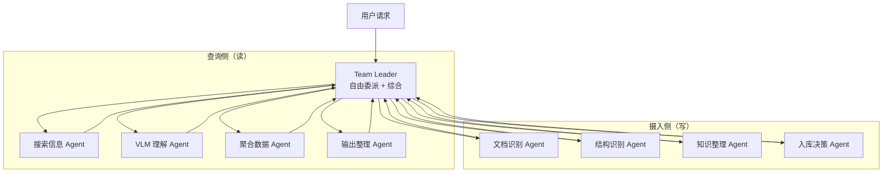
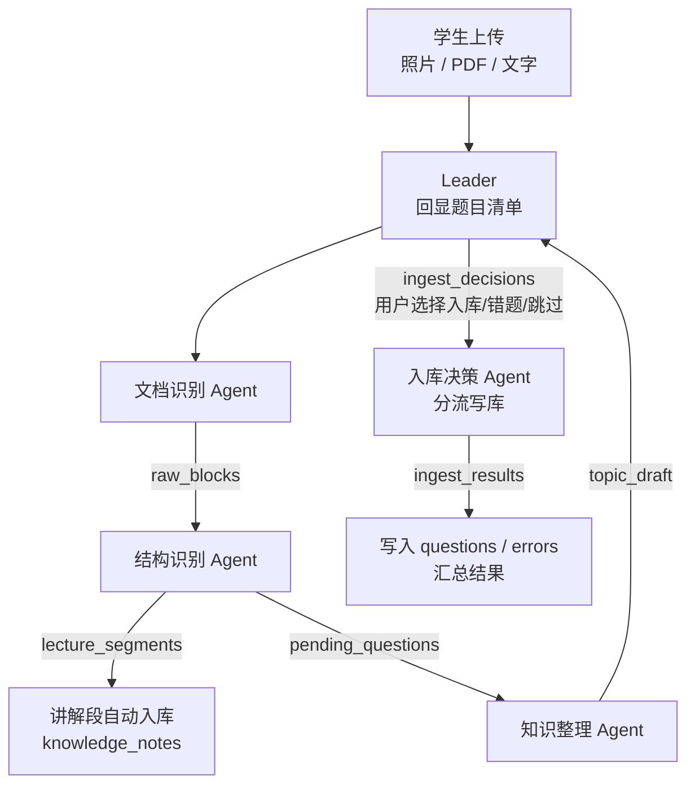

# Agent 编排设计

> 本目录是原 `docs/agent.md` 拆分后的 Agent 编排文档。**目录结构与 `src/agent/` 一一对应：每个 `.py` 文件对应一个 `.md` 文件**。整体架构为 TeamAgent（GraphAgent 备用方案已移除，2026-08-25）。

## 概述

Gaokao RAG 的 Agent 层基于 tRPC-Agent-Python 的 **TeamAgent** 构建（多 Agent 协作模式）。这是与 AlgoNotes RAG（单 RAG Agent）拉开差距的核心差异点。

**核心架构**：一个 **Team Leader**（LLM）接收用户请求，**自由委派**任务给 4 个查询侧子 Agent（搜索信息/VLM 理解/聚合数据/输出整理）+ 4 个摄入侧子 Agent（文档识别/结构识别/知识整理/入库决策），再汇总成员结果生成最终答案。Leader 看问题灵活决定调谁、调几个、什么顺序——不是固定流程模板。**意图识别不是独立子 Agent，而是 Leader 系统提示词内的一项路由能力**（系统提示词列出已实现子 Agent 清单，Leader 自行匹配意图后委派，2026-08-28 决策，详见 [leader.md](leader.md)）。

**为什么用 TeamAgent 而非 GraphAgent**：

- 职责解耦：每个子 Agent 独立测试/替换/升级（如换 VLM 模型只动 VLM Agent）
- 复杂度可管理：每个 Agent 的 prompt 只聚焦一个职责
- 灵活委派：Leader 按需调用，不同场景走不同成员组合
- **项目叙事**：单 Agent → 多 Agent 协作，是 README 亮点（对比 AlgoNotes）

> 注：GraphAgent 曾作为备用方案，但 trpc-agent 源码已确认 TeamAgent 设计可用（2026-08-12 实测跑通），备用方案已移除（2026-08-25）。主架构即 TeamAgent。

## 团队结构

团队分**查询侧**（读数据，产生回答）和**摄入侧**（写数据，接收学生资料），共用同一个 Leader：



### 成员职责：查询侧（读）

| 子 Agent | 职责 | 挂载能力 |
| --------- | ------ | --------- |
| **搜索信息 Agent** | 混合检索（Chroma + SQLite，不分子意图） | AgenticLangchainKnowledgeSearchTool |
| **VLM 理解 Agent** | 图形描述（有图才调用） | VLM FunctionTool |
| **聚合数据 Agent** | 错题/作答统计、周报聚合（**读写** SQLite：errors/exam_attempts 统计 + periodic_reports 落库） | SQLite 查询/写入工具 |
| **输出整理 Agent** | 格式化 + 分片发送 | 纯 LLM |

### 成员职责：摄入侧（写）

| 子 Agent | 职责 | 挂载能力 |
| --------- | ------ | --------- |
| **文档识别 Agent** | 接收照片/PDF → 提取内容（图片走 VLM，PDF 走 PyMuPDF） | VLM + PyMuPDF 工具 |
| **结构识别 Agent** | 区分讲解段 vs 题目段 → **语义划分每题「题目/答案/解析」**（不依赖关键词）→ 生成题目清单（每题一句话概括） | LLM 分类 |
| **知识整理 Agent** | 知识点提取 → tag 归位/别名归并（写 topics） | tag CRUD 工具（topics FunctionTool） |
| **入库决策 Agent** | 消费题目清单 + 用户去向（入库/错题/跳过）→ 写 questions/errors（**回显由 Leader 管理**） | SQLite 写入工具 |

**设计要点**：

- 查询侧与摄入侧**共用底层工具**（VLM、SQLite），但职责相反——查询侧读、摄入侧写
- **上下文隔离（函数式委派，2026-08-28）**：子 Agent 默认只拿 Leader 打包的格式化输入、输出结构化结果，不共享全量对话记录（框架 `override_messages` 机制，`share_member_interactions` 默认关）；只有 Leader 看全量对话——回显/确认/追问/上下文打包都集中 Leader（详见 [leader.md](leader.md)）
- **批量摄入**（ima 导出 20 份 PDF）走 CLI 脚本 `scripts/ingest.py`（开发者初始化用），不占 Agent 团队
- **即时摄入**（学生 QQ 发作业/错题照片）走摄入侧 Agent——这是学生侧唯一的资料录入入口
- 分层边界：`src/agent/ingestion/`（摄入侧子 Agent，含 LLM）与 `src/ingestion/`（写门面，无 LLM）是两层不同概念；子 Agent 只做意图判断与编排，具体存储读写一律委托给两个门面（详见 [architecture.md](../architecture.md)）

## 摄入侧数据流与 State 契约

学生拍照/发文档触发 `ingest` 意图后，摄入侧 4 个子 Agent 依次协作，通过 `GaokaoState` 传递中间产物：



**State 契约字段**（摄入侧新增）：

| 字段 | 产出者 | 内容 | 消费方 |
|------|--------|------|--------|
| `raw_blocks` | 文档识别 | 结构化文本块 + 图像列表 + 坐标信息 | 结构识别 |
| `pending_questions` | 结构识别 | 题目清单（每题：一句话概括 + 题目 / 答案 / 解析三段 + 关联图像 / 来源（source_hint）；不留原文块） | 知识整理、Leader（回显）、入库决策 |
| `lecture_segments` | 结构识别 | 讲解段文本列表 | 自动入库（knowledge_notes） |
| `topic_draft` | 知识整理 | 每题知识点草案（topic_name 列表，待归位） | 入库决策 |
| `ingest_decisions` | 用户（Leader 收集） | 每题去向（入库 / 错题 / 跳过） | 入库决策 |
| `ingest_results` | 入库决策 | 写入结果（question_id / doc_id） | 输出整理 |

**4 个澄清要点**：

1. **文档识别只提取不写库**：`raw_blocks` 是内存态，由结构识别消费，不落任何表
2. **讲解段自动入库、题目才回显**：`lecture_segments` 直接写 knowledge_notes（无需用户确认）；只有题目进回显清单
3. **知识整理双路由**：题目段标注 → `question_topics` 关联；讲解段标注 → `knowledge_notes.topic_tags`。两者都走 tag 归位原语（见 [ingestion/knowledge_organize.md](ingestion/knowledge_organize.md)）
4. **错题先题后错**：标记「错题」的题**先** `ingest_question` 入库、**再**由错题本体系调 `ingest_error(question_id, user_reflection)` 写错因，杜绝循环依赖（见 [ingestion/storage_decision.md](ingestion/storage_decision.md)）

## 目录导航（与 src/agent/ 一一对应）

| 本文档 | 对应 `src/agent/` | 内容 |
|--------|-------------------|------|
| [README.md](README.md) | （包说明） | 总览、团队结构、摄入侧数据流契约、导航 |
| [leader.md](leader.md) | `leader.py` | TeamLeader 编排、委派策略、实测 3 铁律、Langfuse |
| [tools/README.md](tools/README.md) | （工具总览） | FunctionTool 挂载矩阵与门面边界 |
| [tools/ingest_tool.md](tools/ingest_tool.md) | `tools/ingest_tool.py` | 摄入工具（写门面适配层：提取 / VLM / 知识点归位 / 题目摄入） |
| [tools/retrieve_tool.md](tools/retrieve_tool.md) | `tools/retrieve_tool.py` | 检索工具（读门面适配层 + 框架检索工具介绍） |
| [ingestion/doc_recognition.md](ingestion/doc_recognition.md) | `ingestion/doc_recognition.py` | 文档识别 Agent |
| [ingestion/structure_recognition.md](ingestion/structure_recognition.md) | `ingestion/structure_recognition.py` | 结构识别 Agent |
| [ingestion/knowledge_organize.md](ingestion/knowledge_organize.md) | `ingestion/knowledge_organize.py` | 知识整理 Agent |
| [ingestion/storage_decision.md](ingestion/storage_decision.md) | `ingestion/storage_decision.py` | 入库决策 Agent |
| [retrieval/search.md](retrieval/search.md) | `retrieval/search.py` | 搜索信息 Agent |
| [retrieval/vlm.md](retrieval/vlm.md) | `retrieval/vlm.py` | VLM 理解 Agent（查询侧） |
| [retrieval/aggregate.md](retrieval/aggregate.md) | `retrieval/aggregate.py` | 聚合数据 Agent |
| [retrieval/output.md](retrieval/output.md) | `retrieval/output.py` | 输出整理 Agent |

## Skill 与 Agent prompt 的分工（2026-08-27）

**结论**：纯 LLM 子 Agent 的 prompt **不抽取为 Skill**，留在各自 agent 的 `instruction` 中（为便于维护可独立成 `prompts.py` 常量模块，参考 tRPC-Agent-Python `examples/skills/agent/prompts.py` 的写法）。

**判断标准**：Skill 的语义是「按需拉取、可多入口复用的领域指令」；agent 的系统提示词是「每次请求必注入的角色定义」——一对一、无复用、无按需场景，抽成 Skill 只会多一轮 `skill_load` 调用，是形式主义。

| 子 Agent | prompt 位置 | 说明 |
|----------|------------|------|
| 意图路由 | 内联 `src/agent/leader.py` 的 `LEADER_INSTRUCTION`（2026-08-28 决策，非独立 Agent） | 系统提示词内置子 Agent 能力清单 + 意图集合表，Leader 匹配后委派（query_type / period_type 由 Leader 写入） |
| 结构识别 | `src/agent/ingestion/structure_recognition.py` 的 instruction（可抽 `prompts.py`） | 语义切分「讲解段 / 题目段」；每道题目（切出的题目段或零散单题）都 `skill_load question-organize` 归一为三段，讲解段不过 Skill |
| 输出整理 | `src/agent/retrieval/output.py` 的 instruction（可抽 `prompts.py`） | 排版 + 溯源引用 + 分片发送 |

**真正的 Skill（仅一个）**：`question-organize`（[skills/question-organize.md](skills/question-organize.md)）——「单个题目单元（整篇切出的题目段 / 零散单题）→ 题目/答案/解析三段」是**可复用的领域指令**：由结构识别 Agent 对每题逐题 `skill_load` 执行、将来可被其他入口复用，且有明确的「何时加载」触发条件（讲解段不加载），才符合渐进式披露的适用场景。

**Skill 挂载约束（2026-08-28 新增）**：使用 Skill 的子 Agent 通过共享构造 `create_skill_tool_set(ALLOWED_SKILLS)`（`src/agent/skills/__init__.py`）挂载——`ALLOWED_SKILLS` 白名单烘焙进仓库（名单外不可见、不可加载，框架层硬约束），`before_agent_callback` 收紧 `tool_profile`（knowledge_only / full）。详见 [skills/README.md](skills/README.md)。

**边界**：保留 sub-agent 的 Leader 委派与 `GaokaoState` 回填结构；知识整理（挂 ingest_tool 的 KnowledgeTool）、聚合数据（经门面读写 SQLite）等挂载工具的子 Agent 不涉及 prompt 萃取。

## Session 与 Memory

### Session（单会话上下文）

利用 tRPC-Agent 的 `SessionService`：

```python
from trpc_agent_sdk.sessions import InMemorySessionService
# 或 SqlSessionService（持久化）

session_service = SqlSessionService(db_path="data/gaokao.db")

runner = Runner(
    app_name="gaokao_rag",
    agent=gaokao_agent,
    session_service=session_service,
)
```

用户的多轮对话上下文自动管理——"刚才那道题如果改一下参数呢"这种追问天然支持。

### Memory（跨会话记忆）

利用 tRPC-Agent 的 `MemoryService`：

```python
from trpc_agent_sdk.memory import SqlMemoryService

memory_service = SqlMemoryService(db_path="data/gaokao.db")
```

存储内容：

- 用户的错题历史
- 常错的知识点
- 上次复习到了哪个知识点
- 用户的薄弱项画像

## Prompt 策略

### 系统 Prompt

```
你是一位帮助高中学生备考的 AI 助手（当前支持数学，后续扩展到理化生等科目）。

你的职责：
1. 帮助检索和理解题目
2. 提供清晰的解题思路，而非直接给出答案
3. 关联知识点，帮助用户建立知识体系
4. 根据错题分布给出复习建议

原则：
- 解题过程分步骤，每步标注知识点
- 涉及图形时结合 VLM 描述分析
- 鼓励用户思考，适当追问而非全盘输出
- 如果用户的问题描述不完整，先确认再检索
```

### 检索增强 Prompt

通过 tRPC-Agent 的 `prompt_template` 注入检索结果：

```python
RAG_PROMPT = """基于以下检索到的题目和知识点回答用户问题。

检索结果：
{context}

图形描述：
{vlm_context}

用户问题：{query}

要求：
1. 解题思路分步骤
2. 标注每步用到的知识点
3. 引用来源（哪份试卷第几题）
"""
```

## 对外接口

### CLI 交互

```bash
# 交互式问答
python scripts/chat.py

# 单次查询
python scripts/chat.py "椭圆离心率最值怎么求"

# 复习模式
python scripts/chat.py --mode review
```

### FastAPI HTTP

利用 tRPC-Agent 内置的 FastAPI 服务：

```python
from trpc_agent_sdk.server import create_fastapi_app

app = create_fastapi_app(
    agent=gaokao_agent,
    session_service=session_service,
    memory_service=memory_service,
)
```

### MCP Server

利用 tRPC-Agent 的 MCPToolset，暴露以下工具：

| MCP 工具 | 描述 |
| --------- | ------ |
| `search_questions` | 按知识点/题型/年份检索题目 |
| `get_question_detail` | 获取题目完整信息（含 VLM 描述） |
| `get_error_stats` | 获取用户错题统计 |
| `get_review_plan` | 获取/生成复习计划 |
| `add_error` | 添加错题记录 |
| `list_topics` | 列出所有知识点 tag |
| `search_topic` | 按名字/别名搜索知识点 tag |
