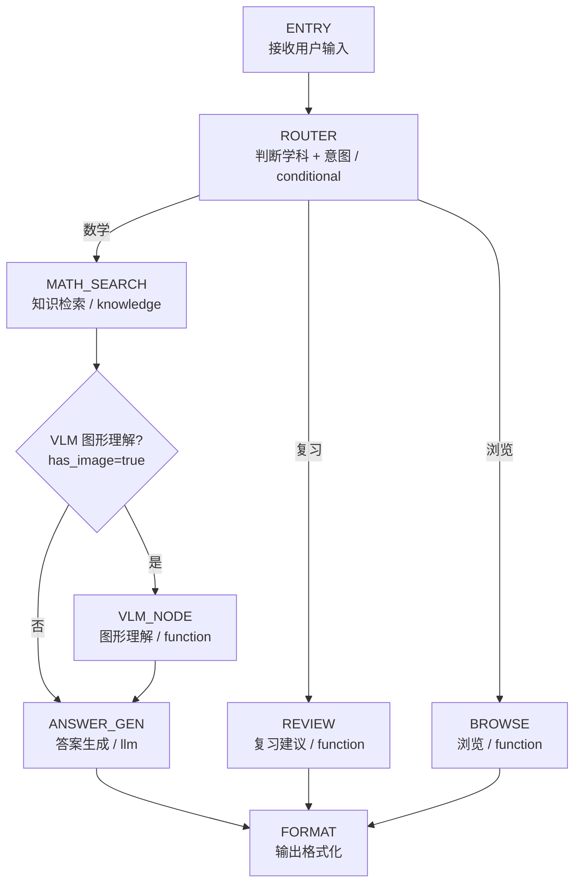

# GraphAgent 设计（备用方案 / Fallback）

> 若 TeamAgent 在 tRPC-Agent 当前版本不可用，退回 GraphAgent 条件路由方案。主架构仍是 TeamAgent（见 [README.md](README.md)）。

## 图结构



## 节点定义

### 1. ENTRY 节点

```python
async def entry_node(state: GaokaoState) -> dict:
    """入口节点：接收用户输入"""
    user_input = state[STATE_KEY_USER_INPUT]
    return {
        "query": user_input,
        "execution_history": [{"node": "entry", "input": user_input}]
    }
```

### 2. ROUTER 节点（学科路由 + 意图识别）

```python
async def subject_router(state: GaokaoState) -> dict:
    """
    LLM 节点：判断用户问题的学科和意图类型。
    MVP 阶段学科固定为"数学"（全科愿景下扩科时由 LLM 动态判断 subject）。
    """
    user_input = state[STATE_KEY_USER_INPUT]
    
    # 用 LLM 判断意图
    intent = await llm_classify_intent(user_input)
    # intent ∈ {"question", "review", "browse", "report"}
    
    return {
        "subject": "数学",  # MVP 固定；扩科后改为 llm_classify_subject(user_input)
        "query_type": intent,
    }

def route_choice(state: GaokaoState) -> str:
    """条件路由函数"""
    intent = state["query_type"]
    if intent == "question":
        return "math_search"
    elif intent == "review":
        return "review_gen"
    elif intent == "report":
        return "report_gen"
    elif intent == "browse":
        return "browse"
    return "math_search"  # 默认
```

**路由逻辑**：

| 用户输入示例 | 意图 | 路由到 |
| ------------ | ------ | ------- |
| "帮我看看这道椭圆题怎么做" | question | math_search → vlm → answer_gen |
| "我的错题主要集中在哪些知识点" | review | review_gen |
| "帮我生成这周的周报" | report | report_gen |
| "这个月的月报怎么样" | report | report_gen |
| "列出2026年南昌一模的所有题目" | browse | browse |

> **period_type 解析**：`query_type="report"` 时，ROUTER 进一步把用户请求解析为 `"weekly"` / `"monthly"`，写入 `GaokaoState.period_type`，供 REPORT_GEN 节点使用（2026-08-20 决策）。

### 3. MATH_SEARCH 节点（混合知识检索）

```python
async def math_search_node(state: GaokaoState) -> dict:
    """
    Knowledge 节点：调用 AgenticLangchainKnowledgeSearchTool 检索。
    tRPC-Agent 的 AgenticLangchainKnowledgeSearchTool 会自动
    根据用户问题构建 KnowledgeFilterExpr。
    """
    # 这部分由 tRPC-Agent 的 knowledge node 自动处理
    # GraphAgent 支持 add_agent_node 或 add_knowledge_node
    # 检索结果写入 state.retrieved_docs
    pass
```

> **混合检索（设计说明）**：不区分"搜题目"还是"搜知识点"——题目 document 和讲解 document 在同一个 Collection，一起召回，由 LLM 综合组织答案：
>
> - 搜"离心率最值怎么求" → 可能命中题目 + 讲解，LLM 既给解法又总结方法
> - 搜"什么是分离参数法" → 命中讲解为主，LLM 自动带上相关例题
> - 搜题目也能总结方法，搜方法也要配例题——**两者天然互补，无需按意图拆分检索**

### 4. VLM 节点（图形理解，条件触发）

```python
async def vlm_understand_node(state: GaokaoState) -> dict:
    """
    Function 节点：如果检索结果含有图像引用，
    调用 VLM 生成图形的文本描述。
    """
    descriptions = []
    for doc in state["retrieved_docs"]:
        if doc.get("has_image"):
            # Chroma metadata 不存 image_file_ids（SQLite 权威，见 vector/vector_store.md「Metadata 格式与过滤语义」）：
            # doc_id 是 "q_42" 两段式，需解析出 questions.id（42）再回查
            entity, qid_str = doc["doc_id"].split("_", 1)
            if entity == "q":
                question_id = int(qid_str)
                image_file_ids = question_db.get_image_file_ids(question_id)
            else:
                continue  # kn_* 是讲解 document，无图片
            for file_id in image_file_ids:
                desc = await vlm_understand_image(
                    file_id, 
                    doc["content"]  # 题目文本作为上下文
                )
                descriptions.append(desc)
    
    return {"vlm_descriptions": descriptions}
```

**条件触发**：如果 `retrieved_docs` 中没有 `has_image=True` 的文档，跳过此节点。

### 5. ANSWER_GEN 节点（答案生成）

```python
async def answer_generate_node(state: GaokaoState) -> dict:
    """
    LLM 节点：基于检索结果 + VLM 描述，生成解题思路。
    """
    # 构建上下文
    context = format_retrieved_docs(state["retrieved_docs"])
    vlm_context = "\n".join(state.get("vlm_descriptions", []))
    
    prompt = f"""你是一位经验丰富的高中数学教师。请基于以下检索到的题目和知识点，回答用户的问题。

要求：
1. 给出清晰的解题思路，分步骤说明
2. 如果涉及图形，结合图形描述分析
3. 每个关键步骤标注知识点来源
4. 如果检索结果不足，说明缺少什么信息

检索结果：
{context}

图形描述：
{vlm_context or "无图形"}

用户问题：{state[STATE_KEY_USER_INPUT]}
"""
    answer = await llm_generate(prompt)
    return {"answer": answer}
```

### 6. REVIEW_GEN 节点（复习建议生成）

```python
async def review_generate_node(state: GaokaoState) -> dict:
    """
    Function 节点：基于用户错题分布，生成复习建议。
    """
    user_id = state.get("user_id", "default")
    
    # 从 SQLite 查询错题分布
    error_stats = query_error_distribution(user_id)
    # {topic_name: error_count, ...}
    # 可选增强：附带 error_summary 列表（LLM 生成的错因总结），
    # 让复习建议基于"具体错因"而非仅"错题数量"
    
    # 找出薄弱知识点
    weak_topics = find_weak_topics(error_stats)
    
    # 生成建议
    suggestion = await llm_generate_review_suggestion(weak_topics, error_stats)
    
    return {"review_suggestion": suggestion}
```

### 7. REPORT_GEN 节点（周报 / 月报生成）

**用户需求**：新高三的朋友最想体验的功能——"通过指令唤起周报/月报，给出建议针对性练习的知识点"。

```python
async def report_generate_node(state: GaokaoState) -> dict:
    """
    Function 节点：按周期（周/月）聚合错题，生成复习报告。
    指令示例："生成周报" / "这个月的月报" / "上周的学习报告"
    """
    user_id = state.get("user_id", "default")
    period_type = state["period_type"]      # "weekly" | "monthly"，由 ROUTER 解析
    period_start, period_end = resolve_period_window(period_type)
    
    # ① 幂等检查：同周期已生成过，直接返回缓存
    cached = get_report(user_id, period_type, period_start, period_end)
    if cached:
        return {"report": cached}
    
    # ② 聚合窗口内错题统计（errors 表）
    stats = aggregate_errors(user_id, period_start, period_end)
    # {total_errors, resolved_errors, resolve_rate, by_topic: [{topic, error_count}]}
    
    # ②b 聚合窗口内整卷作答（exam_attempts 表）
    attempt_stats = aggregate_attempts(user_id, period_start, period_end)
    # {attempt_count, avg_score, weak_question_types: [{qtype, lost_score}]}
    
    # ③ 对比上一周期 → 趋势
    prev_stats = aggregate_errors(user_id, prev_period(period_start, period_end))
    trend = compute_trend(stats, prev_stats)
    
    # ④ LLM 生成针对性练习建议（结合知识点图谱 + 作答失分分析）
    recommendation = await llm_generate_report_recommendation(stats, attempt_stats, trend)
    
    # ⑤ 写入 periodic_reports 表（UNIQUE 幂等）
    report = save_report(user_id, period_type, period_start, period_end,
                         stats, trend, recommendation)
    
    return {"report": report}
```

**报告结构**（Markdown 渲染）：

```markdown
## 📊 数学学习周报（8.4 - 8.10）

### 本周概况
- 新增错题：12 道 | 已掌握：4 道 | 掌握率：33%
- 较上周：错题 +3 道（↑33%），掌握率持平

### 薄弱知识点 Top 3
| 知识点 | 错题数 | 占比 | 趋势 |
|--------|-------|------|------|
| 导数应用（恒成立） | 4 | 33% | ↑ 恶化 |
| 圆锥曲线（离心率） | 3 | 25% | 持平 |
| 立体几何（二面角） | 2 | 17% | 新增 |

### 针对性练习建议
1. **导数恒成立问题**（重点）：本周错 4 道，正确率 0%。
   → 建议先复习「分离参数法」专题（data/files/raw/专题/导数_1.pdf）
   → 推荐练习：2026南昌一模 第15题、2026深圳调研 第20题
2. **圆锥曲线离心率**：错 3 道。
   → 建议复习「焦点三角形」模型，推荐同类题 3 道
3. **立体几何二面角**：本周新增薄弱点。
   → 建议从「建系求法向量」基础开始

### 下周期待
- 聚焦 1-2 个薄弱点，不要贪多
- 本周未掌握的 8 道题建议重新做一遍
```

**关键设计点**：

- **统计快照落库**（`periodic_reports` 表）：报告生成时固化统计，历史报告不漂移
- **幂等**：同一用户同一周期重复唤起 → 返回缓存，不重复生成；`--force` 可强制刷新
- **趋势对比**：与上一周期对比，识别"恶化/改善/新增"的薄弱点——这对"针对性练习"是关键信号
- **练习建议带推荐题源**：结合知识点图谱 + Chroma 检索，推荐具体题目（哪份试卷第几题）
- **双源聚合**：错题（errors）+ 整卷作答（exam_attempts）互补，弱项更全面

## Graph 组装

```python
def create_gaokao_agent() -> GraphAgent:
    graph = StateGraph(GaokaoState)
    
    # 添加节点
    graph.add_node("entry", entry_node)
    graph.add_node("router", subject_router)
    graph.add_node("math_search", knowledge_search_node)  # 或 add_knowledge_node
    graph.add_node("vlm", vlm_understand_node)
    graph.add_node("answer", answer_generate_node)
    graph.add_node("review", review_generate_node)
    graph.add_node("browse", browse_node)
    graph.add_node("format", format_output_node)
    
    # 设置入口
    graph.set_entry_point("entry")
    
    # 添加边
    graph.add_edge("entry", "router")
    
    # 条件路由
    path_map = {
        "math_search": "math_search",
        "review": "review",
        "report": "report",
        "browse": "browse",
    }
    graph.add_conditional_edges("router", route_choice, path_map)
    
    # math 分支
    graph.add_conditional_edges(
        "math_search",
        lambda s: "vlm" if any(d.get("has_image") for d in s["retrieved_docs"]) else "answer",
        {"vlm": "vlm", "answer": "answer"}
    )
    graph.add_edge("vlm", "answer")
    graph.add_edge("answer", "format")
    
    # review 分支
    graph.add_edge("review", "format")
    
    # report 分支
    graph.add_edge("report", "format")
    
    # browse 分支
    graph.add_edge("browse", "format")
    
    # 编译
    return GraphAgent(graph=graph.compile())
```
