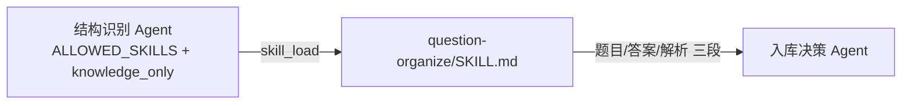

# Agent Skills 清单（src/agent/skills/）

> 本目录存放 gaokao_rag 的 tRPC-Agent Skill。每个子目录含一个 `SKILL.md`（YAML frontmatter + Markdown 正文），由执行方在需要时通过 `skill_load` 注入（渐进式披露，详见 tRPC-Agent-Python 的 skills 子系统）。

## 设计约束

- **只收录「可复用领域指令」**：有明确「何时加载」触发条件、可能被多个环节/入口消费的指令才成 Skill。
- **agent 的系统提示词不纳入**：各子 Agent 的角色定义与行为规则写在自己的 `instruction` 中（可抽 `prompts.py` 常量便于维护），不建 SKILL.md（2026-08-27 用户明确：skill ≠ agent 系统提示词，抽了是形式主义）。
- Skill 只承载 **prompt**，不替代 TeamAgent 的 Leader 委派与 `GaokaoState` 回填结构。

## 共享 Skill 基础设施（2026-08-28 新增）

`src/agent/skills/__init__.py` 承载全员复用的 skill 构造（SKILL.md 放一份即物理全员可达）：

- `SKILLS_ROOT`：skill 根目录（= 本包目录）。
- `create_skill_tool_set(allowed_skills=...)`：共享工厂，返回 `(SkillToolSet, repository)`，供各子 Agent 工厂与 TeamAgent leader 构造复用。
- `_AllowlistedSkillRepository`：带 **skill 白名单**的缓存仓库（agent 级硬约束，不依赖 prompt 自觉）——名单外 skill 不进 prompt（summaries 过滤）、`skill_load` 直接报 `ValueError`、`skill_list` 不泄漏。

**两层收紧，各管一头**：

| 层 | 实现位置 | 作用 |
|----|----------|------|
| skill 名单 | 各 agent 的 `ALLOWED_SKILLS` 常量 → `create_skill_tool_set(ALLOWED_SKILLS)` 烘焙进仓库 | 名单外不可见、不可加载（框架层硬约束） |
| 工具种类 | 各 agent 的 `before_agent_callback` 设 `tool_profile` | `knowledge_only`（load/docs）vs `full`（含 run/exec） |

`allowed_skills=None` 表示全量可见，仅留给确需浏览全部 skill 的 leader；空列表 = 什么都不给（防漏传静默全开）。

## Skills 列表

| Skill | 目录 | 执行方 / 消费方 | 职责 |
|-------|------|----------------|------|
| **题目整理** | `question-organize/`（文档：[question-organize.md](question-organize.md)） | 执行：结构识别 Agent 逐题（`ALLOWED_SKILLS` 白名单）；消费：入库决策 Agent | 把单个题目单元（整篇切出的题目段 / 零散输入：口述/OCR/VLM/聊天片段）归一为「题目 / 答案 / 解析」三段，供入库决策导入；讲解段不加载 |

> 曾被列为萃取候选、现已撤回（2026-08-27）：意图识别 / 结构识别 / 输出整理 —— 三者 prompt 即各自 agent 的系统提示词，留在 instruction，不建 SKILL.md。

## 每个 SKILL.md 结构约定

```yaml
name: <skill-id>          # 与目录名一致（kebab-case）
description: <一句话，注入概览层用于路由选择>
---
<Markdown 正文：定位 / 输入输出 / 决策原则 / 边界>
```

- **概览层**：`name` + `description` 始终注入系统消息，指导模型何时 `skill_load`。
- **主体层**：`skill_load` 后才注入完整 prompt 正文。
- **无 scripts/**：纯 prompt Skill，不涉及隔离空间执行；若未来需要辅助文档，按 `references/` 放置并由 `skill_select_docs` 按需加载。

## 与 Agent 的关系



`question-organize` 是摄入链路的归一化指令模块：结构识别 Agent 对**每道题目**（整篇切出的题目段，或零散单题）逐题 `skill_load` 执行，产出交给入库决策 Agent 写库；讲解段不走此 Skill。它不替代 TeamAgent 的委派结构。

## 落地状态（2026-08-28）

- `src/agent/skills/question-organize/SKILL.md` 已落地（commit `f68ef9a`）。
- 共享 Skill 基础设施（`SKILLS_ROOT` / `create_skill_tool_set` / `_AllowlistedSkillRepository` 白名单仓库）已落地；结构识别 Agent 已接线 `ALLOWED_SKILLS=("question-organize",)` + `knowledge_only` 工具面（待 commit）。
- 其余 SKILL.md 与 `src/agent/` 包本体随 Claude 跟进实现；本清单为设计锚点。
