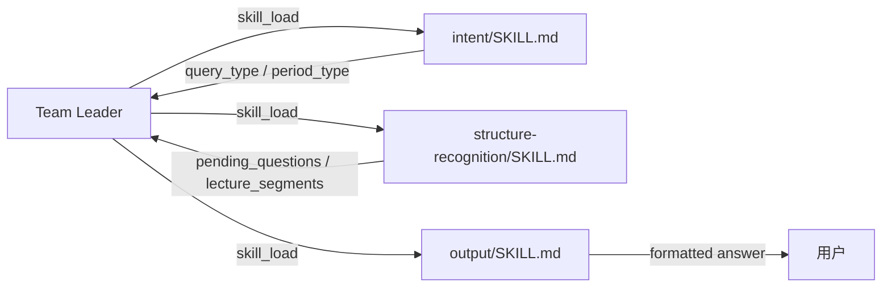

# Agent Skills 清单（src/agent/skills/）

> 本目录存放从「纯 LLM 子 Agent」萃取出的 tRPC-Agent Skill。每个子目录含一个 `SKILL.md`（YAML frontmatter + Markdown 正文），由对应 sub-agent 在构造时通过 `skill_load` 注入（渐进式披露，详见 tRPC-Agent-Python 的 skills 子系统）。

## 设计约束

- **仅收录**「不挂载 FunctionTool、只做 LLM 语义处理」的子 Agent，将其 prompt 沉淀为 Skill。
- Skill 只承载 **prompt**，不替代 TeamAgent 的 Leader 委派与 `GaokaoState` 回填结构。
- 挂载工具的子 Agent **不纳入**本目录：知识整理（挂 `knowledge_tool`）、聚合数据（经门面读写 SQLite）、搜索信息（挂检索工具）、VLM 理解（挂 VLM 工具）、文档识别（挂提取工具）、入库决策（挂写入工具）。

## Skills 列表

| Skill | 目录 | 对应子 Agent | 职责 | 挂载能力 |
|-------|------|--------------|------|----------|
| **意图识别** | `intent/` | `src/agent/retrieval/intent.py` | 判断意图 `question` / `review` / `report` / `browse` / `ingest`；`report` 时解析 `period_type`（weekly/monthly） | 纯 LLM |
| **结构识别** | `structure-recognition/` | `src/agent/ingestion/structure_recognition.py` | 把 raw_blocks 语义切分为「讲解段 / 题目段」，每题生成一句话概括（`pending_questions` / `lecture_segments`） | 纯 LLM |
| **输出整理** | `output/` | `src/agent/retrieval/output.py` | 把聚合结果排版为可读输出：分步解题 + 溯源引用 + QQ 分片发送 + 追问引导 |  纯 LLM |
| **题目整理** | `question-organize/`（文档：[question-organize.md](question-organize.md)） | （入库前归一化，非 sub-agent 萃取） | 把零散输入（口述/OCR/VLM/聊天片段）归一为「题目 / 答案 / 解析」三段，供入库决策导入 | 纯 LLM |

## 每个 SKILL.md 结构约定

```yaml
name: <skill-id>          # 与目录名一致
description: <一句话，注入概览层用于路由选择>
---
<Markdown 正文：职责 / 决策原则 / 输出 Schema>
```

- **概览层**：`name` + `description` 始终注入系统消息，指导模型何时 `skill_load`。
- **主体层**：`skill_load` 后才注入完整 prompt 正文（含 State 契约字段说明）。
- **无 scripts/**：纯 prompt Skill，不涉及隔离空间执行；若未来需要辅助文档，按 `references/` 放置并由 `skill_select_docs` 按需加载。

## 与 TeamAgent 的关系



Leader 仍负责委派与并行；Skill 仅是「按需加载的 prompt 模块」，避免把三个纯 LLM Agent 的指令常驻 context。

## 落地状态（2026-08-27）

- 萃取决策已写入 `docs/agent/README.md` 与项目记忆（决策 24）。
- 实际 `SKILL.md` 文件与 `src/agent/` 包本体随 Claude 跟进实现；本清单为设计锚点。
