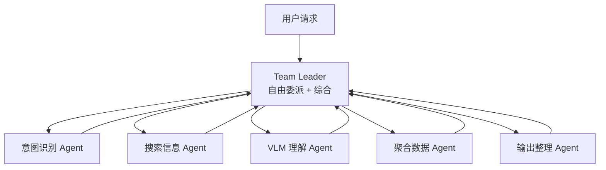

# 架构设计

## 总体思路

Gaokao RAG 基于 **tRPC-Agent-Python** 框架构建，核心理念是：**框架搭骨架，自定义插件填业务逻辑**。

tRPC-Agent 已经提供了 Agent 编排、Knowledge/RAG、Session/Memory、MCP、FastAPI 服务化等能力，我们不需要从零手写这些。需要自定义的是：

- **VLM 图形理解管线** —— 框架的 Knowledge 层是文本 RAG，VLM 调用需要封装为 FunctionTool
- **PDF 多模态摄取** —— 业务逻辑，框架不管，但产出数据走框架的 DocumentLoader → VectorStore 链路
- **知识点图谱** —— SQLite schema 设计 + 知识点查询工具
- **意图识别与委派** —— TeamAgent 的 Leader 自由委派机制，意图由独立子 Agent 判断

## tRPC-Agent 集成层

### 框架替我们做的事

| 能力 | 框架组件 | 我们的用法 |
|------|---------|-----------|
| Agent 编排 | TeamAgent | Leader 自由委派 5 个子 Agent（意图/搜索/VLM/聚合/输出） |
| RAG 检索 | LangchainKnowledge + LangchainKnowledgeSearchTool | 接入 Chroma 向量库，支持 metadata 过滤 |
| 模型接入 | OpenAIModel / LiteLLMModel | **模型中立**：OpenAI 兼容协议抽象，理论上用户可自选任何兼容模型；开发期默认 DeepSeek + Qwen |
| MCP Server | MCPToolset (stdio/sse/streamable-http) | 暴露检索、查询、复习建议工具 |
| 会话记忆 | SessionService + MemoryService | **V0.5 用 SqlSessionService（SQLite 持久化）**；摘要机制 + MemoryService 用户画像 V1.1 |
| 服务化 | FastAPI + A2A + AG-UI | HTTP API + SSE 流式输出 |
| 可观测性 | OpenTelemetry + **Langfuse** | **V0.5 接入 Langfuse（自托管）**——多 Agent 委派链可视化，学生数据不出服务器 |

### 我们自定义的部分

| 自定义模块 | 类型 | 挂载方式 |
|-----------|------|---------|
| VLM 图形理解 | FunctionTool | 挂到 VLM 子 Agent 的 tools |
| 知识点查询 | FunctionTool | 挂到搜索子 Agent 的 tools 列表 |
| PDF 摄取管线 | 独立脚本 | 产出数据写入 Chroma + SQLite |
| 意图识别 | LLM 子 Agent | TeamAgent 成员（意图识别 Agent） |
| 错题分析 | FunctionTool + Memory | 挂到聚合子 Agent，读取错题记录 |

## TeamAgent 编排设计

核心是一个 **TeamAgent**：Leader 自由委派任务给 5 个专业子 Agent（详见 [Agent 设计](agent_design.md)）：



### State 设计

```python
class GaokaoState(State):
    # 业务字段
    subject: str                    # 学科（MVP 固定 "math"）
    query_type: str                 # "question" | "review" | "report" | "browse"
    retrieved_docs: list[dict]     # 检索到的题目/解析（含知识点信息）
    vlm_descriptions: list[str]    # VLM 生成的图形描述
    answer: str                     # 最终答案
    review_suggestion: str         # 复习建议
    # Reducer 字段
    execution_history: Annotated[list[dict], append_list]
```

### 子 Agent 说明

| 子 Agent | 职责 | 挂载能力 |
|---------|------|---------|
| 意图识别 Agent | 判断学科 + 意图 | LLM 分类 |
| 搜索信息 Agent | 混合检索（Chroma + SQLite） | LangchainKnowledgeSearchTool |
| VLM 理解 Agent | 图形理解（有图才调） | Qwen3-VL FunctionTool |
| 聚合数据 Agent | 错题/作答统计、周报聚合 | SQLite 查询工具 |
| 输出整理 Agent | 格式化 + 分片发送 | 纯 LLM |

## 三层存储架构

继承 AlgoNotes RAG 的三层存储设计，但 schema 针对高考场景重新设计：

### Layer 1: 文件存储

```
data/
├── raw/                    # 原始 PDF 文件
│   ├── 试卷/
│   │   ├── 2026_南昌一模.pdf
│   │   ├── 2026_深圳调研.pdf
│   │   └── ...
│   ├── 专题/
│   │   ├── 圆锥曲线_1.pdf
│   │   ├── 导数_1.pdf
│   │   └── ...
│   └── 错题/
│       └── math_errors.json
├── processed/              # 处理后的结构化数据
│   ├── questions/          # 按题目拆分的 JSON
│   └── images/             # 从 PDF 提取的图像
└── chroma_db/              # Chroma 向量数据库
```


### Layer 2: SQLite 索引

负责结构化查询和知识点图谱。详见 [数据模型文档](data_model.md)。

### Layer 3: Chroma 向量库

负责语义检索。每个 chunk 携带 metadata：

```python
{
    "doc_id": "q_001_question",     # 与 SQLite questions.doc_id 对应
    "source_type": "exam",
    "source_file": "2026_南昌一模.pdf",
    "subject": "数学",
    "exam_region": "南昌",
    "exam_year": 2026,
    "exam_month": "三月",
    "question_type": "解答题",
    "difficulty": 4,
    "topic_code": "math.conics.eccentricity",   # 一级编码用于粗过滤
    "topic_codes": "math.conics,math.conics.eccentricity",  # 全部相关编码，逗号分隔
    "chunk_type": "question",
    "has_image": True,
    "image_paths": "[\"/path/to/img1.png\"]",  # 图像路径 JSON
    "vlm_descriptions": "[\"...\"]",           # VLM 生成的图形描述 JSON
}
```

## 模型接入

**模型中立**：通过 tRPC-Agent 的 OpenAIModel（OpenAI 兼容协议）接入，架构上不绑定任何厂商。理论上用户可自选任何 OpenAI 兼容模型（DeepSeek / Qwen / 其他）。**开发期由后台写死默认配置**：

| 用途 | 开发期默认模型 | 提供方 | 接入方式 |
|------|--------------|--------|---------|
| 对话/推理 (LLM) | DeepSeek V4-Flash | DeepSeek 官方 API | OpenAIModel |
| 图形理解 (VLM) | Qwen3-VL-8B-Instruct | Qwen 官方 API（DashScope） | OpenAIModel (多模态) |
| 复杂图形推理 (VLM) | Qwen3-VL-32B-Thinking | Qwen 官方 API（DashScope） | OpenAIModel (多模态) |
| 文本嵌入 | Qwen3-Embedding-4B | Qwen 官方 API（DashScope） | 独立调用 |
| PDF 解析 | MinerU2.5-Pro | 独立 API 调用 | 独立调用 |

模型名、API Key、Base URL 全部走 `config.toml` + 环境变量，代码不硬编码。

## 与 AlgoNotes RAG 的对比

| 维度 | AlgoNotes RAG | Gaokao RAG |
|------|--------------|------------|
| 框架 | 手写 Agent + LangGraph | tRPC-Agent-Python |
| 学科 | 单域（算法竞赛） | 多学科（愿景全科；MVP 数学单科） |
| 输入格式 | Markdown | PDF + 图像 + Markdown |
| 图形处理 | 无 | VLM（核心技术差异点） |
| 知识点 | 扁平 tag | 树形图谱 + 题目关联 |
| 用户 | 个人 | 单人（MVP；user_id 字段预留未来多用户） |
| 元数据 | source/type/tags | 科目/年份/题型/难度/知识点/考区 |
| MCP | 手写 9 工具 | 框架内置 MCPToolset |
| 服务化 | CLI | CLI + FastAPI + MCP |
| 可观测性 | 自写日志 | OpenTelemetry |
