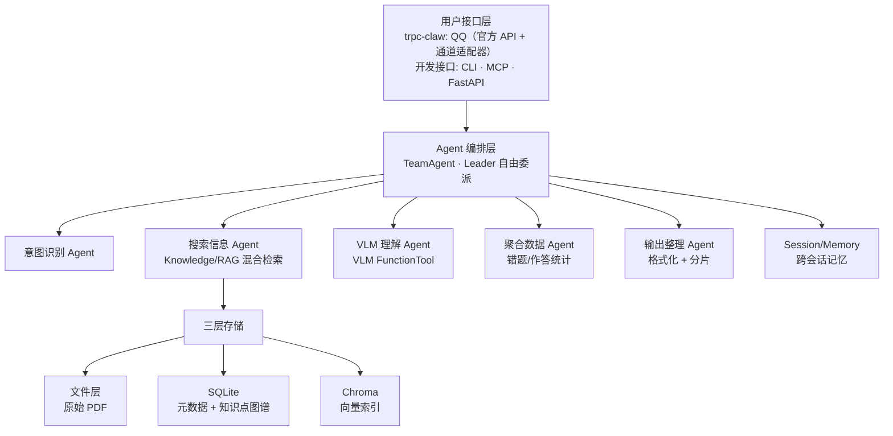
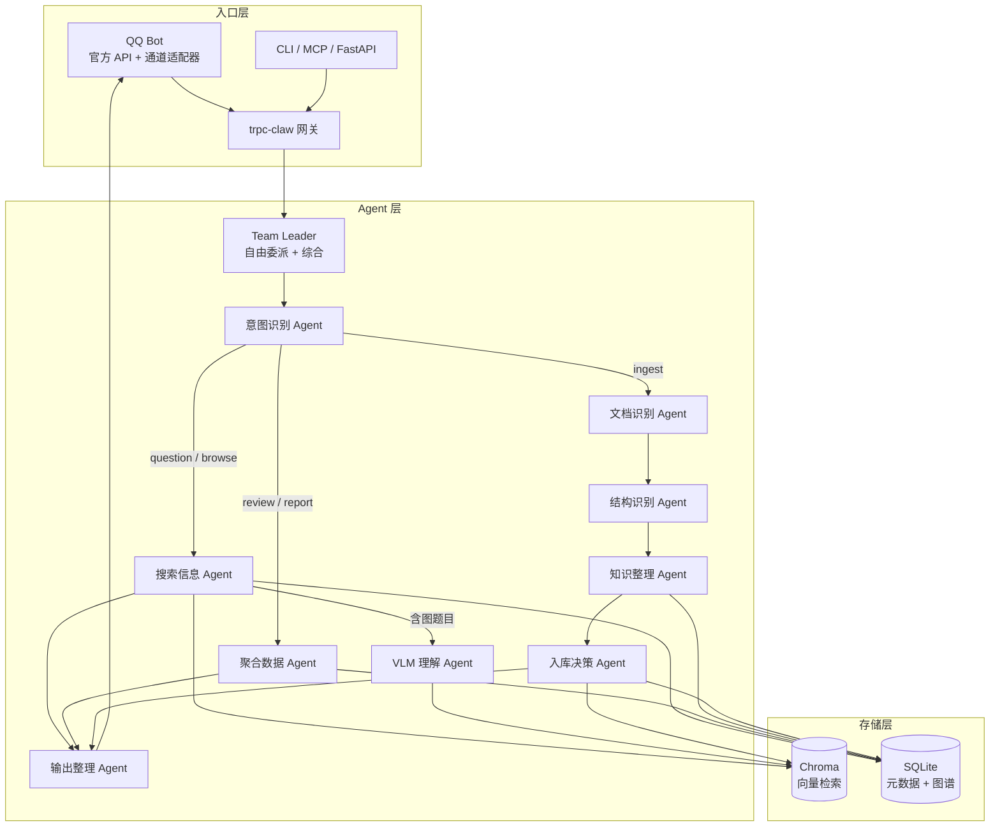

# 架构设计

## 总体思路

Gaokao RAG 基于 **tRPC-Agent-Python** 框架构建，核心理念是：**框架搭骨架，自定义插件填业务逻辑**。

tRPC-Agent 已经提供了 Agent 编排、Knowledge/RAG、Session/Memory、MCP、FastAPI 服务化等能力，我们不需要从零手写这些。需要自定义的是：

- **VLM 图形理解管线** —— 框架的 Knowledge 层是文本 RAG，VLM 调用需要封装为 FunctionTool
- **PDF 多模态摄取** —— 业务逻辑，框架不管，但产出数据走框架的 DocumentLoader → VectorStore 链路
- **知识点图谱** —— SQLite schema 设计 + 知识点查询工具
- **意图识别与委派** —— TeamAgent 的 Leader 自由委派机制，意图由独立子 Agent 判断

## 系统架构总览



## tRPC-Agent 集成层

### 框架替我们做的事

| 能力 | 框架组件 | 我们的用法 |
| ------ | --------- | ----------- |
| Agent 编排 | TeamAgent | Leader 自由委派 5 个子 Agent（意图/搜索/VLM/聚合/输出） |
| RAG 检索 | LangchainKnowledge + LangchainKnowledgeSearchTool | 接入 Chroma 向量库，支持 metadata 过滤 |
| 模型接入 | OpenAIModel / LiteLLMModel | **模型中立**：OpenAI 兼容协议抽象，理论上用户可自选任何兼容模型；开发期默认 DeepSeek + Qwen |
| MCP Server | MCPToolset (stdio/sse/streamable-http) | 暴露检索、查询、复习建议工具 |
| 会话记忆 | SessionService + MemoryService | **V0.5 用 SqlSessionService（SQLite 持久化）**；摘要机制 + MemoryService 用户画像 V1.1 |
| 服务化 | FastAPI + A2A + AG-UI | HTTP API + SSE 流式输出 |
| 可观测性 | OpenTelemetry + **Langfuse** | **V0.5 接入 Langfuse（自托管）**——多 Agent 委派链可视化，学生数据不出服务器 |

### 我们自定义的部分

| 自定义模块 | 类型 | 挂载方式 |
| ----------- | ------ | --------- |
| VLM 图形理解 | FunctionTool | 挂到 VLM 子 Agent 的 tools |
| 知识点查询 | FunctionTool | 挂到搜索子 Agent 的 tools 列表 |
| PDF 摄取管线 | 独立脚本 | 产出数据写入 Chroma + SQLite |
| 意图识别 | LLM 子 Agent | TeamAgent 成员（意图识别 Agent） |
| 错题分析 | FunctionTool + Memory | 挂到聚合子 Agent，读取错题记录 |

## TeamAgent 编排设计

核心是一个 **TeamAgent**：Leader 自由委派任务给查询侧 + 摄入侧两组专业子 Agent（详见 [Agent 设计](agent.md)）。

### 系统总览（三层结构）



**三层结构说明**：

- **入口层**：QQ（官方 API + nanobot 通道适配器）/ CLI / MCP / FastAPI 统一接入 trpc-claw 网关
- **Agent 层**：Leader 按意图委派成员——**意图识别是分支点**：
  - **查询侧（读）**：question/browse 走搜索（含图触发 VLM）→ 输出；review/report 走聚合 → 输出
  - **摄入侧（写）**：ingest 走文档识别 → 结构识别 → 知识整理 → 入库决策 → 输出（回显确认）
  - 不同意图走不同成员组合，不是所有成员每次都被调用
- **存储层**：搜索 Agent 查询 Chroma（语义）+ SQLite（精确过滤）；聚合 Agent 读写 SQLite（错题/作答/报告）；摄入侧写入 Chroma + SQLite（题目/知识点/错题）

### 团队结构

```mermaid
flowchart TD
    U[用户请求] --> L[Team Leader<br/>自由委派 + 综合]

    subgraph 查询侧（读）
        L --> A1[意图识别 Agent]
        L --> A2[搜索信息 Agent]
        L --> A3[VLM 理解 Agent]
        L --> A4[聚合数据 Agent]
        L --> A5[输出整理 Agent]
    end

    subgraph 摄入侧（写）
        L --> B1[文档识别 Agent]
        L --> B2[结构识别 Agent]
        L --> B3[知识整理 Agent]
        L --> B4[入库决策 Agent]
    end

    A1 --> L
    A2 --> L
    A3 --> L
    A4 --> L
    A5 --> L
    B1 --> L
    B2 --> L
    B3 --> L
    B4 --> L
```

### State 设计

```python
class GaokaoState(State):
    # 业务字段
    subject: str                    # 学科（MVP 固定 "math"）
    query_type: str                 # "question" | "review" | "report" | "browse" | "ingest"
    retrieved_docs: list[dict]     # 检索到的题目/解析（含知识点信息）
    vlm_descriptions: list[str]    # VLM 生成的图形描述
    answer: str                     # 最终答案
    review_suggestion: str         # 复习建议
    # 摄入侧字段
    pending_questions: list[dict]  # 待确认题目清单（回显用）
    ingest_decisions: list[dict]   # 用户对每题的决策（入库/错题/跳过）
    # Reducer 字段
    execution_history: Annotated[list[dict], append_list]
```

### 子 Agent 说明

**查询侧（读）**：

| 子 Agent | 职责 | 挂载能力 |
| --------- | ------ | --------- |
| 意图识别 Agent | 判断学科 + 意图 | LLM 分类 |
| 搜索信息 Agent | 混合检索（Chroma + SQLite） | LangchainKnowledgeSearchTool |
| VLM 理解 Agent | 图形理解（有图才调） | VLM FunctionTool |
| 聚合数据 Agent | 错题/作答统计、周报聚合（**读写** SQLite：errors/exam_attempts 统计 + periodic_reports 落库） | SQLite 查询/写入工具 |
| 输出整理 Agent | 格式化 + 分片发送 | 纯 LLM |

**摄入侧（写）**：

| 子 Agent | 职责 | 挂载能力 |
| --------- | ------ | --------- |
| 文档识别 Agent | 接收照片/PDF → 提取内容（图片走 VLM，PDF 走 PyMuPDF） | VLM + PyMuPDF 工具 |
| 结构识别 Agent | 区分讲解段 vs 题目段 → 题目清单（每题一句话概括） | LLM 分类 |
| 知识整理 Agent | 知识点提取 → 动态树归位/合并/挂载（写 topics） | SQLite 写入工具 |
| 入库决策 Agent | 回显清单 → 收集学生选择 → 写 questions/errors | SQLite 写入工具 |

## 三层存储架构

继承 AlgoNotes RAG 的三层存储设计，但 schema 针对高考场景重新设计：

### Layer 1: 文件存储

详见 [文件存储说明](store/files/raw.md)。

### Layer 2: SQLite 索引

负责结构化查询和知识点图谱。详见 [数据模型文档](data_model.md)。

> 每张表的详细设计见 [store/db/](store/db/)（8 份表文档：topics / knowledge_notes / questions / question_topics / errors / exam_attempts / review_plans / periodic_reports）

### Layer 3: Chroma 向量库

负责语义检索。每个 chunk 携带 metadata：

```python
{
    "doc_id": "q_42",     # 与 SQLite questions.doc_id 对应（两段式：{entity}_{id}，见 data_model.md）
    "source_type": "exam",
    "title": "2026 南昌一模数学卷",   # 语义标题（files.title 快照，检索可读）
    "subject": "数学",
    "exam_regions": ["南昌", "江西", "全国一卷"],   # 考区层级，从小到大
    "exam_year": 2026,
    "exam_month": 3,
    "question_type": "解答题",
    "topic_tags": "椭圆,离心率",   # 知识点名字快照（name + aliases），树展开后用于过滤
    "doc_type": "question",   # 来源类型: question（题目）/ note（讲解）
    "has_image": True,   # Chroma 过滤专用快照（SQLite 侧以 image_file_ids 为准，不冗余存储）
    "image_file_ids": "[1, 2]",   # 题目图片 files.id 数组 JSON
}
```

## 项目文件架构

```tree
gaokao_rag/
├── config.toml                # 系统配置（模型、存储路径、VLM 参数）
├── pyproject.toml             # 项目依赖与元数据
├── .env                       # 环境变量（API Key 等，gitignore）
├── main.py                    # uv init 入口（后续替换为 CLI）
│
├── src/                       # 源代码（V0.1-V1.0 逐步实现）
│   ├── config.py              # 配置加载（Pydantic + config.toml + 环境变量）
│   │
│   ├── api/                   # 模型客户端层（OpenAI 兼容协议抽象）
│   │   ├── llm.py             #   LLM 客户端 —— DeepSeek V4-Flash
│   │   ├── vlm.py             #   VLM 客户端 —— Qwen3.7-Flash / Plus（DashScope）
│   │   └── embedding.py       #   嵌入模型 —— Qwen3-Embedding-4B（DashScope）
│   │
│   ├── ingestion/             # 多模态摄取管线（PDF → 结构化数据）
│   │   ├── loader.py          #   PDF 加载（PyMuPDF 主力 + MinerU2.5-Pro 兜底）
│   │   ├── cleaner.py         #   文本清洗（去页眉页脚、公式归一化）
│   │   ├── splitter.py        #   分块策略（题目/解析/知识点分段）
│   │   ├── vlm_processor.py   #   图像 VLM 理解（图形描述生成）
│   │   ├── tagger.py          #   知识点标注（LLM 提取 → 挂载知识树）
│   │   └── pipeline.py        #   管线编排（7 阶段串联）
│   │
│   ├── store/                 # 三层存储 + 知识点图谱
│   │   ├── file_store.py      #   Layer 1：文件存储（原始 PDF 管理，详见 [store/files/raw.md](store/files/raw.md)）
│   │   ├── db/                #   Layer 2：SQLite 数据访问层（按表拆，共享连接）
│   │   │   ├── __init__.py    #     连接管理（单例）+ schema 初始化
│   │   │   ├── schema.py      #     9 张表 DDL + 索引
│   │   │   ├── files.py       #     文件注册表（title + 哈希路径 + sha256 去重）
│   │   │   ├── topics.py      #     知识点树：CRUD + 路径枚举/防环/状态机/展开（独特逻辑集中）
│   │   │   ├── knowledge_notes.py
│   │   │   ├── questions.py
│   │   │   ├── question_topics.py
│   │   │   ├── errors.py
│   │   │   ├── exam_attempts.py
│   │   │   ├── review_plans.py
│   │   │   └── periodic_reports.py
│   │   ├── vector_store.py    #   Layer 3：Chroma 向量库（document 入库，切片细则 V0.3 定）
│   │   └── __init__.py
│   │
│   ├── rag/                   # RAG Agent 与检索
│   │   ├── agent.py           #   TeamAgent 编排（Leader + 5 子 Agent）
│   │   ├── retriever.py       #   混合检索（Chroma 语义 + SQLite 过滤）
│   │   └── prompts.py         #   Agent System Prompts（5 个子 Agent）
│   │
│   ├── tools/                 # 自定义 FunctionTool
│   │   ├── vlm_tool.py        #   VLM 图形理解（挂到 VLM 子 Agent）
│   │   ├── knowledge_tool.py  #   知识点查询（挂到搜索子 Agent）
│   │   └── error_tool.py      #   错题分析（挂到聚合子 Agent）
│   │
│   └── mcp/                   # MCP Server（对外暴露）
│       └── server.py          #   FastMCP 工具定义（14 个工具）
│
├── scripts/                   # CLI 入口
│   ├── ingest.py              #   摄取 CLI（PDF → 入库）
│   ├── chat.py                #   对话 CLI（开发调试）
│   └── mcp_server.py          #   MCP Server 入口（stdio/SSE/HTTP）
│
├── data/                      # 数据目录（gitignore）
│   ├── files/                 # 文件层根目录（raw + processed）
│   │   ├── raw/               # raw_dir：原始文件（只读源，不可变）
│   │   │   ├── pdfs/          #   原始 PDF（哈希命名）
│   │   │   └── images/        #   学生上传图片（哈希命名）
│   │   │       ├── uploaded/  #     QQ 上传、作业拍照等（统一入口）
│   │   │       └── extracted/ #     从 PDF 提取的插图
│   │   └── processed/         # processed_dir：处理后中间产物（可重建）
│   │       ├── text/          #   清洗后的文本
│   │       └── vlm_desc/      #   VLM 图形描述（中间缓存）
│   ├── chroma_db/             # chroma_dir：Chroma 持久化
│   └── gaokao.db              # sqlite_path：SQLite 索引
│
└── tests/                     # 测试（V0.5 后补充）
```

### 各层职责速览

| 层 | 目录 | 职责 |
| ---- | ------ | ------ |
| 配置 | `config.toml` + `.env` | 模型、存储、VLM 参数，代码不硬编码 |
| 模型接入 | `src/api/` | OpenAI 兼容协议封装，LLM / VLM / Embedding 统一接口 |
| 摄取管线 | `src/ingestion/` | PDF 解析 → 图像提取 → VLM 理解 → 知识点标注 → 向量化 |
| 三层存储 | `src/store/` | 文件(raw) → SQLite(元数据+知识树) → Chroma(向量) |
| RAG Agent | `src/rag/` | TeamAgent 编排 + 混合检索器 + Prompts |
| 自定义工具 | `src/tools/` | VLM / 知识点查询 / 错题分析 FunctionTool |
| MCP 服务 | `src/mcp/` | 对外暴露 14 个 MCP 工具（检索/错题/复习/报告） |
| CLI 入口 | `scripts/` | ingest / chat / mcp_server 三个命令 |
| 数据 | `data/` | 原始文件 + 处理后数据 + 两个数据库 |

## 模型配置

**模型中立**：通过 tRPC-Agent 的 OpenAIModel（OpenAI 兼容协议）接入，架构上不绑定任何厂商。理论上用户可自选任何 OpenAI 兼容模型（DeepSeek / Qwen / 其他）。**开发期由后台写死默认配置**：

| 用途 | 开发期默认模型 | 提供方 | 接入方式 |
| ------ | -------------- | -------- | --------- |
| 对话/推理 (LLM) | DeepSeek V4-Flash | DeepSeek 官方 API | OpenAIModel |
| 图形理解 (VLM) | Qwen3.7-Flash | Qwen 官方 API（DashScope） | OpenAIModel (多模态) |
| 复杂图形推理 (VLM) | Qwen3.7-Plus | Qwen 官方 API（DashScope） | OpenAIModel (多模态) |
| 文本嵌入 | Qwen3-Embedding-4B | Qwen 官方 API（DashScope） | 独立调用 |
| PDF 解析 | MinerU2.5-Pro | 独立 API 调用 | 独立调用 |

模型名、API Key、Base URL 全部走 `config.toml` + 环境变量，代码不硬编码。

## 与 AlgoNotes RAG 的对比

| 维度 | AlgoNotes RAG | Gaokao RAG |
| ------ | -------------- | ------------ |
| 框架 | 手写 Agent + LangGraph | tRPC-Agent-Python |
| 学科 | 单域（算法竞赛） | 多学科（愿景全科；MVP 数学单科） |
| 输入格式 | Markdown | PDF + 图像 + Markdown |
| 图形处理 | 无 | VLM（核心技术差异点） |
| 知识点 | 扁平 tag | 树形图谱 + 题目关联 |
| 用户 | 个人 | 单人（MVP；user_id 字段预留未来多用户） |
| 元数据 | source/type/tags | 科目/年份/题型/知识点/考区 |
| MCP | 手写 9 工具 | 框架内置 MCPToolset |
| 服务化 | CLI | CLI + FastAPI + MCP |
| 可观测性 | 自写日志 | OpenTelemetry |
