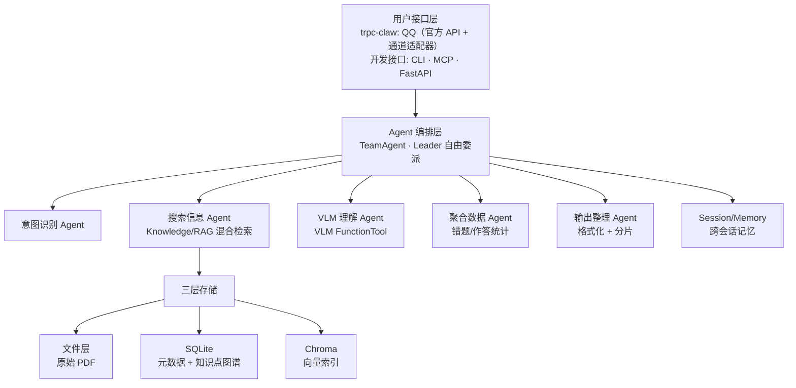
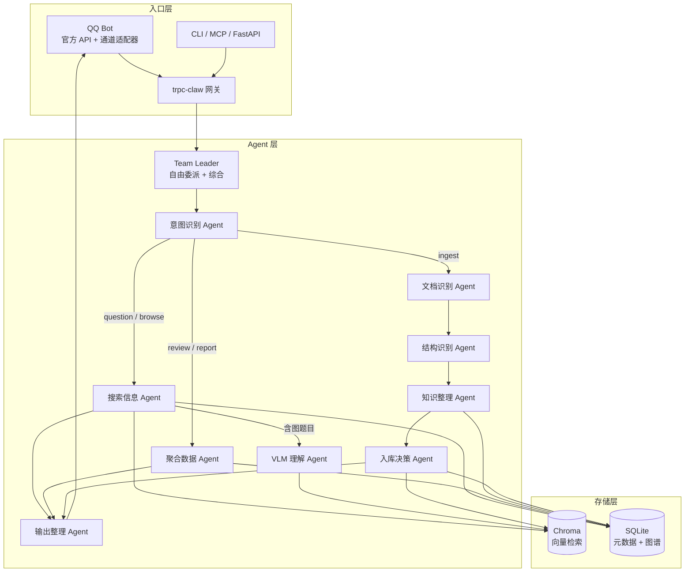
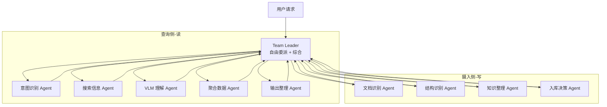

# 架构设计

## 总体思路

Gaokao RAG 基于 **tRPC-Agent-Python** 框架构建，核心理念是：**框架搭骨架，自定义插件填业务逻辑**。

tRPC-Agent 已经提供了 Agent 编排、Knowledge/RAG、Session/Memory、MCP、FastAPI 服务化等能力，我们不需要从零手写这些。需要自定义的是：

- **VLM 图形理解管线** —— 框架的 Knowledge 层是文本 RAG，VLM 调用需要封装为 FunctionTool
- **PDF 多模态摄取** —— 业务逻辑，框架不管；但摄取的核心决策（内容三分、题目切分、知识点提取）由 Agent 层完成，ingestion 层只提供纯 I/O 工具集
- **知识点图谱** —— SQLite schema 设计 + 知识点查询工具
- **意图识别与委派** —— TeamAgent 的 Leader 自由委派机制，意图由独立子 Agent 判断

## 系统架构总览



## tRPC-Agent 集成层

### 框架替我们做的事

| 能力 | 框架组件 | 我们的用法 |
| ------ | --------- | ----------- |
| Agent 编排 | TeamAgent | Leader 自由委派 5 个子 Agent（意图/搜索/VLM/聚合/输出） |
| RAG 检索 | LangchainKnowledge + AgenticLangchainKnowledgeSearchTool | 接入 Chroma 向量库，支持 metadata 过滤 |
| 模型接入 | OpenAIModel | **模型中立**：OpenAI 兼容协议抽象，理论上用户可自选任何兼容模型；开发期默认 DeepSeek + Qwen |
| MCP Server | MCPToolset (stdio/sse/streamable-http) | 暴露检索、查询、复习建议工具 |
| 会话记忆 | SessionService + SqlMemoryService | **V0.5 用 SqlSessionService（SQLite 持久化）**；摘要机制 + SqlMemoryService 用户画像 V1.1 |
| 服务化 | FastAPI + A2A + AG-UI | HTTP API + SSE 流式输出 |
| 可观测性 | OpenTelemetry + **Langfuse** | **V0.5 接入 Langfuse（自托管）**——多 Agent 委派链可视化，学生数据不出服务器 |

### 我们自定义的部分

| 自定义模块 | 类型 | 挂载方式 |
| ----------- | ------ | --------- |
| VLM 图形理解 | FunctionTool | 挂到 VLM 子 Agent 的 tools |
| 知识点查询 | FunctionTool | 挂到搜索子 Agent 的 tools 列表 |
| PDF 摄取管线 | 业务 I/O 工具集（Agent 调用） | ingestion 层提供写入函数（ingest_question / ingest_image / ingest_exam_paper / ingest_error 等）；知识点归位复用 src/ingestion/topic.py |
| 意图识别 | LLM 子 Agent | TeamAgent 成员（意图识别 Agent） |
| 错题分析 | FunctionTool + Memory | 挂到聚合子 Agent，读取错题记录 |

## TeamAgent 编排设计

核心是一个 **TeamAgent**：Leader 自由委派任务给查询侧 + 摄入侧两组专业子 Agent（详见 [Agent 编排设计](agent/README.md)）。

### 系统总览（三层结构）



**三层结构说明**：

- **入口层**：QQ（官方 API + nanobot 通道适配器）/ CLI / MCP / FastAPI 统一接入 trpc-claw 网关
- **Agent 层**：Leader 按意图委派成员——**意图识别是分支点**：
  - **查询侧（读）**：question/browse 走搜索（含图触发 VLM）→ 输出；review/report 走聚合 → 输出
  - **摄入侧（写）**：ingest 走文档识别 → 结构识别 → 知识整理 → 入库决策 → 输出（回显确认）
  - 不同意图走不同成员组合，不是所有成员每次都被调用
- **存储层**：搜索 Agent 查询 Chroma（语义）+ SQLite（精确过滤）；聚合 Agent 读写 SQLite（错题/作答/报告）；摄入侧写入 Chroma + SQLite（题目/知识点/错题）

### 团队结构



### State 设计

```python
class GaokaoState(State):
    # 业务字段
    subject: str                    # 学科（MVP 固定 "math"）
    query_type: str                 # "question" | "review" | "report" | "browse" | "ingest"
    period_type: str                # "weekly" | "monthly"（report 意图时由 ROUTER 解析）
    retrieved_docs: list[dict]     # 检索到的题目/解析（含知识点信息）
    vlm_descriptions: list[str]    # VLM 生成的图形描述
    answer: str                     # 最终答案
    review_suggestion: str         # 复习建议
    # 摄入侧字段
    pending_questions: list[dict]  # 待确认题目清单（回显用）
    ingest_decisions: list[dict]   # 用户对每题的决策（入库/错题/跳过）
    # Reducer 字段
    execution_history: Annotated[list[dict], append_list]
```

### 子 Agent 说明

**查询侧（读）**：

| 子 Agent | 职责 | 挂载能力 |
| --------- | ------ | --------- |
| 意图识别 Agent | 判断学科 + 意图 | LLM 分类 |
| 搜索信息 Agent | 混合检索（Chroma + SQLite） | LangchainKnowledgeSearchTool |
| VLM 理解 Agent | 图形理解（有图才调） | VLM FunctionTool |
| 聚合数据 Agent | 错题/作答统计、周报聚合（**读写** SQLite：errors/exam_attempts 统计 + periodic_reports 落库） | SQLite 查询/写入工具 |
| 输出整理 Agent | 格式化 + 分片发送 | 纯 LLM |

**摄入侧（写）**：

| 子 Agent | 职责 | 挂载能力 |
| --------- | ------ | --------- |
| 文档识别 Agent | 接收照片/PDF → 提取内容（图片走 VLM，PDF 走 PyMuPDF） | VLM + PyMuPDF 工具 |
| 结构识别 Agent | 区分讲解段 vs 题目段 → 题目清单（每题一句话概括） | LLM 分类 |
| 知识整理 Agent | 知识点提取 → tag 归位/别名归并（写 topics） | SQLite 写入工具 |
| 入库决策 Agent | 回显清单 → 收集学生选择 → 写 questions/errors | SQLite 写入工具 |

## 三层存储架构

继承 AlgoNotes RAG 的三层存储设计，但 schema 针对高考场景重新设计：

### Layer 1: 文件存储

详见 [文件存储说明](store/files/raw.md)。

### Layer 2: SQLite 索引

负责结构化查询和知识点标签管理。详见 [数据模型文档](data_model.md)。

> 每张表的详细设计见 [store/db/](store/db/)（8 份表文档：topics / knowledge_notes / questions / question_topics / errors / exam_attempts / review_plans / periodic_reports）

### Layer 3: Chroma 向量库

负责语义检索。每个 document 携带**检索快照 metadata**——只存过滤/展示需要的字段（学科/考区/年份/题型/知识点 tag/含图标记），内容以 SQLite 为权威源。**字段规范与过滤语义见 [store/vector/vector_store.md「Metadata 格式与过滤语义」](store/vector/vector_store.md)**（单一来源，此处不重复）。

## 项目文件架构

```tree
gaokao_rag/
├── config.toml                # 系统配置（模型、存储路径、VLM 参数）
├── pyproject.toml             # 项目依赖与元数据
├── .env                       # 环境变量（API Key 等，gitignore）
├── main.py                    # uv init 入口（后续替换为 CLI）
│
├── src/                       # 源代码（V0.1-V1.0 逐步实现）
│   ├── config.py              # 配置加载（Pydantic + config.toml + 环境变量）
│   │
│   ├── api/                   # 模型客户端层（OpenAI 兼容协议抽象）
│   │   ├── llm.py             #   LLM 客户端 —— DeepSeek V4-Flash
│   │   ├── vlm.py             #   VLM 客户端 —— Qwen3.7-Flash / Plus（DashScope）
│   │   └── embedding.py       #   嵌入模型 —— qwen3.7-text-embedding（DashScope）
│   │
│   ├── ingestion/             # 摄取门面（写，封装三层存储全部 增/删/改，无 LLM）
│   │   ├── question.py        #   ingest_question() - 存储一道题（文件 + DB + 向量 + knowledge 四层）
│   │   ├── image.py           #   ingest_image() - 存储一张图（文件 + DB）
│   │   ├── exam_paper.py      #   ingest_exam_paper() - 存储一份试卷（文件 + DB）
│   │   └── error.py           #   ingest_error() - 存储错题（DB + 关联题目）
│   │
│   ├── retrieval/             # 检索门面（读，封装全部查询与聚合，只读不写，无 LLM）★ 新增
│   │   ├── retriever.py       #   hybrid_search() - 混合检索（题目+讲解 Chroma 语义 + SQLite 过滤）
│   │   ├── question.py        #   search_questions / get_question_detail / browse_questions
│   │   ├── knowledge_note.py  #   search_knowledge_notes
│   │   ├── topic.py           #   search_topics / list_topics
│   │   ├── error.py           #   get_error_stats / get_weak_topics
│   │   ├── exam_attempt.py    #   aggregate_attempts
│   │   └── report.py          #   get_report / compute_trend（周报双源聚合）
│   │
│   ├── store/                 # 三层存储 + 知识点图谱（原语层，最低层）
│   │   ├── file_store.py      #   Layer 1：文件存储（原始 PDF 管理，详见 [store/files/raw.md](store/files/raw.md)）
│   │   ├── db/                #   Layer 2：SQLite 数据访问层（按表拆，共享连接）
│   │   │   ├── __init__.py    #     连接管理（单例）+ schema 初始化
│   │   │   ├── schema.py      #     9 张表 DDL + 索引
│   │   │   ├── files.py       #     文件注册表（title + 哈希路径 + sha256 去重）
│   │   │   ├── topics.py      #     知识点标签 CRUD（MVP 扁平 tag，无树结构）
│   │   │   ├── knowledge_notes.py
│   │   │   ├── questions.py
│   │   │   ├── question_topics.py
│   │   │   ├── errors.py
│   │   │   ├── exam_attempts.py
│   │   │   ├── review_plans.py
│   │   │   └── periodic_reports.py
│   │   ├── vector/             #   Layer 3：Chroma 向量库（存储读写 / Knowledge 构建两层）
│   │   │   ├── vector_store.py #     Layer 3a：Chroma 增删读写（document 入库，切片细则 V0.3 定）
│   │   │   └── knowledge.py    #     Layer 3b：Knowledge 对象构建（GaokaoKnowledge 子类）
│   │   └── __init__.py
│   │
│   ├── agent/                 # Agent 编排层（TeamAgent + 子 Agent + 工具）
│   │   ├── leader.py          #   Team Leader 编排（TeamAgent + 自由委派）
│   │   ├── tools/             #   FunctionTool（每文件一个工具，挂到各子 Agent）
│   │   │   ├── vlm_tool.py    #     VLM 图形理解（挂到 VLM / 文档识别子 Agent）
│   │   │   ├── knowledge_tool.py  #  知识点查询（挂到搜索 / 知识整理子 Agent）
│   │   │   ├── error_tool.py  #    错题分析（挂到聚合子 Agent）
│   │   │   ├── extract_tool.py #    PDF / 图像提取（挂到文档识别子 Agent）
│   │   │   └── ingest_tool.py  #    题目/错题摄入（挂到入库决策子 Agent）
│   │
│   │   ├── ingestion/         #   摄入侧子 Agent（每文件一个 Agent，只调 src/ingestion 写门面）
│   │   │   ├── doc_recognition.py      #  文档识别 Agent
│   │   │   ├── structure_recognition.py # 结构识别 Agent
│   │   │   ├── knowledge_organize.py   #  知识整理 Agent
│   │   │   └── storage_decision.py     #  入库决策 Agent
│   │
│   │   └── retrieval/         #   查询侧子 Agent（每文件一个 Agent，只调 src/retrieval 读门面）
│   │       ├── intent.py      #    意图识别 Agent
│   │       ├── search.py      #    搜索信息 Agent
│   │       ├── vlm.py         #    VLM 理解 Agent
│   │       ├── aggregate.py   #    聚合数据 Agent
│   │       └── output.py      #    输出整理 Agent
│   │
│   └── mcp/                   # MCP Server（对外暴露）
│       └── server.py          #   FastMCP 工具定义（14 个工具）
│
├── scripts/                   # CLI 入口
│   ├── ingest.py              #   批量摄取（自动调用摄入侧 Agent 工具集，不经过 TeamLeader）
│   ├── chat.py                #   对话 CLI（开发调试）
│   └── mcp_server.py          #   MCP Server 入口（stdio/SSE/HTTP）
│
├── data/                      # 数据目录（gitignore）
│   ├── files/                 # 文件层根目录（raw + processed）
│   │   ├── raw/               # raw_dir：原始文件（只读源，不可变）
│   │   │   ├── pdfs/          #   原始 PDF（哈希命名）
│   │   │   └── images/        #   学生上传图片（哈希命名）
│   │   │       ├── uploaded/  #     QQ 上传、作业拍照等（统一入口）
│   │   │       └── extracted/ #     从 PDF 提取的插图
│   │   └── processed/         # processed_dir：处理后中间产物（可重建）
│   │       ├── text/          #   清洗后的文本
│   │       └── vlm_desc/      #   VLM 图形描述（中间缓存）
│   ├── chroma_db/             # chroma_dir：Chroma 持久化
│   └── gaokao.db              # sqlite_path：SQLite 索引
│
└── tests/                     # 测试（V0.5 后补充）
```

### 各层职责速览

| 层 | 目录 | 职责 |
| ---- | ------ | ------ |
| 配置 | `config.toml` + `.env` | 模型、存储、VLM 参数，代码不硬编码 |
| 模型接入 | `src/api/` | OpenAI 兼容协议封装，LLM / VLM / Embedding 统一接口 |
| 三层存储（原语） | `src/store/` | 最低层：文件(raw) / SQLite 逐表 CRUD / Chroma 原语 + `GaokaoKnowledge`。只被 ingestion、retrieval 依赖，不向上依赖 |
| 摄取门面（写） | `src/ingestion/` | **封装三层存储的全部 增/删/改**：ingest_question / update_question / delete_question、ingest_image、ingest_exam_paper、ingest_error、ingest_knowledge_note、topic 归位（create_topic / add_topic_alias / resolve_or_create_topics / delete_topic）、record_exam_attempt、save_review_plan、save_report。保证三态一致，**无 LLM** |
| 检索门面（读，**新增**） | `src/retrieval/` | **封装全部查询与聚合逻辑**：混合检索（题目+讲解 `hybrid_search`）、search_questions / get_question_detail / browse_questions、search_knowledge_notes、search_topics / list_topics、get_error_stats / get_weak_topics、aggregate_errors / aggregate_attempts / get_report / compute_trend。只读不写 |
| Agent 编排 | `src/agent/` | TeamAgent 编排（leader.py）+ 子 Agent（ingestion/ 摄入侧、retrieval/ 查询侧，每文件一个 Agent）+ FunctionTool（tools/）；**只调用 ingestion（写）/ retrieval（读）封装函数**，严禁 import `src.store.*` |
| MCP 服务 | `src/mcp/` | 对外暴露工具，委托 agent（含 tools） |
| CLI 入口 | `scripts/` | ingest / chat / mcp_server 三个命令 |
| 数据 | `data/` | 原始文件 + 处理后数据 + 两个数据库 |

## 分层边界契约（强制）

本次结构调整确立三条铁律：**ingestion = 写门面、retrieval = 读门面、agent/mcp = 只委托**。依赖方向构成无环 DAG：

```
src/store  ←  { src/ingestion, src/retrieval }  ←  { src/agent, src/mcp }
```

- **store（原语层）**：只提供单表 / 单文件 / 单向量的原子 CRUD，以及 `GaokaoKnowledge` 检索组件。不依赖 ingestion / retrieval / agent。测试可直接 import 以断言三层状态。
- **ingestion（写门面）**：组合 store 原语，把「文件层 + SQLite + 向量层」三态作为一个原子业务操作保持一致。拥有所有 增/删/改；不含任何 LLM 调用。
- **retrieval（读门面）**：组合 store 原语 + `get_knowledge()`，封装所有查询与聚合（含周报双源统计）。只读不写。
- **agent / mcp（业务入口）**：只允许 `import src.ingestion`（写）与 `import src.retrieval`（读）。**严禁**在任一入口模块里 `import src.store`、`import src.store.db`、`import src.store.vector`、`import src.store.file_store` —— 任何存储访问必须经由两个门面。

> 注意命名：`src/agent/ingestion/`（摄入侧子 Agent，含 LLM）与 `src/ingestion/`（写门面，无 LLM）是**两层不同概念**；`src/agent/retrieval/`（查询侧子 Agent）与 `src/retrieval/`（读门面）同理。子 Agent 负责意图判断与编排，**具体存储读写一律委托给两个门面**，子 Agent 本身也不允许 import src.store。

> 校验（可选）：在 `src/agent/__init__.py` 或 CI lint 中拒绝 agent 包出现对 `src.store` 的 import，从机制上堵死「入口直连存储」。

## 模型配置

**模型中立**：通过 tRPC-Agent 的 OpenAIModel（OpenAI 兼容协议）接入，架构上不绑定任何厂商。理论上用户可自选任何 OpenAI 兼容模型（DeepSeek / Qwen / 其他）。**开发期由后台写死默认配置**：

| 用途 | 开发期默认模型 | 提供方 | 接入方式 |
| ------ | -------------- | -------- | --------- |
| 对话/推理 (LLM) | DeepSeek V4-Flash | DeepSeek 官方 API | OpenAIModel |
| 图形理解 (VLM) | Qwen3.7-Flash | Qwen 官方 API（DashScope） | OpenAIModel (多模态) |
| 复杂图形推理 (VLM) | Qwen3.7-Plus | Qwen 官方 API（DashScope） | OpenAIModel (多模态) |
| 文本嵌入 | qwen3.7-text-embedding（dimension=1024，config 规定） | Qwen 官方 API（DashScope） | OpenAI 兼容端点独立调用 |
| PDF 解析 | MinerU2.5-Pro | 独立 API 调用 | 独立调用 |

模型名、API Key、Base URL 全部走 `config.toml` + 环境变量，代码不硬编码。

## 与 AlgoNotes RAG 的对比

| 维度 | AlgoNotes RAG | Gaokao RAG |
| ------ | -------------- | ------------ |
| 框架 | 手写 Agent + LangGraph | tRPC-Agent-Python |
| 学科 | 单域（算法竞赛） | 多学科（愿景全科；MVP 数学单科） |
| 输入格式 | Markdown | PDF + 图像 + Markdown |
| 图形处理 | 无 | VLM（核心技术差异点） |
| 知识点 | 扁平 tag + 题目关联 | 树形图谱 + 题目关联 |
| 用户 | 个人 | 单人（MVP；user_id 字段预留未来多用户） |
| 元数据 | source/type/tags | 科目/年份/题型/知识点/考区 |
| MCP | 手写 9 工具 | 框架内置 MCPToolset |
| 服务化 | CLI | CLI + FastAPI + MCP |
| 可观测性 | 自写日志 | OpenTelemetry |
