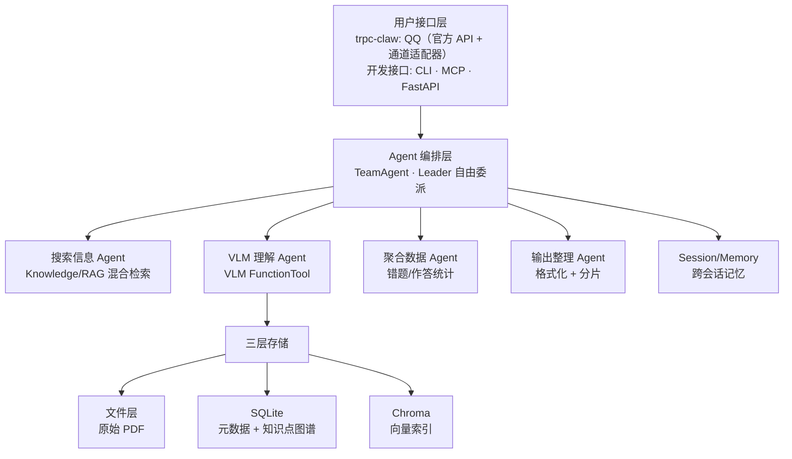

# 架构设计

## 总体思路

Gaokao RAG 基于 **tRPC-Agent-Python** 框架构建，核心理念是：**框架搭骨架，自定义插件填业务逻辑**。

tRPC-Agent 已经提供了 Agent 编排、Knowledge/RAG、Session/Memory、MCP、FastAPI 服务化等能力，我们不需要从零手写这些。需要自定义的是：

- **VLM 图形理解管线** —— 框架的 Knowledge 层是文本 RAG，VLM 调用需要封装为 FunctionTool
- **PDF 多模态摄取** —— 业务逻辑，框架不管；但摄取的核心决策（内容三分、题目切分、知识点提取）由 Agent 层完成，ingestion 层只提供纯 I/O 工具集
- **知识点图谱** —— SQLite schema 设计 + 知识点查询工具
- **意图路由与委派** —— TeamAgent 的 Leader 自由委派机制；意图匹配内联 Leader 系统提示词（2026-08-28 决策：非独立子 Agent），Leader 按子 Agent 能力清单匹配后委派

## 系统架构总览



## tRPC-Agent 集成层

### 框架替我们做的事

| 能力 | 框架组件 | 我们的用法 |
| ------ | --------- | ----------- |
| Agent 编排 | TeamAgent | Leader 自由委派 4 个子 Agent（搜索/VLM/聚合/输出；意图路由内联 Leader 系统提示词） |
| RAG 检索 | LangchainKnowledge + LangchainKnowledgeSearchTool（MVP 纯向量比较；`AgenticLangchainKnowledgeSearchTool` 动态过滤后续升级） | 接入 Chroma 向量库 |
| 模型接入 | OpenAIModel | **模型中立**：OpenAI 兼容协议抽象，理论上用户可自选任何兼容模型；开发期默认 DeepSeek + Qwen |
| MCP Server | MCPToolset (stdio/sse/streamable-http) | 暴露检索、查询、复习建议工具 |
| 会话记忆 | SessionService + SqlMemoryService | **V0.5 用 SqlSessionService（SQLite 持久化）**；摘要机制 + SqlMemoryService 用户画像 V1.1 |
| 服务化 | FastAPI + A2A + AG-UI | HTTP API + SSE 流式输出 |
| 可观测性 | OpenTelemetry + **Langfuse** | **V0.5 接入 Langfuse（自托管）**——多 Agent 委派链可视化，学生数据不出服务器 |

### 我们自定义的部分

| 自定义模块 | 类型 | 挂载方式 |
| ----------- | ------ | --------- |
| VLM 图形理解 | FunctionTool | 挂到 VLM 子 Agent 的 tools |
| 知识点查询 | FunctionTool | 挂到搜索子 Agent 的 tools 列表 |
| PDF 摄取管线 | 业务 I/O 工具集（Agent 调用） | ingestion 层提供写入函数（ingest_question / ingest_image / ingest_exam_paper / ingest_error 等）；知识点归位复用 src/ingestion/topic.py |
| 意图路由 | Leader 系统提示词能力 | `LEADER_INSTRUCTION` 内置子 Agent 能力清单 + 意图集合表，Leader 匹配后委派（2026-08-28 决策，原独立意图识别子 Agent 已移除） |
| 错题分析 | FunctionTool + Memory | 挂到聚合子 Agent，读取错题记录 |

## TeamAgent 编排设计

核心是一个 **TeamAgent**：Leader 自由委派任务给查询侧 + 摄入侧两组专业子 Agent。

> 完整编排设计（系统总览三层结构、团队结构、GaokaoState、子 Agent 职责、Skill 分工、Session/Memory）统一维护在 **[Agent 编排设计](agent/README.md)**，此处不重复。

## 三层存储架构

继承 AlgoNotes RAG 的三层存储设计（L1 文件 / L2 SQLite / L3 Chroma），schema 针对高考场景重新设计。

> 存储层文档统一入口：**[store/README.md](store/README.md)**（三层职责速览 + files / db / vector 文档导航；SQLite 逐表设计见 store/db/，Chroma Document / doc_id 策略见 store/vector/vector_store.md）。

## 项目文件架构

```tree
gaokao_rag/
├── config.toml                # 系统配置（模型、存储路径、VLM 参数）
├── pyproject.toml             # 项目依赖与元数据
├── .env                       # 环境变量（API Key 等，gitignore）
├── main.py                    # uv init 入口（后续替换为 CLI）
│
├── src/                       # 源代码（V0.1-V1.0 逐步实现）
│   ├── config.py              # 配置加载（Pydantic + config.toml + 环境变量）
│   │
│   ├── api/                   # 模型客户端层（OpenAI 兼容协议抽象）
│   │   ├── llm.py             #   LLM 客户端 —— DeepSeek V4-Flash
│   │   ├── vlm.py             #   VLM 客户端 —— Qwen3.7-Flash / Plus（DashScope）
│   │   └── embedding.py       #   嵌入模型 —— qwen3.7-text-embedding（DashScope）
│   │
│   ├── ingestion/             # 摄取门面（写，封装三层存储全部 增/删/改，无 LLM）
│   │   ├── question.py        #   ingest_question() - 存储一道题（文件 + DB + 向量 + knowledge 四层）
│   │   ├── image.py           #   ingest_image() - 存储一张图（文件 + DB）
│   │   ├── exam_paper.py      #   ingest_exam_paper() - 存储一份试卷（文件 + DB）
│   │   └── error.py           #   ingest_error() - 存储错题（DB + 关联题目）
│   │
│   ├── retrieval/             # 检索门面（读，封装全部查询与聚合，只读不写，无 LLM）
│   │   ├── knowledge.py       #   知识检索组件（GaokaoKnowledge + get_knowledge，过滤翻译）
│   │   ├── question.py        #   search_questions / get_question_detail / browse_questions
│   │   ├── knowledge_note.py  #   search_knowledge_notes
│   │   ├── topic.py           #   search_topics / list_topics
│   │   ├── error.py           #   get_error_stats / get_weak_topics
│   │   ├── exam_attempt.py    #   aggregate_attempts
│   │   └── report.py          #   get_report / compute_trend（周报双源聚合）
│   │
│   ├── store/                 # 三层存储 + 知识点图谱（原语层，最低层）
│   │   ├── file_store.py      #   Layer 1：文件存储（原始 PDF 管理，详见 [store/files/raw.md](store/files/raw.md)）
│   │   ├── db/                #   Layer 2：SQLite 数据访问层（按表拆，共享连接）
│   │   │   ├── __init__.py    #     连接管理（单例）+ schema 初始化
│   │   │   ├── schema.py      #     9 张表 DDL + 索引
│   │   │   ├── files.py       #     文件注册表（title + 哈希路径 + sha256 去重）
│   │   │   ├── topics.py      #     知识点标签 CRUD（MVP 扁平 tag，无树结构）
│   │   │   ├── knowledge_notes.py
│   │   │   ├── questions.py
│   │   │   ├── question_topics.py
│   │   │   ├── errors.py
│   │   │   ├── exam_attempts.py
│   │   │   ├── review_plans.py
│   │   │   └── periodic_reports.py
│   │   ├── vector/             #   Layer 3：Chroma 向量库（存储读写原语）
│   │   │   └── vector_store.py #     Chroma 增删读写 + 懒单例（document 入库，切片细则 V0.3 定）
│   │   └── __init__.py
│   │
│   ├── agent/                 # Agent 编排层（TeamAgent + 子 Agent + 工具 + Skills）
│   │   ├── leader.py          #   Team Leader 编排（TeamAgent + 自由委派）
│   │   ├── tools/             #   FunctionTool（按写/读拆两个文件：ingest_tool / retrieve_tool，挂到各子 Agent）
│   │   │   ├── ingest_tool.py  #    写侧工具（合并自原 extract/vlm/knowledge/ingest 4 个 tool 文件；挂到文档识别/题目维护/入库决策/VLM 理解子 Agent）
│   │   │   └── retrieve_tool.py #   读侧工具（合并自原 knowledge_tool 查询侧 / error_tool；框架检索工具 + 业务查询，挂到搜索/聚合子 Agent）
│   │   │
│   │   ├── skills/            #   Agent Skills：__init__.py 承载共享构造（SKILLS_ROOT / create_skill_tool_set / 白名单仓库），子目录各含一个 SKILL.md
│   │   │   └── question-organize/     #    题目整理：整篇切出的题目段 / 零散输入 → 题目/答案/解析三段（已落地）
│   │
│   │   ├── ingestion/         #   摄入侧子 Agent（每文件一个 Agent，只调 src/ingestion 写门面）
│   │   │   ├── doc_recognition.py       #  文档识别 Agent
│   │   │   ├── structure_recognition.py #  结构识别 Agent
│   │   │   ├── question_maintain.py    #  题目维护 Agent（知识点归位 + 改 / 删题）
│   │   │   ├── storage_decision.py      #  入库决策 Agent
│   │   │   └── prompts.py               #  摄入侧各 Agent 的 instruction 常量（长 prompt 独立成模块）
│   │
│   │   └── retrieval/         #   查询侧子 Agent（每文件一个 Agent，只调 src/retrieval 读门面；意图路由内联 Leader 系统提示词，无 intent.py）
│   │       ├── search.py      #    搜索信息 Agent
│   │       ├── vlm.py         #    VLM 理解 Agent
│   │       ├── aggregate.py   #    聚合数据 Agent
│   │       └── output.py      #    输出整理 Agent
│   │
│   ├── mcp/                   # MCP Server（对外暴露）
│   │   └── server.py          #   FastMCP 工具定义（14 个工具）
│   │
│   └── im/                    # IM 接入层（QQ 入口，详见 [im/README.md](im/README.md)）
│       ├── __init__.py        #   create_claw_app()：装配 TeamAgent → ClawApplication（方式 A，QQ 主入口）
│       └── claw_app.py        #   ClawApplication team 模式扩展 + openclaw 配置加载（channels.qq + ${VAR} 桥接 .env）
│                              #   注：通道适配器 _qq.py 与 create_agent team 扩展属 trpc_agent_sdk 侧（上游 PR / 本地补丁）
│
├── scripts/                   # CLI 入口
│   ├── ingest.py              #   批量摄取（自动调用摄入侧 Agent 工具集，不经过 TeamLeader）
│   ├── chat.py                #   对话 CLI（开发调试）
│   ├── mcp_server.py          #   MCP Server 入口（stdio/SSE/HTTP）
│   └── im_server.py           #   IM 网关入口（trpc-claw QQ 通道，方式 A）
│
├── data/                      # 数据目录（gitignore）
│   ├── files/                 # 文件层根目录（raw + processed）
│   │   ├── raw/               # raw_dir：原始文件（只读源，不可变）
│   │   │   ├── pdfs/          #   原始 PDF（哈希命名）
│   │   │   └── images/        #   学生上传图片（哈希命名）
│   │   │       ├── uploaded/  #     QQ 上传、作业拍照等（统一入口）
│   │   │       └── extracted/ #     从 PDF 提取的插图
│   │   └── processed/         # processed_dir：处理后中间产物（可重建）
│   │       ├── text/          #   清洗后的文本
│   │       └── vlm_desc/      #   VLM 图形描述（中间缓存）
│   ├── chroma_db/             # chroma_dir：Chroma 持久化
│   └── gaokao.db              # sqlite_path：SQLite 索引
│
└── tests/                     # 测试（V0.5 后补充）
```

### 各层职责速览

| 层 | 目录 | 职责 |
| ---- | ------ | ------ |
| 配置 | `config.toml` + `.env` | 模型、存储、VLM 参数，代码不硬编码 |
| 模型接入 | `src/api/` | OpenAI 兼容协议封装，LLM / VLM / Embedding 统一接口 |
| 三层存储（原语） | `src/store/` | 最低层：文件(raw) / SQLite 逐表 CRUD / Chroma 原语。只被 ingestion、retrieval 依赖，不向上依赖 |
| 摄取门面（写） | `src/ingestion/` | **封装三层存储的全部 增/删/改**：ingest_question / update_question / delete_question、ingest_image、ingest_exam_paper、ingest_error、ingest_knowledge_note、topic 归位（create_topic / add_topic_alias / resolve_or_create_topics / delete_topic）、record_exam_attempt、save_review_plan、save_report。保证三态一致，**无 LLM** |
| 检索门面（读，**新增**） | `src/retrieval/` | **封装全部查询与聚合逻辑**：知识检索组件（`GaokaoKnowledge.search` 语义召回 + 过滤翻译）、search_questions / get_question_detail / browse_questions、search_knowledge_notes、search_topics / list_topics、get_error_stats / get_weak_topics、aggregate_errors / aggregate_attempts / get_report / compute_trend。只读不写 |
| Agent 编排 | `src/agent/` | TeamAgent 编排（leader.py）+ 子 Agent（ingestion/ 摄入侧、retrieval/ 查询侧，每文件一个 Agent）+ FunctionTool（tools/）+ Skills（skills/，可复用领域指令，渐进式披露）；**只调用 ingestion（写）/ retrieval（读）封装函数**，严禁 import `src.store.*` |
| MCP 服务 | `src/mcp/` | 对外暴露工具，委托 agent（含 tools） |
| IM 接入（**新增**） | `src/im/` | QQ 通道网关装配（trpc-claw `ClawApplication` + TeamAgent 方式 A）；通道适配器 `_qq.py` 与 `create_agent` team 扩展属 trpc_agent_sdk 侧（上游 PR / 本地补丁），见 [im/README.md](im/README.md) |
| CLI 入口 | `scripts/` | ingest / chat / mcp_server / im_server 四个命令 |
| 数据 | `data/` | 原始文件 + 处理后数据 + 两个数据库 |

## 分层边界契约（强制）

本次结构调整确立三条铁律：**ingestion = 写门面、retrieval = 读门面、agent/mcp/im = 只委托**。依赖方向构成无环 DAG：

```
src/store  ←  { src/ingestion, src/retrieval }  ←  { src/agent, src/mcp, src/im }
```

- **store（原语层）**：只提供单表 / 单文件 / 单向量的原子 CRUD。不依赖 ingestion / retrieval / agent。测试可直接 import 以断言三层状态。
- **ingestion（写门面）**：组合 store 原语，把「文件层 + SQLite + 向量层」三态作为一个原子业务操作保持一致。拥有所有 增/删/改；不含任何 LLM 调用。
- **retrieval（读门面）**：组合 store 原语，封装所有查询与聚合（含周报双源统计）；**包含知识检索组件 `GaokaoKnowledge`（对 Chroma 的读包装应用，语义召回 + 过滤翻译）**。只读不写。
- **agent / mcp / im（业务入口）**：只允许 `import src.ingestion`（写）与 `import src.retrieval`（读）。**严禁**在任一入口模块里 `import src.store`、`import src.store.db`、`import src.store.vector`、`import src.store.file_store` —— 任何存储访问必须经由两个门面。`src/im/` 进一步只委托 `src/agent`（TeamAgent 装配），不直接触碰门面。

> **2026-08-28 决策**：`GaokaoKnowledge`（原 `src/store/vector/knowledge.py`）迁入 `src/retrieval/knowledge.py`——它是「对第三层存储的读包装应用」而非存储原语，归属读门面。由此框架检索工具注入 `get_knowledge()` 走 `src.retrieval`，分层铁律无需任何特例放行。

> 注意命名：`src/agent/ingestion/`（摄入侧子 Agent，含 LLM）与 `src/ingestion/`（写门面，无 LLM）是**两层不同概念**；`src/agent/retrieval/`（查询侧子 Agent）与 `src/retrieval/`（读门面）同理。**意图匹配与编排决策归 Leader**（系统提示词内联），子 Agent 只处理分内任务，**具体存储读写一律委托给两个门面**，子 Agent 本身也不允许 import src.store。

> 校验（可选）：在 `src/agent/__init__.py` 或 CI lint 中拒绝 agent 包出现对 `src.store` 的 import，从机制上堵死「入口直连存储」。

## 模型配置

**模型中立**：通过 tRPC-Agent 的 OpenAIModel（OpenAI 兼容协议）接入，架构上不绑定任何厂商。理论上用户可自选任何 OpenAI 兼容模型（DeepSeek / Qwen / 其他）。**开发期由后台写死默认配置**：

| 用途 | 开发期默认模型 | 提供方 | 接入方式 |
| ------ | -------------- | -------- | --------- |
| 对话/推理 (LLM) | DeepSeek V4-Flash | DeepSeek 官方 API | OpenAIModel |
| 图形理解 (VLM) | Qwen3.7-Flash | Qwen 官方 API（DashScope） | OpenAIModel (多模态) |
| 复杂图形推理 (VLM) | Qwen3.7-Plus | Qwen 官方 API（DashScope） | OpenAIModel (多模态) |
| 文本嵌入 | qwen3.7-text-embedding（dimension=1024，config 规定） | Qwen 官方 API（DashScope） | OpenAI 兼容端点独立调用 |
| PDF 解析 | MinerU2.5-Pro | 独立 API 调用 | 独立调用 |

模型名、API Key、Base URL 全部走 `config.toml` + 环境变量，代码不硬编码。

## 与 AlgoNotes RAG 的对比

| 维度 | AlgoNotes RAG | Gaokao RAG |
| ------ | -------------- | ------------ |
| 框架 | 手写 Agent + LangGraph | tRPC-Agent-Python |
| 学科 | 单域（算法竞赛） | 多学科（愿景全科；MVP 数学单科） |
| 输入格式 | Markdown | PDF + 图像 + Markdown |
| 图形处理 | 无 | VLM（核心技术差异点） |
| 知识点 | 扁平 tag + 题目关联 | 树形图谱 + 题目关联 |
| 用户 | 个人 | 单人（MVP；user_id 字段预留未来多用户） |
| 元数据 | source/type/tags | 科目/年份/题型/知识点/考区 |
| MCP | 手写 9 工具 | 框架内置 MCPToolset |
| 服务化 | CLI | CLI + FastAPI + MCP |
| 可观测性 | 自写日志 | OpenTelemetry |
