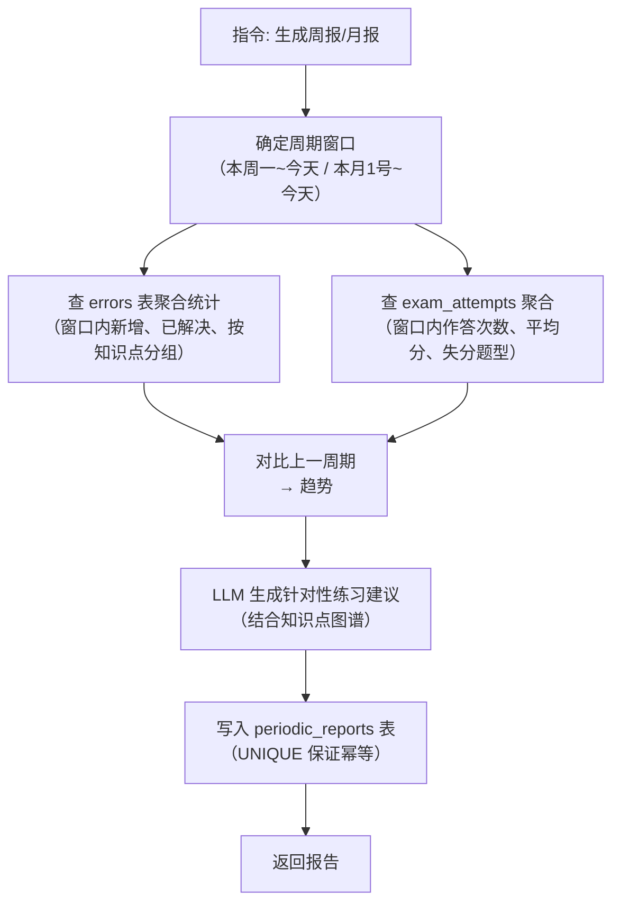

# 数据模型与知识点图谱

## 概述

### 一句话模型

> **Gaokao RAG 的数据 = 题目 + 知识点，两者分开处理**：
>
> - **知识点**（资料/专题/作业中的讲解段）→ 只需挂到知识树（`knowledge_notes.topic_id` → `topics`），纯文本 RAG
> - **题目**（试卷/作业中的题）→ 记录完整四要素：**题目内容（含图片描述）+ 答案解析 + 错题错因 + 知识点关联**
> - **考试试卷**额外记录整卷作答情况（`exam_attempts`）；作业试卷不需要
> - 所有输入走**统一摄入范式**：结构识别 → 讲解/题目分流 → 回显确认 → 用户决定去向

### 存储分层

Gaokao RAG 的数据模型分为两部分：

1. **SQLite 关系层** —— 存储知识点图谱、知识点讲解、题目元数据、错题记录、作答记录、题目-知识点关联
2. **Chroma 向量层** —— 存储文本块（题目、解析、知识点描述）的向量嵌入

两层通过 `doc_id` 关联。SQLite 负责"精确过滤"（按知识点、年份、难度），Chroma 负责"语义相似"（按问题含义检索）。

## SQLite Schema

### 1. 文件注册表 `files`

所有源文件（PDF / 题目图片）的**统一注册表**：磁盘存哈希命名文件，数据库记录语义标题（`title`）+ 磁盘路径（`file_path`）。业务表（questions / knowledge_notes / exam_attempts）通过 `file_id` 引用，不再各自存来源。

```sql
CREATE TABLE files (
    id          INTEGER PRIMARY KEY AUTOINCREMENT,
    title       TEXT,                            -- 语义标题（agent 总结生成 / 用户自定义，可空=待生成）
    file_path   TEXT UNIQUE NOT NULL,            -- 磁盘相对路径（哈希命名: pdfs/3f9a2c81.pdf）
    sha256      TEXT NOT NULL,                   -- 内容哈希（去重 + 完整性校验）
    size        INTEGER,                         -- 字节数
    kind        TEXT NOT NULL,                   -- "pdf" / "image"
    source_hint TEXT,                            -- 原始来源备注（可选: "QQ 上传" / "ima 导出"）
    created_at  TEXT DEFAULT (datetime('now'))
);

CREATE INDEX idx_files_kind ON files(kind);
CREATE UNIQUE INDEX idx_files_sha ON files(sha256);   -- 同内容天然去重
```

> **设计要点**：磁盘文件名 = sha256 哈希（去重 / 防冲突 / 防恶意名），**原文件名直接丢弃**；`title` 是语义标题（agent 从内容总结，用户可自定义），**挂在文件上而非题目上**——一份试卷改标题全局生效。图片（kind='image'）同样入库，题目通过 `image_file_ids` 引用。`source_file` 字段已废弃。
> 详细文档见 [store/db/files.md](store/db/files.md)

### 2. 知识点树形表 `topics`

> 详细文档见 [store/db/topics.md](store/db/topics.md)

采用**路径枚举（Materialized Path）**模型，每个节点用 `path` 列记录从根到自身的完整 id 路径（如 `1/2/3/`，根节点 = `1/`）。子树查询走前缀匹配（`LIKE '1/2/%'`），防环靠 O(1) 路径比较，移动/合并靠前缀批量替换——比邻接表 + 递归 CTE 更契合"频繁演化"的动态树。**树是数据驱动的动态结构**（非预定义写死，见下方"动态构建"说明）：

```sql
CREATE TABLE topics (
    id          INTEGER PRIMARY KEY AUTOINCREMENT,
    path        TEXT NOT NULL,                    -- 路径枚举: '1/2/3/'（必须尾斜杠，防 id 前缀撞车），根 = '1/'
    name        TEXT NOT NULL,                    -- 知识点名称（LLM 提取，即 tag，同名/同义靠 aliases 归并）
    subject     TEXT NOT NULL,                    -- 学科: "数学" / "物理" / ...
    level       INTEGER NOT NULL,                 -- 层级: 0=根, 1=一级, 2=二级, 3=叶子（可直接子节点过滤）
    description TEXT,                             -- 知识点描述（跨题目聚合）
    -- 动态构建字段
    aliases     TEXT,                             -- 同义表述 JSON: ["离心率", "e=c/a"]（合并/改名时旧名归档于此）
    source_count INTEGER DEFAULT 0,               -- 关联题目数（树生长统计）
    confidence  REAL,                             -- 节点可信度（LLM 挂载置信度）
    status      TEXT DEFAULT 'active',            -- active / merged / pending（待归位）
    merged_into INTEGER REFERENCES topics(id),    -- 合并后指向的节点
    created_at  TEXT DEFAULT (datetime('now'))
);

CREATE INDEX idx_topics_path ON topics(path);
CREATE INDEX idx_topics_subject ON topics(subject);
CREATE INDEX idx_topics_status ON topics(status);
```

> **tag 语义（名字即 tag）**：树上任意节点的 `name`（含 `aliases`）都是可用的 tag。Chroma metadata 存**名字快照**（`topic_tags`，见下文），树结构演化（合并/移动/改名）不影响已入库 metadata——合并/改名时旧名归档进 `aliases`，检索按"name + aliases"并集匹配即可。~~`code`（知识点编码）~~ 已砍掉：名字即身份，无需额外编码层。

**路径枚举操作要点**：

| 操作         | SQL / 做法                                                                                                 |
| ------------ | ---------------------------------------------------------------------------------------------------------- |
| 取子树       | `WHERE path LIKE '1/2/3/%'`（走 path 索引）                                                                |
| 取祖先链     | `path` split('/') 得到 id 序列                                                                             |
| 插入         | `INSERT` 拿新 id → `path = 父路径 \| id \| '/'`                                                            |
| 移动整棵子树 | `UPDATE topics SET path = 新前缀 \| substr(path, LEN(旧前缀)+1) WHERE path LIKE 旧前缀 \| '%'`（一次改完） |
| 防环检查     | 新父 `path` 不以本节点 `path` 开头（O(1) 字符串比较）                                                      |
| 合并         | source 子树 path 批量替换到 target 前缀 + aliases 并入 target                                              |

> 防环必须写在写入路径（`move_topic`/`create_topic`）内部，不能依赖 LLM 自觉；`path` 必须带尾斜杠，否则 `LIKE '1/2/3/%'` 会误匹配 `1/2/3/60` 这类 id 前缀撞车的节点。

**动态构建（数据驱动，MVP 单用户一棵树）**：

> 树不是 V0.2 手工 seed 的固定分类，而是随用户数据摄入不断演化。摄取时四步：
> ① **LLM 开放式提取**知识点名（不预定义候选集，允许树外新节点，如"切线放缩""端点效应"）
> ② **查树归位**：命中复用已有节点；未命中新增（先挂根，status=pending）
> ③ **语义合并**：同义/近义表述（"离心率" vs "e=c/a"）合并到同一节点（aliases），防树膨胀
> ④ **挂载父节点**：LLM 依据语义判定层级挂载（status=pending → active）

**设计决策**：动态构建而非预定义。理由：

- 树是"用户数据在知识空间的投影"，无知识天花板；树外知识点自动长出新节点
- 反映真实薄弱分布（周报"薄弱知识点 Top 3"直接从树 × errors 聚合）
- 扩科（理化生）无需重造树，数据喂进来树自己长
- **MVP 单用户**：不存在多用户隔离，树就是这一个用户的知识树

### 3. 知识点讲解表 `knowledge_notes`

> 详细文档见 [store/db/knowledge_notes.md](store/db/knowledge_notes.md)

存储讲义/学习资料中的**知识点讲解段**（概念、公式、典型方法）。本质是**纯文本 RAG**——比带图的题目还简单，不需要 VLM，文本切块向量化即可。

```sql
CREATE TABLE knowledge_notes (
    id              INTEGER PRIMARY KEY AUTOINCREMENT,
    doc_id          TEXT UNIQUE NOT NULL,          -- 与 Chroma knowledge_point chunk 对应
    topic_id        INTEGER REFERENCES topics(id),  -- 关联知识点树节点（可空，识别不出先挂 NULL）
    file_id         INTEGER REFERENCES files(id),  -- 所属资料/试卷（files 表，可空=散题无来源）
    title           TEXT,                           -- 讲解标题（如"分离参数法"）
    content         TEXT NOT NULL,                  -- 讲解文本
    examples        TEXT,                           -- 关联例题引用 JSON: [question_id]
    created_at      TEXT DEFAULT (datetime('now'))
);

CREATE INDEX idx_notes_topic ON knowledge_notes(topic_id);
CREATE INDEX idx_notes_file ON knowledge_notes(file_id);
```

**与 Chroma 的关系**：content 向量化 → `knowledge_point` chunk，`doc_id` 桥接（同 questions 模式）。

**检索价值**：用户问"什么是分离参数法" → 命中 knowledge_point chunk → 返回讲解内容 + 关联例题。复习建议可链接到具体讲解（"先看圆锥曲线讲义：分离参数法"）。

### 4. 题目表 `questions`

> 详细文档见 [store/db/questions.md](store/db/questions.md)

```sql
CREATE TABLE questions (
    id              INTEGER PRIMARY KEY AUTOINCREMENT,
    doc_id          TEXT UNIQUE NOT NULL,          -- 与 Chroma chunk 的 doc_id 对应
    source_type     TEXT NOT NULL,                  -- "exam" / "special_topic" / "homework" / "error_book"
    file_id         INTEGER REFERENCES files(id),  -- 所属试卷/作业（files 表；标题经 join 获取，不冗余）
    exam_region     TEXT,                            -- 考区: "南昌" / "深圳" / "全国卷I" ...
    exam_year       INTEGER,                         -- 年份
    exam_month      TEXT,                            -- 月份: "二月" / "三月" ...
    question_number TEXT,                            -- 题号: "第15题" / "选择题3"
    question_type   TEXT NOT NULL,                  -- "选择题" / "填空题" / "解答题"
    difficulty      INTEGER,                         -- 1-5 难度等级
    content_text    TEXT NOT NULL,                  -- 题目文本（VLM 处理后含图形描述）
    answer_text     TEXT,                            -- 标准答案
    analysis_text   TEXT,                            -- 解析
    has_image       BOOLEAN DEFAULT 0,              -- 是否含图
    image_file_ids  TEXT,                            -- 题目图片 files.id 数组 JSON（经 files 表取路径）
    vlm_descriptions TEXT,                           -- VLM 生成的图形描述 JSON 数组
    raw_text        TEXT,                            -- 原始提取文本（备份）
    created_at      TEXT DEFAULT (datetime('now'))
);

CREATE INDEX idx_questions_source ON questions(source_type, file_id);
CREATE INDEX idx_questions_exam ON questions(exam_region, exam_year);
CREATE INDEX idx_questions_type ON questions(question_type);
CREATE INDEX idx_questions_difficulty ON questions(difficulty);
```

### 5. 题目-知识点关联表 `question_topics`

> 详细文档见 [store/db/question_topics.md](store/db/question_topics.md)

多对多关系——一道题可能涉及多个知识点：

```sql
CREATE TABLE question_topics (
    question_id  INTEGER NOT NULL REFERENCES questions(id),
    topic_id     INTEGER NOT NULL REFERENCES topics(id),
    is_primary   BOOLEAN DEFAULT 0,                 -- 是否是主要知识点
    created_at   TEXT DEFAULT (datetime('now')),
    PRIMARY KEY (question_id, topic_id)
);

CREATE INDEX idx_qt_question ON question_topics(question_id);
CREATE INDEX idxt_qt_topic ON question_topics(topic_id);
```

> **标注流程**：摄取时由 LLM 读取题目文本，输出知识点**名字**列表（含同义表述），通过 `search_topic`（name/aliases 模糊查）归位获取 `topic_id`；未命中则新建节点（pending）。

### 6. 错题记录表 `errors`

> 详细文档见 [store/db/errors.md](store/db/errors.md)

```sql
CREATE TABLE errors (
    id              INTEGER PRIMARY KEY AUTOINCREMENT,
    user_id         TEXT NOT NULL,                  -- 用户标识（MVP 固定单一用户，字段预留未来多用户）
    question_id     INTEGER REFERENCES questions(id),
    source_text     TEXT,                            -- 错题原始文本（如果未关联到题目）
    error_type      TEXT,                            -- "计算错误" / "思路错误" / "知识盲区" / "审题错误"
    user_reflection TEXT,                            -- 用户口述的原始错因描述（自由文本）
    error_summary   TEXT,                            -- LLM 生成的结构化错因总结（JSON: {cause, knowledge_gap, fix_suggestion}）
    error_count     INTEGER DEFAULT 1,              -- 同一题错了几次
    first_seen      TEXT DEFAULT (datetime('now')),
    last_seen       TEXT DEFAULT (datetime('now')),
    resolved        BOOLEAN DEFAULT 0               -- 是否已掌握
);

CREATE INDEX idx_errors_user ON errors(user_id);
CREATE INDEX idx_errors_question ON errors(question_id);
CREATE INDEX idx_errors_type ON errors(error_type);
```

> **错因总结（关键设计）**：错题录入时**不存学生手写解题过程**（VLM 识别手写准确率低且存储成本高），改为**用户口述错因 + LLM 生成结构化总结**：
>
> - `user_reflection`：用户用自己的话描述"我当时怎么错的"（QQ 文字/语音输入）
> - `error_summary`：LLM 基于口述 + 题目上下文生成的结构化总结（错因归类、知识缺口、改进建议）
> - 周报/复习建议优先消费 `error_summary`（结构化、可比对），`user_reflection` 作为原始依据保留

### 7. 复习计划表 `review_plans`

> 详细文档见 [store/db/review_plans.md](store/db/review_plans.md)

```sql
CREATE TABLE review_plans (
    id              INTEGER PRIMARY KEY AUTOINCREMENT,
    user_id         TEXT NOT NULL,                  -- 用户标识（MVP 固定单一用户）
    plan_type       TEXT NOT NULL,                  -- "knowledge_gap" / "exam_review" / "custom"
    target_topics   TEXT,                            -- 目标知识点 JSON 数组
    description     TEXT,                            -- 建议内容
    priority       INTEGER DEFAULT 3,               -- 1-5 优先级
    created_at     TEXT DEFAULT (datetime('now')),
    completed_at   TEXT
);

CREATE INDEX idx_review_user ON review_plans(user_id);
```

### 8. 试卷作答记录表 `exam_attempts`

> 详细文档见 [store/db/exam_attempts.md](store/db/exam_attempts.md)

支撑「整卷作答情况」——记录一次完整模考/作业的总体表现（总分、正确率、逐题对错、用时）。与 `errors` 分工：errors 回答"这题为什么错"（题目粒度），exam_attempts 回答"这张卷整体考得怎样"（卷子粒度）。

```sql
CREATE TABLE exam_attempts (
    id              INTEGER PRIMARY KEY AUTOINCREMENT,
    user_id         TEXT NOT NULL,                  -- 用户标识（MVP 固定单一用户）
    file_id         INTEGER NOT NULL REFERENCES files(id),  -- 关联试卷（files 表，title 经 join 获取）
    attempt_date    TEXT NOT NULL,                  -- 作答日期
    total_score     REAL,                           -- 卷面得分
    max_score       REAL,                           -- 满分（如 150）
    time_spent      INTEGER,                        -- 用时（分钟）
    question_results TEXT,                          -- 逐题对错 JSON: [{question_id, score, correct}]
    answer_summary  TEXT,                           -- LLM 生成的整卷分析（薄弱题型/失分点/建议）
    created_at      TEXT DEFAULT (datetime('now'))
);

CREATE INDEX idx_attempts_user_date ON exam_attempts(user_id, attempt_date);
CREATE INDEX idx_attempts_file ON exam_attempts(file_id);
```

> **作答录入（关键交互）**：与错题录入一致——**用户口述 + LLM 解析**，不依赖识别手写成绩单：
>
> - 用户口述："南昌一模做了，选择错 2 个、填空错 1 个，大题导数没写出来，总分 68"（可拍照成绩单作为辅助输入）
> - LLM 解析为 `question_results`（按题号匹配 questions 表）+ `total_score` + `answer_summary`
> - 周报可聚合：`exam_attempts` 算整体正确率/失分题型，`errors` 算薄弱知识点，两者互补

### 9. 周期报告表 `periodic_reports`

> 详细文档见 [store/db/periodic_reports.md](store/db/periodic_reports.md)

支撑「周报 / 月报」功能。报告生成后落库，可回溯、可对比、可缓存（同一周期不重复生成）：

```sql
CREATE TABLE periodic_reports (
    id              INTEGER PRIMARY KEY AUTOINCREMENT,
    user_id         TEXT NOT NULL,                  -- 用户标识（MVP 固定单一用户）
    period_type     TEXT NOT NULL,                  -- "weekly" / "monthly"
    period_start    TEXT NOT NULL,                  -- 周期起始日期
    period_end      TEXT NOT NULL,                  -- 周期结束日期
    -- 统计快照（生成时固化，防后续错题更新导致历史报告漂移）
    total_errors    INTEGER NOT NULL,               -- 周期内新增错题数
    resolved_errors INTEGER DEFAULT 0,              -- 周期内已掌握错题数
    resolve_rate    REAL,                            -- 掌握率 = resolved / total
    weak_topics     TEXT,                            -- 薄弱知识点 JSON: [{topic, error_count, accuracy}]
    trend_vs_prev   TEXT,                            -- 对比上一周期 JSON: {total_delta, top_topic_delta}
    recommendation  TEXT,                            -- LLM 生成的针对性练习建议
    raw_stats       TEXT,                            -- 完整统计原始数据（JSON，供重新生成/调试）
    created_at      TEXT DEFAULT (datetime('now')),
    UNIQUE(user_id, period_type, period_start, period_end)   -- 同周期幂等
);

CREATE INDEX idx_reports_user_period ON periodic_reports(user_id, period_type, period_start);
```

**生成流程**（详见 [Agent 设计](agent.md) 的 REPORT_GEN 节点）：



**数据流**：`errors` 表（错题明细）+ `exam_attempts` 表（作答明细）→ 周期聚合 → `periodic_reports`（快照）→ LLM 建议。错题持续累积、作答按次记录，报告按需生成，三者解耦。

## Chroma 向量层

### Collection 设计

单 Collection，通过 metadata 过滤区分内容类型。

```python
collection = chroma_client.get_or_create_collection(
    name="gaokao",                     # 通用名：全科共用，按 metadata.subject 过滤学科
    metadata={"description": "高考全科知识库"}
)
```

### Chunk 策略

一道题拆分为 3 种 chunk，独立入库：

| chunk_type        | 内容                         | 检索场景                 |
| ----------------- | ---------------------------- | ------------------------ |
| `question`        | 题目文本 + VLM 图形描述      | 用户搜"椭圆离心率最值"   |
| `answer`          | 标准答案 + 解析              | 用户看解析、对比解法     |
| `knowledge_point` | 知识点描述 + 公式 + 典型方法 | 用户问"什么是分离参数法" |

### Metadata 设计

每个 chunk 的 metadata（与 SQLite 字段对齐）：

```python
{
    "doc_id": "q_001_question",     # 与 SQLite questions.doc_id 对应
    "source_type": "exam",
    "title": "2026 南昌一模数学卷",   # 语义标题（files.title 快照，检索可读）
    "subject": "数学",
    "exam_region": "南昌",
    "exam_year": 2026,
    "question_type": "解答题",
    "difficulty": 4,
    "topic_tags": "椭圆,离心率",   # 知识点名字快照（name + aliases），逗号分隔
    "chunk_type": "question",
    "has_image": True,
}
```

> **tag 快照与树的上卷**：`topic_tags` 是摄入时的名字快照（人话、可读）。检索时通过**树展开**做上卷——用户问父节点（"圆锥曲线"）时，取子树所有节点的 name + aliases 并集作为过滤词（"椭圆,双曲线,抛物线,离心率,…"），`topic_tags` 命中任一即召回。树结构演化后只需重新计算展开集合，metadata 不需要改。

## tRPC-Agent Knowledge 集成

利用 tRPC-Agent 的 `LangchainKnowledge` + `AgenticLangchainKnowledgeSearchTool`，Agent 可以根据用户问题自动构建 metadata 过滤条件：

```python
# 用户问 "帮我找2026年南昌一模的圆锥曲线题"
# LLM 自动构建 dynamic_filter（圆锥曲线 → 树展开为子孙节点名字并集）:
{
    "operator": "and",
    "value": [
        {"field": "metadata.exam_region", "operator": "eq", "value": "南昌"},
        {"field": "metadata.exam_year", "operator": "eq", "value": 2026},
        {"field": "metadata.topic_tags", "operator": "like", "value": "椭圆|双曲线|抛物线|离心率"}
    ]
}
```

这就是 tRPC-Agent 的 `AgenticLangchainKnowledgeSearchTool` 的核心能力——LLM 根据用户语义自动构建 `KnowledgeFilterExpr`，不需要手写路由逻辑。
