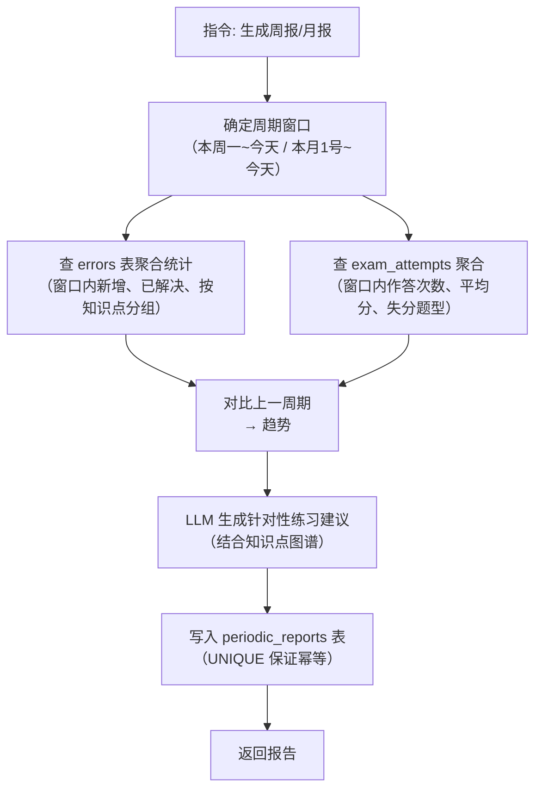

# 数据模型与知识点图谱

## 概述

### 一句话模型

> **Gaokao RAG 的数据 = 题目 + 知识点，两者分开处理**：
>
> - **知识点**（资料/专题/作业中的讲解段）→ 只需挂到知识树（`knowledge_notes.topic_id` → `topics`），纯文本 RAG
> - **题目**（试卷/作业中的题）→ 记录**题目内容（含图片描述）+ 答案解析**（questions 表）；**知识点关联存 `question_topics` 表**（经 `question_id`）；**错题错因单独存 `errors` 表**（经 `question_id` 关联，见第 6 节）
> - **考试试卷**额外记录整卷作答情况（`exam_attempts`）；作业试卷不需要
> - 所有输入走**统一摄入范式**：结构识别 → 讲解/题目分流 → 回显确认 → 用户决定去向

### 存储分层

Gaokao RAG 的数据模型分为两部分：

1. **SQLite 关系层** —— 存储知识点图谱、知识点讲解、题目完整信息（内容/解析）、错题记录、作答记录、题目-知识点关联
2. **Chroma 向量层** —— 存储文本块（题目、解析、知识点描述）的向量嵌入

两层通过 `doc_id` 关联。SQLite 负责"精确过滤"（按知识点、年份、考区），Chroma 负责"语义相似"（按问题含义检索）。

## SQLite Schema

### 1. 文件注册表 `files`

所有源文件（PDF / 题目图片）的**统一注册表**：磁盘存哈希命名文件，数据库记录语义标题（`title`）+ 磁盘路径（`file_path`）。业务表（questions / knowledge_notes / exam_attempts）通过 `file_id` 引用，不再各自存来源。

> **设计要点**：磁盘文件名 = sha256 哈希（去重 / 防冲突 / 防恶意名），**原文件名直接丢弃**；`title` 是语义标题（agent 从内容总结，用户可自定义），**挂在文件上而非题目上**——一份试卷改标题全局生效。图片（kind='image'）同样入库，题目通过 `image_file_ids` 引用。`source_file` 字段已废弃。
> Schema 设计见 [store/db/files.md](store/db/files.md)

### 2. 知识点树形表 `topics`

采用**路径枚举（Materialized Path）**模型，每个节点用 `path` 列记录从根到自身的完整 id 路径（如 `1/2/3/`，根节点 = `1/`）。子树查询走前缀匹配（`LIKE '1/2/%'`），防环靠 O(1) 路径比较，移动/合并靠前缀批量替换——比邻接表 + 递归 CTE 更契合"频繁演化"的动态树。**树是数据驱动的动态结构**（非预定义写死，见下方"动态构建"说明）。

> **tag 语义（名字即 tag）**：树上任意节点的 `name`（含 `aliases`）都是可用的 tag。Chroma metadata 存**名字快照**（`topic_tags`，见下文），树结构演化（合并/移动/改名）不影响已入库 metadata——合并/改名时旧名归档进 `aliases`，检索按"name + aliases"并集匹配即可。~~`code`（知识点编码）~~ 已砍掉：名字即身份，无需额外编码层。

**路径枚举操作要点**：

| 操作         | SQL / 做法                                                                                                 |
| ------------ | ---------------------------------------------------------------------------------------------------------- |
| 取子树       | `WHERE path LIKE '1/2/3/%'`（走 path 索引）                                                                |
| 取祖先链     | `path` split('/') 得到 id 序列                                                                             |
| 插入         | `INSERT` 拿新 id → `path = 父路径 \| id \| '/'`                                                            |
| 移动整棵子树 | `UPDATE topics SET path = 新前缀 \| substr(path, LEN(旧前缀)+1) WHERE path LIKE 旧前缀 \| '%'`（一次改完） |
| 防环检查     | 新父 `path` 不以本节点 `path` 开头（O(1) 字符串比较）                                                      |
| 合并         | source 子树 path 批量替换到 target 前缀 + aliases 并入 target                                              |

> 防环必须写在写入路径（`move_topic`/`create_topic`）内部，不能依赖 LLM 自觉；`path` 必须带尾斜杠，否则 `LIKE '1/2/3/%'` 会误匹配 `1/2/3/60` 这类 id 前缀撞车的节点。

**动态构建（数据驱动，MVP 单用户一棵树）**：

> 树不是 V0.2 手工 seed 的固定分类，而是随用户数据摄入不断演化。摄取时四步：
> ① **LLM 开放式提取**知识点名（不预定义候选集，允许树外新节点，如"切线放缩""端点效应"）
> ② **查树归位**：命中复用已有节点；未命中新增（先挂根，status=pending）
> ③ **语义合并**：同义/近义表述（"离心率" vs "e=c/a"）合并到同一节点（aliases），防树膨胀
> ④ **挂载父节点**：LLM 依据语义判定层级挂载（status=pending → active）

**设计决策**：动态构建而非预定义。理由：

- 树是"用户数据在知识空间的投影"，无知识天花板；树外知识点自动长出新节点
- 反映真实薄弱分布（周报"薄弱知识点 Top 3"直接从树 × errors 聚合）
- 扩科（理化生）无需重造树，数据喂进来树自己长
- **MVP 单用户**：不存在多用户隔离，树就是这一个用户的知识树

Schema 设计见 [store/db/topics.md](store/db/topics.md)

### 3. 知识点讲解表 `knowledge_notes`

存储讲义/学习资料中的**知识点讲解段**（概念、公式、典型方法）。本质是**纯文本 RAG**——比带图的题目还简单，不需要 VLM，文本切块向量化即可。

**与 Chroma 的关系**：content 向量化 → `knowledge_point` chunk，`doc_id` 桥接（同 questions 模式）。

**检索价值**：用户问"什么是分离参数法" → 命中 knowledge_point chunk → 返回讲解内容 + 关联例题。复习建议可链接到具体讲解（"先看圆锥曲线讲义：分离参数法"）。

Schema 设计见 [store/db/knowledge_notes.md](store/db/knowledge_notes.md)

### 4. 题目表 `questions`

存储试卷/作业/专题/错题中的**题目信息**：题目内容（含图片描述）+ 答案解析（本表）；**知识点关联在 `question_topics` 表**（经 `question_id`），**错题错因在 `errors` 表**（经 `question_id`）。题目文本、答案、解析存于本表（**SQLite 自包含**——离线可查；答案/解析**允许缺失**，源资料没有则 NULL），内容三分由结构识别 Agent **LLM 语义划分**（不依赖关键词）。同时拆分 3 种 chunk 入 Chroma（question / answer / knowledge_point，`doc_id` 桥接）做语义检索——双写，本表是权威源。**可重建内容（VLM 描述、原始提取文本）不占本表**，存 `processed/`（vlm_desc/、text/）经哈希关联（见 [processed.md](store/files/processed.md)）。

Schema 设计见 [store/db/questions.md](store/db/questions.md)

### 5. 题目-知识点关联表 `question_topics`

多对多关系——一道题可能涉及多个知识点。**关联存知识点名字（`topic_name`）而非 `topic_id`**——知识树会演化（合并/移动/改名），id 不稳定；名字是稳定 tag（合并时旧名归档进 aliases），树怎么调整关联都不受影响。题目 id 不会变，`question_id` 正常引用。

> **标注流程**：摄取时由 LLM 读取题目文本，输出知识点**名字**列表（含同义表述），通过 `search_topic`（name/aliases 模糊查）归位**确认规范名字**（命中取规范名 / 未命中新建 pending 后取其名）；关联表存该名字。

Schema 设计见 [store/db/question_topics.md](store/db/question_topics.md)

### 6. 错题记录表 `errors`

> **错因总结（关键设计）**：错题录入时**不存学生手写解题过程**（VLM 识别手写准确率低且存储成本高），改为**用户口述错因 + LLM 生成结构化总结**：
>
> - `user_reflection`：用户用自己的话描述"我当时怎么错的"（QQ 文字/语音输入）
> - `error_summary`：LLM 基于口述 + 题目上下文生成的结构化总结（错因归类、知识缺口、改进建议）
> - 周报/复习建议优先消费 `error_summary`（结构化、可比对），`user_reflection` 作为原始依据保留

Schema 设计见 [store/db/errors.md](store/db/errors.md)

### 7. 复习计划表 `review_plans`

Schema 设计见 [store/db/review_plans.md](store/db/review_plans.md)

### 8. 试卷作答记录表 `exam_attempts`

支撑「整卷作答情况」——记录一次完整模考/作业的总体表现（总分、正确率、逐题对错、用时）。与 `errors` 分工：errors 回答"这题为什么错"（题目粒度），exam_attempts 回答"这张卷整体考得怎样"（卷子粒度）。

> **作答录入（关键交互）**：与错题录入一致——**用户口述 + LLM 解析**，不依赖识别手写成绩单：
>
> - 用户口述："南昌一模做了，选择错 2 个、填空错 1 个，大题导数没写出来，总分 68"（可拍照成绩单作为辅助输入）
> - LLM 解析为 `question_results`（按题号匹配 questions 表）+ `total_score` + `answer_summary`
> - 周报可聚合：`exam_attempts` 算整体正确率/失分题型，`errors` 算薄弱知识点，两者互补

Schema 设计见 [store/db/exam_attempts.md](store/db/exam_attempts.md)

### 9. 周期报告表 `periodic_reports`

支撑「周报 / 月报」功能。报告生成后落库，可回溯、可对比、可缓存（同一周期不重复生成）：

**生成流程**（详见 [Agent 设计](agent.md) 的 REPORT_GEN 节点）：



**数据流**：`errors` 表（错题明细）+ `exam_attempts` 表（作答明细）→ 周期聚合 → `periodic_reports`（快照）→ LLM 建议。错题持续累积、作答按次记录，报告按需生成，三者解耦。

Schema 设计见 [store/db/periodic_reports.md](store/db/periodic_reports.md)

## Chroma 向量层

### Collection 设计

单 Collection，通过 metadata 过滤区分内容类型。

```python
collection = chroma_client.get_or_create_collection(
    name="gaokao",                     # 通用名：全科共用，按 metadata.subject 过滤学科
    metadata={"description": "高考全科知识库"}
)
```

### Chunk 策略

一道题拆分为 3 种 chunk，独立入库：

| chunk_type        | 内容                         | 检索场景                 |
| ----------------- | ---------------------------- | ------------------------ |
| `question`        | 题目文本 + VLM 图形描述      | 用户搜"椭圆离心率最值"   |
| `answer`          | 标准答案 + 解析              | 用户看解析、对比解法     |
| `knowledge_point` | 知识点描述 + 公式 + 典型方法 | 用户问"什么是分离参数法" |

### Metadata 设计

每个 chunk 的 metadata（与 SQLite 字段对齐）：

```python
{
    "doc_id": "q_001_question",     # 与 SQLite questions.doc_id 对应
    "source_type": "exam",
    "title": "2026 南昌一模数学卷",   # 语义标题（files.title 快照，检索可读）
    "subject": "数学",
    "exam_region": "南昌",
    "exam_year": 2026,
    "question_type": "解答题",
    "topic_tags": "椭圆,离心率",   # 知识点名字快照（name + aliases），逗号分隔
    "chunk_type": "question",
    "has_image": True,
}
```

> **tag 快照与树的上卷**：`topic_tags` 是摄入时的名字快照（人话、可读）。检索时通过**树展开**做上卷——用户问父节点（"圆锥曲线"）时，取子树所有节点的 name + aliases 并集作为过滤词（"椭圆,双曲线,抛物线,离心率,…"），`topic_tags` 命中任一即召回。树结构演化后只需重新计算展开集合，metadata 不需要改。

## tRPC-Agent Knowledge 集成

利用 tRPC-Agent 的 `LangchainKnowledge` + `AgenticLangchainKnowledgeSearchTool`，Agent 可以根据用户问题自动构建 metadata 过滤条件：

```python
# 用户问 "帮我找2026年南昌一模的圆锥曲线题"
# LLM 自动构建 dynamic_filter（圆锥曲线 → 树展开为子孙节点名字并集）:
{
    "operator": "and",
    "value": [
        {"field": "metadata.exam_region", "operator": "eq", "value": "南昌"},
        {"field": "metadata.exam_year", "operator": "eq", "value": 2026},
        {"field": "metadata.topic_tags", "operator": "like", "value": "椭圆|双曲线|抛物线|离心率"}
    ]
}
```

这就是 tRPC-Agent 的 `AgenticLangchainKnowledgeSearchTool` 的核心能力——LLM 根据用户语义自动构建 `KnowledgeFilterExpr`，不需要手写路由逻辑。
