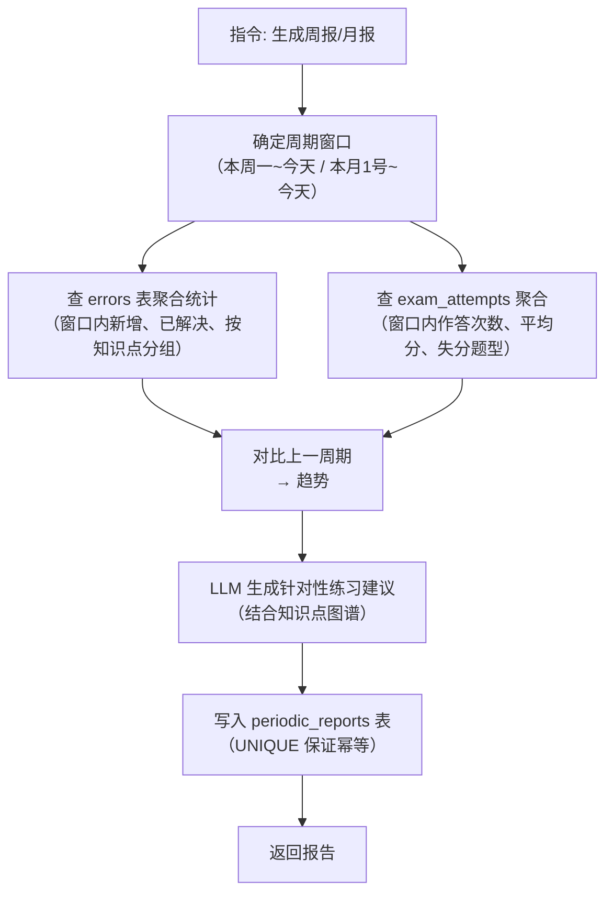

# 数据模型与知识点图谱

## 概述

### 一句话模型

> **Gaokao RAG 的数据 = 题目 + 知识点，两者分开处理**：
>
> - **知识点**（资料/专题/作业中的讲解段）→ 只需挂到知识树（`knowledge_notes.topic_id` → `topics`），纯文本 RAG
> - **题目**（试卷/作业中的题）→ 记录**题目内容（含图片描述）+ 答案解析**（questions 表）；**知识点关联存 `question_topics` 表**（经 `question_id`）；**错题错因单独存 `errors` 表**（经 `question_id` 关联，见第 6 节）
> - **考试试卷**额外记录整卷作答情况（`exam_attempts`）；作业试卷不需要
> - 所有输入走**统一摄入范式**：结构识别 → 讲解/题目分流 → 回显确认 → 用户决定去向

### 存储分层

Gaokao RAG 的数据模型分为两部分：

1. **SQLite 关系层** —— 存储知识点图谱、知识点讲解、题目完整信息（内容/解析）、错题记录、作答记录、题目-知识点关联
2. **Chroma 向量层** —— 存储文本块（题目、解析、知识点描述）的向量嵌入

两层通过 `doc_id` 关联。SQLite 负责"精确过滤"（按知识点、年份、考区），Chroma 负责"语义相似"（按问题含义检索）。

## SQLite Schema

### 1. 文件注册表 `files`

所有源文件（PDF / 题目图片）的**统一注册表**：磁盘存哈希命名文件，数据库记录语义标题（`title`）+ 磁盘路径（`file_path`）。业务表（questions / knowledge_notes / exam_attempts）通过 `file_id` 引用，不再各自存来源。

> **设计要点**：磁盘文件名 = sha256 哈希（去重 / 防冲突 / 防恶意名），**原文件名直接丢弃**；`title` 是语义标题（agent 从内容总结，用户可自定义），**挂在文件上而非题目上**——一份试卷改标题全局生效。图片（kind='image'）同样入库，题目通过 `image_file_ids` 引用。`source_file` 字段已废弃。
> Schema 设计见 [store/db/files.md](store/db/files.md)

### 2. 知识点标签表 `topics`

MVP 采用**扁平 tag 表**（无树结构）。每个知识点是一条独立记录，`name` 即为 tag，`aliases` 存同义表述。题目与知识点通过 `question_topics` 多对多关联。

> **MVP 与正式版的分界**：树形结构（Materialized Path / 父子关系 / 树展开上卷）放在 MVP 后的正式版做。MVP 只做"标签注册 + 多对多关联"，不构成树。

**设计要点**：

- `name` 是规范名，`aliases` 是同义表述 JSON（如 `["离心率", "e=c/a"]`）
- Chroma metadata 存**名字快照**（`topic_tags`，格式见 [store/vector/vector_store.md「Metadata 格式」](store/vector/vector_store.md)）
- 名字是稳定 tag（与"名字即 tag"原则一致），不依赖 id 做关联
- ~~`code`（知识点编码）~~ 已砍掉：名字即身份，无需额外编码层

Schema 设计见 [store/db/topics.md](store/db/topics.md)

### 3. 知识点讲解表 `knowledge_notes`

存储讲义/学习资料中的**知识点讲解段**（概念、公式、典型方法）。本质是**纯文本 RAG**——比带图的题目还简单，不需要 VLM，文本切块向量化即可。**`subject` 学科冗余列**（同 questions：扩科后讲解混合多学科，直接过滤免 join）。

**与 Chroma 的关系**：content 向量化 → `knowledge_notes` document（`kn_*`），`doc_id` 桥接（同 questions 模式）。

**检索价值**：用户问"什么是分离参数法" → 命中讲解 document → 返回讲解内容 + 关联例题。复习建议可链接到具体讲解（"先看圆锥曲线讲义：分离参数法"）。

Schema 设计见 [store/db/knowledge_notes.md](store/db/knowledge_notes.md)

### 4. 题目表 `questions`

存储试卷/作业/专题/错题中的**题目信息**：题目内容（含图片描述）+ 答案解析（本表）；**知识点关联在 `question_topics` 表**（经 `question_id`），**错题错因在 `errors` 表**（经 `question_id`）。**`subject` 学科冗余列**（查询热维度，扩科后直接过滤免 join，与 Chroma metadata 的 subject 快照一致）。题目文本、答案、解析存于本表（**SQLite 自包含**——离线可查；答案/解析**允许缺失**，源资料没有则 NULL），内容三分由结构识别 Agent **逐题加载 `question-organize` Skill 归一**（不依赖关键词）。整篇（题干+答案+解析+VLM 描述）作为一篇 document 入 Chroma（`doc_id` 桥接）做语义检索——双写，本表是权威源。**可重建内容（VLM 描述、原始提取文本）不占本表**，存 `processed/`（vlm_desc/、text/）经哈希关联（见 [processed.md](store/files/processed.md)）。

Schema 设计见 [store/db/questions.md](store/db/questions.md)

### 5. 题目-知识点关联表 `question_topics`

多对多关系——一道题可能涉及多个知识点。**关联存知识点名字（`topic_name`）而非 `topic_id`**——知识树会演化（合并/移动/改名），id 不稳定；名字是稳定 tag（合并时旧名归档进 aliases），树怎么调整关联都不受影响。题目 id 不会变，`question_id` 正常引用。

> **标注流程**：摄取时由 LLM 读取题目文本，输出知识点**名字**列表（含同义表述），通过 `search_topic`（name/aliases 模糊查）归位**确认规范名字**（命中取规范名 / 未命中新建 pending 后取其名）；关联表存该名字。

Schema 设计见 [store/db/question_topics.md](store/db/question_topics.md)

### 6. 错题记录表 `errors`

> **错因总结（关键设计）**：错题录入时**不存学生手写解题过程**（VLM 识别手写准确率低且存储成本高），改为**用户口述错因 + LLM 生成结构化总结**：
>
> - `user_reflection`：用户用自己的话描述"我当时怎么错的"（QQ 文字/语音输入）
> - `error_summary`：LLM 基于口述 + 题目上下文生成的结构化总结（错因归类、知识缺口、改进建议）
> - 周报/复习建议优先消费 `error_summary`（结构化、可比对），`user_reflection` 作为原始依据保留

Schema 设计见 [store/db/errors.md](store/db/errors.md)

### 7. 复习计划表 `review_plans`

Schema 设计见 [store/db/review_plans.md](store/db/review_plans.md)

### 8. 试卷作答记录表 `exam_attempts`

支撑「整卷作答情况」——记录一次完整模考/作业的总体表现（总分、正确率、逐题对错、用时）。与 `errors` 分工：errors 回答"这题为什么错"（题目粒度），exam_attempts 回答"这张卷整体考得怎样"（卷子粒度）。**`subject` 学科冗余列**（同 questions：周报按学科聚合作答统计）。

> **作答录入（关键交互）**：与错题录入一致——**用户口述 + LLM 解析**，不依赖识别手写成绩单：
>
> - 用户口述："南昌一模做了，选择错 2 个、填空错 1 个，大题导数没写出来，总分 68"（可拍照成绩单作为辅助输入）
> - LLM 解析为 `question_results`（按题号匹配 questions 表）+ `total_score` + `answer_summary`
> - 周报可聚合：`exam_attempts` 算整体正确率/失分题型，`errors` 算薄弱知识点，两者互补

Schema 设计见 [store/db/exam_attempts.md](store/db/exam_attempts.md)

### 9. 周期报告表 `periodic_reports`

支撑「周报 / 月报」功能。报告生成后落库，可回溯、可对比、可缓存（同一周期不重复生成）：

**生成流程**（详见 [聚合数据子 Agent](agent/retrieval/aggregate.md) 的 REPORT_GEN 逻辑）：



**数据流**：`errors` 表（错题明细）+ `exam_attempts` 表（作答明细）→ 周期聚合 → `periodic_reports`（快照）→ LLM 建议。错题持续累积、作答按次记录，报告按需生成，三者解耦。

Schema 设计见 [store/db/periodic_reports.md](store/db/periodic_reports.md)

## Chroma 向量层

### Collection 设计

单 Collection，通过 metadata 过滤区分内容类型。

```python
# 通过 langchain-chroma 创建（实际代码走 src/store/vector/vector_store.py 单例）
vectorstore = Chroma(
    collection_name="gaokao",          # 通用名：全科共用，按 metadata.subject 过滤学科
    embedding_function=get_embedding_model(),
    persist_directory="data/chroma_db",
)
```

### 向量维度（config 规定）

**向量维度由 `config.embedding.dimension` 规定（默认 1024），请求显式传 `dimensions` 参数，不依赖模型/平台默认值。**

原因（AlgoNotes 踩坑）：同一 `Qwen3-Embedding-4B`，Gitee.AI 返回 1024 维、SiliconFlow 返回 2560 维——**同模型跨平台默认维度不同**；而 Chroma collection 建好后维度固定，换模型/换维度必须先删 collection 重建，否则维度冲突报错。实现细节与防呆校验见 [store/vector/vector_store.md](store/vector/vector_store.md)。

### Document 策略

**入库单位 = 一篇完整 document**（不是按 chunk 拆分）。一个业务实体 = 一个 doc_id = 一篇完整内容，整体作为一个向量存入 Chroma（当前实现不切片：`upsert` 直接 `add_documents([doc])` 嵌入整篇文本，未接 text splitter；将来若题目过长需切，须保证 doc_id 仍唯一对应实体）。

| document | page_content 组成 | 来源 |
| -------- | ---- | ---- |
| **题目 document**（`doc_type=question`） | 题干 + 答案 + 解析 + VLM 图形描述，四段以换行连接，空段跳过 | `questions` 行 |
| **讲解 document**（`doc_type=note`） | 知识点讲解段文本（概念/公式/方法），为一篇 | `knowledge_notes` 行 |

**page_content 拼接规则**（来自 `src/ingestion/question.py` 的 `ingest_question`）：

```python
parts = [question_text, answer_text, analysis_text]
if vlm_descriptions:
    parts.append("\n".join(vlm_descriptions))
embedding_text = "\n".join(p for p in parts if p)   # 仅拼接非空段
```

即「题干 → 答案 → 解析 → VLM 描述」顺序，缺答案 / 缺解析 / 无图时不留空行。题目 document 与讲解 document 在同一个 Collection 混合召回（用户问"什么是分离参数法" → 命中讲解 document；搜题 → 命中题目 document），由 LLM 综合组织。

#### 题目 document 实例

下面是一篇题目 document 在 Chroma 中的真实形态——由 `ingest_question` 调用 `VectorStore.upsert(doc_id, embedding_text, meta)` 写入，`upsert` 内部再注入 `doc_id` 到 metadata：

```python
from langchain_core.documents import Document

Document(
    page_content=(
        "已知椭圆 C: x²/a² + y²/b² = 1 (a>b>0) 的左右焦点为 F1, F2，\n"
        "点 P 在 C 上，且 ∠F1PF2 = 90°，求 △F1PF2 面积的最大值。\n"
        "设 |PF1|=m, |PF2|=n，则 m+n=2a，m²+n²=(2c)²。\n"
        "面积 S = ½mn。由 (m+n)² = m²+n²+2mn 得 4a² = 4c²+2mn，\n"
        "mn = 2(a²-c²) = 2b²，故 S = b²（定值）。\n"
        "利用椭圆定义 m+n=2a 与勾股定理 m²+n²=4c²，结合展开求 mn，\n"
        "关键：焦点三角形面积只与 b 有关。\n"
        "图形为水平椭圆，左焦点 F1(-c,0)、右焦点 F2(c,0)，\n"
        "点 P 在第一象限弧上，连线 PF1、PF2 构成三角形。"
    ),
    metadata={
        "doc_id": "q_42",                       # upsert 自动注入
        "doc_type": "question",
        "subject": "数学",
        "source_type": "exam",
        "title": "2026 南昌一模 理科数学",         # 取自 files 表标题；无源文件则取题干前 40 字
        "exam_year": 2026,                       # 缺省落 0，不是 None（Chroma 拒绝 None）
        "question_type": "解答题",
        "has_image": True,                       # 布尔快照，Chroma 侧判断含图用
        "topic_tags": ["椭圆", "焦点三角形", "离心率"],  # 知识点名字快照；空列表则不写该字段
        "exam_regions": ["南昌", "江西"],          # 考区层级；空则不写该字段
    },
)
```

**值得注意的几点（与代码一致）**：

- `page_content` 是**文本拼接**，VLM 描述已并入题干文本，下游全走文本 RAG；VLM 原始内容不存 Chroma（存 `processed/vlm_desc/`）。
- metadata **只存检索快照**，不存 `image_file_ids` / `file_id` / `question_number`（这些在 `questions` 表权威）；含图与否用 `has_image` 布尔判断，避免检索时回查 SQLite。
- `exam_year` 缺省落 `0`（`exam_year or 0`），不是 `None`——Chroma metadata 不接受 `None`。
- `topic_tags` / `exam_regions` 为空时**整个字段不写入**（Chroma 拒绝空列表 metadata：`ValueError: non-empty`）。
- `doc_id` 由 `upsert` 从参数注入 metadata，调用方无需在 `meta` 里手写。

**讲解 document 与题目 document 结构镜像**：`doc_type=note`，`page_content` 为讲解段文本，`metadata` 同样含 `subject` / `topic_tags`（若有）/ `title` 等检索字段，差异仅在 `doc_type` 与无 `question_type` / `exam_*` 等题目专属字段。

### doc_id 生成规则

`doc_id` 是 SQLite ↔ Chroma 的桥（业务表存 `doc_id` 列，Chroma 用 `doc_id` 定位 document）。**实体级两段式生成**：

```
doc_id = "{entity}_{id}"
```

| 段 | 取值 | 说明 |
| --- | ---- | ---- |
| `entity` | `q`（questions）/ `kn`（knowledge_notes） | 业务实体缩写 |
| `id` | 业务表主键（questions.id / knowledge_notes.id） | 定位到行 |

**示例**：

| doc_id | 含义 |
| ------ | ---- |
| `q_42` | 题目 42 的完整 document（题干+答案+解析+VLM 描述） |
| `kn_7` | 讲解 7 的 document |

**规则**：
1. **幂等**：同实体（entity + id）恒生成同 doc_id——Chroma `upsert` 天然去重，重复摄入不产生重复 document（更新同 id 的题目内容 = 重算向量后 upsert 同名 doc_id 覆盖）
2. **按实体操作**：删除/更新题目 = 直接按 doc_id（`q_42`）操作，一个实体一个键
3. **双来源共存**：`q_*`（题目）与 `kn_*`（讲解）在同一 collection，前缀区分来源；检索按 `doc_type` 过滤时天然混用两者（题目 + 讲解都答"什么是X"）
4. **检索不依赖 doc_id**：查询走 metadata 过滤（subject/topic_tags/doc_type），doc_id 只做桥接与生命周期管理（更新/删除）

metadata 的**格式、字段规范与过滤语义**见 [store/vector/vector_store.md「Metadata 格式」](store/vector/vector_store.md)。

## tRPC-Agent Knowledge 集成

利用 tRPC-Agent 的 `LangchainKnowledge` + `AgenticLangchainKnowledgeSearchTool`，Agent 可以根据用户问题自动构建 metadata 过滤条件（`KnowledgeFilterExpr`，示例见 [store/vector/knowledge.md「框架集成」](store/vector/knowledge.md)）。
