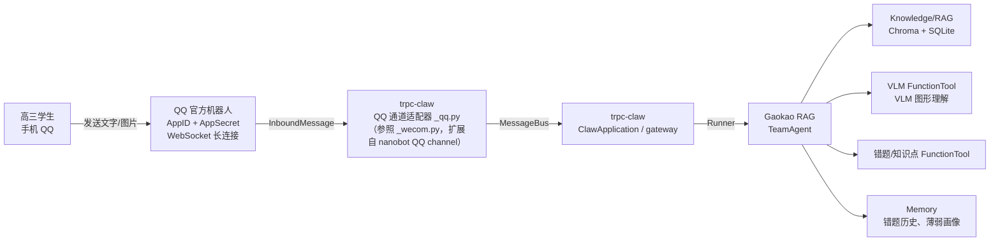

# IM 接入设计（trpc-claw）

## 概述

Gaokao RAG 面向的用户是高三学生——**他们可能不会用 WorkBuddy 等 agent 工具，甚至没有电脑**。因此前端必须是 IM（即时通讯），而不是 MCP / CLI。

tRPC-Agent-Python 原生提供 **trpc-claw**（OpenClaw-like Agent 运行时，**OpenClaw 命名澄清见下文「术语澄清」**），基于 nanobot 构建，内置 Telegram / 企业微信通道；**QQ 走 nanobot 原生 QQ 通道直配接入，免写适配器**（详见下文）。一条命令启动即可 7×24 在线，不需要自己实现消息网关。

> **✅ 可行性已核实（2026-08-30，基于源码 + 官方 wiki）**
> - 依赖已就位并提交（commit `56eda45`）：`trpc-agent-py[knowledge,langfuse,openclaw]>=1.1.16`（拉入 nanobot-ai 0.3.0）+ `qq-botpy>=1.2.0,<2.0.0`（装出 1.2.1）
> - `from nanobot.channels.qq.runtime import QQChannel` 可正常导入，`trpc_agent_cmd openclaw run` 可用
> - 官方文档确认：频道 / 群 / **消息列表单聊**三场景个人开发者均可用，MVP 走 C2C 单聊
> - 本地源码参考：`D:\AI_study\learn\botpy`（官方 SDK）、`D:\AI_study\learn\nanobot`、`D:\AI_study\learn\trpc-agent-python`

## 术语澄清：OpenClaw ≠ trpc-claw（2026-08-30 联网核实）

> 本文所有 "trpc-claw / openclaw" 均指 **tRPC-Agent-Python 内置的 `openclaw`（trpc_claw）**，**不是**业界知名的独立开源项目 **OpenClaw**。两者经常被混淆，务必区分：

| 维度 | **OpenClaw**（独立开源项目） | **trpc-claw**（本项目所用） |
| ------ | ------ | ------ |
| 是什么 | 开源个人 AI 助手 / 自托管 Agent 网关（openclaw.ai / github.com/openclaw/openclaw） | tRPC-Agent-Python 内置的 OpenClaw-like Agent 运行时（`trpc_agent_sdk/server/openclaw/`） |
| 技术栈 | **Node.js**（`npm i -g openclaw`，Node ≥22） | **Python**（`trpc_agent_sdk` + `nanobot`，随 trpc-agent-py 发行） |
| 作者/体量 | Peter Steinberger（steipete）创建于 2025-11，GitHub 34.6 万+ stars，MIT，OpenClaw Foundation 维护 | tRPC-Agent 团队；随包分发，非独立仓库 |
| 通道机制 | channel plugin（WhatsApp/Telegram/Discord/Slack/Teams/Signal/Matrix/iMessage/Zalo/Google Chat/Twitch…） | `channels/` + `register_channel_repair`（内置 telegram/wecom；QQ 待自建 `_qq.py`） |
| 与对方关系 | **概念源头**——trpc-claw 的 Gateway / channel / skills / cron 设计均致敬它 | 命名与架构致敬 OpenClaw，但代码、依赖、运行时完全独立 |
| **QQ 通道** | ❌ 本体及官方插件**均无 QQ 通道** | ✅ 基于 nanobot `QQChannel` 可扩展（即本文方案） |

**对本项目的影响**：OpenClaw 本体（Node 版）无 QQ 通道，且与 trpc-claw **不兼容**（其 `openclaw-qqbot` 插件依赖 Node 版 CLI 插件系统，见下文「兼容性澄清」）。本项目全程使用 Python 栈的 trpc-claw，QQ 接入走「nanobot 原生 QQ 通道 + trpc-claw 适配器」路线，**与 OpenClaw 本体无关**；讨论任何 `openclaw` 命令/配置时，请默认指 trpc-claw。

## 为什么选 QQ（nanobot 原生通道 + trpc-claw 扩展）

| 维度 | QQ（AppID/AppSecret 官方 API） | CLI/MCP |
| ------ | ------------------------- | --------- |
| 高三学生是否已有 | ✅ QQ 是主力（班级/年级群） | ❌ 没有电脑 |
| 安装成本 | 零（QQ 扫码创建） | 极高 |
| 通道支持 | ✅ nanobot 原生支持 QQ（`channels.qq`，AppID+AppSecret） | - |
| 封号风险 | ✅ 无（官方 API） | - |
| 国内可用性 | ✅ | - |
| 图片发送 | ✅ | 受限 |
| 群聊支持 | ⚠️ 可用但消息需 @机器人 触发；沙箱群/正式开放需配置或过审 | - |

**结论**：QQ 走官方 API（AppID + AppSecret），零成本、零封号风险、学生零学习成本。技术路径是 **nanobot 原生 QQ 通道直配 + TeamAgent 接入**（详见下文"QQ 接入方案"）。CLI/MCP/FastAPI 保留给开发者调试和外部 Agent 接入。

> **⚠️ 兼容性澄清（2026-08 调研结论）**：社区版 OpenClaw 的 `openclaw-qqbot` 插件（`openclaw plugins install @tencent-connect/openclaw-qqbot`）是 **Node.js 社区版 OpenClaw** 的插件，依赖 `openclaw` CLI（plugins/channels/gateway 命令），**与 tRPC-Agent-Python 的 trpc-claw 不兼容**。trpc-claw 的 CLI 只有 `run/chat/ui/conf_temp/deps`，没有插件系统。
>
> 正确路径（✅ 2026-08-30 源码验证）：**trpc-claw 基于 nanobot**，而 **nanobot 原生支持 QQ 通道**——`HKUDS/nanobot` 源码（== PyPI `nanobot-ai` 0.3.0）中存在 `nanobot/channels/qq/`（类 `QQChannel(BaseChannel)`，`runtime.py:196`），依赖官方 SDK `qq-botpy>=1.2.0,<2.0.0`，配置字段 `appId/secret/allowFrom/msgFormat`（`manifest.py` SETUP_SPEC）。**且 registry 自动发现含 qq（`discover_plugins()` 实测）——config 配 `channels.qq` 即可启用原生通道，MVP 无需写适配器**（`_qq.py` 长答案分片增强为 V1.1+ 迭代项）。

## QQ 接入方案（nanobot QQ 通道 + trpc-claw 适配器）

> 技术路线：nanobot 已原生支持 QQ 通道，trpc-claw 基于 nanobot 构建。**config 配 `channels.qq` 直启原生 `QQChannel`（MVP 免补丁）**，仅需将主 Agent 换成我们的 TeamAgent。

### 创建机器人（QQ 开放平台）

官方文档：<https://q.qq.com/qqbot/openclaw/>

1. **打开 QQ 开放平台**，用 QQ 扫码登录
2. **点击"创建机器人"**：一键创建，获得 **AppID + AppSecret**
3. AppSecret 只显示一次，保存好（泄露需重置）

### 依赖（✅ 已完成 2026-08-30，commit `56eda45`）

```toml
# pyproject.toml dependencies
"trpc-agent-py[knowledge,langfuse,openclaw]>=1.1.16",  # openclaw extra 拉入 nanobot-ai 0.3.0
"qq-botpy>=1.2.0,<2.0.0",                              # 腾讯官方 SDK（当前 1.2.1）
```

> **关键坑：`qq-botpy` 发行包的导入模块名是 `botpy`**（不是 `qq_botpy`）。nanobot 内部即 `import botpy`；写 `_qq.py` / 调试时切勿写 `import qq_botpy`（会 ModuleNotFoundError）。

安装后验证（已通过）：

```bash
uv run python -c "from nanobot.channels.qq.runtime import QQChannel; print('ok')"
uv run trpc_agent_cmd openclaw run --help
```

### 方案一：直接用 nanobot 网关（备用，可跳过）

nanobot 原生支持 QQ 通道，不需要写任何代码即可跑通消息链路。**注意：openclaw extra 装好后方案二的增量工作已很小，直接走方案二**；此方案保留作参考：

```json
// ~/.nanobot/config.json
{
  "channels": {
    "qq": {
      "enabled": true,
      "appId": "你的AppID",
      "secret": "你的AppSecret",
      "allowFrom": []
    }
  }
}
```

启动：

```bash
nanobot gateway
```

**用途**：V1.0 阶段先验证"学生手机 QQ → 收到答案"的完整链路。Gaokao RAG 的 TeamAgent 通过 Agent-as-Tool 或 HTTP 回调接入 nanobot 网关。

### 方案二：nanobot 原生 QQ 通道直配（正式方案，推荐）

**✅ MVP 免补丁验证（2026-08-30）**：nanobot 的 `ChannelManager`（`nanobot/channels/manager.py` `_init_channels`）通过 `discover_plugins()` **自动扫描注册表内全部通道插件**——实测发现 17 个通道（dingtalk/discord/email/feishu/matrix/mattermost/mochat/msteams/napcat/**qq**/signal/slack/telegram/websocket/wecom/weixin/whatsapp），qq 的 runtime 即 `nanobot.channels.qq.runtime:QQChannel`。**只要 config 配置 `channels.qq` 段（enabled + appId/secret），原生 `QQChannel` 即自动加载启用，无需写任何适配器**（`default_enabled=False` 只影响"未配置时是否默认启用"）。

因此 **MVP 阶段不写 `_qq.py`、不碰 `trpc_agent_sdk` 包**；`_qq.py`（长答案分片增强）是 **V1.1+ 迭代项**（见下文）。

**MVP 落地路径**（仅 3 步，全部在项目内）：

1. **新建 `src/im/openclaw.yaml` 配置 `channels.qq` 段**（字段名以 nanobot `channels/qq/manifest.py` 的 SETUP_SPEC 为准，camelCase；`${VAR}` 由 `load_config` 的 `_expand_env_vars` 展开，密钥仍走 `.env`）：

```yaml
# src/im/openclaw.yaml —— openclaw 网关配置（可进 git，无明文密钥）
channels:
  qq:
    enabled: true
    appId: ${QQ_APP_ID}
    secret: ${QQ_APP_SECRET}
    allowFrom: []           # 空 = 允许所有人；可填 QQ 号/群号白名单
    msgFormat: plain        # plain | markdown（默认 plain）
```

> **配置注入机制**（`openclaw/config/_config.py`）：`load_config(config_path)` 搜索顺序 = ①显式 `config_path` 参数 → ②`$TRPC_CLAW_CONFIG` 环境变量 → ③默认 `~/.trpc_claw/config.yaml`。读文件后 `set_config_path()` 同步给 nanobot loader（`channels.qq` 由此生效）+ `_expand_env_vars()` 递归展开 `${VAR}`（`os.path.expandvars`）。**openclaw 配置（yaml）与 gaokao 自身配置（config.toml + `.env`，TeamAgent 模型/存储）是两套，互不干扰**。

2. **TeamAgent 接入**（方式 A，`src/im/claw_app.py` 子类覆写 `ClawApplication`）
3. **启动入口**（`scripts/im_server.py`，见下文方式 A 节）

**环境变量**：

```bash
# QQ 机器人（AppID / AppSecret）
export QQ_APP_ID=xxx
export QQ_APP_SECRET=xxx
```

#### `_qq.py` 通道增强（V1.1+ 迭代项，MVP 不做）

> **2026-08-30 决策**：MVP 用原生 `QQChannel` 直配（registry 自动发现，见上），`_qq.py` 移入 V1.1+ 迭代池。以下内容为**理解链路与未来增强的参考资产**，保留供实现时查阅。

**增强动机**：nanobot 原生 `QQChannel.send()` 一次性整段发送，无长答案分片——LLM 长回复可能超 QQ 消息长度限制。`_qq.py` 继承原生类，仅重写 `send()` 做分片，其余复用。

**三层封装中各层职责**（源码行号已核实）：

| 层 | 包 | 职责 | 关键源码 |
| ------ | ------ | ------ | ------ |
| 1 | qq-botpy（导入名 `botpy`） | QQ 协议：WebSocket 长连接、AppID/AppSecret 鉴权、HTTP API、C2C/Group 消息模型 | `botpy/gateway.py`、`botpy/http.py`、`botpy/message.py:238/263` |
| 2 | nanobot | `QQChannel` 消息双向翻译、`MessageBus` 异步总线、`AgentLoop`（会话/LLM/工具/记忆）、allowFrom 白名单 | `nanobot/channels/qq/runtime.py:196`、`nanobot/bus/queue.py:8`、`nanobot/agent/loop.py:183` |
| 3 | trpc-claw | `ClawApplication` 网关编排、`create_agent` 装配主 Agent、通道 repair 增强、session/memory 服务 | `claw.py:105/696/707`、`agent/_agent.py:133`、`channels/_repair.py` |
| 4 | gaokao_rag | 业务：TeamAgent 替换 create_agent 产物（方式 A） | `src/agent/` |

> 一句话分工：**qq-botpy 管"怎么连上 QQ"，nanobot 管"消息怎么变成 Agent 的输入输出"，trpc-claw 管"这套东西怎么作为产品跑起来"，TeamAgent 管"答案从哪来"。**

**端到端环节细节**（`nanobot/channels/qq/runtime.py` 行号，Claude 写 `_qq.py` 前必读——**以下能力父类已全部实现，切勿重复造轮子**）：

| 环节 | 细节 | 源码位置 |
| ------ | ------ | ------ |
| 建连/鉴权 | `start()` → `_make_bot_class` 动态子类 botpy Client → `client.start(appid, secret)` 内部用 AppID/AppSecret 换 token 建 WebSocket | runtime.py:241/118/266 |
| 事件订阅 | `Intents(public_messages=True, direct_message=True)`：`public_messages` 覆盖群 @ + C2C 单聊；三个回调 `on_c2c_message_create`(is_group=False) / `on_group_at_message_create`(True) / `on_direct_message_create`(False) | runtime.py:121/136-143 |
| 断线重连 | 两层：覆写 `bot_connect` 指数退避 5s→300s（:145-173）+ 外层 `_run_bot` 兜底循环（:259-278），**内置，无需处理** | runtime.py:145/259 |
| 收消息·身份 | 群：`chat_id=group_openid`、`user_id=author.member_openid`；单聊：`chat_id=user_id=author.id/user_openid`（`chat_id` 回消息时当 `openid` 用） | runtime.py:540-550 |
| 收消息·去重 | `_processed_ids`（deque 上限 1000），重复消息直接丢弃（QQ 可能重推） | runtime.py:554-557 |
| 收消息·白名单 | `is_allowed(user_id)` 查 `allowFrom`；**未授权 C2C 回一条空消息**（QQ 配对码机制，必须有响应才继续），群里静默忽略 | runtime.py:563-571 |
| 收消息·附件 | 分块流式下载（256KB chunk / 200MB 上限 / `.part` 临时文件 + 原子改名），存 `media_dir`（默认 `~/.nanobot/media/qq/`），内容拼 `Received files:` 列表带本地路径（VLM 读图数据源） | runtime.py:624-661/663-772 |
| 收消息·ack | `ack_message`（默认 `⏳ Processing...`）先回执再进 Agent，避免用户等十几秒无反馈 | runtime.py:596-605 |
| 收消息·发布 | `_handle_message(...)` 封装 `InboundMessage` 进 MessageBus，与 Agent 解耦 | runtime.py:607 |
| 发回复·顺序 | **先媒体后文本**（媒体失败 fallback 发 `[Attachment send failed: ...]`） | runtime.py:299-343 |
| 发回复·文本 | `msg_type=0`（纯文本）/`2`（markdown，由 `msg_format` 配）；`msg_seq` 自增防 QQ 重复校验；单聊 `post_c2c_message(openid=chat_id)`、群 `post_group_message(group_openid=chat_id)` | runtime.py:345-371 |
| 发回复·媒体 | 本地路径/`file://`/http(s) 均可；base64 上传 `/v2/users/{openid}/files` 拿 `file_info` 再 `msg_type=7` 发送；**图片不传 `file_name`**（否则被渲染成文件附件而非内联图） | runtime.py:373-530 |

> 综上：**建连/鉴权/重连/收发/附件/白名单/去重/ack 全部内置**。`_qq.py` 的唯一增量 = 重写 `send()` 做长答案分片（`stream_reply`），外加 `repair_qq_channel` 注册与 `channels/__init__.py` 导入。

实现清单：

**MVP 清单（3 步，全在项目内，不碰 trpc_agent_sdk 包）**：

1. 新建 `src/im/openclaw.yaml`：配置 `channels.qq` 段（appId/secret/allowFrom/msgFormat，见上「MVP 落地路径」）
2. TeamAgent 接入（方式 A）：`src/im/claw_app.py` 子类覆写 `ClawApplication`（`claw.py:105/166`），`self.agent = create_gaokao_leader()` 替换默认 LlmAgent，重建 `Runner`（契约验证见下文方式 A 节）
3. 启动入口 `scripts/im_server.py`（复刻 `_cli.py:50-63`，实例化 `GaokaoClaw`；`trpc_agent_cmd openclaw run` 硬编码默认类无法加载子类）

**V1.1+ 迭代清单（`_qq.py` 增强，待长答案截断成为真问题时再做）**：

1. 新建 `trpc_agent_sdk/server/openclaw/channels/_qq.py`（参照 `_wecom.py`）：
   - `from nanobot.channels.qq.runtime import QQChannel as NanobotQqChannel`
   - `class QqChannel(NanobotQqChannel)`：重写 `send()` 实现长答案分片（读 config 的 `stream_reply`），建连/收消息/翻译复用父类
   - `repair_qq_channel(name, channel_manager)`：section 缺失或未 enabled 直接返回，否则替换 `channel_manager.channels[name]`
   - 模块末尾 `register_channel_repair("qq", repair_qq_channel)`
2. `channels/__init__.py` 里 import `_qq` 并导出 `repair_qq_channel`（与 wecom/telegram 一致）；成熟后可向 tRPC-Agent-Python 上游提 PR（已有 PR #298 先例），合并后删除本地补丁

### 验证通道

> ⚠️ **启动命令说明**：`trpc_agent_cmd openclaw run` 硬编码实例化默认 `ClawApplication`（`_cli.py:57`），**不会加载我们的 `GaokaoClaw` 子类**（TeamAgent 接入无效）。必须用项目入口 `scripts/im_server.py` 启动：

```bash
# 启动 GaokaoClaw 网关（TeamAgent 作为主 Agent）
uv run python scripts/im_server.py          # 默认读 src/im/openclaw.yaml
# 或显式指定：uv run python scripts/im_server.py -c <path>

# 手机 QQ 给机器人发消息，观察是否响应
# 若通道未启用（.env 缺 QQ 密钥），自动回退 CLI 聊天模式
```

`scripts/im_server.py` 复刻 `_cli.py:50-63` 的启动逻辑（`GaokaoClaw(workspace, config_path)` → `run_gateway()`），仅把默认类换成我们的子类。

### 沙箱测试（MVP 联调路径）

官方文档：<https://bot.q.qq.com/wiki/>（开发文档入口 `develop/api-v2/`）

个人开发者三大场景（QQ频道 / QQ群 / 消息列表单聊）均可用；**MVP 走"消息列表单聊"沙箱联调**：

1. 管理端「沙箱配置」添加沙箱单聊 QQ 号（自己 + 用户的测试号）
2. 手机 QQ 扫管理端二维码 → 打开机器人资料卡 →「发消息」→ 授权添加 → 进入沙箱单聊对话
3. `python scripts/im_server.py` 起网关后即可端到端联调，**无需等上线审核**

**API 域名**：获取凭证 `https://bots.qq.com/app/getAppAccessToken`；正式环境 `https://api.sgroup.qq.com/`；沙箱环境 `https://sandbox.api.sgroup.qq.com`（沙箱只收白名单配置的频道/群/QQ号事件，OpenAPI 仅能操作沙箱数据）。

### 环境变量

```bash
# 所有 API Key 通过 .env 设置，config.toml 用 ${VAR} 引用
# LLM（DeepSeek 官方 API，OpenAI 兼容）
DEEPSEEK_API_KEY=xxx

# VLM（Qwen 官方 DashScope API，OpenAI 兼容）
DASHSCOPE_API_KEY=xxx

# QQ 机器人（trpc-claw 需要）
QQ_APP_ID=xxx
QQ_APP_SECRET=xxx
```

## 接入架构



## 与 TeamAgent 的集成

trpc-claw 的 Runner 默认挂载一个 LlmAgent（`create_agent` 返回 LlmAgent，见 `server/openclaw/agent/_agent.py`）。Gaokao RAG 的核心是 TeamAgent，集成方式有两种：

### 方式 A：TeamAgent 作为 agent 传入（推荐）

替换 trpc-claw 的主 Agent（默认 LlmAgent），换成 gaokao_rag 的 TeamAgent。

**✅ 接口契约已验证（2026-08-30，读 SDK 源码）**：`Runner`（`trpc_agent_sdk/runners.py:432-601`，claw 消息驱动的唯一消费者）对 agent 只依赖 5 个点——`run_async(invocation_context)`（runners.py:475，核心异步事件流）、`name`（:437）、`find_agent(name)`（:529，子 agent 路由）、`parent_agent`（:554）、`sub_agents`（claw.py:177）。`TeamAgent` 与 `LlmAgent` **同源于 `BaseAgent`**（`agents/_base_agent.py`），上述字段/方法全部同款具备（pydantic model_fields 逐一比对确认），**零适配层，无需任何包装类**。

**✅ 接入点已验证**：`ClawApplication.__init__`（`claw.py:105`）**没有 agent factory 注入参数**，`self.agent = create_agent(...)` 硬编码在 `claw.py:166`。因此**无需扩展/修改 trpc_agent_sdk 源码**（避免本地补丁），改为**子类覆写**：

```python
# src/im/claw_app.py（示意，交 Claude 实现）
from trpc_agent_sdk.server.openclaw.claw import ClawApplication
from trpc_agent_sdk.runners import Runner
from src.agent.leader import create_gaokao_leader   # 现有工厂，leader.py:119

class GaokaoClaw(ClawApplication):
    def __init__(self, workspace=None, config_path=None):
        super().__init__(workspace, config_path)       # 默认装配全保留
        # bus / channels / model / storage / session / memory 不动
        self.agent = create_gaokao_leader()            # ← 唯一替换点
        self.runner = Runner(                          # 重建 runner（对照 claw.py:172-176）
            app_name=self.config.runtime.app_name,
            agent=self.agent,
            session_service=self.session_service,
            memory_service=self.memory_service,
        )
```

**注意点**：

- **tools 差异是特性**：TeamAgent 不带 claw 的通用 tools（文件/Shell/Web/Skills/MessageTool/CronTool）——gaokao 场景 Leader 用自己那套 ingest/retrieve 工具，claw 通用工具本就不需要；回复走 OutboundMessage，无需 MessageTool。
- **`sub_agents` 为空**：claw.py:177 的 worker_runner 会退化为 agent 自身，仅影响 SpawnTaskTool（后台任务分发），gaokao 不用，可接受。
- **模型配置源分离**：TeamAgent 走 `get_llm_model()`（config.toml + `.env`），claw 的 `create_model` 走 openclaw config（`agent.model_*` / `TRPC_AGENT_*`）。两套不冲突，部署时 `.env` 的模型 key 需齐全。

**决策**：MVP 用方式 A——Gaokao RAG 是一个专注备考的专用 Agent（MVP 数学，后续扩科），不需要通用 Agent 的杂项能力，TeamAgent 直接作为主 Agent 最干净。若 V1.0 时子类覆写成本过高，退回方式 B 作为过渡。

**启动入口**（`scripts/im_server.py`，因 CLI 无法加载自定义子类）：

`trpc_agent_cmd openclaw run` 硬编码 `from trpc_agent_sdk.server.openclaw.claw import ClawApplication`（`_cli.py:51`）并直接实例化（:57），无自定义工厂注入点——所以必须自建入口，复刻 `_cli.py:50-63` 的启动逻辑、仅替换为 `GaokaoClaw`：

```python
# scripts/im_server.py（示意，交 Claude 实现）
import asyncio
from pathlib import Path
from src.im.claw_app import GaokaoClaw

def main(workspace: str | None = None, config: str | None = None) -> None:
    ws = Path(workspace).expanduser().resolve() if workspace else None
    cfg = Path(config).expanduser().resolve() if config else None

    async def _run() -> None:
        gateway = GaokaoClaw(workspace=ws, config_path=cfg)
        # 复刻 _cli.py:58-60：有启用通道走网关，否则 CLI 回退（.env 缺密钥时可无网调试）
        if not gateway.channels.enabled_channels:
            await gateway.run_cli_fallback()
            return
        await gateway.run_gateway()

    asyncio.run(_run())

if __name__ == "__main__":
    import argparse
    ap = argparse.ArgumentParser()
    ap.add_argument("-c", "--config", default="src/im/openclaw.yaml")
    ap.add_argument("-w", "--workspace", default=None)
    args = ap.parse_args()
    main(workspace=args.workspace, config=args.config)
```

> **配置注入**：`-c` 默认指向 `src/im/openclaw.yaml`（项目内，可进 git）；不传时 `GaokaoClaw` 也会按 `load_config` 顺序回退到 `~/.trpc_claw/config.yaml`。openclaw 配置与 gaokao 的 `config.toml`/`.env`（TeamAgent 模型、存储）是两套独立配置源，互不干扰。

**`run_gateway()` 是阻塞常驻的 async 主循环**（claw.py:696-703）：`await self.start()` 装配完毕后 `asyncio.gather(channels.start_all(), _wait_forever())`——通道（含 QQ WebSocket）常驻、事件循环挂起等待消息，Ctrl-C 时 `finally: await self.stop()` 收尾。启动后无需额外运维。

### 方式 B：TeamAgent 作为 Agent-as-Tool

如果保留 trpc-claw 默认的 LlmAgent（有文件/Shell/Web 等通用能力），将 Gaokao RAG 的核心问答封装为 AgentTool 挂载：

```python
from trpc_agent_sdk.tools import AgentTool

gaokao_tool = AgentTool(gaokao_team)
# 挂载到 trpc-claw 的 LlmAgent tools
```

## 用户交互流程（IM 场景）

### 典型对话

```text
学生: 生成周报
Bot: 📊 数学学习周报（8.4 - 8.10）
     本周新增错题 12 道 | 已掌握 4 道 | 掌握率 33%
     薄弱知识点 Top 3:
     1. 导数应用（恒成立）4 道 —— ↑ 恶化
     2. 圆锥曲线（离心率）3 道 —— 持平
     3. 立体几何（二面角）2 道 —— 新增
     针对性练习建议：
     → 先复习「分离参数法」，推荐：2026南昌一模 第15题、2026深圳调研 第20题
     → 回复「#1」查看第一道题详情

学生: 帮我看看这道题怎么做
[发送图片]
Bot: 已识别题目图片，这是一道圆锥曲线离心率问题...
     （调用 VLM 理解图形 → 检索知识库 → 分步解析）
```

### 错题录入（关键交互）

学生拍错题 → Bot 识别题目 → **用户口述错因** → LLM 生成错因总结 → 确认入库：

```text
学生: [发送错题图片]
Bot: 已识别错题：
     题目：椭圆 x²/4 + y²/3 = 1 的离心率为____
     知识点：圆锥曲线 > 椭圆 > 离心率
     这题你当时是怎么错的？用你自己的话说一下
     （比如"算到一半不知道 e 怎么求"）

学生: 我用了 b²=a²-c² 但算出来不对，感觉是公式记混了
Bot: 已生成错因总结：
     ▸ 错误类型：知识盲区
     ▸ 错因：离心率公式 e = c/a 与 b² = a² - c² 记混，
             误把 b/a 当成了离心率
     ▸ 建议：先复习「焦点三角形」模型，配套练习 3 道
     确认保存吗？回复 1 确认 / 2 重来

学生: 1
Bot: 已存入你的错题本（错因总结已记录）
```

> **设计说明**：不存手写解题过程（VLM 识别手写准确率低、存储成本高）。改为**用户口述错因 + LLM 结构化总结**——用户自己描述"当时怎么错的"，比 AI 读手写更准确；`error_summary` 结构化后可直接供周报/复习建议消费。

### 整卷作答录入（周报的"整体视角"）

学生做完一张卷子，口述作答情况 → LLM 解析 → 存入 `exam_attempts` 表：

```text
学生: 南昌一模做了，选择错 2 个填空错 1 个，导数大题没写出来
     （附成绩单照片，可选）
Bot: 已解析整卷作答：
     ▸ 2026_南昌一模 · 总分 68 / 150
     ▸ 失分题型：解答题（导数）失分最多，选择失 10 分
     ▸ 与错题本关联：导数大题已标记为薄弱点
     确认保存吗？回复 1 确认 / 2 重来

学生: 1
Bot: 已记录整卷作答，本周周报会包含这张卷子的分析
```

> **设计说明**：与错题录入同原则——不识别手写成绩单，**用户口述 + LLM 解析**（成绩单照片仅作辅助参考）。`exam_attempts` 与 `errors` 互补：前者回答"整体考得怎样"，后者回答"这题为什么错"。

### 文档上传处理（统一范式 · 任何文档）

学生上传任意文档（作业/试卷/讲义/笔记）→ Bot 提取题目 → **回显清单让学生决定去向**：

```text
学生: [发送文档（作业照片 / 试卷 PDF / 讲义）]
Bot: 已识别到 3 道题目：
     1.【圆锥曲线】椭圆焦点三角形面积最值
     2.【导数应用】恒成立参数取值范围
     3.【立体几何】二面角余弦值计算
     另识别到 1 段知识点讲解（已自动入库）
     
     每道题怎么处理？
       a = 入库    b = 进错题本    c = 跳过
     回复格式："1a 2b 3c"，或 "全部 a"

学生: 1a 2b 3c
Bot: 完成：1 → 入库（questions）
           2 → 进错题本（errors）
           3 → 已跳过
```

> **设计说明**：**统一摄入范式**——任何文档上传都走"提取题目 → 回显清单 → 用户决定去向"，系统不替用户做主。每题的**一句话概括**由 LLM 生成（如"椭圆焦点三角形面积最值"），学生不看原文也能判断。知识点讲解段自动入库（纯文本 RAG，成本低无需确认）。作业整体情况（对几错几）可另行轻量上报，供周报统计练习量。

### IM 图片处理

- **学生发图片** → trpc-claw 收到 image part → Gaokao RAG 用 VLM 理解
- **Bot 发图片** → 题目图形回传（需要把 VLM 描述/原图转给通道）

## 用户模型（MVP 单用户）

- **MVP 只服务一个用户**（作者的高三朋友），不存在多用户隔离问题
- 各表保留 `user_id` 字段（固定单一值），为未来多用户扩展预留
- trpc-claw 的 `user_id`（QQ openid / bot 会话）仍会设置，但 MVP 阶段所有数据归同一用户

## 当前限制（QQ 官方机器人，2026-08-30 依官方 wiki 核实）

| 限制 | 说明 | 应对 |
| ------ | ------ | ------ |
| **IP 白名单** | 新增机器人**默认启用**：正式环境仅白名单 IP 可连 WebSocket / 调 OpenAPI；**沙箱环境不受影响** | 开发期用沙箱（本机动态 IP 无碍）；正式上线需固定公网 IP 并在管理端报备 |
| 群聊需 @ 触发 | 群场景机器人只能收到 `group_at_message_create`（被 @ 才触发）；单聊 C2C 无此限制 | MVP 单聊不受影响；将来上群聊需引导用户 @机器人，且群聊场景开放需过审 |
| 消息 URL 白名单 | 机器人回复中包含的链接域名须提前报备（需 ICP 备案，上限 20 条） | MVP 回复尽量不带外链；确需附题目来源链接时提前报备域名 |
| 发布流程 | 正式上线需自测报告 + 审核 + 手动上线；使用范围白名单上限 20 人/场景 | 开发期全程沙箱；上线前走发布流程（指令/服务配置一并提审） |
| 需要实名认证 | QQ 账号需完成实名 | 无成本，学生一般已有 |

## 边界与限制

| 场景 | 处理 |
| ------ | ------ |
| IM 消息长度限制 | 长答案分片发送（`stream_reply: true`） |
| 数学公式在 IM 的渲染 | 用文字近似（如 `x²/4 + y²/3 = 1`），或 ASCII 公式 |
| 图片质量差 | 提示用户重拍，VLM 失败时降级文本描述 |
| 并发高峰 | trpc-claw 常驻 + 异步处理，控制 VLM 并发 |
| 部署环境 | 需要一台 7×24 在线的服务器（或用户自己的电脑常开） |

## 开发里程碑（并入 V1.0，2026-08-30 更新）

- [x] QQ 开放平台注册 + 创建机器人（AppID/AppSecret 已就位，待填入 `.env`）
- [x] 依赖就位：`openclaw` extra（nanobot 0.3.0）+ `qq-botpy` 1.2.1（commit `56eda45`）；QQChannel 可导入，`openclaw run` 可用
- [x] 路线核实：nanobot 原生 QQ 通道（HKUDS/nanobot 源码验证）；官方 wiki 确认单聊场景个人开发者可用
- [ ] `.env` 填入 `QQ_APP_ID` / `QQ_APP_SECRET`；run config 增加 `channels.qq` 段
- [ ] MVP 免补丁直配：`channels.qq` 段配置后 nanobot registry 自动加载原生 `QQChannel`（已验证 `discover_plugins()` 含 qq）
- [ ] 沙箱单聊联调：`python scripts/im_server.py -c <config>` → 沙箱 QQ 号发消息 → 收到回复（QQ → TeamAgent 最小对话）
- [ ] TeamAgent 替换默认 agent（方式 A：`src/im/claw_app.py` 子类覆写 `ClawApplication`）
- [ ] IM 图片收发：错题拍照 → VLM 识别 → 录入
- [ ] （V1.1+）`_qq.py` 长答案分片增强 + 错误处理
- [ ] （正式上线前）固定公网 IP 报备白名单 + 自测报告 + 提审上线
