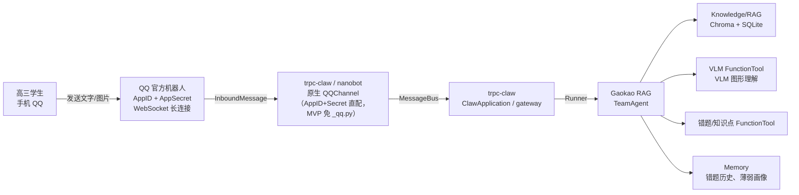

# TeamAgent 接入 ClawApplication（src/im/claw_app.py）

> 对应代码：`src/im/claw_app.py`（`GaokaoClaw` / `create_claw_app`）+ `src/im/openclaw.yaml`（网关配置）。
> 总览与 QQ 平台侧操作见 [README.md](README.md)；session / memory 持久化见
> [session_service.md](session_service.md)。

## 网关配置（src/im/openclaw.yaml）

`GaokaoClaw` 默认读项目内的 `src/im/openclaw.yaml`（`DEFAULT_CONFIG_PATH`）。字段名以 nanobot `channels/qq/manifest.py` 的 SETUP_SPEC 为准（camelCase）；`${VAR}` 由 `load_config` 的 `_expand_env_vars` 展开，密钥仍走 `.env`（变量清单见 [README.md](README.md) 环境变量节）。

```yaml
# src/im/openclaw.yaml —— openclaw 网关配置（可进 git，无明文密钥）
agent:
  memory_window: 30
  # create_model 用 api_key/api_base/model 构造 OpenAIModel：TeamAgent 不走它
  # （模型在 src/agent/ 工厂显式构造），但 session 摘要器与 heartbeat 真调 LLM，
  # 须指向真实 DeepSeek 兼容端点（与 config.toml [llm] 同一套 .env 凭证）
  api_key: ${DEEPSEEK_API_KEY}
  api_base: https://api.deepseek.com
  model: deepseek-v4-flash

gateway:
  heartbeat:
    enabled: false   # nanobot 默认 True + 30min 一轮——真 key 下会静默计费，显式关闭

channels:
  qq:
    enabled: true
    appId: ${QQ_APP_ID}
    secret: ${QQ_APP_SECRET}
    allowFrom: ["*"]        # MVP 通配放行；0.2.0 空列表=deny（静默丢弃），非"允许所有人"；
                            # 精确匹配须填 openid（C2C 的 user_id 是 openid，不是 QQ 号）
    msgFormat: plain        # plain | markdown（默认 plain）
    media_dir: data/files/raw/images/uploaded   # 收消息附件落地（L1 raw 区，见 README.md 附件行）
```

> **配置注入机制**（`openclaw/config/_config.py`）：`load_config(config_path)` 搜索顺序 = ①显式 `config_path` 参数 → ②`$TRPC_CLAW_CONFIG` 环境变量 → ③默认 `~/.trpc_claw/config.yaml`。读文件后 `set_config_path()` 同步给 nanobot loader（`channels.qq` 由此生效）+ `_expand_env_vars()` 递归展开 `${VAR}`（`os.path.expandvars`，`.env` 由 claw.py:96 `load_dotenv()` 先行加载）。**分工**：`agent` 段的模型三件套只喂 session 摘要器（ClawSummarizer，`memory_window` 触发滚动摘要）与 heartbeat；TeamAgent 四成员的模型/存储走 gaokao 自身配置（config.toml + `.env` + src/agent 工厂），两套互不读取。**heartbeat 必须显式关闭**——nanobot 默认 `enabled=True` + 30min 一轮（nanobot/config/schema.py:330），真 key 下会静默真实计费。

## 接入架构



## 与 TeamAgent 的集成

trpc-claw 的 Runner 默认挂载一个 LlmAgent（`create_agent` 返回 LlmAgent，见 `server/openclaw/agent/_agent.py`）。Gaokao RAG 的核心是 TeamAgent，集成方式有两种：

### 方式 A：TeamAgent 作为 agent 传入（推荐）

替换 trpc-claw 的主 Agent（默认 LlmAgent），换成 gaokao_rag 的 TeamAgent。

**✅ 接口契约已验证（2026-08-30，读 SDK 源码）**：`Runner`（`trpc_agent_sdk/runners.py:432-601`，claw 消息驱动的唯一消费者）对 agent 只依赖 5 个点——`run_async(invocation_context)`（runners.py:475，核心异步事件流）、`name`（:437）、`find_agent(name)`（:529，子 agent 路由）、`parent_agent`（:554）、`sub_agents`（claw.py:177）。`TeamAgent` 与 `LlmAgent` **同源于 `BaseAgent`**（`agents/_base_agent.py`），上述字段/方法全部同款具备（pydantic model_fields 逐一比对确认），**零适配层，无需任何包装类**。

**✅ 接入点已验证**：`ClawApplication.__init__`（`claw.py:105`）**没有 agent factory 注入参数**，`self.agent = create_agent(...)` 硬编码在 `claw.py:166`。因此**无需扩展/修改 trpc_agent_sdk 源码**（避免本地补丁），改为**子类覆写**：

```python
# src/im/claw_app.py（精简骨架，与实现一致）
from trpc_agent_sdk.server.openclaw.claw import ClawApplication
from trpc_agent_sdk.runners import Runner
from src.agent.leader import create_gaokao_leader   # 现有工厂，leader.py:119
from src.im.session_service import ShortKeyClawSessionService

class GaokaoClaw(ClawApplication):
    def __init__(self, workspace=None, config_path=None):
        super().__init__(workspace, config_path)       # 默认装配全保留
        # bus / channels / model / storage / memory 不动
        # 替换 1：session 文件名哈希化（修 AioFileStorage 128 key 上限，
        # 见「session / memory 持久化」节）——须在重建 Runner 之前
        self.session_service = ShortKeyClawSessionService(
            config=self.config, summarizer_manager=self._summarizer_manager)
        self.command_handler.params.session_service = self.session_service
        # 替换 2：主 agent 换成 gaokao TeamAgent
        self.agent = create_gaokao_leader()
        self.runner = Runner(                          # 重建 runner（对照 claw.py:172-176）
            app_name=self.config.runtime.app_name,
            agent=self.agent,
            session_service=self.session_service,
            memory_service=self.memory_service,
        )
```

**注意点**：

- **tools 差异是特性**：TeamAgent 不带 claw 的通用 tools（文件/Shell/Web/Skills/MessageTool/CronTool）——gaokao 场景 Leader 用自己那套 ingest/retrieve 工具，claw 通用工具本就不需要；回复走 OutboundMessage，无需 MessageTool。
- **`sub_agents` 为空**：claw.py:177 的 worker_runner 会退化为 agent 自身，仅影响 SpawnTaskTool（后台任务分发），gaokao 不用，可接受。
- **模型配置源分离**：TeamAgent 走 `get_llm_model()`（config.toml + `.env`），claw 的 `create_model` 走 openclaw config（`agent.model_*` / `TRPC_AGENT_*`）。两套不冲突，部署时 `.env` 的模型 key 需齐全。

**决策**：MVP 用方式 A——Gaokao RAG 是一个专注备考的专用 Agent（MVP 数学，后续扩科），不需要通用 Agent 的杂项能力，TeamAgent 直接作为主 Agent 最干净。若 V1.0 时子类覆写成本过高，退回方式 B 作为过渡。

**启动入口**（`scripts/im_server.py`，因 CLI 无法加载自定义子类）：

`trpc_agent_cmd openclaw run` 硬编码 `from trpc_agent_sdk.server.openclaw.claw import ClawApplication`（`_cli.py:51`）并直接实例化（:57），无自定义工厂注入点——所以必须自建入口，复刻 `_cli.py:50-63` 的启动逻辑、仅替换为 `GaokaoClaw`：

```python
# scripts/im_server.py（精简骨架，与实现一致）
import asyncio
from pathlib import Path
from src.im.claw_app import GaokaoClaw

def main(workspace: str | None = None, config: str | None = None) -> None:
    ws = Path(workspace).expanduser().resolve() if workspace else None
    cfg = Path(config).expanduser().resolve() if config else None

    async def _run() -> None:
        gateway = GaokaoClaw(workspace=ws, config_path=cfg)
        # 复刻 _cli.py:58-60：有启用通道走网关，否则 CLI 回退（.env 缺密钥时可无网调试）
        if not gateway.channels.enabled_channels:
            await gateway.run_cli_fallback()
            return
        await gateway.run_gateway()

    asyncio.run(_run())

if __name__ == "__main__":
    import argparse
    ap = argparse.ArgumentParser()
    ap.add_argument("-c", "--config", default="src/im/openclaw.yaml")
    ap.add_argument("-w", "--workspace", default=None)
    args = ap.parse_args()
    main(workspace=args.workspace, config=args.config)
```

> **配置注入**：`-c` 默认指向 `src/im/openclaw.yaml`（项目内，可进 git）；不传时 `GaokaoClaw` 也会按 `load_config` 顺序回退到 `~/.trpc_claw/config.yaml`。openclaw 配置与 gaokao 的 `config.toml`/`.env`（TeamAgent 模型、存储）是两套独立配置源，互不干扰。

**`run_gateway()` 是阻塞常驻的 async 主循环**（claw.py:696-703）：`await self.start()` 装配完毕后 `asyncio.gather(channels.start_all(), _wait_forever())`——通道（含 QQ WebSocket）常驻、事件循环挂起等待消息，Ctrl-C 时 `finally: await self.stop()` 收尾。启动后无需额外运维。

### 方式 B：TeamAgent 作为 Agent-as-Tool

如果保留 trpc-claw 默认的 LlmAgent（有文件/Shell/Web 等通用能力），将 Gaokao RAG 的核心问答封装为 AgentTool 挂载：

```python
from trpc_agent_sdk.tools import AgentTool

gaokao_tool = AgentTool(gaokao_team)
# 挂载到 trpc-claw 的 LlmAgent tools
```

## 启动与验证

> ⚠️ **启动命令说明**：`trpc_agent_cmd openclaw run` 硬编码实例化默认 `ClawApplication`（`_cli.py:57`），**不会加载我们的 `GaokaoClaw` 子类**（TeamAgent 接入无效）。必须用项目入口 `scripts/im_server.py` 启动：

```bash
# 启动 GaokaoClaw 网关（TeamAgent 作为主 Agent）
uv run python scripts/im_server.py          # 默认读 src/im/openclaw.yaml
# 或显式指定：uv run python scripts/im_server.py -c <path>

# 手机 QQ 给机器人发消息，观察是否响应
# 若通道未启用（.env 缺 QQ 密钥），自动回退 CLI 聊天模式
```

`scripts/im_server.py` 复刻 `_cli.py:50-63` 的启动逻辑（`GaokaoClaw(workspace, config_path)` → `run_gateway()`），仅把默认类换成我们的子类。
