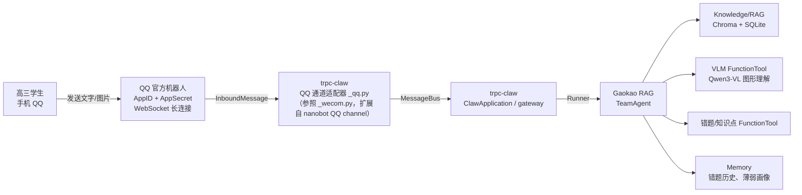

# IM 接入设计（trpc-claw）

## 概述

Gaokao RAG 面向的用户是高三学生——**他们可能不会用 WorkBuddy 等 agent 工具，甚至没有电脑**。因此前端必须是 IM（即时通讯），而不是 MCP / CLI。

tRPC-Agent-Python 原生提供 **trpc-claw**（OpenClaw-like Agent 运行时），基于 nanobot 构建，内置 Telegram / 企业微信通道；**QQ 通过扩展通道适配器接入**（nanobot 原生支持 QQ，详见下文）。一条命令启动即可 7×24 在线，不需要自己实现消息网关。

## 为什么选 QQ（nanobot 原生通道 + trpc-claw 扩展）

| 维度 | QQ（AppID/AppSecret 官方 API） | CLI/MCP |
| ------ | ------------------------- | --------- |
| 高三学生是否已有 | ✅ QQ 是主力（班级/年级群） | ❌ 没有电脑 |
| 安装成本 | 零（QQ 扫码创建） | 极高 |
| 通道支持 | ✅ nanobot 原生支持 QQ（`channels.qq`，AppID+AppSecret） | - |
| 封号风险 | ✅ 无（官方 API） | - |
| 国内可用性 | ✅ | - |
| 图片发送 | ✅ | 受限 |
| 群聊支持 | ⚠️ 当前仅创建人可用 | - |

**结论**：QQ 走官方 API（AppID + AppSecret），零成本、零封号风险、学生零学习成本。技术路径是 **nanobot 原生 QQ 通道 + trpc-claw 适配器扩展**（详见下文"QQ 接入方案"）。CLI/MCP/FastAPI 保留给开发者调试和外部 Agent 接入。

> **⚠️ 兼容性澄清（2026-08 调研结论）**：社区版 OpenClaw 的 `openclaw-qqbot` 插件（`openclaw plugins install @tencent-connect/openclaw-qqbot`）是 **Node.js 社区版 OpenClaw** 的插件，依赖 `openclaw` CLI（plugins/channels/gateway 命令），**与 tRPC-Agent-Python 的 trpc-claw 不兼容**。trpc-claw 的 CLI 只有 `run/chat/ui/conf_temp/deps`，没有插件系统。
>
> 正确路径：**trpc-claw 基于 nanobot**，而 **nanobot 原生支持 QQ 通道**（`config.json` 里配 `channels.qq`，AppID + AppSecret，参考 nanobot 官方文档）。因此我们在 trpc-claw 里补一个 QQ 通道适配器（参照内置的 `_wecom.py`），即可用官方 API 接入 QQ。

## QQ 接入方案（nanobot QQ 通道 + trpc-claw 适配器）

> 技术路线：nanobot 已原生支持 QQ 通道，trpc-claw 基于 nanobot 构建。我们通过扩展 trpc-claw 的通道适配器接入 QQ 官方 API。

### 创建机器人（QQ 开放平台）

官方文档：<https://q.qq.com/qqbot/openclaw/>

1. **打开 QQ 开放平台**，用 QQ 扫码登录
2. **点击"创建机器人"**：一键创建，获得 **AppID + AppSecret**
3. AppSecret 只显示一次，保存好（泄露需重置）

### 方案一：直接用 nanobot 网关（MVP 快速验证，推荐先行）

nanobot 原生支持 QQ 通道，不需要写任何代码即可跑通消息链路：

```json
// ~/.nanobot/config.json
{
  "channels": {
    "qq": {
      "enabled": true,
      "appId": "你的AppID",
      "secret": "你的AppSecret",
      "allowFrom": []
    }
  }
}
```

启动：

```bash
nanobot gateway
```

**用途**：V1.0 阶段先验证"学生手机 QQ → 收到答案"的完整链路。Gaokao RAG 的 TeamAgent 通过 Agent-as-Tool 或 HTTP 回调接入 nanobot 网关。

### 方案二：扩展 trpc-claw 通道适配器（正式方案，推荐）

trpc-claw 内置通道适配器位于 `trpc_agent_sdk/server/openclaw/channels/`（目前只有 `_telegram.py` 和 `_wecom.py`）。参照 `_wecom.py` 的实现，为 QQ 增加一个适配器：

```text
trpc_agent_sdk/server/openclaw/channels/
├── __init__.py          # 注册新通道
├── _command_handler.py
├── _repair.py           # 注册通道修复逻辑
├── _qq.py               # ← 新增：QQ 通道适配器（参照 _wecom.py）
├── _telegram.py
└── _wecom.py
```

**适配器职责**（对照 nanobot QQ channel 实现）：

- 读取 `config.channels.qq`（AppID / AppSecret / allowFrom）
- 鉴权并建立 QQ 官方 API 连接（WebSocket 长连接，无需公网 IP）
- 把 QQ 消息转成 nanobot 的 `InboundMessage` 送入 MessageBus
- 把 `OutboundMessage` 转成 QQ 消息回复（支持文本/图片/Markdown）

**配置项**（并入 trpc-claw 的 config 模型）：

```yaml
channels:
  qq:
    enabled: true
    app_id: ${QQ_APP_ID}
    app_secret: ${QQ_APP_SECRET}
    allow_from: []          # 空 = 允许所有人；可填 QQ 号/群号白名单
    stream_reply: true      # 长答案分片
    restart_command: /restart
```

**环境变量**：

```bash
# QQ 机器人（AppID / AppSecret）
export QQ_APP_ID=xxx
export QQ_APP_SECRET=xxx
```

### 验证通道

```bash
# 启动 trpc-claw 网关
trpc_agent_cmd openclaw run -c ~/.trpc_claw/config_full.yaml

# 手机 QQ 给机器人发消息，观察是否响应
# 若通道未启用，trpc-claw 自动回退 CLI 模式
```

### 沙箱测试

QQ 开放平台提供沙箱配置——在正式发布前，可在沙箱中添加测试 QQ 号进行功能验证，避免影响正式用户。

### 环境变量

```bash
# 所有 API Key 通过 .env 设置，config.toml 用 ${VAR} 引用
# LLM（DeepSeek 官方 API，OpenAI 兼容）
DEEPSEEK_API_KEY=xxx

# VLM（Qwen 官方 DashScope API，OpenAI 兼容）
DASHSCOPE_API_KEY=xxx

# QQ 机器人（trpc-claw 需要）
QQ_APP_ID=xxx
QQ_APP_SECRET=xxx
```

## 接入架构



## 与 TeamAgent 的集成

trpc-claw 的 Runner 默认挂载一个 LlmAgent（`create_agent` 返回 LlmAgent，见 `server/openclaw/agent/_agent.py`）。Gaokao RAG 的核心是 TeamAgent，集成方式有两种：

### 方式 A：TeamAgent 作为 agent 传入（推荐）

替换 trpc-claw 的 `create_agent` 调用，把默认 LlmAgent 换成 gaokao_rag 的 TeamAgent：

```python
# 在 trpc-claw 的 ClawApplication 初始化处替换默认 agent
from trpc_agent_sdk.teams import TeamAgent
from gaokao_rag import create_gaokao_team

gaokao_team: TeamAgent = create_gaokao_team()
# 将 gaokao_team 作为 claw 的 agent 注册（覆盖 create_agent 的返回值）
```

> 实现提示：trpc-claw 的 `ClawApplication` 在 `__init__` 里调用 `create_agent(config, model)` 创建主 Agent。要替换为 TeamAgent，需要小幅扩展 `create_agent` 或新增配置项（如 `agent.type: team`），让它返回 TeamAgent 而非 LlmAgent。这是 V1.0 的一个开发任务。

### 方式 B：TeamAgent 作为 Agent-as-Tool

如果保留 trpc-claw 默认的 LlmAgent（有文件/Shell/Web 等通用能力），将 Gaokao RAG 的核心问答封装为 AgentTool 挂载：

```python
from trpc_agent_sdk.tools import AgentTool

gaokao_tool = AgentTool(gaokao_team)
# 挂载到 trpc-claw 的 LlmAgent tools
```

**决策**：MVP 用方式 A——Gaokao RAG 是一个专注备考的专用 Agent（MVP 数学，后续扩科），不需要通用 Agent 的杂项能力，TeamAgent 直接作为主 Agent 最干净。若 V1.0 时扩展 `create_agent` 成本过高，退回方式 B 作为过渡。

## 用户交互流程（IM 场景）

### 典型对话

```text
学生: 生成周报
Bot: 📊 数学学习周报（8.4 - 8.10）
     本周新增错题 12 道 | 已掌握 4 道 | 掌握率 33%
     薄弱知识点 Top 3:
     1. 导数应用（恒成立）4 道 —— ↑ 恶化
     2. 圆锥曲线（离心率）3 道 —— 持平
     3. 立体几何（二面角）2 道 —— 新增
     针对性练习建议：
     → 先复习「分离参数法」，推荐：2026南昌一模 第15题、2026深圳调研 第20题
     → 回复「#1」查看第一道题详情

学生: 帮我看看这道题怎么做
[发送图片]
Bot: 已识别题目图片，这是一道圆锥曲线离心率问题...
     （调用 VLM 理解图形 → 检索知识库 → 分步解析）
```

### 错题录入（关键交互）

学生拍错题 → Bot 识别题目 → **用户口述错因** → LLM 生成错因总结 → 确认入库：

```text
学生: [发送错题图片]
Bot: 已识别错题：
     题目：椭圆 x²/4 + y²/3 = 1 的离心率为____
     知识点：圆锥曲线 > 椭圆 > 离心率
     这题你当时是怎么错的？用你自己的话说一下
     （比如"算到一半不知道 e 怎么求"）

学生: 我用了 b²=a²-c² 但算出来不对，感觉是公式记混了
Bot: 已生成错因总结：
     ▸ 错误类型：知识盲区
     ▸ 错因：离心率公式 e = c/a 与 b² = a² - c² 记混，
             误把 b/a 当成了离心率
     ▸ 建议：先复习「焦点三角形」模型，配套练习 3 道
     确认保存吗？回复 1 确认 / 2 重来

学生: 1
Bot: 已存入你的错题本（错因总结已记录）
```

> **设计说明**：不存手写解题过程（VLM 识别手写准确率低、存储成本高）。改为**用户口述错因 + LLM 结构化总结**——用户自己描述"当时怎么错的"，比 AI 读手写更准确；`error_summary` 结构化后可直接供周报/复习建议消费。

### 整卷作答录入（周报的"整体视角"）

学生做完一张卷子，口述作答情况 → LLM 解析 → 存入 `exam_attempts` 表：

```text
学生: 南昌一模做了，选择错 2 个填空错 1 个，导数大题没写出来
     （附成绩单照片，可选）
Bot: 已解析整卷作答：
     ▸ 2026_南昌一模 · 总分 68 / 150
     ▸ 失分题型：解答题（导数）失分最多，选择失 10 分
     ▸ 与错题本关联：导数大题已标记为薄弱点
     确认保存吗？回复 1 确认 / 2 重来

学生: 1
Bot: 已记录整卷作答，本周周报会包含这张卷子的分析
```

> **设计说明**：与错题录入同原则——不识别手写成绩单，**用户口述 + LLM 解析**（成绩单照片仅作辅助参考）。`exam_attempts` 与 `errors` 互补：前者回答"整体考得怎样"，后者回答"这题为什么错"。

### 文档上传处理（统一范式 · 任何文档）

学生上传任意文档（作业/试卷/讲义/笔记）→ Bot 提取题目 → **回显清单让学生决定去向**：

```text
学生: [发送文档（作业照片 / 试卷 PDF / 讲义）]
Bot: 已识别到 3 道题目：
     1.【圆锥曲线】椭圆焦点三角形面积最值
     2.【导数应用】恒成立参数取值范围
     3.【立体几何】二面角余弦值计算
     另识别到 1 段知识点讲解（已自动入库）
     
     每道题怎么处理？
       a = 入库    b = 进错题本    c = 跳过
     回复格式："1a 2b 3c"，或 "全部 a"

学生: 1a 2b 3c
Bot: 完成：1 → 入库（questions）
           2 → 进错题本（errors）
           3 → 已跳过
```

> **设计说明**：**统一摄入范式**——任何文档上传都走"提取题目 → 回显清单 → 用户决定去向"，系统不替用户做主。每题的**一句话概括**由 LLM 生成（如"椭圆焦点三角形面积最值"），学生不看原文也能判断。知识点讲解段自动入库（纯文本 RAG，成本低无需确认）。作业整体情况（对几错几）可另行轻量上报，供周报统计练习量。

### IM 图片处理

- **学生发图片** → trpc-claw 收到 image part → Gaokao RAG 用 VLM 理解
- **Bot 发图片** → 题目图形回传（需要把 VLM 描述/原图转给通道）

## 用户模型（MVP 单用户）

- **MVP 只服务一个用户**（作者的高三朋友），不存在多用户隔离问题
- 各表保留 `user_id` 字段（固定单一值），为未来多用户扩展预留
- trpc-claw 的 `user_id`（QQ openid / bot 会话）仍会设置，但 MVP 阶段所有数据归同一用户

## 当前限制（QQ 官方机器人）

| 限制 | 说明 | 应对 |
| ------ | ------ | ------ |
| 仅创建人可用 | 官方 BOT 暂不支持拉入 QQ 群 | 开发阶段先一对一使用；后续关注群聊开放进度 |
| 沙箱测试 | 正式发布前需在沙箱中添加测试 QQ 号 | 开发阶段用沙箱即可 |
| 需要实名认证 | QQ 账号需完成实名 | 无成本，学生一般已有 |

## 边界与限制

| 场景 | 处理 |
| ------ | ------ |
| IM 消息长度限制 | 长答案分片发送（`stream_reply: true`） |
| 数学公式在 IM 的渲染 | 用文字近似（如 `x²/4 + y²/3 = 1`），或 ASCII 公式 |
| 图片质量差 | 提示用户重拍，VLM 失败时降级文本描述 |
| 并发高峰 | trpc-claw 常驻 + 异步处理，控制 VLM 并发 |
| 部署环境 | 需要一台 7×24 在线的服务器（或用户自己的电脑常开） |

## 开发里程碑（并入 V1.0）

- [ ] QQ 开放平台注册 + 创建机器人（获取 AppID/AppSecret）
- [ ] **V0.1 并行**：调研 tRPC-Agent 官方是否内置 QQ 通道（nanobot 已支持，关注跟进进度）
- [ ] 方案一验证：nanobot 网关 + `channels.qq` 配置，跑通 QQ → 消息链路
- [ ] 方案二落地：trpc-claw 新增 `_qq.py` 通道适配器（参照 `_wecom.py`）
- [ ] trpc-claw 跑通：QQ → LlmAgent 最小对话
- [ ] TeamAgent 替换默认 agent（方式 A，扩展 `create_agent`）
- [ ] IM 图片收发：错题拍照 → VLM 识别 → 录入
- [ ] 长答案分片、错误处理
