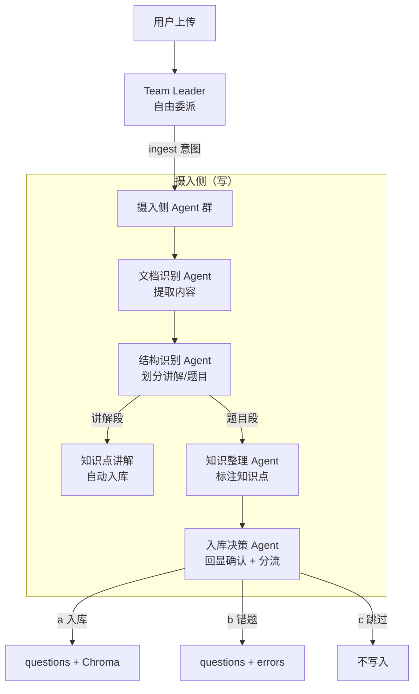

# 多模态摄取管线

摄取管线是 Gaokao RAG 的核心模块，负责把任意学习资料转化为可检索的结构化数据。这是和 AlgoNotes RAG（纯 Markdown 输入）拉开差距的地方——必须处理 PDF 文本、嵌入图像、数学公式三种模态。

---

## 架构视角：摄入侧 Agent 群

摄取不是固定流程，而是 **TeamLeader 按需委派摄入侧 4 个子 Agent** 协作完成。LLM 贯穿始终：整理输入格式、判断有无答案/解析、分析图片、提取知识点、决定何时需要用户确认。



**为什么用 Agent 而非固定流程**：

- 用户输入高度非结构化：可能是一段文字描述、一张照片、一份 PDF，内容完整性未知（有无答案/解析/图都不固定）
- LLM 需要判断一切：输入格式整理、内容三分、图像理解、知识点提取、回显策略
- 固定流程无法覆盖这些灵活决策，应该由 Agent 自主编排

摄入侧 4 个子 Agent 的职责与工具，见 [Agent 编排设计](agent.md)「摄入侧（写）」章节。

---

## 两层概念：试卷摄入 vs 单题摄入

虽然执行是 Agent 协作，但业务上仍分为两层：

| | 试卷摄入（多题） | 单题摄入（一题） |
|--|--|--|
| **输入** | 一份试卷 PDF / 作业照片 / 专题讲义 | 一道题的原始内容（题干 + 可选图像 + 可选答案/解析） |
| **核心任务** | 切分 + 调度：把文档变成 N 道题目 + M 段讲解 | 处理 + 入库：把一道题变成结构化数据 |
| **Agent 协作** | 文档识别 → 结构识别 →（讲解自动入库）/（题目进清单）→ 回显确认 | 知识整理 → 入库决策 → 写入 |
| **终止条件** | 回显题目清单，等待用户确认 | 按用户决策分流完成 |
| **跳过条件** | 作业拍照（单题/少量题）直接进入单题摄入 | — |

---

## 摄入侧 Agent 详解

### 文档识别 Agent

**职责**：接收用户上传的任意格式（PDF / 照片 / 文本），提取结构化内容。

**挂载工具**：
- `PDFExtractTool`：PyMuPDF 提取文本块 + 嵌入图像列表；复杂版面降级 MinerU2.5-Pro
- `VLMImageTool`：Qwen3.7-Flash/Plus，理解照片中的题目内容 + 图形描述

**决策原则**：
- PDF 优先走 PyMuPDF，版面复杂才降级 MinerU
- 照片直接走 VLM，不需要先 OCR
- 数学公式：Unicode 文本基本可用，复杂公式后续 LaTeX 化（MVP 不做）
- 提取后保留坐标信息，用于后续图像关联

**输出**：结构化文本块 + 图像列表 + 坐标信息

---

### 结构识别 Agent

**职责**：把文档内容从"整篇文本"变成"讲解段 + 题目段"的集合，并对每道题生成一句话概括。

**核心判断**：
- **讲解段** vs **题目段**：由 LLM 语义判断，不依赖关键词
- **内容三分**：对每道题，LLM 划分「题干 / 答案 / 解析」边界（用户粘贴的内容可能没有「参考答案」字样）
- **一句话概括**：每题生成简短描述，用于回显时学生快速判断

**决策原则**：
- OCR 文本格式杂乱、编号不规范，正则匹配命中率极低，**不做正则切分**
- 直接由 LLM 语义识别输出：讲解段列表 + 题目列表（位置、一句话概括、原文起止）
- 一题跨页 → 合并前后页文本后一起喂给 LLM
- 无编号（如专题讲义例题）→ LLM 按语义段落切分

**输出**：
- 讲解段列表 → 自动进入知识点讲解入库（无需用户确认）
- 题目列表（每题含：一句话概括、原始内容块、关联图像列表）→ 进入回显确认

---

### 知识整理 Agent

**职责**：对题目进行知识点标注，与 `topics` 表交互实现 tag 归位。

**挂载工具**（见 [agent.md](agent.md)「知识整理 Agent 详解」）：
- `search_topic(keyword)`：按名字/别名模糊查节点
- `create_topic(name, aliases=[])`：新增 tag
- `add_alias(topic_id, alias)`：同义表述归并

**决策原则**：
- 开放式提取：LLM 读取题目文本，提取知识点名（不预定义候选集）
- 归位优先：先查 `topics` 表（含 aliases），命中复用，未命中新建
- 同义合并：语义等价时写入 aliases 而非新建节点
- 知识树动态演化：树随数据摄入生长，不预定义

**输出**：`question_topics` 关联（question_id + topic_name 列表）

---

### 入库决策 Agent

**职责**：回显题目清单给用户确认，收集决策，执行分流写入。

**核心交互**：

```
Bot: 已识别到 3 道题目：
     1.【圆锥曲线】椭圆焦点三角形面积最值
     2.【导数应用】恒成立参数取值范围
     3.【立体几何】二面角余弦值计算
     另识别到 1 段知识点讲解（已入库）
     
     每道题怎么处理？
     回复格式：题号 + 操作
       a = 全部入库
       b = 全部进错题本
       c = 跳过
```

**分流逻辑**：

| 决策 | 写入内容 |
|------|----------|
| **a 入库** | questions + question_topics + Chroma ✅ |
| **b 错题** | questions + question_topics + Chroma ✅ + errors 表 |
| **c 跳过** | 不写入 |

**决策原则**：
- 用户操作是批量 + 按题组合，避免每题都问一遍
- 讲解段已自动入库，回显只包含题目
- 错题额外触发：用户口述错因 → LLM 生成 `error_summary` → 写入 `errors` 表

**输出**：写入结果回显

---

## 知识点讲解入库（自动执行）

讲义/专题/作业中的**知识点讲解段**（概念、公式、典型方法）自动入库，无需用户确认：

```mermaid
flowchart LR
    A[讲解段文本] --> B[LLM 判断所属知识点]
    B --> C[写入 knowledge_notes 表]
    C --> D[向量化 Chroma<br/>doc_id = kn_{id}]
```

**简化点**：
- 不需要内容三分（本身就是纯文本）
- 不需要图像处理（讲解段通常无图）
- 不需要知识点标注（本身就是知识点，直接关联 topic_id）

---

## 整卷作答摄入（exam_attempts）

试卷切分入库后，学生可能做完整张卷子并报告作答情况。**不识别手写成绩单**（同错题原则），改为用户口述 + LLM 解析：

```
用户口述："选择错2个填空错1个，导数大题没写出来，总分68"
     ↓
LLM 解析 → 逐题对错 + 总分 + 整卷分析
     ↓
写入 exam_attempts 表
```

**说明**：`question_results` 用 `question_id` 关联已入库的题目，周报可据此聚合"哪些题型失分最多"。

---

## 实现视角：src/ingestion/ 工具集

所有涉及 LLM 的判断（内容三分、题目切分、知识点提取、VLM 调用决策、回显策略）全部由 Agent 层完成。`src/ingestion/` 只提供**纯 I/O 操作**，作为 Agent 的 FunctionTool 被调用。

```
Agent 层（LLM）                     ingestion 层（I/O）
┌─────────────────────┐          ┌──────────────────────┐
│ 结构识别 Agent      │          │ src/ingestion/       │
│ - LLM 判断讲解/题目 │──调用───▶│ file_ops.py          │
│ - LLM 内容三分      │          │   save_raw()         │
│ - LLM 提取知识点    │          │   save_processed()   │
│                     │          │                       │
│ 知识整理 Agent      │──调用───▶│ extract.py           │
│ - LLM 决定调用 VLM  │          │   extract_pdf()      │
│                     │          │   extract_images()   │
│ 入库决策 Agent      │──调用───▶│                       │
│ - 回显确认          │          │ vlm_ops.py           │
│ - 分流执行          │          │   call_vlm()         │
└─────────────────────┘          │                       │
                                 │ db_ops.py            │
                                 │   insert_question()  │
                                 │   insert_error()     │
                                 │   insert_topic()     │
                                 │   ...                │
                                 │                       │
                                 │ vector_ops.py        │
                                 │   upsert_question()  │
                                 │   upsert_knowledge() │
                                 │                       │
                                 │ pipeline.py          │
                                 │   ingest_question()  │
                                 │   （dumb 组合）      │
                                 └──────────────────────┘
```

### 设计原则

1. **Agent 提供数据，ingestion 执行写入**：Agent 的 LLM 负责生成结构化数据（题干/答案/解析/知识点/用户决策），ingestion 层只负责把这些数据写入三层存储
2. **ingestion 层无决策能力**：不做 LLM 调用、不做内容理解、不做格式判断，所有输入必须是结构化数据
3. **每层工具可独立测试**：ingestion 层的函数都是纯 I/O，mock 输入即可测试，不依赖 LLM
4. **pipeline.py 是 dumb 组合**：把多个 I/O 操作按固定顺序串起来，但不做任何智能判断

### 工具清单

#### file_ops.py — 文件 I/O

```python
# 保存原始文件（PDF/图像），返回相对路径
save_raw(content: bytes, kind: Literal["pdf", "image"], subdir: str = "uploaded") -> str

# 保存处理后文件（文本/VLM 描述），返回相对路径
save_processed(content: bytes, category: Literal["text", "vlm_desc"], name: str) -> str

# 读取文件
read(relative_path: str) -> bytes | None
read_text(relative_path: str, encoding: str = "utf-8") -> str | None
```

#### extract.py — 内容提取

```python
# 从 PDF 提取文本块 + 图像列表
extract_pdf(file_path: str) -> dict:
    # 返回：{"text_blocks": [...], "images": [...], "pages": [...]}

# 从 PDF 提取图像并落盘
extract_images(file_path: str) -> list[str]:
    # 返回：图像相对路径列表
```

#### vlm_ops.py — VLM 调用

```python
# 调用 VLM 生成图形描述（纯 API 调用，不做决策）
call_vlm(model: str, image_path: str, prompt: str) -> str

# 选择 VLM 模型（默认 flash，大图/复杂图升级 plus）
select_vlm_model(image_path: str, complexity_keywords: list[str] = None) -> str
```

#### db_ops.py — SQLite 写入

```python
# 写入题目（返回 question_id）
insert_question(data: QuestionInput) -> int

# 写入知识点关联
insert_question_topics(question_id: int, topic_names: list[str]) -> None

# 写入错题
insert_error(data: ErrorInput) -> int

# 写入知识点讲解
insert_knowledge_note(data: KnowledgeNoteInput) -> int

# 写入文件注册
insert_file(data: FileInput) -> int

# 查询 topics（供 Agent 归位）
search_topic(keyword: str) -> list[dict]
create_topic(name: str, aliases: list[str] = None) -> int
add_alias(topic_id: int, alias: str) -> None
```

#### vector_ops.py — Chroma 向量化

```python
# 题目 document 向量化
upsert_question_doc(question_id: int, text: str, metadata: dict) -> None

# 知识点 document 向量化
upsert_knowledge_doc(note_id: int, text: str, metadata: dict) -> None

# 删除 document
delete_doc(doc_id: str) -> None
```

#### pipeline.py — 组合操作（dumb 组合）

```python
# 完整的一道题入库流程（I/O 组合，不做 LLM 判断）
def ingest_question(
    raw_file_path: str,
    question_data: dict,      # Agent 提供的结构化数据
    topic_names: list[str],   # Agent 提取的知识点
    user_decision: str,       # "a" / "b" / "c"
    vlm_descriptions: list[str] = None,
) -> dict:
    """
    执行写入：
    1. insert_question
    2. insert_question_topics
    3. upsert_question_doc
    4. 如果 user_decision == "b"：insert_error
    5. 返回写入结果（question_id、doc_id、error_id 等）
    """
```

### 与 Agent 的协作方式

摄入侧 Agent 通过 FunctionTool 调用上述工具：

```python
# 示例：入库决策 Agent 的 FunctionTool
class IngestQuestionTool(FunctionTool):
    name = "ingest_question"
    description = "将一道题写入三层存储"
    
    async def execute(self, raw_file_path, question_data, topic_names, user_decision, vlm_descriptions=None):
        return pipeline.ingest_question(raw_file_path, question_data, topic_names, user_decision, vlm_descriptions)
```

Agent 运行时：
1. **LLM 先判断**：这道题有没有图？需不需要调 VLM？有没有答案/解析？
2. **LLM 生成数据**：题干文本、答案文本、解析文本、知识点列表
3. **LLM 调用工具**：把结构化数据喂给 ingestion 层的 FunctionTool
4. **ingestion 层执行**：纯 I/O 写入，返回 ID
5. **LLM 组织回显**：把结果整理成用户可读的确认消息

---

## 摄取入口

```bash
# 批量摄取（走完整试卷摄入 → 单题摄入 × N）
python scripts/ingest.py data/files/raw/试卷/2026_南昌一模.pdf
python scripts/ingest.py data/files/raw/试卷/ --recursive

# 从 ima 知识库导入
python scripts/ingest.py --source ima --kb "高考2026" --folder "数学/试卷"
```

**注意**：批量摄取（CLI）走的是摄入侧 Agent 的自动化版本，不经过 TeamLeader 委派，但核心能力复用同一套工具。

---

## 数据来源映射

| ima 知识库位置 | 摄取目标 | source_type |
|---------------|---------|-------------|
| 知识/数学/试卷/* | data/files/raw/试卷/ | exam |
| 知识/数学/专题/* | data/files/raw/专题/ | special_topic |
| 知识/数学/资料/* | data/files/raw/资料/ | reference |
| 知识/数学/错题* | errors 表（直接导入） | error_book |

## 数据源边界（明确不做的事）

**不接入题库网站（组卷网等）**，理由（2026-08 决策）：
- **版权问题**：组卷网等平台的题目版权归属不明，公开/开源项目接入有侵权风险
- **用不到**：答案解析有两个更干净的来源——**用户手动上传**（真题解析、老师讲义）和 **AI 生成**（LLM 基于题目现场生成），无需依赖第三方题库
- 数据来源闭环：真题/专题来自用户知识库导入（ima），新题来自学生拍照/作业（用户生成），解析来自用户上传 + AI 生成——**全部数据自给自足**，不依赖外部爬取

**一句话原则**：Gaokao RAG 只摄入"用户自己拥有的数据"（ima 导入 + 用户拍照 + 用户上传），不爬取、不转载第三方平台的题。

---

## 幂等性

- 同一文件重复摄取 → 检测 `files.sha256` 已存在，跳过或 `--force` 覆盖
- 增量摄取 → 只处理 `data/files/raw/` 中未摄取的新文件
- 摄取失败 → 记录到 `ingest_errors.log`，不影响其他文件
- 单题重复摄入 → 检测 `questions` 表已有同 file_id + 题号，跳过或覆盖
