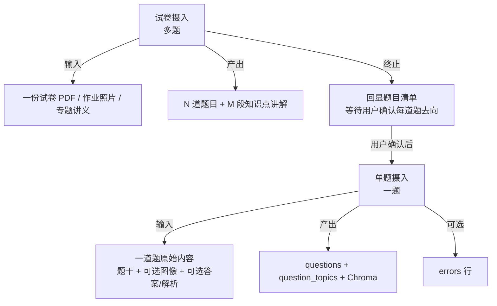
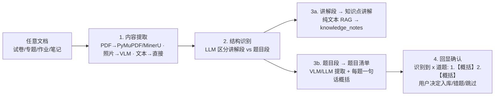
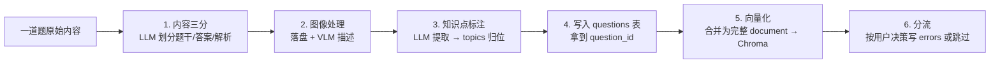

# 多模态摄取管线

摄取管线是 Gaokao RAG 的核心模块，负责把任意学习资料转化为可检索的结构化数据。这是和 AlgoNotes RAG（纯 Markdown 输入）拉开差距的地方——必须处理 PDF 文本、嵌入图像、数学公式三种模态。

---

## 两层架构：试卷摄入 → 单题摄入

摄取分两层，**试卷摄入是"切分 + 调度"，单题摄入是"处理 + 入库"**：



**为什么分两层**：
- 试卷摄入的核心是**切分和调度**：PDF → 文本提取 → 题号切分 → 识别讲解段 vs 题目段 → 每题一句话概括 → 回显确认
- 单题摄入的核心是**处理和入库**：内容三分 → 图像处理 → 知识点标注 → 写入 SQLite → 向量化
- 作业拍照（单题/少量题）可以跳过第一层，直接进入第二层

---

## 第一层：试卷摄入（多题）

### 输入

任意文档：试卷 PDF、专题讲义、作业照片、学习笔记。

### 流程总览



### 1. 内容提取

**PDF 文本提取**

工具：PyMuPDF (`fitz`)

输入：原始 PDF 文件路径

输出：
- 全文文本（按页）
- 页面布局信息（坐标、字体大小，用于判断题号编号）
- 嵌入图像列表（含坐标，用于关联到对应题目）

策略：
- 优先使用 PyMuPDF 的 `page.get_text("blocks")` 获取带坐标的文本块
- 如果遇到复杂版面（表格、多栏），降级使用 MinerU2.5-Pro 做版面分析
- 数学公式：PyMuPDF 提取的是 Unicode 文本（如 x² + y² = 1），基本可用；复杂公式（如求和符号、积分）可能需要 LaTeX 化处理

**照片输入**

工具：VLM（Qwen3.7-Flash）

输入：学生上传的照片/截图

输出：结构化文本（题目内容 + 图像描述）

**文本输入**

直接读取，跳过提取阶段。

### 2. 结构识别

**核心任务**：把一份文档从"整篇文本"变成"讲解段 + 题目段"的集合。

**讲解段 vs 题目段**：由 LLM 语义判断，不依赖关键词。

- **讲解段**：概念解释、公式推导、方法总结 → 自动走知识点讲解入库（无需用户确认）
- **题目段**：有题号、有设问、需要作答 → 进入题目清单，等待用户确认

### 3. 题目切分

**核心难点**：把一份试卷从"整篇文本"变成"一题一题"的结构。

**OCR 文本的特点**：格式杂乱、编号不规范、换行随机，正则匹配命中率极低，无需多此一举。

**切分策略**：

**直接由 LLM 语义识别切分**：把整篇文本喂给 LLM，要求它输出「讲解段 vs 题目段」的划分，以及每道题的一句话概括。LLM 依据语义边界判断，不依赖题号格式。

```
LLM 输入：整篇文本
LLM 输出：
  - 讲解段列表（概念/公式/方法）
  - 题目列表（每题包含：位置、一句话概括、原文起止）
```

**关联逻辑**：
- **图像关联**：图像坐标落在题目的文本块坐标范围内 → 关联到该题

**异常处理**：
- LLM 识别出编号不连续（跳号）→ 告警，人工确认
- 一题跨页 → 合并前后页文本后一起喂给 LLM
- 无编号（如专题讲义的例题）→ LLM 按语义段落切分，无需正则兜底

### 4. 题目清单生成

对每道题目，由 LLM 生成**一句话概括**（如"椭圆焦点三角形面积最值"），用于回显时让学生不看原文也能判断。

同时提取每道题的**原始内容块**（题干文本 + 关联图像列表 + 答案/解析文本，如果有的话）。

### 5. 知识点讲解自动入库

文档中的讲解段（非题目部分）自动走知识点讲解入库流程（见下方「单题摄入 - 知识点讲解」），无需用户确认。

### 6. 回显确认（核心交互）

**任何文档上传，第一件事是"提取题目并回显给用户确认"**——用户决定每道题的去向，系统不替用户做主：

```
学生: [上传一份文档（试卷/专题/作业/笔记）]
Bot: 已识别到 3 道题目：
     1.【圆锥曲线】椭圆焦点三角形面积最值
     2.【导数应用】恒成立参数取值范围
     3.【立体几何】二面角余弦值计算
     另识别到 1 段知识点讲解（已入库）
     
     每道题怎么处理？
     回复格式：题号 + 操作
       a = 全部入库
       b = 全部进错题本
       c = 跳过
     例："1a 2b 3c" 或 "全部 a"

学生: 1a 2b 3c
Bot: 完成：
     1 → 已入库（questions）
     2 → 已进错题本（errors）
     3 → 已跳过
```

**设计要点**：
- **每题一句话概括**由 LLM 生成，让学生不看原文也能判断
- **知识点讲解段自动入库**（纯文本 RAG，无需用户确认，成本低）
- 用户操作是**批量 + 按题**的组合，避免每题都问一遍（高频场景要省交互）
- 此范式统一覆盖：试卷、专题、作业、笔记、任何上传文档

---

## 第二层：单题摄入（一题）

### 输入

一道题的原始内容：
- 题干文本（必选）
- 答案文本（可选，缺失 → NULL）
- 解析文本（可选，缺失 → NULL）
- 图像列表（可选，每张图独立处理）
- 用户决策（a 入库 / b 错题 / c 跳过）

### 流程总览



### 1. 内容三分（LLM 语义划分）

**核心任务**：把一道题的原始文本划分为「题干 / 答案 / 解析」三部分。

**为什么不依赖关键词**：用户粘贴的内容可能没有「参考答案」「解析」字样，LLM 依据语义判断边界。

**输出**：
- `question_text`：题干（必选）
- `answer_text`：答案（可选，缺失 → NULL）
- `analysis_text`：解析（可选，缺失 → NULL）

**允许缺失**：源资料没有答案/解析 → 存 NULL；缺失解析可后续由 LLM 补生成（MVP 不做）。

### 2. 图像处理

如有图像：

1. **落盘**：保存到 `data/files/raw/images/extracted/{sha256}.png`（或 `uploaded/` 如果是用户拍照）
2. **注册 files 表**：`kind='image'`，关联到本题
3. **过滤**：
   - 排除装饰性图片（logo、水印）：面积 < 1000px² 的跳过
   - 排除纯文字截图：如果 OCR 后文字占比 > 90% 且无几何线条，转为文本
4. **VLM 理解**：对剩余图像调用 VLM（Qwen3.7-Flash/Plus），生成结构化图形描述文本

详见 [VLM 策略文档](vlm_strategy.md)。

**VLM 调用流程**：

```python
async def vlm_understand_image(image_path: str, question_text: str) -> str:
    """
    调用 Qwen3.7（VLM），传入图像 + 题目文字，
    返回图形的结构化文本描述。
    """
    model = select_vlm_model(image_path)  # 默认 Flash，复杂图升级 Plus
    
    prompt = f"""你是一位高中数学教师。请分析这张数学图形，给出结构化描述。

题目文字：{question_text}

请按以下格式描述：
1. 图形类型（函数图像 / 几何图形 / 坐标系 / 统计图 / 其他）
2. 关键元素（如：椭圆，长轴=2a，焦点在x轴上）
3. 数量关系（如：x²/4 + y²/3 = 1，离心率 e = 1/2）
4. 与题目的关联（图形提供了什么约束条件）

注意：描述要精确到可用于文本检索，但不要直接给出答案。"""
    
    response = await call_vlm(model, image_path, prompt)
    return response
```

### 3. 知识点标注

**工具**：LLM（开发期默认 DeepSeek V4-Flash，模型中立可换）

**流程**（数据驱动的动态标注）：

```python
async def tag_knowledge_points(question_text: str, vlm_desc: str = "") -> list[dict]:
    """
    输入题目文本 + VLM 描述，
    输出知识点列表（开放式提取，不限定候选集）。
    返回 [{name, parent_hint}]，parent_hint 为父节点语义提示（可空）。
    """
    prompt = f"""分析以下数学题目，提取所有涉及的知识点。

要求：
1. 知识点用自然名称表达（如"切线放缩"、"端点效应"），不要拘泥于现有分类
2. 如果知识点已有常见表述，使用常见表述（如"离心率"而非"e=c/a"）
3. 为每个知识点给出父节点提示（如"导数应用"），帮助挂载到知识树

题目文本：{question_text}
图形描述：{vlm_desc or "无图形"}

请输出 JSON：{{"topics": [{{"name": "...", "parent_hint": "..."}}]}}"""
    
    response = await call_llm(prompt)
    return parse_json(response)
```

**归位逻辑**（与 `topics` 表交互）：
- 提取的知识点名 → 查 `topics`（含 `aliases` 模糊匹配）
  - 命中 → 复用节点，取规范名插入 `question_topics`
  - 未命中 → 新增节点（`parent` 由 LLM 的 `parent_hint` 判定，挂载后 `status=active`；无法判定则挂根，`status=pending`），取新节点名插入
- 同义合并：与现有节点语义等价时，写入 `aliases` 而非新建

**知识点库**：动态演化，不再是固定候选集。树随数据摄入生长。

### 4. 写入 questions 表

写入 SQLite `questions` 表，字段包括：

| 字段 | 来源 | 说明 |
|------|------|------|
| `file_id` | 源文件注册 | 关联 files 表 |
| `subject` | 配置/LLM 判断 | MVP 固定 "math" |
| `question_text` | 内容三分 | 题干 |
| `answer_text` | 内容三分 | 答案（可空） |
| `analysis_text` | 内容三分 | 解析（可空） |
| `vlm_desc` | VLM 调用 | 图形描述（可空） |
| `image_file_ids` | 图像处理 | 关联的图像文件 ID 列表 |
| `source_type` | 来源判断 | exam / homework / special_topic / reference |
| `difficulty` | LLM 判断 | 难度（可选） |
| `question_type` | LLM 判断 | 选择题/填空题/解答题等 |

写入后拿到 `question_id`，用于后续步骤。

### 5. 向量化

**入库单位 = 一篇完整 document**（不按 chunk 拆分）：

| document | 内容 | 来源 |
|----------|------|------|
| 题目 document | 题干 + 答案 + 解析 + VLM 图形描述（合并） | `questions` 行 |
| 讲解 document | 知识点讲解段（概念/公式/方法） | `knowledge_notes` 行 |

**切片分块细则**（切多大/怎么切/是否切片存储）属于 `vector_store.py` 实现细节，V0.3 实现时再定——摄入侧只保证"一个实体 = 一个 doc_id = 一篇完整内容"。

**向量嵌入**：
- 模型：qwen3.7-text-embedding（DashScope API，dimension=1024 由 `config.embedding.dimension` 规定）
- 调用方式：DashScope OpenAI 兼容端点（与 VLM 同厂商，一套 Key）
- **131k 长上下文**：整份讲义/长文档可一次嵌入，简化分块策略

**doc_id 生成规则**：`doc_id = f"q_{question_id}"`（两段式，幂等）

**入库**：写入 Chroma，metadata 与 SQLite 字段对齐（见 [数据模型](data_model.md)）。

metadata 快照字段：
- `doc_id`：`q_{id}`
- `doc_type`：`question`
- `subject`：学科
- `source_type`：来源
- `topic_tags`：知识点名字列表（从 `question_topics`  JOIN 获取）
- `has_image`：是否有图像
- `exam_year` / `exam_region` / `question_type`：可选元数据

### 6. 知识点关联写入

写入 `question_topics` 表（多对多关联）：

| 字段 | 来源 |
|------|------|
| `question_id` | 第 4 步拿到 |
| `topic_name` | 第 3 步 LLM 提取并归位的规范名 |

**关联存名字而非 id**：知识树会演化（合并/移动/改名），id 不稳定；名字是稳定 tag（合并时旧名归档进 aliases），树怎么调整关联都不受影响。

### 7. 按用户决策分流

根据用户在第 6 步（试卷摄入回显）给出的决策：

| 决策 | 操作 |
|------|------|
| **a 入库** | questions + question_topics + Chroma ✅ 完成 |
| **b 错题** | questions + question_topics + Chroma ✅ + 额外写 `errors` 表 |
| **c 跳过** | 不写入（或只写 questions 但不参与检索） |

**错题额外写入**（`errors` 表）：

> **错因总结（关键设计）**：错题录入时**不存学生手写解题过程**（VLM 识别手写准确率低且存储成本高），改为**用户口述错因 + LLM 生成结构化总结**：
>
> - `user_reflection`：用户用自己的话描述"我当时怎么错的"（QQ 文字/语音输入）
> - `error_summary`：LLM 基于口述 + 题目上下文生成的结构化总结（错因归类、知识缺口、改进建议）
> - 周报/复习建议优先消费 `error_summary`（结构化、可比对），`user_reflection` 作为原始依据保留

### 8. 回显结果

```
Bot: 完成：
     1 → 已入库（questions + Chroma）
     2 → 已进错题本（errors）
     3 → 已跳过
```

---

## 知识点讲解入库（单题摄入的变体）

讲义/专题/作业中的**知识点讲解段**（概念、公式、典型方法）走简化版单题摄入：

```mermaid
flowchart LR
    A[讲解段文本] --> B[写入 knowledge_notes 表]
    B --> C[向量化 Chroma<br/>doc_id = kn_{id}]
```

**不需要**：
- 内容三分（本身就是纯文本）
- 图像处理（讲解段通常无图）
- 知识点标注（讲解段本身就是知识点，直接关联 topic_id）

**简化流程**：
1. LLM 判断该讲解段属于哪个知识点（查询 `topics` 表）
2. 写入 `knowledge_notes` 表（`topic_id` + `content`）
3. 向量化：`doc_id = f"kn_{knowledge_note_id}"`，metadata 含 `doc_type=knowledge_note`

---

## 整卷作答摄入（exam_attempts）

试卷切分入库后，学生可能做完整张卷子并报告作答情况。**不识别手写成绩单**（同错题原则），改为用户口述 + LLM 解析：

```python
async def ingest_exam_attempt(file_id: int, user_statement: str) -> dict:
    """
    输入：试卷 file_id（files 表）+ 用户口述（如"选择错2个填空错1个，导数大题没写出来，总分68"）
    输出：写入 exam_attempts 表
    """
    # ① 按 file_id 找到试卷的所有题目（questions 表）
    questions = query_questions_by_file(file_id)
    
    # ② LLM 解析口述 → 逐题对错 + 总分
    parsed = await llm_parse_attempt_statement(user_statement, questions)
    # {question_results: [{question_id, correct, score}], total_score, max_score}
    
    # ③ LLM 生成整卷分析
    summary = await llm_generate_attempt_summary(parsed, questions)
    
    # ④ 入库
    return save_exam_attempt(file_id=file_id, **parsed, answer_summary=summary)
```

**说明**：`question_results` 用 `question_id` 关联已入库的题目，周报可据此聚合"哪些题型失分最多"。

---

## 摄取管线入口

```bash
# 摄取单个文件（走完整试卷摄入 → 单题摄入 × N）
python scripts/ingest.py data/files/raw/试卷/2026_南昌一模.pdf

# 摄取整个目录
python scripts/ingest.py data/files/raw/试卷/ --recursive

# 从 ima 知识库导入
python scripts/ingest.py --source ima --kb "高考2026" --folder "数学/试卷"
```

## 数据来源映射

| ima 知识库位置 | 摄取目标 | source_type |
|---------------|---------|-------------|
| 知识/数学/试卷/* | data/files/raw/试卷/ | exam |
| 知识/数学/专题/* | data/files/raw/专题/ | special_topic |
| 知识/数学/资料/* | data/files/raw/资料/ | reference |
| 知识/数学/错题* | errors 表（直接导入） | error_book |

## 数据源边界（明确不做的事）

**不接入题库网站（组卷网等）**，理由（2026-08 决策）：
- **版权问题**：组卷网等平台的题目版权归属不明，公开/开源项目接入有侵权风险
- **用不到**：答案解析有两个更干净的来源——**用户手动上传**（真题解析、老师讲义）和 **AI 生成**（LLM 基于题目现场生成），无需依赖第三方题库
- 数据来源闭环：真题/专题来自用户知识库导入（ima），新题来自学生拍照/作业（用户生成），解析来自用户上传 + AI 生成——**全部数据自给自足**，不依赖外部爬取

**一句话原则**：Gaokao RAG 只摄入"用户自己拥有的数据"（ima 导入 + 用户拍照 + 用户上传），不爬取、不转载第三方平台的题。

---

## 作业摄入（高频 · 与试卷同管线）

作业题与试卷题在摄入层面没有本质区别——都是走单题摄入流程，唯一差别是 `source_type`。**是否入库由学生按需决定**，而非系统强制。

**交互原则**（IM 场景，见 [IM 接入](im_interface.md)）：

```
学生: [发送作业照片]
Bot: 已识别题目：...
     这道题要存入知识库吗？
     1 = 存入（以后可检索/关联）
     2 = 不存（只当次解答）
     3 = 这题我做错了 → 进入错题录入
```

**三分支处理**：
1. **入库** → 走单题摄入标准流程，`source_type=homework`，文件注册到 `files` 表（title 由 agent 总结，如"2026-08-11 作业"），参与检索与知识点关联
2. **不存** → 只当次解答，不落库（省存储，适合一次性问题）
3. **错题** → 走错题分流流程（口述错因 + error_summary），与拍照错题完全一致

**作业整体情况**（对几错几，可选）→ 轻量进 `exam_attempts` 表：`file_id` 指向作业文件（files 表），`total_score/max_score` 可空（作业无满分），`question_results` 存对错。供周报统计"本周练习量/平均正确率"。

**与试卷摄入的区别**：无固定结构 → 不走 PDF 切分；单题/少量题 → 跳过试卷摄入层，直接进入单题摄入流程。

---

## 幂等性

- 同一文件重复摄取 → 检测 `files.sha256` 已存在，跳过或 `--force` 覆盖
- 增量摄取 → 只处理 `data/files/raw/` 中未摄取的新文件
- 摄取失败 → 记录到 `ingest_errors.log`，不影响其他文件
- 单题重复摄入 → 检测 `questions` 表已有同 file_id + 题号，跳过或覆盖
