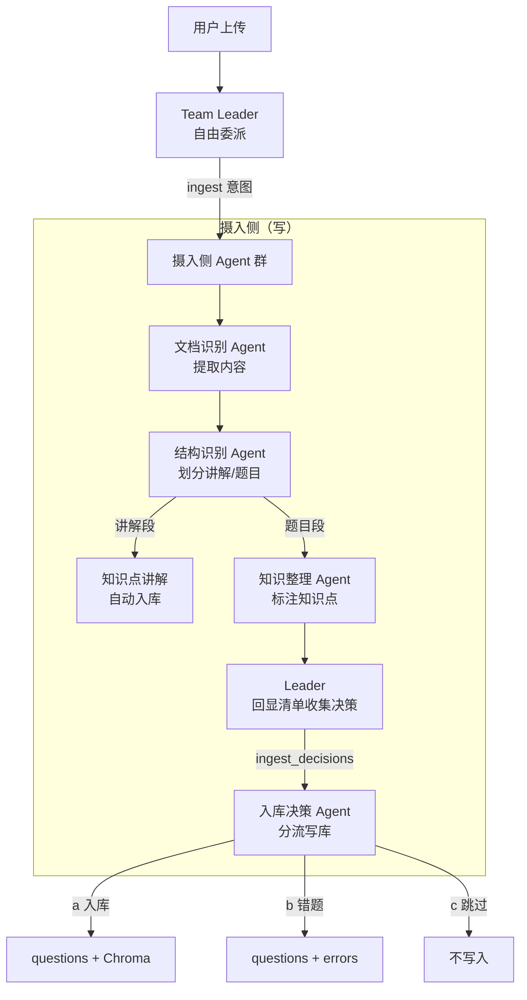

# 多模态摄取管线

摄取管线是 Gaokao RAG 的核心模块，负责把任意学习资料转化为可检索的结构化数据。这是和 AlgoNotes RAG（纯 Markdown 输入）拉开差距的地方——必须处理 PDF 文本、嵌入图像、数学公式三种模态。

---

## 定位：写门面（增 / 删 / 改）

`src/ingestion/` 是**唯一允许修改三层存储**的代码层——文件层（FileStore）+ SQLite（逐表）+ 向量层（Chroma）的三态一致性，由本包内的原子函数统一保证。**任何写入（新增 / 更新 / 删除题目、图片、试卷、错题、讲解、知识点、作答、复习计划、周报）都必须经由本包暴露的函数，Agent 的 tool 不得直接调用 `src.store.*`。**

知识整理 Agent 的「归位」原语（`resolve_or_create_topics` / `create_topic` / `add_topic_alias` / `delete_topic`）也收敛到 `src/ingestion/topic.py`，供 `ingest_question` 与知识整理 tool 复用。

---

## 架构视角：摄入侧 Agent 群

摄取不是固定流程，而是 **TeamLeader 按需委派摄入侧 4 个子 Agent** 协作完成。LLM 贯穿始终：整理输入格式、判断有无答案/解析、分析图片、提取知识点、决定何时需要用户确认。



**为什么用 Agent 而非固定流程**：

- 用户输入高度非结构化：可能是一段文字描述、一张照片、一份 PDF，内容完整性未知（有无答案/解析/图都不固定）
- LLM 需要判断一切：输入格式整理、内容三分、图像理解、知识点提取、回显策略
- 固定流程无法覆盖这些灵活决策，应该由 Agent 自主编排

摄入侧 4 个子 Agent 的职责与工具，见 [Agent 编排设计](../agent/README.md)「摄入侧（写）」章节。

---

## 两层概念：试卷摄入 vs 单题摄入

虽然执行是 Agent 协作，但业务上仍分为两层：

| | 试卷摄入（多题） | 单题摄入（一题） |
|--|--|--|
| **输入** | 一份试卷 PDF / 作业照片 / 专题讲义 | 一道题的原始内容（题干 + 可选图像 + 可选答案/解析） |
| **核心任务** | 切分 + 调度：把文档变成 N 道题目 + M 段讲解 | 处理 + 入库：把一道题变成结构化数据 |
| **Agent 协作** | 文档识别 → 结构识别 →（讲解自动入库）/（题目进清单）→ Leader 回显确认 → 入库决策写库 | 知识整理 → 入库决策 → 写入 |
| **终止条件** | Leader 回显题目清单，等待用户确认后分流写库 | 按用户决策分流完成 |
| **跳过条件** | 作业拍照（单题/少量题）直接进入单题摄入 | — |

---

## 摄入侧 Agent 详解

### 文档识别 Agent

**职责**：接收用户上传的任意格式（PDF / 照片 / 文本），提取结构化内容。

**挂载工具**：
- `PDFExtractTool`：PyMuPDF 提取文本块 + 嵌入图像列表；复杂版面降级 MinerU2.5-Pro
- `VLMImageTool`：Qwen3.7-Flash/Plus，理解照片中的题目内容 + 图形描述

**决策原则**：
- PDF 优先走 PyMuPDF，版面复杂才降级 MinerU
- 照片直接走 VLM，不需要先 OCR
- 数学公式：Unicode 文本基本可用，复杂公式后续 LaTeX 化（MVP 不做）
- 提取后保留坐标信息，用于后续图像关联

**输出**：结构化文本块 + 图像列表 + 坐标信息

---

### 结构识别 Agent

**职责**：把文档内容从"整篇文本"整理成"讲解段 + 题目段"的集合——讲解段原样保留，每道题目（整篇切出的题目段或零散单题）过 `question-organize` Skill 归一为「题目 / 答案 / 解析」三段，并对每题生成一句话概括。

**核心判断**：
- **讲解段** vs **题目段**：由 LLM 语义判断，不依赖关键词
- **逐题归一化**：每道题目单元过 `question-organize` Skill 归一为「题目 / 答案 / 解析」三段（允许补全省略 / 统一符号 / 明确设问，禁编造缺失条件）；讲解段不过 Skill
- **一句话概括**：每题生成简短描述，用于回显时学生快速判断

**决策原则**：
- OCR 文本格式杂乱、编号不规范，正则匹配命中率极低，**不做正则切分**
- 直接由 LLM 语义识别输出：讲解段列表 + 题目列表（位置、一句话概括、原文起止）
- 一题跨页 → 合并前后页文本后一起喂给 LLM
- 无编号（如专题讲义例题）→ LLM 按语义段落切分

**输出**：
- 讲解段列表 → 自动进入知识点讲解入库（无需用户确认）
- 题目列表（每题含：一句话概括、题目 / 答案 / 解析三段、关联图像 / 来源（source_hint，若有）；不留原文块）→ 进入回显确认

---

### 知识整理 Agent

**职责**：对题目进行知识点标注，与 `topics` 表交互实现 tag 归位。

**挂载工具**（见 [agent/knowledge_organize.md](../agent/ingestion/knowledge_organize.md)「知识整理 Agent 详解」）：
- `search_topic(keyword)`：按名字/别名模糊查节点
- `create_topic(name, aliases=[])`：新增 tag
- `add_alias(topic_id, alias)`：同义表述归并

**决策原则**：
- 开放式提取：LLM 读取题目文本，提取知识点名（不预定义候选集）
- 归位优先：先查 `topics` 表（含 aliases），命中复用，未命中新建
- 同义合并：语义等价时写入 aliases 而非新建节点
- 知识树动态演化：树随数据摄入生长，不预定义

**输出**：`question_topics` 关联（question_id + topic_name 列表）

---

### 入库决策 Agent

**职责**：摄入链路写库执行者——消费「结构化的题目清单 + 用户的去向意图」，逐题分流写入。**回显题目清单、与用户的多轮对话由 Leader Agent 管理**（2026-08-28 用户明确），本 Agent 不发起对话、不做回显。

**输入（结构化，由 Leader 传入）**：`pending_questions`（题目/答案/解析三段 + 关联图像 / 来源；来源有则拆解映射 `exam_year` / `question_number` / `exam_regions` / `source_type`）+ `ingest_decisions`（每题去向：入库/错题/跳过）

回显示意（**Leader 侧**，非本 Agent 职责）：

```
Bot: 已识别到 3 道题目：
     1.【圆锥曲线】椭圆焦点三角形面积最值
     2.【导数应用】恒成立参数取值范围
     3.【立体几何】二面角余弦值计算
     另识别到 1 段知识点讲解（已入库）
     
     每道题怎么处理？
     回复格式：题号 + 操作
       a = 全部入库
       b = 全部进错题本
       c = 跳过
```

**分流逻辑**：

| 决策 | 写入内容 |
|------|----------|
| **a 入库** | 调用 `ingest_question` → questions + question_topics + Chroma |
| **b 错题** | 先 `ingest_question` 入库题目（与 a 完全相同），再由错题本体系调用 `ingest_error(question_id)` 写入错因（见 error.md） |
| **c 跳过** | 不调用 `ingest_question`（题目不写入任何表） |

**决策原则**：
- 只消费传入的题目与意图，写库后返回结果，不发起对话 / 不回显 / 不收集决策
- 决策缺失或模糊（某题无对应意图）→ 标记 `pending` 交还 Leader 补充，不擅自猜测去向
- **错题不在题目摄入时内联写 `errors`**：入库决策 Agent 对标记为「错题」的题目，**先** `ingest_question` 入库，**再**调用独立的 `ingest_error(question_id, user_reflection)` 写入错因（见 error.md）。`ingest_question` 保持原子化、完全不感知 `errors`，避免 `ingest_question` ↔ `errors` 的循环依赖。

**输出**：`ingest_results`（每题 question_id / doc_id，或跳过标记）

---

## 知识点讲解入库（自动执行）

讲义/专题/作业中的**知识点讲解段**（概念、公式、典型方法）自动入库，无需用户确认：

```mermaid
flowchart LR
    A[讲解段文本] --> B[LLM 判断所属知识点]
    B --> C[写入 knowledge_notes 表]
    C --> D[向量化 Chroma<br/>doc_id = kn_{id}]
```

**简化点**：
- 不需要内容三分（本身就是纯文本）
- 不需要图像处理（讲解段通常无图）
- 不需要知识点标注（本身就是知识点，直接关联 topic_id）

---

## 摄取入口

```bash
# 批量摄取（走完整试卷摄入 → 单题摄入 × N）
python scripts/ingest.py data/files/raw/试卷/2026_南昌一模.pdf
python scripts/ingest.py data/files/raw/试卷/ --recursive

# 从 ima 知识库导入
python scripts/ingest.py --source ima --kb "高考2026" --folder "数学/试卷"
```

**注意**：批量摄取（CLI）走的是摄入侧 Agent 的自动化版本，不经过 TeamLeader 委派，但核心能力复用同一套工具。

---

## 数据来源映射

| ima 知识库位置 | 摄取目标 | source_type |
|---------------|---------|-------------|
| 知识/数学/试卷/* | data/files/raw/试卷/ | exam |
| 知识/数学/专题/* | data/files/raw/专题/ | special_topic |
| 知识/数学/资料/* | data/files/raw/资料/ | reference |
| 知识/数学/错题* | errors 表（直接导入） | error_book |

## 数据源边界（明确不做的事）

**不接入题库网站（组卷网等）**，理由（2026-08 决策）：
- **版权问题**：组卷网等平台的题目版权归属不明，公开/开源项目接入有侵权风险
- **用不到**：答案解析有两个更干净的来源——**用户手动上传**（真题解析、老师讲义）和 **AI 生成**（LLM 基于题目现场生成），无需依赖第三方题库
- 数据来源闭环：真题/专题来自用户知识库导入（ima），新题来自学生拍照/作业（用户生成），解析来自用户上传 + AI 生成——**全部数据自给自足**，不依赖外部爬取

**一句话原则**：Gaokao RAG 只摄入"用户自己拥有的数据"（ima 导入 + 用户拍照 + 用户上传），不爬取、不转载第三方平台的题。

---

## 幂等性

- 同一文件重复摄取 → 检测 `files.sha256` 已存在，跳过或 `--force` 覆盖
- 增量摄取 → 只处理 `data/files/raw/` 中未摄取的新文件
- 摄取失败 → 记录到 `ingest_errors.log`，不影响其他文件
- 单题重复摄入 → 检测 `questions` 表已有同 file_id + 题号，跳过或覆盖

---

## 实现工具集

`src/ingestion/` 提供业务级别的 I/O 工具，每个工具对应"存储一个业务实体"，内部封装好三层存储的组合操作。Agent 只需要提供结构化数据，调用单个函数即可完成入库。

详细设计见各模块文档：

- [question.md](question.md) — 存储一道题（文件 + DB + 向量 + knowledge 四层）
- [image.md](image.md) — 存储一张图（文件 + DB）
- [exam_paper.md](exam_paper.md) — 存储一份试卷（文件 + DB）
- [error.md](error.md) — 存储错题（DB + 关联题目）

### 设计原则

1. **业务实体 = 一个函数**：每道题、每张图、每份试卷、每条错题，对应一个 `ingest_*()` 函数
2. **函数内部封装所需的所有存储操作**：比如 `ingest_question()` 内部自动完成文件落盘 → DB 写入 → Chroma 向量化 → 知识点归位，Agent 不需要知道细节
3. **ingestion 层无 LLM 决策**：所有输入必须是结构化数据，不做内容理解、不做格式判断
4. **每个工具可独立测试**：mock 结构化数据即可测试，不依赖 LLM
5. **知识点归位复用 store 层**：`src/store/db/topics.py`（`TopicsDB`）已提供 topics 查询/创建/别名管理（`search` / `create` / `add_alias`），ingestion 层直接调用，不重复实现。注意：不是 `src/retrieval/knowledge.py`——那是读门面的知识检索组件（`GaokaoKnowledge` 语义检索），不管 topic 注册。

### 与 Agent 的协作方式

摄入侧 Agent 通过 FunctionTool 调用上述工具：

```python
# 示例：入库决策 Agent 的 FunctionTool
class IngestQuestionTool(FunctionTool):
    name = "ingest_question"
    description = "将一道题写入三层存储（SQLite + Chroma）"
    
    async def execute(self, raw_file_path, question_text, answer_text="",
                     analysis_text="", topic_names=None, ...):
        return ingestion.question.ingest_question(
            raw_file_path=raw_file_path,
            question_text=question_text,
            ...
        )
        # 标记「错题」的题目：ingest_question 返回 question_id 后，
        # 再由错题本体系调用独立的 ingest_error(question_id, user_reflection) 写错因
```

Agent 运行时：
1. **LLM 先判断并生成数据**：这道题有没有图？需不需要调 VLM？有没有答案/解析？提取出知识点名字列表
2. **LLM 调用工具**：把结构化数据喂给 `ingest_question()` 等高层函数
3. **ingestion 层执行**：内部封装三层存储组合操作，返回业务 ID
4. **结果汇总**：入库决策 Agent 返回 `ingest_results`，由 Leader 组织用户可读的确认消息（回显/对话归 Leader）

**关键点**：Agent 不需要知道 `insert_question` → `insert_question_topics` → `upsert_question_doc` 三个步骤，只需要调用一个 `ingest_question()` 函数。
