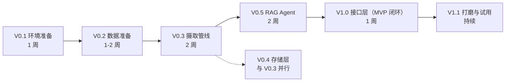
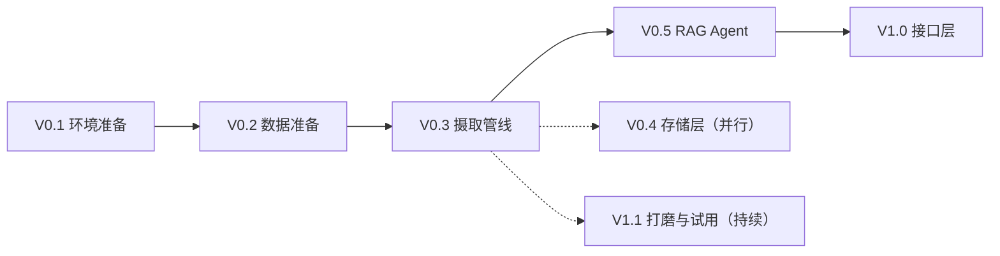

# 开发路线图（Roadmap）

## 版本总览

> 版本命名：MVP 完成 = **V1.0**；V0.x 为开发中版本，V1.1 起为 MVP 后迭代。

## V0.1: 环境准备（1 周）

**目标**：跑通 tRPC-Agent-Python 最小示例。

### 任务

- [ ] 安装 Python 3.12
- [ ] `pip install trpc-agent-py`
- [ ] 配置 LLM API Key（DeepSeek 官方）+ VLM API Key（Qwen DashScope）——通过 `.env` 设置 `DEEPSEEK_API_KEY` / `DASHSCOPE_API_KEY`，`config.toml` 用 `${VAR}` 引用
- [ ] 运行 tRPC-Agent 官方 quickstart 示例，验证模型调用
- [ ] **验证 TeamAgent 可用性**（`trpc_agent_sdk.teams` 的 Leader 委派 API；若当前版本不可用，退回 GraphAgent——见 [Agent 设计](agent.md)）
- [ ] **核对文档 vs 源码 API 清单**（Quickstart 跑通后，对照各文档的 API 假设：OpenAIModel 三件套、`AgenticLangchainKnowledgeSearchTool`、nanobot `channels.qq`；发现对不上则改文档不改代码）
- [ ] 验证 Qwen3-VL 多模态调用（OpenAI 协议图片输入）
- [ ] 验证 Chroma + Qwen3-Embedding-4B 嵌入链路
- [ ] 从 ima 知识库导出数学试卷 PDF 到 `data/raw/`

### 验收标准

- [ ] 本地能跑通一个"问天气"式的 LlmAgent
- [ ] **TeamAgent 可用性结论明确**：Leader 委派跑通，或确认退回 GraphAgent 方案
- [ ] VLM 能对一张数学图形图片返回文本描述
- [ ] 至少 3 份试卷 PDF 已导入 `data/raw/`

## V0.2: 数据准备（1-2 周）

**目标**：收集并整理原始数据。

### 数据源

1. **试卷**：从 ima「高考2026」导出数学试卷（2月-6月，约 20+ 份）
2. **专题**：导出 9 份专题 PDF（圆锥曲线、导数、立体几何等）
3. **错题**：从 ima 笔记导出错题记录
4. **知识点体系**：**不预定义**——由数据驱动动态生长（LLM 开放式提取 → 归位/合并/挂载，见 [数据模型](data_model.md)）

### 任务

- [ ] 写脚本批量从 ima 导出 PDF（或手动导出）
- [ ] 按 `data/raw/试卷/`、`data/raw/专题/` 分类整理
- [ ] 抽 2-3 份试卷人工检查 PDF 质量（文本可提取性、图像完整性）
- [ ] 知识点树不做 seed——依赖 V0.3 摄取时的动态构建（见 [数据模型](data_model.md) 四步机制）

### 验收标准

- [ ] `data/raw/` 下试卷 + 专题 ≥ 20 份 PDF
- [ ] 人工抽查 2-3 份试卷：文本可提取、图像完整（V0.3 摄取的输入就绪）

## V0.3: 摄取管线（2 周）

**目标**：任意文档 → 结构化题目 + 知识点 + 向量（统一摄入范式，见 [摄取管线](ingestion.md)）。

### 任务

- [ ] 内容提取：PDF 走 PyMuPDF（文本+图像），照片走 VLM，纯文本直接读
- [ ] **结构识别**：LLM 区分「讲解段」vs「题目段」（不靠正则——讲义/作业无固定题号）
- [ ] 讲解段 → `knowledge_notes` 表（纯文本 RAG，关联 topic_id）
- [ ] 题目段 → 题目清单生成（每题一句话概括）
- [ ] **回显确认**：向用户展示题目清单，批量决定去向（入库/错题/跳过）
- [ ] 题目入库：题目文本 + VLM 图形描述 + 答案解析（含图题目走 VLM，见 [VLM 策略](vlm_strategy.md)）
- [ ] 知识点标注：LLM 开放式提取 → 动态树归位/合并/挂载（见 [数据模型](data_model.md)）
- [ ] 分块向量化（Qwen3-Embedding-4B + Chroma，chunk 类型 question/answer/knowledge_point）
- [ ] SQLite 元数据入库（questions + question_topics + knowledge_notes）
- [ ] 摄取 CLI：`python scripts/ingest.py <path>`
- [ ] 幂等性：重复摄取跳过、断点续传

### 验收标准

- [ ] 1 份试卷完整跑通：PDF → 20+ 道题 → 回显清单 → 入库
- [ ] 1 份专题 PDF：讲解段正确分流到 knowledge_notes，题目段入库
- [ ] 含图题目 VLM 描述正确（抽样人工审核）
- [ ] `gaokao.db` 中 questions / question_topics / knowledge_notes 表有数据
- [ ] Chroma 中向量可检索

## V0.4: 存储层（与 V0.3 并行）

**目标**：SQLite schema 落地 + 知识点图谱查询。

### 任务

- [ ] 实现 `topics` 树形表（路径枚举：path 列 + 动态构建字段 aliases / status / merged_into，防环 + 子树前缀查询）
- [ ] 实现 `questions` / `question_topics` / `knowledge_notes` 表
- [ ] 实现 `errors`（含 error_summary 错因总结）/ `exam_attempts`（整卷作答）表
- [ ] 实现 `review_plans` / `periodic_reports`（周报快照，UNIQUE 幂等）表
- [ ] 知识点查询工具：`get_knowledge_tree`、`get_questions_by_topic`
- [ ] 错题统计工具：`get_error_stats`、`analyze_weak_points`
- [ ] 作答/报告工具：`add_exam_attempt`、`generate_periodic_report`（见 [MCP 接口](mcp_interface.md)）

### 验收标准

- [ ] 知识点树查询：输入"解析几何"返回全部子知识点
- [ ] 题目过滤：按"2026年 南昌 圆锥曲线 解答题"精确过滤
- [ ] 9 张表全部建齐（files / topics / knowledge_notes / questions / question_topics / errors / exam_attempts / review_plans / periodic_reports）

## V0.5: RAG Agent（2 周）

**目标**：TeamAgent 编排跑通问答闭环。

### 任务

- [ ] 集成 `LangchainKnowledge` + `AgenticLangchainKnowledgeSearchTool`
- [ ] TeamAgent：Leader + **查询侧 5 个**（意图/搜索/VLM/聚合/输出）子 Agent 协作（Leader prompt 按 [Agent 设计](agent.md) 三条铁律：完成标准/调用上限/prompt 自洽）
- [ ] **摄入侧 Agent**：文档识别/结构识别/知识整理/入库决策 4 个成员 + ingest 意图（学生 QQ 发照片 → 识别 → 回显 → 确认入库，见 [Agent 设计](agent.md)）
- [ ] VLM 条件触发节点
- [ ] 答案生成带溯源（引用"2026南昌一模 第15题"）
- [ ] 复习建议节点（基于错题统计）
- [ ] **周报/月报节点**：`periodic_reports` 表 + 周期聚合 + LLM 针对性练习建议（见 [Agent 设计](agent.md) REPORT_GEN 节点）
- [ ] Session 接入：`SqlSessionService`（SQLite，持久化会话 + 多轮追问上下文）
- [ ] **可观测性：接入 Langfuse**（框架内置 OpenTelemetry + `server/langfuse/` 模块；自托管，学生数据不出服务器；多 Agent 委派链调试刚需）
- [ ] Prompt 优化（数学语境约束；输出整理 Agent 剥离 thought 思考痕迹）

### 验收标准

- [ ] 问"椭圆离心率最值怎么求"→ 返回解析 + 溯源 + 相关题目
- [ ] 问"我的薄弱知识点"→ 基于错题返回分析 + 复习建议
- [ ] 指令"生成周报"→ 返回错题统计 + 薄弱知识点 Top 3 + 针对性练习建议（含推荐题目）
- [ ] 指令"这个月的月报"→ 返回月度报告，含与上月趋势对比
- [ ] 同一周期重复生成 → 返回缓存，不重复计算
- [ ] 多轮追问（"第二问呢"）上下文连贯
- [ ] **发一张题目照片 → 识别 → 回显清单 → 确认后入库**（摄入侧 Agent 闭环）

## V1.0: 接口层（MVP 闭环，1-2 周）

**目标**：对外提供 IM（QQ 官方 API + nanobot 通道适配器扩展）+ 开发接口（CLI / MCP / HTTP）。

### 任务

- [ ] QQ 开放平台注册 + 创建机器人（获取 AppID/AppSecret）
- [ ] 方案一：nanobot 网关 + `channels.qq` 配置，验证 QQ 消息链路
- [ ] 方案二：trpc-claw 新增 `_qq.py` 通道适配器（参照 `_wecom.py`，见 [IM 接入](im_interface.md)）
- [ ] TeamAgent 作为主 Agent 注册进 trpc-claw（扩展 `create_agent`，见 [IM 接入](im_interface.md)）
- [ ] IM 图片收发：错题拍照 → VLM 识别 → 录入
- [ ] 长答案分片、错误处理
- [ ] CLI：`chat.py`（开发调试用）
- [ ] MCP Server：STDIO + SSE（见 [MCP 接口](mcp_interface.md)）
- [ ] FastAPI HTTP + SSE 流式输出（可选）

### 验收标准

- [ ] 手机 QQ 向 Bot 发"生成周报"→ 收到完整周报
- [ ] 手机 QQ 发错题图片 → Bot 识别并录入错题本
- [ ] Claude Code 能通过 MCP 调用 `search_questions`（开发接口）

## V1.1: 打磨与试用（持续）

**目标**：真实场景验证 + 迭代。

### 任务

- [ ] 找 1-2 位高三同学试用，收集反馈
- [ ] 优化 VLM 描述质量（见 [VLM 策略](vlm_strategy.md) 质量评估）
- [ ] 扩充知识点树（补全二级/三级节点）
- [ ] 评估检索效果（关键词覆盖率、命中率）
- [ ] 复习建议的个性化程度迭代

## 风险与对策

| 风险 | 等级 | 对策 |
|------|------|------|
| PDF 质量差（扫描件、公式乱码） | 高 | 优先处理电子排版试卷；MinerU2.5-Pro 兜底；公式用 LaTeX 化 |
| VLM 描述质量不稳定 | 中 | Prompt 迭代 + 人工抽样审核；自动升级 32B |
| 结构识别错误（讲解/题目段分流不准） | 中 | LLM 语义判断 + 置信度低标 pending；回显确认环节让用户修正去向 |
| 知识点标注不一致 | 中 | 开放式提取 + 同义合并（aliases）；人工抽查种子数据；置信度低标 pending |
| LLM/VLM API 限流/不稳定（DeepSeek / Qwen 官方） | 低 | 重试 + 退避；并发控制；缓存；模型中立可切换备用厂商 |
| ima 导出权限/格式问题 | 低 | 手动导出兜底 |
| QQ 官方机器人限制（当前仅创建人可用，暂不支持群聊） | 中 | 开发阶段一对一使用即可；后续关注群聊开放进度 |
| 部署环境：需要 7×24 在线服务器 | 中 | 可用家用电脑常开 / 学生云服务器；初期本地演示即可 |

## 版本依赖关系

- V0.3 依赖 V0.1（VLM/嵌入链路验证）和 V0.2（数据就绪）
- V0.4 可与 V0.3 并行（schema 先行）
- V0.5 依赖 V0.3（向量数据）和 V0.4（SQLite 查询工具）
- V1.0 依赖 V0.5（Agent 可用）
- **V1.0 = MVP 完成**：QQ 接入跑通，学生能完整使用「问 → 错题 → 周报」闭环
