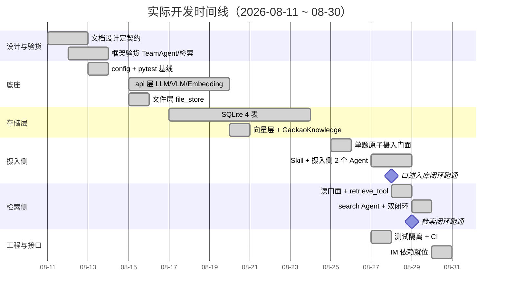
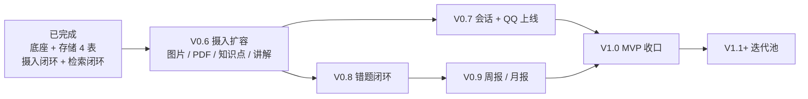

# 开发路线图（Roadmap）

> **本文档 2026-08-30 重写。**
>
> 原版是 08-11「代码未动一行」时拍的计划（V0.1 环境 → V0.2 数据 → V0.3 摄取 → V0.5 Agent → V1.0 接口）。
> 实际开发顺序与它偏离较大——不是照着走的，是按「当下最缺什么」逐个啃出来的。
>
> 因此本文档分两部分：
> - **第一部分**按 git 记录还原**真实时间线**（已完成部分不再套用 V0.x 编号，那个切分与实际不对应）
> - **第二部分**把剩下的活儿重排一遍，编号从 **V0.6** 接续。仅作参考，不是承诺。

---

## 当前状态速览（2026-08-30）

| 层 | 已落地 | 缺口 |
|----|--------|------|
| 配置 / API | `config.py`、LLM / VLM / Embedding 三客户端 | — |
| 文件层（L1） | `file_store.py`（sha256 命名 + 防穿越） | `data/files/` 目前**空的** |
| SQLite（L2） | 4 / 9 表：`files` `questions` `topics` `question_topics` | `knowledge_notes` `errors` `exam_attempts` `review_plans` `periodic_reports` |
| 向量层（L3） | `vector_store.py` + `GaokaoKnowledge`（已归位 `src/retrieval/`） | — |
| 摄入门面 | `ingestion/question.py`（原子化单题） | `image` `exam_paper` `topic` `knowledge_note` `error` `exam_attempt` |
| 检索门面 | `retrieval/knowledge.py`、`retrieval/question.py` | `knowledge_note` `topic` `error` `exam_attempt` `report` |
| Agent | Leader + 3 成员（结构识别 / 入库决策 / 搜索信息） | 文档识别、题目维护、VLM 理解、聚合数据、输出整理 |
| Tools | `ingest_question_tool`、`knowledge_search_tool`、`get_question_detail_tool` | Extract / VLM / Knowledge / 其余业务查询工具 |
| 入口 | `scripts/chat.py`（对话调试）、`scripts/cli.py`（只读浏览） | QQ、MCP、HTTP |
| 工程 | pytest + integration 分组 + GitHub Actions CI | Langfuse、Session 持久化 |

**数据现状（这是当前最大的问题）**：`questions` 4 条（全部口述入库）、`files` 0 条、`topics` / `question_topics` **0 条**（题目维护 Agent 未落地，Leader 暂不传 `topic_names`）、`data/files/` 空。
08-29 chat.py 实测结论：检索体验差的根因是**数据量**，不是代码。

---

# 第一部分：已完成（实际时间线）

## 阶段 0：设计先行 + 框架验货（08-11 ~ 08-13）

- `daaeb0c` 项目初始化：README + CLAUDE.md + 9 篇 docs（2730 行），6 条核心决策定型
- `8876ff7` **摄入侧 Agent 化**（用户发现的缺口：原设计 5 个子 Agent 全是读侧，没有写数据的）
- 框架验货（对应原 V0.1 的核心目的）：
  - `examples/team` 跑通 → TeamAgent 主架构风险解除，GraphAgent 备用方案后续删除
  - `knowledge_with_searchtool_rag_agent` 跑通 → 检索链路可行，LLM 会自主生成检索词
  - QQ 开放平台机器人创建完成
- 选型修正：嵌入从 bge-m3（本地）改 DashScope 云端 API（省掉整套本地推理栈）；DeepSeek 模型名 `deepseek-chat` → `deepseek-v4-flash` / `v4-pro`

**这一阶段唯一没做的原 V0.1 任务**：从 ima 导出试卷 PDF。一直拖到现在。

## 阶段 1：底座（08-13 ~ 08-15）

- `ab8b6cb` config 模块 + pytest 基线（34 用例全绿）
- `b17a5aa` 配置体系定案（敏感 → `.env`，公开 → `config.toml`，`${VAR}` 桥接）
- `3941932` `docs/test.md` 测试规范
- `e451c65` / `a7f1046` api 层：LLM + VLM 客户端（VLM 选型从 qwen3-vl-8b/32b 切到 **Qwen3.7-Flash/Plus**）
- `6e7f3e2` / `6c60569` `file_store.py` 文件层（哈希命名 + 防穿越 + 路径基准=项目根）

原计划没有独立的"底座"阶段，config 和 api 层被 V0.1 一句「配置 API Key」带过了。实际这块占了两三天。

## 阶段 2：存储层逐表（08-17 ~ 08-23）

- `18bc40a` **FilesDB**（首张表，确立"一表一模块 + DDL 单一来源 = `docs/store/db/*.md`"的样板）
- `8be91cd` **QuestionsDB** + 连接管理统一到 `db/__init__`
- `e72021d` embedding 客户端；`34c4110` 嵌入定为 `qwen3.7-text-embedding`（dim=1024）
- `17fa2d5` `vector_store.py`；`8a3fcf8` **GaokaoKnowledge** 子类 + 37 测试（全算子递归翻译成 Chroma 过滤）
- `d514cbf` **topics + question_topics**（路径枚举 + 名字即 tag）

**这是与原计划偏离最大的一段**：原本 V0.4 存储层是「与 V0.3 并行」的支线，实际成了整整一周的主干。而且只建了 4 张表——按需建表，用不到的不预先铺。

## 阶段 3：摄入写门面 + 架构分层（08-25）

- `3aea2e5` **`src/ingestion/question.py`** 原子化单题摄入（先题后错，四层写入 + 汇总日志）
- `f2b74ab` 测试隔离统一为 conftest 单一入口
- 文档大重构：`89abdf5` 分层门面契约（store ← ingestion/retrieval ← agent/mcp）、`4cd3c5b` agent.md / ingestion.md 目录化、`53a8125` 移除 GraphAgent

## 阶段 4：工程基建 + Skill 机制（08-27）

- `46b7ded` `@pytest.mark.integration` 标记（真实 API 测试默认不跑，零计费）
- `f181343` GitHub Actions CI；`6b1c286` clean env 隔离缺陷修复（CI 首跑 14 failed，暴露本地 `.env` + 残留 db 掩盖的问题）
- `f68ef9a` **question-organize Skill**（项目唯一 Skill，kebab-case）
- `1d8aded` **结构识别子 Agent**（接 Skill + `knowledge_only` 工具面收紧）

CI、Skill、测试隔离这三样原计划里一个字都没有，全是过程中长出来的。CI 尤其值——第一次跑就照出 14 个本地看不见的隔离缺陷。

## 阶段 5：摄入闭环打通（08-28，里程碑日）

- `1b351db` 题目归一化统一（整篇切出的题目段与零散单题同规则，讲解段不过 Skill）
- `0b2cbff` Skill 白名单硬约束（框架级，不靠 prompt 自觉）
- `01b06dc` `ingest_question` FunctionTool 薄封装（11 参数 LLM 友好子集）
- `8cb51d9` **入库决策子 Agent**（纯写库执行者，回显归 Leader）
- `f94d48c` **Team Leader 临时版**（2 成员 + 函数式隔离钉死）
- `134b294` **`scripts/chat.py` → 「口述题目 → 入库」端到端首次跑通**（question_id=1561，SQLite + Chroma 双写）
- `5b9a6fb` 来源链路贯通（`exam_regions` 落库，实测「2026高考全国1卷」）
- `62eefa2` GaokaoKnowledge 归位 `src/retrieval/` + `retrieve_tool` 落地
- `52f3167` PEP 562 惰性导出（修 CI 无 `.env` 时 collection 阶段崩溃）
- `5a201be` 题目读门面 `retrieval/question.py` + 只读 CLI `scripts/cli.py`

## 阶段 6：检索闭环上线（08-29，里程碑日）

- `c9f3d3d` **查询侧 search Agent** + Leader 扩为双闭环（意图路由内联 Leader 系统提示词，不做独立 Agent）
- `e798503` **检索 score 恒 0.0 修复**（框架 `SIMILARITY` 分支无分数出口 → 改 `SIMILARITY_SCORE_THRESHOLD` + `MIN_SCORE=-1.0`）
- `7e22c69` README 项目结构树重写（对齐实际目录）

score 修好后连带行为改善：search Agent 不再靠 LLM 猜相关性自行过滤，按分数降序全量交付，判断权交还 Leader。

## 阶段 7：IM 接入准备 + 文档收口（08-30）

- `56eda45` 依赖就位：`openclaw` extra（nanobot 0.3.0）+ `qq-botpy` 1.2.1，`openclaw run` 可用
- `8e62935` docs 目录化 + 去冗（`im_interface.md` → `im/README.md`、`mcp_interface.md` → `mcp/README.md`、`data_model.md` 解散下放）

核实清楚：nanobot 原生支持 QQ 通道，「继承 `QQChannel` 写 trpc-claw `_qq.py`」路线成立。

---

## 与原计划的偏离（5 处）

| 原计划 | 实际 | 为什么 |
|--------|------|--------|
| V0.2 数据准备：导入 20+ 份 PDF | **完全跳过**，`data/files/` 至今为空 | 摄入管线从"口述单题"起步，没 PDF 也能验链路；导数据是纯手工活，被一路后延 |
| V0.3 摄取管线：PDF → 20+ 题 → 回显 → 入库 | 只做了单题原子摄入 + 口述输入；PDF / 图片提取、讲解段分流都没动 | 单题是最小可验证单元；文档提取是独立大工程，先打通链路再拓宽入口 |
| V0.4 存储层「与 V0.3 并行」 | 成了 08-17 ~ 08-23 的主干，只建 4 / 9 表 | 摄入门面依赖表，表必须先行；表按需建不预先铺 |
| V0.5「查询侧 4 + 摄入侧 4」子 Agent | 摄入侧先落地（08-27/28），查询侧后（08-29），共 3 个成员 | 摄入决定"数据从哪来"，没数据检索无意义 |
| — | 多出来的：CI、Skill 白名单机制、测试隔离系统、chat.py / cli.py 调试入口 | 过程中的真实需要，计划时想不到 |

一句话总结偏离的规律：**原计划是"按层横着铺"，实际是"按闭环竖着切"**。竖切下来的结果是 08-28/29 两天各跑通一个闭环，代价是每层都留了缺口。

## 实际形成的开发节奏（值得保留）

这几条不是计划出来的，是打出来的，后面继续照这个来：

1. **文档先行定契约** → Claude 按契约写代码 → WorkBuddy review + commit。设计争议在 markdown 里吵完，不在代码里返工。
2. **一个 `.py` 配一个 `.md` 配一组测试**，逐个落地不批量合并（08-28 用户明确：工具"一个一个写"）。
3. **垂直闭环优先于水平铺层**。宁可 4 张表跑通一条链，不要 9 张表一个入口都没有。
4. **存储层自底向上，业务层自顶向下**。存储按 file → db → vector 顺序垒；业务层缺什么补什么。
5. **决策先写进 `MEMORY.md` 再动手**，防后续回潮（已经拦下过好几次：意图不做独立 Agent、不包装 SearchDocument、hybrid_search 删除）。
6. **CI 是照妖镜**。本地有 `.env`、有残留 db，很多问题只有干净环境才暴露。

---

# 第二部分：待完成（建议顺序）

## 排序原则

1. **先解数据量瓶颈**。08-29 实测已经说清楚了：检索体验差是因为库里只有 4 题。摄入扩容的优先级高于任何新功能——先把数据灌进来，检索质量自然改善。
2. **每个版本都要能跑出一条完整链路**。不做"只有表没有入口"的半成品（现在 topics 表就是这个状态，空的）。
3. **趁热打铁**。IM 依赖 08-30 刚就位、源码刚读完，别等认知冷了再回头。

## V0.6 摄入扩容：从"一题一题说"到"整份喂进去"

**目标**：数据量从 4 题干到 200+ 题。这是当前唯一的瓶颈。

### a. 图片摄入（IM 主场景，优先）

- [ ] `VLMUnderstandTool`：FunctionTool 封装（`api/vlm.py` 客户端已有，缺工具层）
- [ ] `src/ingestion/image.py`：图片落 `file_store` + `files` 表注册 + `processed/vlm_desc/` 缓存（VLM 只在摄入时调一次）
- [ ] `src/agent/ingestion/doc_recognition.py` 文档识别 Agent（照片分支）
- [ ] Leader 摄入闭环接图片入口

**验收**：chat.py 传一张题目照片 → VLM 描述 → 结构识别 → 回显 → 入库

### b. PDF 摄入（数据量主力）

- [ ] `ExtractTool`：PyMuPDF 提取文本块 + 嵌入图像 + 坐标
- [ ] `src/ingestion/exam_paper.py`：试卷级摄入（`files` 注册 + 分题调度）
- [ ] 文档识别 Agent 补 PDF 分支
- [ ] `scripts/ingest.py` 批量 CLI（幂等由 `files.sha256` UNIQUE 兜底）

**验收**：1 份试卷 PDF → 20+ 题清单 → 批量决策 → 入库

### c. 知识点关联补链（`topics` 表现在是空的）

- [ ] `src/ingestion/topic.py`：归位原语 `resolve_or_create_topics` / `create_topic` / `add_topic_alias`
- [ ] `src/agent/ingestion/question_maintain.py` 题目维护 Agent（知识点双路提取；**兼 `manage` 改 / 删题**，见 f）
- [ ] `src/retrieval/topic.py`：`search_topics` / `list_topics` / `get_topic`
- [ ] Leader 摄入链补「题目维护 Agent（知识点归位）」步骤，取消当前 `topic_names` 不传的降级

**验收**：入库题目带知识点 tag，`topics` / `question_topics` 有数据；问"椭圆"能返回相关 tag

### d. 讲解段落地

- [ ] `knowledge_notes` 表（第 5 张）+ `src/ingestion/knowledge_note.py` + `src/retrieval/knowledge_note.py`
- [ ] 结构识别输出的 `lecture_segments` 不再被 Leader 忽略

**验收**：1 份专题 PDF → 讲解段进 `knowledge_notes`、题目段进 `questions`，检索能同时召回两类

### e. 数据回填（原 V0.2 在这里补上）

- [ ] 从 ima「高考2026」导出 20+ 份试卷 + 9 份专题 → `data/files/raw/pdfs/`
- [ ] 抽 2-3 份人工检查 PDF 质量（文本可提取性、图像完整性）
- [ ] 批量摄入

**验收**：`questions` ≥ 200，检索有得可召

> 顺序上 e 可以随时插队——它是纯手工活，不依赖任何代码。哪天不想写代码了就去导 PDF。

### f. 题目维护改 / 删（设计已定，2026-09-03；优先级低于 a–e）

设计已写进 [ingestion/question.md](ingestion/question.md)（`update_question` / `delete_question`），代码未落地。排在 a–e 之后的理由：库里才 4 题时，改 / 删的需求几乎不会出现，先灌数据。

- [x] store 层补 `QuestionTopicsDB.remove_by_question(question_id)`（现有只有单条 `remove`）
- [ ] `src/ingestion/question.py` 加 `update_question`（部分更新 + 知识点全量替换 + VLM 描述回读重嵌）
- [ ] 加 `delete_question`（先 Chroma 后 DB 的级联顺序；**阶段 1 只级联三处**：`question_topics` + Chroma + 主行）
- [ ] `UpdateQuestionTool` / `DeleteQuestionTool` 并入写侧 `ingest_tool.py`，挂**题目维护 Agent**
- [ ] 题目维护 Agent 扩 `manage` 分支（改题：字段结构化 / 来源拆解 / 补解析；删题：薄调用 + 回传 cascade）
- [ ] Leader 加 `manage` 意图：定位 `question_id` + 打包委派 + 删前回显确认（Leader 不挂写工具）
- [ ] **随错题本落地**：`delete_question` 级联扩展到 `errors` + 删除预检（查引用 → 回显连带影响 → 用户确认一起删）
- [ ] **随作答功能落地**：同上扩展 `exam_attempts`

> **归属决策（2026-09-03）**：改 / 删**不挂 Leader**——`create_gaokao_leader()` 不传 `tools=`，Leader 是纯编排者，挂写工具破坏「只委派」。执行者为**题目维护 Agent**：其原本就管「已入库题目的知识点改动」，树治理后置后并入改 / 删，属同一类写操作。代码未落地，扩职责零成本。
>
> **级联分阶段（2026-09-03 用户拍板）**：现在门面只删三处，不为删题倒推建 errors / exam_attempts 模块；**错题本功能落地时同步修改删除代码**——检查该题是否在错题本中，命中则在回显阶段提示用户，确认后一起删除；作答同理。检查进回显而非当闸门，不做「删除时拒绝」。删题预检（首轮）与执行（用户确认后的新一轮）分属两轮、每轮只委派一次，与「每成员每任务最多委派一次」铁律天然不冲突，无需例外。

**验收**：改一道题的答案 + 知识点 → SQLite 与 Chroma 同步、检索能召回新内容；删一道题 → 关联 `question_topics` 与向量一并清掉，raw 文件保留（`errors` / `exam_attempts` 级联在阶段 2 随各自功能验收）

## V0.7 会话持久化 + QQ 上线

**目标**：从"命令行自己玩"到"手机 QQ 能用"。依赖刚就位，趁热打铁。

- [ ] `SqlSessionService` 接入（多轮上下文持久化——IM 的前置条件，命令行单次会话掩盖了这个需求）
- [ ] `src/im/` 包：`create_claw_app()` 装配 TeamAgent → ClawApplication（方式 A）
- [ ] `[channels.qq]` 配置段 + `.env` 填 `QQ_APP_ID` / `QQ_APP_SECRET`（**MVP 免补丁**：nanobot registry 自动发现并加载原生 `QQChannel`，无需写 `_qq.py`，详见 [IM 接入](im/README.md)）
- [ ] `scripts/im_server.py` 入口 + 沙箱单聊联调
- [ ] IM 图片收发接 V0.6a 的图片摄入

**验收**：手机 QQ 发文字问题 → 收到带溯源的回答；发题目照片 → 识别并入库

细节见 [IM 接入](im/README.md)。注意 `qq-botpy` 的导入名是 `botpy`。

## V0.8 错题闭环

**目标**：把入库决策 Agent 里 `error_pending` 那个降级还掉。这是 MVP 的差异化核心。

- [ ] `errors` 表（第 6 张，含 `error_summary`）
- [ ] `src/ingestion/error.py`：`ingest_error`（先题后错，原子化）
- [ ] 错因口述结构化：用户口述 → LLM 转 `error_summary`（替代手写识别）
- [ ] `src/retrieval/error.py`：`get_error_stats` / `get_error_details` / `get_weak_topics`
- [ ] 入库决策 Agent 去掉 `error_pending` 降级分支
- [ ] Leader `review` 意图落地

**验收**：说"这题我算错了，符号看漏了" → 错题入库；问"我的薄弱知识点" → 返回分布 + 复习建议

## V0.9 周报 / 月报

**目标**：朋友最想要的功能。剩下 3 张表一起建。

- [ ] `exam_attempts`（第 7）+ `review_plans`（第 8）+ `periodic_reports`（第 9）三表
- [ ] `src/ingestion/exam_attempt.py`：整卷作答口述录入
- [ ] `src/retrieval/exam_attempt.py` + `src/retrieval/report.py`（双源聚合 + 趋势对比）
- [ ] 聚合数据子 Agent（REPORT_GEN 逻辑，见 [聚合数据子 Agent](agent/retrieval/aggregate.md)）
- [ ] Leader `report` 意图落地（解析 `period_type`）

**验收**：
- 「生成周报」→ 错题统计 + 薄弱知识点 Top 3 + 针对性练习建议（带推荐题目）
- 「这个月的月报」→ 月度报告含与上月趋势对比
- 同一周期重复生成 → 返回缓存不重算（`periodic_reports` UNIQUE 幂等）

## V1.0 MVP 收口

**目标**：朋友能独立用完整闭环，不需要你在旁边。

- [ ] 输出整理 Agent（剥离 v4-flash 的 thought 思考痕迹）
- [ ] 查询侧 VLM 理解 Agent（对着图问问题）
- [ ] 正式环境：固定公网 IP 配 QQ IP 白名单；回复含链接需报备消息 URL 白名单（要 ICP 备案）
- [ ] Prompt 打磨（数学语境约束；Leader 作答稳定性——目前"方法小结"有时有有时没有）
- [ ] 找 1-2 位高三同学试用，收集反馈

**验收**：朋友用手机 QQ 独立走完「问题 → 拍错题 → 看周报」，全程不需要指导

## V1.1+ 迭代池（不排序，按触发条件取）

| 项 | 触发条件 |
|----|----------|
| `topics` 树形升级（路径枚举正式版 + 树查询工具） | tag 数量多到扁平列表看不清 |
| Agentic 检索（`dynamic_filter`） | 出现明确的带条件检索需求（"2026年 圆锥曲线 解答题"） |
| Langfuse 自托管可观测性 | 多 Agent 委派链靠日志调不动时 |
| MCP Server（STDIO + SSE） | 想让 Claude Code 直接查题库时，见 [MCP 接口](mcp/README.md) |
| FastAPI + SSE 流式 | 有 Web 前端需求时 |
| MinerU2.5-Pro 降级通道 | 遇到 PyMuPDF 提不出的扫描件 |
| 公式 LaTeX 化 | Unicode 文本在复杂公式上明显不够用时 |
| 扩科（物化生） | 数学单科验证成立后 |
| 群聊 / 多用户隔离 | QQ 开放群能力 + 出现第二个用户时 |
| `_qq.py` 长答案分片增强（`stream_reply`，继承原生 `QQChannel` 重写 `send()` + `register_channel_repair`） | 长回复被 QQ 消息长度截断时（MVP 已用原生 `QQChannel` 直配） |

## 依赖关系

- V0.6 是所有后续的前提（数据量瓶颈不解，做什么都没手感）
- **V0.7 与 V0.8 可并行**：一个动接口层、一个动数据层，互不冲突。哪天想碰 IM 就碰 IM，想补表就补表
- V0.9 依赖 V0.8（周报的核心数据源是错题统计）
- V1.0 = MVP 完成

---

## 风险与坑

### 已发生并处置（留档防复发）

| 坑 | 处置 |
|----|------|
| CI 无 `.env` 时模块级实体化在 collection 阶段崩 | 改 PEP 562 惰性导出；审查顶层 import 要用"无 `.env` 视角" |
| Windows `skill_load` 符号链接 `WinError 1314` | `CopySkillStager` 替代默认 `LinkSkillStager` |
| 检索 score 恒 0.0（框架 `SIMILARITY` 无分数出口） | `SEARCH_TYPE` → `SIMILARITY_SCORE_THRESHOLD` + `MIN_SCORE=-1.0` |
| `git rm` 触发安全中心把整个目录送回收站 | 禁用 `git rm`，改普通 `rm` + `git add -A` |
| clean env 下建表 / 嵌入 patch 未生效（CI 首跑 14 failed） | conftest 补 ensure schema 步骤 + patch 扩到 3 个目标模块 |
| `qq-botpy` 发行包的导入名是 `botpy` 不是 `qq_botpy` | 已记入 [IM 接入](im/README.md)，写 `_qq.py` 时别踩 |
| `FunctionTool` schema 生成器不认 PEP 604 的 `X \| None` | 可空参数一律写 `typing.Optional[...]` |

### 仍在的风险

| 风险 | 等级 | 对策 |
|------|------|------|
| **数据量瓶颈（库里 4 题）** | 高 | V0.6 全力解决；e 步（ima 导出）是纯手工活可随时插队 |
| PDF 质量差（扫描件、公式乱码） | 高 | 优先电子排版试卷；MinerU2.5-Pro 兜底；公式 LaTeX 化后置 |
| VLM 描述质量不稳定 | 中 | Prompt 迭代 + 人工抽样审核；flash → plus 升级档 |
| 结构识别分流不准（讲解 / 题目） | 中 | LLM 语义判断 + 回显确认兜底（已生效） |
| 知识点标注不一致 | 中 | 开放式提取 + aliases 归并；人工抽查 |
| QQ 正式环境默认启用 IP 白名单 | 中 | 开发期走沙箱不受影响；上线需固定公网 IP |
| QQ 机器人当前仅创建人可用、不支持拉群 | 中 | 沙箱可配置指定 QQ 号——把朋友的号加进沙箱即可试用，不必等上线审核 |
| 部署需 7×24 在线 | 中 | 家用电脑常开 / 学生云服务器；初期本地演示即可 |
| LLM / VLM API 限流或不稳定 | 低 | 重试 + 退避 + 并发控制；模型中立可切厂商 |
