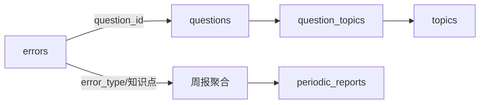

# errors 表详解（错题记录）

## 功能定位

记录**学生的错题与错因**，回答"这题为什么错"（题目粒度）。是周报/复习建议的两大数据源之一（另一个是 `exam_attempts`）。

## Schema

```sql
CREATE TABLE errors (
    id              INTEGER PRIMARY KEY AUTOINCREMENT,
    user_id         TEXT NOT NULL,                  -- 用户标识（MVP 固定单一用户，字段预留未来多用户）
    question_id     INTEGER REFERENCES questions(id),
    source_text     TEXT,                            -- 错题原始文本（如果未关联到题目）
    error_type      TEXT,                            -- "计算错误" / "思路错误" / "知识盲区" / "审题错误"
    user_reflection TEXT,                            -- 用户口述的原始错因描述（自由文本）
    error_summary   TEXT,                            -- LLM 生成的结构化错因总结（JSON: {cause, knowledge_gap, fix_suggestion}）
    error_count     INTEGER DEFAULT 1,              -- 同一题错了几次
    first_seen      TEXT DEFAULT (datetime('now')),
    last_seen       TEXT DEFAULT (datetime('now')),
    resolved        BOOLEAN DEFAULT 0               -- 是否已掌握
);

CREATE INDEX idx_errors_user ON errors(user_id);
CREATE INDEX idx_errors_question ON errors(question_id);
CREATE INDEX idx_errors_type ON errors(error_type);
```

## 关键设计点

### 错因总结（核心设计）：用户口述 + LLM 结构化，不识别手写

- **不存学生手写解题过程**——VLM 识别手写 CER 15-20% 不可靠（vlm_strategy.md 调研结论），存储成本也高
- `user_reflection`：用户自己的话描述"我当时怎么错的"（QQ 文字/语音）
- `error_summary`：LLM 基于口述 + 题目上下文生成的结构化总结（`{cause, knowledge_gap, fix_suggestion}`）
- 周报/复习建议**优先消费 `error_summary`**（结构化、可比对），`user_reflection` 作为原始依据保留

### 错误计数与状态

- `error_count`：同一题反复错，累加（"第三次错同一道题"要触发复习提醒）
- `resolved`：已掌握标记——周报"掌握率 = resolved / total"的数据源
- `first_seen` / `last_seen`：时间窗口过滤（本周新增/已解决）

## 常见操作

- 录入：`user_id + question_id`（或 source_text 兜底）→ 口述 → LLM 生成 error_summary（事务内）
- 聚合：按 `error_type` / 按知识点（经 question_topics join topics）统计
- 更新：错同题 +1 次、标记 resolved

## 与其他表的关系



> 与 `exam_attempts` 的分工：errors 回答"这题为什么错"（题目粒度），exam_attempts 回答"这张卷整体考得怎样"（卷子粒度）——周报双源聚合（见 `periodic_reports.md`）。
