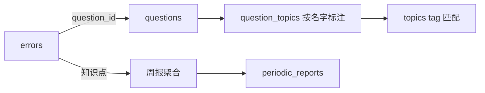

# errors 表详解（错题记录）

## 功能定位

记录**学生的错题与错因**，回答"这题为什么错"（题目粒度）。是周报/复习建议的两大数据源之一（另一个是 `exam_attempts`）。

## Schema

```sql
CREATE TABLE errors (
    id              INTEGER PRIMARY KEY AUTOINCREMENT,
    question_id     INTEGER NOT NULL REFERENCES questions(id),  -- 必填：错题本只记错因，经 id 关联到具体题目
    user_reflection TEXT,                            -- 用户口述的原始错因描述（自由文本）
    error_summary   TEXT,                            -- LLM 生成的结构化错因总结（JSON: {error_type, cause, knowledge_gap, fix_suggestion}）
    first_seen      TEXT DEFAULT (datetime('now')),  -- 首次记入错题本
    last_seen       TEXT DEFAULT (datetime('now')),  -- 最后一次更新（补录 / 修正错因）
    resolved        BOOLEAN DEFAULT 0               -- 是否已掌握
);

-- 一题一行：同一道题在错题本里只有一条记录
CREATE UNIQUE INDEX idx_errors_question ON errors(question_id);
```

## 关键设计点

### 错因总结（核心设计）：用户口述 + LLM 结构化，不识别手写

- **不存学生手写解题过程**——VLM 识别手写 CER 15-20% 不可靠（vlm_strategy.md 调研结论），存储成本也高
- `user_reflection`：用户自己的话描述"我当时怎么错的"（QQ 文字/语音）
- `error_summary`：LLM 基于口述 + 题目上下文生成的结构化总结（`{error_type, cause, knowledge_gap, fix_suggestion}`）
- 周报/复习建议**优先消费 `error_summary`**（结构化、可比对），`user_reflection` 作为原始依据保留

### 错误类型并入 error_summary，不设独立列（2026-09-13 决策）

原设计把错误类型（计算错误 / 思路错误 / 知识盲区 / 审题错误）做成独立列 + `idx_errors_type` 索引，
现**降级为 `error_summary` JSON 内的一个键**：

- **没有"按类型聚合 / 检索"的真实需求**——学生要的是"我哪里薄弱"（知识点维度），不是"我计算错误错了几道"
- **万一将来要按类型找错题**，对 `error_summary` 做语义检索（向量）即可覆盖，不必为它建列 + 索引
- 类型仍是 LLM 同一次结构化的产出（零额外成本），留在 JSON 里供**展示**（「▸ 错误类型：知识盲区」）与向量化文本使用

> 代价明确：放弃 SQL 层的 `GROUP BY error_type`。真需要恢复该维度时，从 JSON 提取聚合或重新加列，届时按需再定。

### 一题一行（2026-09-17 定）

`UNIQUE INDEX idx_errors_question` 保证同一道题在错题本里**只有一条记录**——这是 `update_error` / `delete_error` 按 `question_id` 定位的前提（否则「改哪条 / 删哪条」无从决定）。再次错同一题 = **更新这条记录**，不新增行。

**`question_id` 必填**（`NOT NULL`，2026-09-17 定）：错题表**只记录错因、经 id 关联到具体题目**——题目必须先经 `ingest_question` 入库（"先题后错"铁律）。原 `source_text` 兜底列（错题原文不经题目表直接落库）已随之删除。

### 状态与时间

- `resolved`：已掌握标记——周报"掌握率 = resolved / total"的数据源。**再次错同一题时自动重置为 0**（2026-09-17 定）：又错了说明还没掌握，"已掌握"不能一直挂着
- `first_seen` / `last_seen`：首次记入 / 最后一次更新的时间，用于时间窗过滤（本周新增 / 已解决）

> **不设 `error_count`（2026-09-17 决策，原字段已删）**：原设计有「同一题错了几次」的计数字段，现移除。理由：
> ① **错一次和错多次同样需要被重视**——计数不产生任何行动差异，也不存在「检索错过两次的题」这类场景；
> ② 同一题的多次错因可以在 `error_summary` 的**自然语言描述**里体现（如 cause 里写明「首次是符号看漏、这次是公式记混」），不必单独建键。
> 连带效果：`WeakTopic.error_count`（该知识点下的错题数）不再与表字段同名，此前的命名冲突消失。

## 常见操作

- 录入：`question_id`（必填）→ 口述 → LLM 生成 `error_summary`（由 `error-organize` Skill 产出后传入，见 [../../agent/skills/error-organize.md](../../agent/skills/error-organize.md)）
- 聚合：按知识点（经 question_topics 的 `topic_name` 匹配）/ **按学科（join questions.subject，无需冗余）** / 按时间窗（`first_seen` / `last_seen`）统计
- 更新：补录 / 修正错因、标记 `resolved`（`update_error`，同一题恒一条记录——再次错同一题是**更新**而非新增）

## 与其他表的关系



> 与 `exam_attempts` 的分工：errors 回答"这题为什么错"（题目粒度），exam_attempts 回答"这张卷整体考得怎样"（卷子粒度）——周报双源聚合（见 `periodic_reports.md`）。
