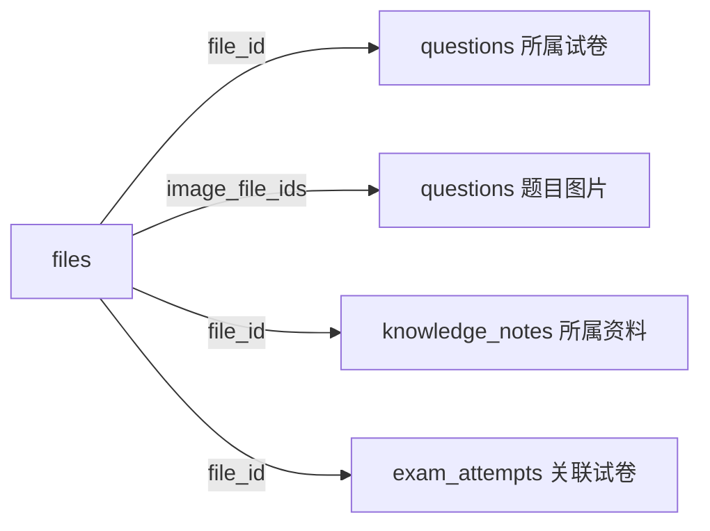

# files 表详解（文件注册表）

> 所有源文件（PDF / 题目图片）的**统一注册表**，第 1 张表。磁盘上存哈希命名文件，数据库记录语义标题 + 磁盘路径。业务表（questions / knowledge_notes / exam_attempts）通过 `file_id` 引用，不再各自存来源。

## 功能定位

- **源文件元数据中枢**：`title`（语义标题）/ `file_path`（磁盘哈希路径）/ `sha256`（去重+完整性）单一事实来源
- **原文件名直接丢弃**：用户上传的文件名大多是噪音（"新建文档.pdf"），不保留
- **title 挂在文件上而非题目上**：一份试卷对应多道题，改一次标题全局生效

## Schema

```sql
CREATE TABLE files (
    id          INTEGER PRIMARY KEY AUTOINCREMENT,
    title       TEXT,                            -- 语义标题（agent 总结生成 / 用户自定义，可空=待生成）
    file_path   TEXT UNIQUE NOT NULL,            -- 磁盘相对路径，基准=项目根（哈希命名: data/files/raw/pdfs/3f9a2c81.pdf）
    sha256      TEXT NOT NULL,                   -- 内容哈希（去重 + 完整性校验）
    size        INTEGER,                         -- 字节数
    kind        TEXT NOT NULL,                   -- "pdf" / "image"
    source_hint TEXT,                            -- 原始来源备注（可选: "QQ 上传" / "ima 导出"）
    created_at  TEXT DEFAULT (datetime('now'))
);

CREATE INDEX idx_files_kind ON files(kind);
CREATE UNIQUE INDEX idx_files_sha ON files(sha256);   -- 同内容天然去重
```

## 关键设计点

### 1. 磁盘哈希命名（物理层）

- 磁盘文件名 = 完整 `sha256`（64 位 hex）+ 扩展名（`data/files/raw/pdfs/<sha256>.pdf`，相对项目根）
- 好处：**同内容同文件**（`sha256` UNIQUE 索引直接挡掉重复上传）、同名不覆盖、防恶意文件名、物理层可自由重组

### 2. title 语义标题（逻辑层）

- 摄入时 **agent 从内容总结**（LLM 读 PDF 首段/试卷头生成"2026 南昌一模数学卷"）
- **用户可自定义**（摄入回显时确认/修改——符合统一摄入范式"系统不替用户做主"）
- 可空 = 待生成（用户没确认前先落库，检索按原始内容兜底）

### 3. 图片也走本表

- `kind='image'`：题目图片同样入库（哈希去重、可空 title）
- 题目通过 `questions.image_file_ids`（JSON 数组存 files.id）引用——见 questions.md

## 常见操作

**分层调用**：物理层落盘（`FileStore.save_raw` / `save_processed`）与元数据登记（`FilesDB.register`）分两步——`FileStore` 管字节，`FilesDB` 管注册。摄取管线按需编排（组合 helper 待有调用方时再加）。

| 方法 | 用途 |
| ---- | ---- |
| `register(file_path, sha256, kind, title=None, size=None, source_hint=None)` | 登记文件 → 返回 file_id（同 sha256 命中已有行，去重） |
| `get_by_id(file_id)` | 按 ID 查（返回 dict 或 None） |
| `get_by_path(file_path)` | 按磁盘路径查 |
| `get_by_sha(sha256)` | 按内容哈希查（去重校验用） |
| `get_by_title(title)` | 按语义标题查（"按试卷名找卷子"，摄入回显/检索入口） |
| `list_all(kind=None)` | 列出全部 / 按 kind（pdf/image）过滤 |
| `set_title(file_id, title)` | 改名（全局生效；缺失 id 抛 ValueError） |
| `set_source_hint(file_id, source_hint)` | 更新来源备注（缺失 id 抛 ValueError） |
| `verify(file_id, expected_sha256)` | 完整性校验（与预期哈希比对，缺失返回 False） |
| `delete(file_id)` | 删除登记（raw 被引用时调用方应先查 SQLite） |

## 与其他表的关系



| 表 | 引用方式 | 说明 |
| ---- | -------- | ---- |
| `questions` | `file_id`（主源）+ `image_file_ids`（图片 JSON） | 替代原 `source_file` / `image_paths` |
| `knowledge_notes` | `file_id` | 讲解所属的资料/试卷 |
| `exam_attempts` | `file_id` | 整卷作答关联的试卷 |

> `source_file` 字段已废弃（2026-08-15 设计修正：原文件名无语义价值，改 title + 磁盘哈希）。
