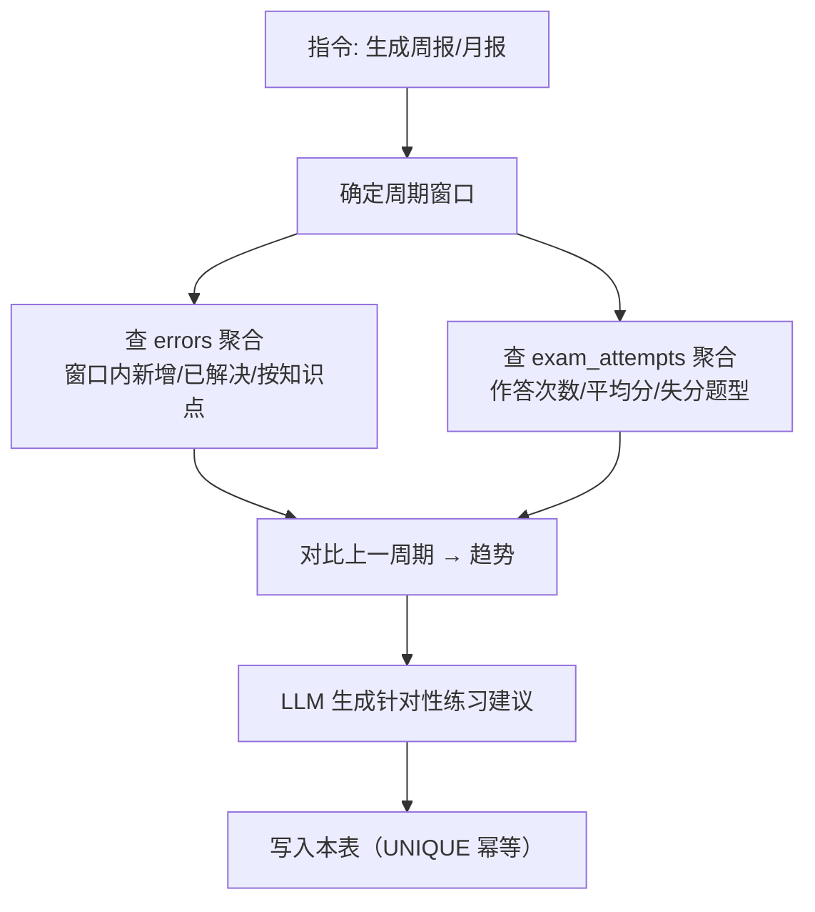

# periodic_reports 表详解（周期报告）

## 功能定位

支撑**周报/月报**功能（MVP 核心功能之一）。报告生成后落库，可回溯、可对比、可缓存（同周期不重复生成）。数据流：`errors`（错题明细）+ `exam_attempts`（作答明细）→ 周期聚合 → 本表（快照）→ LLM 建议。

## Schema

```sql
CREATE TABLE periodic_reports (
    id              INTEGER PRIMARY KEY AUTOINCREMENT,
    user_id         TEXT NOT NULL,                  -- 用户标识（MVP 固定单一用户）
    period_type     TEXT NOT NULL,                  -- "weekly" / "monthly"
    period_start    TEXT NOT NULL,                  -- 周期起始日期
    period_end      TEXT NOT NULL,                  -- 周期结束日期
    -- 统计快照（生成时固化，防后续错题更新导致历史报告漂移）
    total_errors    INTEGER NOT NULL,               -- 周期内新增错题数
    resolved_errors INTEGER DEFAULT 0,              -- 周期内已掌握错题数
    resolve_rate    REAL,                            -- 掌握率 = resolved / total
    weak_topics     TEXT,                            -- 薄弱知识点 JSON: [{topic, error_count, accuracy}]
    trend_vs_prev   TEXT,                            -- 对比上一周期 JSON: {total_delta, top_topic_delta}
    recommendation  TEXT,                            -- LLM 生成的针对性练习建议
    raw_stats       TEXT,                            -- 完整统计原始数据（JSON，供重新生成/调试）
    created_at      TEXT DEFAULT (datetime('now')),
    UNIQUE(user_id, period_type, period_start, period_end)   -- 同周期幂等
);

CREATE INDEX idx_reports_user_period ON periodic_reports(user_id, period_type, period_start);
```

## 关键设计点

### 快照固化（核心设计）

报告里的统计数字（`total_errors` / `weak_topics` 等）**在生成时固化**——后续错题更新不影响历史报告，保证"上周的报告说的就是上周的情况"，可对比、可回溯。原始明细留 `raw_stats` JSON 供重新生成/调试。

### 幂等（UNIQUE 约束）

`UNIQUE(user_id, period_type, period_start, period_end)`——同一周期重复触发"生成周报"不会产生重复记录，而是命中已有行（返回缓存/或显式重新生成覆盖）。

### 双源聚合



- `errors` 回答"薄弱知识点"（题目粒度）
- `exam_attempts` 回答"整体表现"（卷子粒度）
- 两者互补合并 → `weak_topics` + `recommendation`

## 常见操作

- 生成：REPORT_GEN 节点（见 `docs/agent.md`）——窗口计算 → 双源聚合 → 对比上周期 → LLM 建议 → 落库
- 查询：`WHERE user_id = ? AND period_type = ? AND period_end = ?`（幂等命中）
- 重生成：同周期覆盖（先查后写，UNIQUE 冲突时 UPDATE）

## 与其他表的关系

| 关联 | 说明 |
| ---- | ---- |
| `errors` | 错题明细源（新增/已解决/按知识点分组） |
| `exam_attempts` | 作答明细源（整体表现） |
| `topics` | `weak_topics` 里的知识点名字对应树节点（可展开检索推荐题） |
| `review_plans` | recommendation 可落到复习计划 |
