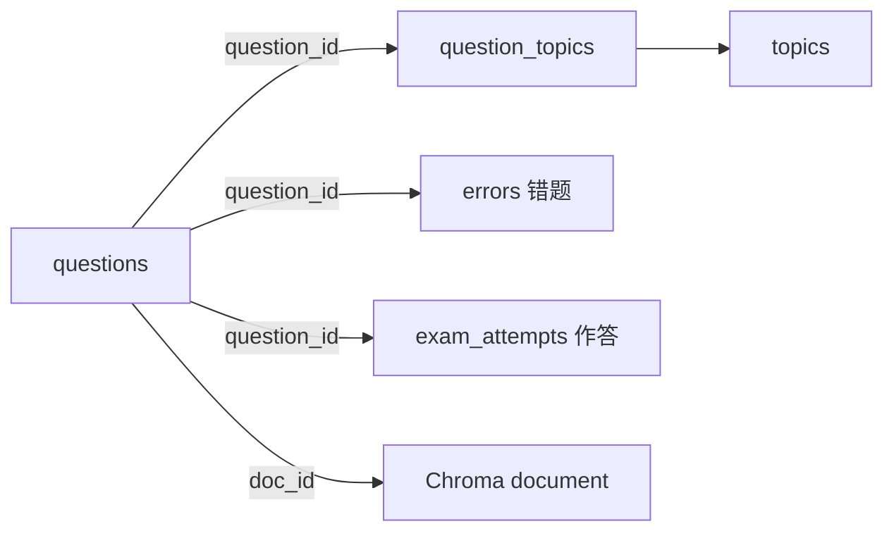

# questions 表详解（题目）

## 功能定位

题目主表，记录**题目内容（含图片描述）+ 答案解析**；知识点关联在 `question_topics` 表（经 `question_id`），错题错因在 `errors` 表（经 `question_id`）。整篇（题干+答案+解析+VLM 描述）作为一篇 document 入 Chroma（`doc_id` 桥接），本表是 SQLite 侧的元数据中枢。

## Schema

```sql
CREATE TABLE questions (
    id              INTEGER PRIMARY KEY AUTOINCREMENT,
    doc_id          TEXT UNIQUE NOT NULL,          -- 与 Chroma document 的 doc_id 对应
    source_type     TEXT NOT NULL,                  -- "exam" / "special_topic" / "homework" / "error_book"
    subject         TEXT NOT NULL,                  -- 学科: "数学" / "物理" / ...（查询热维度，冗余列——扩科后 questions 混合多学科，直接过滤免 join；摄入时从源文件学科判定，MVP 固定"数学"）
    file_id         INTEGER REFERENCES files(id),  -- 所属试卷/作业（files 表；标题经 join 获取，不冗余）
    exam_regions    TEXT,                            -- 考区层级 JSON 数组，从小到大: ["深圳","广东","全国一卷"]；单级可 ["南昌"]；可空=未知
    exam_year       INTEGER,                         -- 年份
    exam_month      INTEGER,                         -- 1-12 月份（展示时转中文）
    question_number TEXT,                            -- 题号: "第15题" / "选择题3"
    question_type   TEXT NOT NULL,                  -- "单选题" / "多选题" / "填空题" / "解答题"
    content_text    TEXT NOT NULL,                  -- 题目文本（VLM 处理后含图形描述）
    answer_text     TEXT,                            -- 标准答案（可空：源资料缺失时 NULL）
    analysis_text   TEXT,                            -- 解析（可空：源资料缺失时 NULL，可后续 LLM 补）
    image_file_ids  TEXT,                            -- 题目图片 files.id 数组 JSON（经 files 表取路径；非空即含图）
    created_at      TEXT DEFAULT (datetime('now'))
);

CREATE INDEX idx_questions_source ON questions(source_type, file_id);
CREATE INDEX idx_questions_subject ON questions(subject);
CREATE INDEX idx_questions_exam ON questions(exam_year);
CREATE INDEX idx_questions_type ON questions(question_type);
```

## 关键设计点

- **`content_text` 含 VLM 图形描述**：图片经 VLM 转文本描述后并入题目文本，下游全走文本 RAG；VLM 描述原始内容**不存本表**——存 `data/files/processed/vlm_desc/{图片sha256}.json`，经 `image_file_ids` → `files.sha256` 推导路径关联（见 processed.md）
- **原始提取文本不存本表**：OCR/解析原文存 `data/files/processed/text/{文件sha256}.txt`（可重建，raw 重跑即可），VLM 描述质量差时回溯重跑用
- **整篇 document 入库**：一道题 = 题干+答案+解析+VLM 描述合并为一篇 document 入 Chroma（切片分块细则在 vector_store.py 实现时定）；同 collection 靠 `doc_type`（question/note）+ metadata 区分来源
- **`doc_id` 是 SQLite ↔ Chroma 的桥**：格式如 `q_42`（两段式 `{entity}_{id}`，幂等 upsert，详见 [data_model.md](../../data_model.md)「doc_id 生成规则」），双写一致性靠它
- **可重建内容外置**：VLM 描述 / 原始提取文本等可重建内容不占 SQLite，存 `processed/`（vlm_desc/、text/）经哈希关联——`content_text` / `answer_text` / `analysis_text` 才是本表的持久内容
- **`has_image` 是 Chroma 过滤专用**：Chroma metadata 存 `has_image` 布尔快照（bool 标量过滤最直接，避免检索时回查 SQLite 才能判断含图）；**SQLite 侧不存该字段**——以 `image_file_ids` 为准（非空即含图），避免两边维护不一致。摄入时同步写 Chroma metadata。Chroma metadata **不存 `image_file_ids`**（SQLite 权威，检索用不上，见 vector/vector_store.md「Metadata 格式与过滤语义」）

## 常见操作

- 插入：本表 + `question_topics` 关联 + Chroma document（**同一事务**，见摄入管线）
- 按知识点查：`question_topics` join 本表（或经树展开取多知识点）
- 按考试查：`WHERE exam_regions LIKE '%"南昌"%' AND exam_year = ?`（JSON 数组包含匹配；题目量小全表扫可接受）
- 删除：级联删 `question_topics` / `errors` 引用 + Chroma document

## 与其他表的关系



> 摄入链路：结构识别 Agent 出题目清单 → 回显确认 → 入库决策 Agent 写本表 + 关联 + Chroma（见 `docs/agent.md` 摄入侧设计）。
