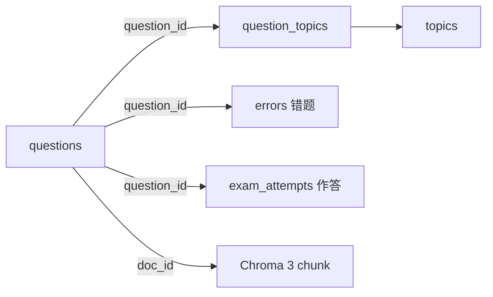

# questions 表详解（题目）

## 功能定位

题目主表，记录**完整四要素**：题目内容（含图片描述）+ 答案解析 + 错题错因 + 知识点关联。一道题拆分 3 种 chunk 入 Chroma（`question` / `answer` / `knowledge_point`），本表是 SQLite 侧的元数据中枢。

## Schema

```sql
CREATE TABLE questions (
    id              INTEGER PRIMARY KEY AUTOINCREMENT,
    doc_id          TEXT UNIQUE NOT NULL,          -- 与 Chroma chunk 的 doc_id 对应
    source_type     TEXT NOT NULL,                  -- "exam" / "special_topic" / "homework" / "error_book"
    file_id         INTEGER REFERENCES files(id),  -- 所属试卷/作业（files 表；标题经 join 获取，不冗余）
    exam_region     TEXT,                            -- 考区: "南昌" / "深圳" / "全国卷I" ...
    exam_year       INTEGER,                         -- 年份
    exam_month      INTEGER,                         -- 1-12 月份（展示时转中文）
    question_number TEXT,                            -- 题号: "第15题" / "选择题3"
    question_type   TEXT NOT NULL,                  -- "单选题" / "多选题" / "填空题" / "解答题"
    content_text    TEXT NOT NULL,                  -- 题目文本（VLM 处理后含图形描述）
    answer_text     TEXT,                            -- 标准答案
    analysis_text   TEXT,                            -- 解析
    has_image       BOOLEAN DEFAULT 0,              -- 是否含图
    image_file_ids  TEXT,                            -- 题目图片 files.id 数组 JSON（经 files 表取路径）
    vlm_descriptions TEXT,                           -- VLM 生成的图形描述 JSON 数组
    raw_text        TEXT,                            -- 原始提取文本（备份）
    created_at      TEXT DEFAULT (datetime('now'))
);

CREATE INDEX idx_questions_source ON questions(source_type, file_id);
CREATE INDEX idx_questions_exam ON questions(exam_region, exam_year);
CREATE INDEX idx_questions_type ON questions(question_type);
```

## 关键设计点

- **`content_text` 含 VLM 图形描述**：图片经 VLM 转文本描述后并入题目文本，下游全走文本 RAG（`vlm_descriptions` 单独留原始描述）
- **3 种 chunk**：`question`（题目+图形描述，检索用）/ `answer`（答案+解析）/ `knowledge_point`（知识点描述）——同 collection 靠 `chunk_type` + metadata 区分
- **`doc_id` 是 SQLite ↔ Chroma 的桥**：格式如 `q_001_question`，双写一致性靠它
- **`raw_text` 备份**：保留 OCR/原始提取文本，VLM 描述质量差时可回溯重跑

## 常见操作

- 插入：本表 + `question_topics` 关联 + Chroma 3 chunk（**同一事务**，见摄入管线）
- 按知识点查：`question_topics` join 本表（或经树展开取多知识点）
- 按考试查：`WHERE exam_region = ? AND exam_year = ?`
- 删除：级联删 `question_topics` / `errors` 引用 + Chroma chunk

## 与其他表的关系



> 摄入链路：结构识别 Agent 出题目清单 → 回显确认 → 入库决策 Agent 写本表 + 关联 + Chroma（见 `docs/agent.md` 摄入侧设计）。
