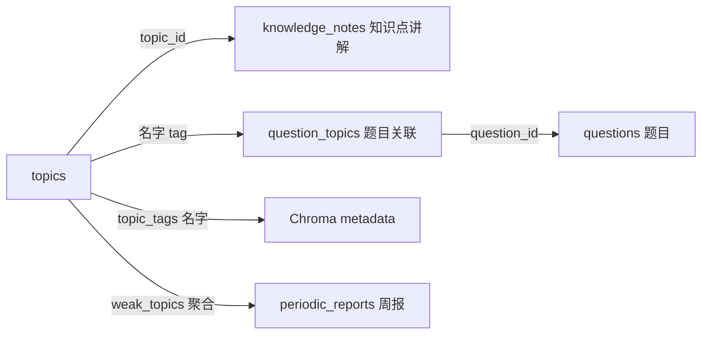

# topics 表详解（知识点树）

> 本表是整个 Gaokao RAG 的**知识骨架**，也是唯一带复杂结构逻辑的表（路径枚举 + 动态构建 + 状态机）。其余 7 张表都是普通 CRUD。

## 功能定位

存储**动态构建的知识点树**——树上任意节点的 `name`（含 `aliases`）都是可用的 tag，用于题目标注（`question_topics`）、Chroma metadata 过滤（`topic_tags`）、周报薄弱知识点聚合。

**树是数据驱动的**：不是预定义 seed，而是随学生摄入的题目/讲解不断演化（LLM 开放式提取 → 归位 → 合并 → 挂载）。MVP 单用户一棵树（`subject` 字段为扩科预留）。

## Schema

```sql
CREATE TABLE topics (
    id          INTEGER PRIMARY KEY AUTOINCREMENT,
    path        TEXT NOT NULL,                    -- 路径枚举: '1/2/3/'（必须尾斜杠，防 id 前缀撞车），根 = '1/'
    name        TEXT NOT NULL,                    -- 知识点名称（LLM 提取，即 tag，同名/同义靠 aliases 归并）
    subject     TEXT NOT NULL,                    -- 学科: "数学" / "物理" / ...
    level       INTEGER NOT NULL,                 -- 层级: 0=根, 1=一级, 2=二级, 3=叶子（可直接子节点过滤）
    description TEXT,                             -- 知识点描述（跨题目聚合）
    -- 动态构建字段
    aliases     TEXT,                             -- 同义表述 JSON: ["离心率", "e=c/a"]（合并/改名时旧名归档于此）
    source_count INTEGER DEFAULT 0,               -- 关联题目数（按名字匹配 question_topics.topic_name，含 aliases；合并后重算）
    confidence  REAL,                             -- 节点可信度（LLM 挂载置信度）
    status      TEXT DEFAULT 'active',            -- active / merged / pending（待归位）
    merged_into INTEGER REFERENCES topics(id),    -- 合并后指向的节点
    created_at  TEXT DEFAULT (datetime('now'))
);

CREATE INDEX idx_topics_path ON topics(path);
CREATE INDEX idx_topics_subject ON topics(subject);
CREATE INDEX idx_topics_status ON topics(status);
```

## 关键设计点

### 1. 路径枚举（Materialized Path）存储

用 `path` 列记录"从根到自身的完整 id 路径"，替代邻接表 + 递归 CTE：

| 操作 | SQL / 做法 |
| ---- | ---------- |
| 取子树 | `WHERE path LIKE '1/2/3/%'`（走 path 索引） |
| 取祖先链 | `path` split('/') 得到 id 序列 |
| 插入 | `INSERT` 拿新 id → `path = 父path \|\| id \|\| '/'` |
| 移动整棵子树 | `UPDATE topics SET path = 新前缀 \|\| substr(path, len(旧前缀)+1) WHERE path LIKE 旧前缀 \|\| '%'`（一次改完） |
| 防环检查 | 新父 `path` 不以本节点 `path` 开头（O(1) 字符串比较） |
| 合并 | source 子树 path 批量替换到 target 前缀 + aliases 并入 target |

**防环必须写在写入路径（`move_topic`/`create_topic`）内部，不能依赖 LLM 自觉；`path` 必须带尾斜杠**，否则 `LIKE '1/2/3/%'` 会误匹配 `1/2/3/60` 这类 id 前缀撞车的节点。

### 2. tag 语义 = 名字即 tag

- 树上任意节点的 `name`（含 `aliases`）都是可用 tag
- Chroma metadata 存**名字快照**（`topic_tags`，见 `questions.md` / data_model.md）
- 树结构演化（合并/移动/改名）**不影响已入库 metadata**——合并/改名时旧名归档进 `aliases`，检索按"name + aliases"并集匹配
- ~~code（知识点编码）~~ 已砍掉：名字即身份，无需额外编码层

### 3. 状态机（动态构建的生命线）

| status | 含义 | 说明 |
| ------ | ---- | ---- |
| `pending` | 待归位 | LLM 新提取、暂挂根/父节点，等下次归位确认 |
| `active` | 正常 | 挂载完成，可被检索/标注 |
| `merged` | 已合并 | `merged_into` 指向目标节点，**锁死不可再操作** |

### 4. 树展开（上卷检索的关键）

```python
def expand_tag_names(node_id) -> list[str]:
    """取子树所有节点的 name + aliases 并集（含自身）。
    用户问"圆锥曲线" → 展开为 ["椭圆","双曲线","抛物线","离心率",...]
    → Chroma metadata.topic_tags 数组 $contains + $or 命中任一（见 vector.md「Metadata 格式与过滤语义」）。"""
```

## 常见操作

- `search_topic(keyword, subject)`：按 name/aliases 模糊查（归位第一步）
- `create_topic(name, parent_id, subject)`：新增（内部先 search 去重；新节点 pending）
- `add_alias(node_id, alias)`：同义表述归并（别名查重）
- `merge_topic(source_id, target_id)`：语义合并（旧名→target aliases；merged 锁死）
- `move_topic(node_id, new_parent_id)`：挂载/移动（**防环强制**）
- `deactivate_topic(node_id)`：软删（status→inactive；**不提供真删**）

## 与其他表的关系



- **摄入侧**：`store/db/topics.py` 封装全部树逻辑 → FunctionTool 挂到知识整理 Agent（见 `docs/agent.md`「知识整理 Agent 详解」）
- **检索侧**：`expand_tag_names` 树展开 → 配合 `AgenticLangchainKnowledgeSearchTool` 过滤 `metadata.topic_tags`（数组 `$contains` + `$or`，见 [vector.md「Metadata 格式与过滤语义」](../../vector.md)）
