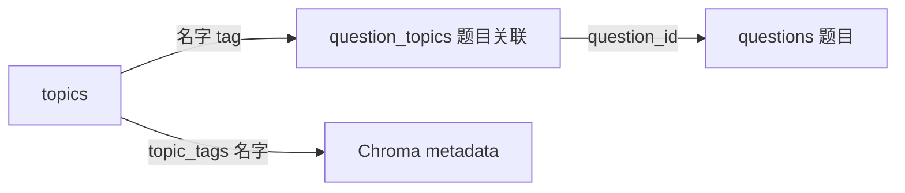

# topics 表详解（知识点标签注册表）

> MVP 版本：扁平 tag 表，无树结构。树形结构（Materialized Path / 父子关系 / 树展开上卷）放在 MVP 后的正式版实现。

## 功能定位

存储**知识点标签注册表**——每个知识点是一条独立记录，`name` 即为 tag，`aliases` 存同义表述。用于题目标注（`question_topics`）、Chroma metadata 过滤（`topic_tags`）、周报薄弱知识点聚合。

**MVP 不做的事**：
- 无父子关系（`parent_id`）
- 无路径枚举（`path`）
- 无树展开（`expand_tag_names`）
- 无动态归位/合并/挂载

## Schema

```sql
CREATE TABLE topics (
    id          INTEGER PRIMARY KEY AUTOINCREMENT,
    name        TEXT NOT NULL UNIQUE,              -- 知识点规范名（即 tag）
    aliases     TEXT,                               -- 同义表述 JSON: ["离心率", "e=c/a"]
    created_at  TEXT DEFAULT (datetime('now'))
);

CREATE INDEX idx_topics_name ON topics(name);
```

## 关键设计点

### 1. 名字即 tag

- `name` 是规范名，直接用于题目标注和 Chroma metadata
- `aliases` 是同义表述（如"离心率"的别称"e=c/a"），检索时按"name + aliases"并集匹配
- 不依赖 id 做关联——`question_topics` 存 `topic_name`（名字），不存 `topic_id`

### 2. 去重策略

- `name` 字段加 `UNIQUE` 约束，防止重复创建同一知识点
- 摄取时 LLM 输出知识点名字 → 先查 `topics` 表（`name = ? OR aliases LIKE ?`）
- 命中则复用已有 id；未命中则 INSERT 新建

### 3. 与 Chroma 的关系

- `topic_tags`（Chroma metadata）存**名字快照**（摄入时的规范名 + 别名）
- 检索时直接按 `topic_tags` 数组做 `$contains` 过滤（见 [vector_store.md「Metadata 格式与过滤语义」](../vector/vector_store.md)）
- **无树展开**：MVP 不做父节点 → 子孙节点的上卷，只查直接命中的 tag

## 常见操作

- `search_topic(keyword)`：按 name/aliases 模糊查（归位第一步）
- `create_topic(name, aliases=[])`：新增（内部先 search 去重）
- `add_alias(topic_id, alias)`：追加同义表述

## 与其他表的关系



- **摄入侧**：`store/db/topics.py` 封装 tag CRUD → 供摄取 Agent / 题目维护 Agent 调用
- **检索侧**：`topic_tags` 直接 `$contains` 过滤（无树展开），见 [vector_store.md「Metadata 格式与过滤语义」](../vector/vector_store.md)

## 正式版升级路径

MVP 验证"标签化检索"可行后，正式版可升级为树形结构：

1. 增加 `path`（Materialized Path）+ `parent_id` 字段
2. 增加 `status`（active/pending/merged）+ `merged_into` 字段
3. 增加 `level` / `confidence` / `source_count` 字段
4. 实现 `expand_tag_names()` 树展开（父节点 → 全部子孙的 name+aliases 并集）
5. 实现 `move_topic` / `merge_topic` / `create_topic` 树操作
6. 题目维护 Agent 增加"归位/合并/挂载"流程

升级时 `name` / `aliases` / `question_topics` 关联不变，平滑过渡。
