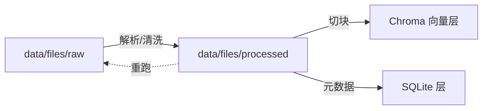

# 处理后中间产物（Layer 1.5：processed）

> 对应 `data/files/processed/`（config `data_dir` 派生）。**可重建的中间产物**——清洗文本、VLM 描述缓存等，丢失后可从 `raw/` 重跑摄入管线再生成。

## 功能定位

raw 与最终库之间的**中间层**。与 raw 的本质区别：

| | `data/files/raw/` | `data/files/processed/` |
| ---- | ----------------- | ----------------------- |
| 内容 | 原始 PDF / 题目图片 | 清洗文本、VLM 描述、提取中间态 |
| 可再生 | **否**（源数据不可再生） | **是**（从 raw 重跑管线） |
| 删除策略 | 永不删除 | 可清理（重跑即重建） |
| 注册 | `files` 表（title/hash） | 不需要注册表（纯中间缓存） |

## 目录结构

```text
data/files/processed/
├── text/                  # 清洗后的文本（去页眉页脚、公式归一化后）
│   └── 3f9a2c81.txt       #   按源文件哈希命名，与 files 表 file_path 关联
├── vlm_desc/              # VLM 图形描述（中间缓存，防止重复调用 VLM）
│   └── a3f2e1c9.json      #   按图片哈希命名
└── split/                 # 题目切分中间态（长试卷先切块再入库）
```

## 关键设计点

1. **可重建原则**：processed 的任何文件都能从 raw + 管线重跑生成——所以不设注册表、不做备份、可随时 `rm -rf` 清理
2. **命名跟随源文件**：文件名用源文件哈希（`3f9a2c81.txt`）——processed ↔ raw 一一对应，调试好定位
3. **缓存价值**：`vlm_desc/` 是成本优化关键——同一张图 VLM 描述只调一次，缓存命中直接复用（VLM 按 token 计费）

### 内容存储角色（不只是缓存）

processed 不只是中间态，还承担**可重建内容的持久存储**——`questions` 表不冗余这些内容，经哈希路径关联读取：

| 子目录 | 存什么 | 关联方式 |
| ------ | ------ | -------- |
| `vlm_desc/{图片sha256}.json` | VLM 图形描述原始内容 | `questions.image_file_ids` → `files.sha256` → 推导路径 |
| `text/{文件sha256}.txt` | 原始提取文本（OCR/解析原文）| `questions.file_id` → `files.sha256` → 推导路径 |

**推导规则**：`processed/vlm_desc/{sha}.json`、`processed/text/{sha}.txt`（sha 与 `files.sha256` 一致）——无需显式存路径，哈希即关联键。读取 VLM 描述/回溯原文时按此约定解析；重跑管线会重新生成同名文件。

## 与各层的关系



- **上游**：raw（原始文件）→ 管线处理 → processed
- **下游**：processed 的文本/描述 → Chroma 向量化 + SQLite 入库（入库后 processed 只是缓存，删了不损失数据，只损失重跑时间）

## 注意事项

1. **清理安全**：磁盘紧张时可清 processed（重跑管线即重建），但**绝不动 raw**
2. **不注册**：processed 不进 `files` 表——files 表只登记不可再生的源文件
3. **git 忽略**：`data/` 整个目录在 `.gitignore`（含 raw 与 processed）

## 与其他文档的关系

- 原始文件：[files/raw.md](raw.md)（raw 目录与 files 表设计）
- 文件注册表：[db/files.md](../db/files.md)
- 摄入管线：processed 是管线的中间产物（见 `docs/ingestion.md`）
