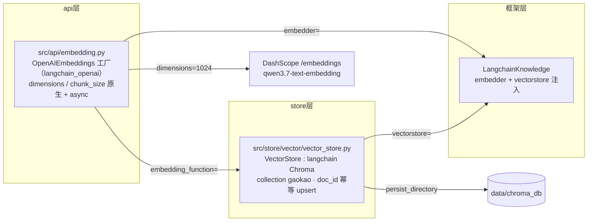

# 向量存储（Layer 3a：Chroma 增删读写）

> 对应 `src/store/vector/vector_store.py`（Chroma 封装）。负责**语义检索的写入侧**：文本 + metadata → 向量 → Chroma collection `gaokao`，供搜索子 Agent 按语义召回（配合 SQLite 精确过滤形成混合检索，见 [architecture.md](../../architecture.md)）。嵌入模型客户端见 [src/api/embedding.py](../../../src/api/embedding.py) 的工厂说明（下文「嵌入模型选型」「向量维度」同源决策）。检索查询侧（Knowledge 对象构建）见 [knowledge.md](./knowledge.md)。

## 功能定位

三层存储的**最顶层索引**——SQLite 负责"精确过滤"（知识点/年份/考区），Chroma 负责"语义相似"（按问题含义检索），两层通过 `doc_id` 桥接。**Collection / doc_id / Document 策略**见 [data_model.md](../../data_model.md)「Chroma 向量层」一节；**Metadata 格式与过滤语义见本文档下文**——本文档是向量存储写入侧的单一来源。

## 技术选型：langchain-chroma（不直接用原生 chromadb）

| 方案 | 说明 | 结论 |
| ---- | ---- | ---- |
| 原生 `chromadb.Client` | data_model.md 早期示例的写法 | ✗ 不满足 A 方案 |
| **`langchain_chroma.Chroma`** | 实现 langchain `VectorStore` 接口（`asearch` / `afrom_documents` / `similarity_search_with_relevance_scores`） | ✓ **采用** |

**原因**：`LangchainKnowledge.search()` 内部调用 `vectorstore.asearch()`（见 [tRPC-Agent 源码](https://github.com/trpc-group/trpc-agent-python/blob/main/trpc_agent_sdk/server/knowledge/langchain_knowledge.py)），要求 vectorstore 是 langchain `VectorStore` 接口实现。原生 chromadb API 满足不了，故统一走 langchain Chroma，**不要混用两种 API 操作同一个 `chroma_db`**（避免双写不一致）。

## 嵌入模型选型：qwen3.7-text-embedding（2026-08-19 定）

对比 DashScope 各嵌入模型（官方模型市场 / 文档）：

| 模型 | 价格 | 可选维度 | 批量（条/次） | 单批 Token | 性能 |
| ---- | ---- | -------- | ------------ | ---------- | ---- |
| **qwen3.7-text-embedding** | ¥0.5/M | 2560/2048/1536/**1024(默认)**/768/512/256 | **20** | **128K** | v4 基础上检索任务 +20%，201 种语言，上下文 131K |
| text-embedding-v4 | ¥0.5/M | 2048/1536/1024/768/512/256/128/64 | 10 | 33K | MTEB 68.36 @1024 / 71.58 @2048 |
| text-embedding-v3 | ¥0.5/M | 1024/768/512/256/128/64 | 10 | 8K | MTEB 63.39 @1024 |
| text-embedding-async-v2/v1 | — | 1536 固定 | 100K（离线） | 2K | 全量索引专用，MVP 不用 |
| text-embedding-v2/v1 | — | 1536 固定 | 25 | 2K | 老模型，排除 |

**决策：qwen3.7-text-embedding，dimension=1024（默认）**。理由：
1. **同价（¥0.5/M）性能最强**——v4 基础上检索任务提升 20%，无理由选旧代
2. 维度 256~2560 可自定义，1024 默认——契合"config 规定维度 + 显式传参"方案
3. 批量 20 条 / 128K token（v4 仅 10 条 / 33K）——批量摄入请求次数减半；131K 上下文，长文档一次嵌入不截断
4. **模型中立**：走 OpenAI 兼容端点，换平台/换模型只改 `base_url` + `model`（不绑 DashScope 原生 API）

> 为什么不选 DashScope 原生 API（厂商专属协议）：`text_type`（非对称检索）需实测确认 qwen3.7 支持；`output_type=dense&sparse` 稀疏检索 Chroma 不支持，落地要自建稀疏索引，MVP 不值；`instruct` 增益 1-5% 锦上添花。为这些用不上的功能牺牲模型中立，不值。触发条件：检索效果实测不达标再评估。

## 向量维度（核心决策，必须显式指定）

### 为什么必须规定维度

AlgoNotes 踩过的坑（`algonotes_rag/issues/IJVLRZ.md`）：**同一个模型 `Qwen/Qwen3-Embedding-4B`，不传维度参数时不同平台返回不同维度**——

| 平台 | 返回维度 |
| ---- | -------- |
| Gitee.AI | 1024 |
| SiliconFlow | 2560 |

而 Chroma collection 一旦建好维度就固定（AlgoNotes `docs/STORE.md` 教训：**更换 Embedding 模型时必须先删除旧 collection 再重建，否则维度冲突报错**）。连锁后果：不显式固定维度，将来换平台/换模型名，库里已有向量与新向量维度不一致，整个检索直接崩。

**决策：`config.toml` 的 `[embedding]` 段规定 `dimension`，请求显式传 `dimensions` 参数，不依赖模型/平台默认值。**

### 官方 API 确认（platform.qianwenai.com text-embedding 文档）

| 端点 | 参数名 | 默认值 | 可选值 |
| ---- | ------ | ------ | ------ |
| OpenAI 兼容（`/compatible-mode/v1/embeddings`） | **`dimensions`**（复数） | 1024 | 2048 / 1536 / 1024 / 768 / 512 / 256 / 128 / 64（2048/1536/256/128/64 仅 v4） |
| DashScope 原生（`/api/v1/services/embeddings/...`） | **`dimension`**（单数） | 1024 | 同上 |

本走 **OpenAI 兼容端点**，由 `langchain_openai.OpenAIEmbeddings` 封装（它原生透传 `dimensions` + `chunk_size` 自动分批 + async），配置见 `config.embedding`。

> ⚠️ **实测（2026-08-20 探针）**：DashScope OpenAI 兼容端点的 `/embeddings` **不接受 token-ID 格式**（`{"input":[[token_id,...]]}`，即 langchain 在 `check_embedding_ctx_length=True` 默认参数下的发送格式），直接返回 400 `contents is neither str nor list of str`。因此 `embedding.py` **必须**设 `check_embedding_ctx_length=False`（发纯文本），见「坑 8」。这与 Gitee.AI 修复前的行为一致（用户 Gitee issue IJUQ06）。

> 官方文档模型表未列 `qwen3.7-text-embedding`（更新滞后），但其 OpenAI 兼容端点的 `dimensions` 参数 **qwen3.7 支持 1024**——已于 2026-08-20 实测确认（探针 Test 3 返回 1024 维）。不再需要"先冒烟再定白名单"的保留条款，`dimensions=1024` 作为硬约束显式传入。

### 配置

```toml
# config.toml
[embedding]
model = "qwen3.7-text-embedding"
base_url = "https://dashscope.aliyuncs.com/compatible-mode/v1"
api_key = "${DASHSCOPE_API_KEY}"
timeout = 60.0
dimension = 1024          # 向量维度，显式指定；换值需重建 collection

[store]
data_dir = "data"
collection_name = "gaokao"   # Chroma collection 名（全科共用，metadata.subject 过滤学科）
```

`src/config.py`：`EmbeddingConfig.dimension`（默认 1024）+ `StoreConfig.collection_name`（默认 "gaokao"）。

### 维度一致性防呆（vector_store.py）

```python
def __init__(self, collection_name: str, persist_dir: str, expected_dim: int) -> None:
    self.vectorstore = Chroma(
        collection_name=collection_name,
        embedding_function=get_embedding_model(),
        persist_directory=persist_dir,   # 必须显式传，见「坑 2」
    )
    existing = self.vectorstore.get(limit=1)
    if existing["ids"] and len(existing["embeddings"][0]) != expected_dim:
        raise RuntimeError(
            f"Chroma collection '{collection_name}' 现有向量维度 "
            f"{len(existing['embeddings'][0])} 与 config embedding.dimension={expected_dim} 不一致。"
            "更换维度需先删除 data/chroma_db 重建。"
        )
```

**Chroma 不预指定维度**（对比腾讯云向量库的 `IndexParams(dimension=768)`）：以第一批入库向量的维度为准，因此防呆校验放在初始化时。

## Metadata 格式与过滤语义

**定位：Chroma metadata 是检索快照**——只存过滤/展示需要的字段，内容（题干/答案/解析/关联）一律不存；SQLite 是权威源，metadata 摄入时从 SQLite 行派生、同事务双写。

**类型约束（Chroma 官方）**：值支持 `str / int / float / bool / 同类型数组`（str[] / int[] / float[] / bool[]）；`$contains` 是**数组包含**操作（非字符串子串匹配）；`$gt/$gte/$lt/$lte` 仅数值；多条件用 `$and` / `$or` 嵌套。

**通用字段（题目与讲解共有）**：

| 字段 | 类型 | 示例 | 过滤方式 | 说明 |
| ---- | ---- | ---- | -------- | ---- |
| `doc_id` | str | `q_42` / `kn_7` | 不参与过滤 | 幂等 upsert 键 + SQLite 桥 |
| `doc_type` | str | `question` / `note` | `$eq` / `$in` | 来源类型，检索混合召回用 |
| `subject` | str | `数学` | `$eq` | 学科（MVP 固定，扩科后过滤） |
| `source_type` | str | `exam` / `homework` / `notes` | `$in` | 资料类型 |
| `title` | str | `2026 南昌一模数学卷` | 不参与过滤 | files.title 快照，检索结果可读 |
| `topic_tags` | **str[]** | `["椭圆", "离心率"]` | `$contains` | 知识点 tag 名字快照（摄入时的规范名 + 别名），直接匹配 |

**题目专属字段**：

| 字段 | 类型 | 示例 | 过滤方式 |
| ---- | ---- | ---- | -------- |
| `exam_regions` | **str[]** | `["南昌", "江西", "全国一卷"]` | `$contains`（考区层级，从小到大） |
| `exam_year` | int | `2026` | `$eq` / `$gte` / `$lte`（可空：作业/资料不存该字段） |
| `question_type` | str | `解答题` | `$eq` / `$in` |
| `has_image` | bool | `True` | `$eq`（Chroma 过滤专用快照） |

讲解 document（`kn_*`）只有通用字段，无 `exam_*` / `question_type` / `has_image`。

**示例（题目 q_42）**：

```python
{
    "doc_id": "q_42",
    "doc_type": "question",
    "subject": "数学",
    "source_type": "exam",
    "title": "2026 南昌一模数学卷",        # 语义标题（files.title 快照，检索可读）
    "exam_regions": ["南昌", "江西", "全国一卷"],   # 考区层级，从小到大
    "exam_year": 2026,
    "question_type": "解答题",
    "topic_tags": ["椭圆", "离心率"],      # 知识点名字快照（name + aliases）
    "has_image": True,                    # Chroma 过滤专用快照
}
```

**过滤语义**：

```python
# 学科 + 知识点（topic_tags 数组 $contains，命中任一即召回）
{"$and": [
    {"subject": "数学"},
    {"topic_tags": {"$contains": "椭圆"}}
]}

# 考区 + 年份 + 题型
{"$and": [
    {"exam_regions": {"$contains": "南昌"}},
    {"exam_year": {"$gte": 2024}},
    {"question_type": {"$in": ["选择题", "填空题"]}},
]}

# 含图题目
{"has_image": True}
```

> **tag 快照**：`topic_tags` 是摄入时的名字快照（人话、可读）。检索时直接按 `topic_tags` 数组做 `$contains` 匹配（MVP 不做树展开）。正式版引入树形结构后，可通过树展开（父节点 → 子孙名字并集）做上卷检索。

> **字段取舍**：`image_file_ids`、`exam_month` **不存 Chroma**——前者以 SQLite `questions.image_file_ids` 为准（检索用不上，要图 → `has_image` 过滤 + doc_id 回查 SQLite）；后者检索价值低（年份够用），按月聚合走 SQLite。

### 实现注意：langchain Filter vs Chroma where

⚠️ langchain 的 Filter 语法（`$eq/$ne/$in/$gt...`）**不含 `$contains`**——它是 Chroma 专有操作符。`AgenticLangchainKnowledgeSearchTool` 生成的 filter 若覆盖不到数组语义，`VectorStore.search()` 需要支持直接透传 **chromadb 原生 where**（或加 langchain Filter → Chroma where 的翻译层），否则数组字段（知识点/考区）无法过滤。实现时以实测为准，测试里覆盖"数组 $contains 过滤"用例。该翻译层由 [knowledge.md](./knowledge.md) 的 `GaokaoKnowledge` 子类负责。

## 组件装配



> 查询侧 Knowledge 对象如何消费 `embedder` / `vectorstore`，以及 `GaokaoKnowledge` 子类的过滤翻译，见 [knowledge.md](./knowledge.md)。

### src/api/embedding.py —— embedder（OpenAIEmbeddings 工厂）

- **直接用 `langchain_openai.OpenAIEmbeddings`**，不自写 `Embeddings` 子类——它本身就是 langchain `Embeddings` 接口实现（含 `aembed_documents`/`aembed_query` async 版），可直接注入 `LangchainKnowledge.embedder` 与 `langchain_chroma.Chroma` 的 `embedding_function`。
- 构造参数（来自 `config.embedding`）：`model` / `api_key=SecretStr(...)` / `base_url` / **`dimensions=cfg.dimension`（显式传维度，防 AlgoNotes 跨平台坑——OpenAIEmbeddings 仅在 `dimensions is not None` 时透传 `params["dimensions"]`）** / `chunk_size=20`（qwen3.7 单次 input 数组 ≤20 条，原生自动分批，不用手写循环）/ **`check_embedding_ctx_length=False`（必设：DashScope 实测拒收 token-ID 格式，见「坑 8」）** / `timeout=cfg.timeout`（透传 openai client，非 langchain 自有字段）。`tiktoken_enabled` **不显式设**（保持默认 True）——因 `check_embedding_ctx_length=False` 已绕过 token 化，该参数实际不参与；设 `False` 反而要求 HF transformers，无益。
- `get_embedding_model()` 懒初始化单例，**保留我们的约定**：白名单（`_SUPPORTED_MODELS = ("qwen3.7-text-embedding",)`）+ `${VAR}` 占位符检查（api_key 未解析则 RuntimeError）+ 初始化日志（用 `trpc_agent_sdk.log.logger`，不 import 业务 logger）

### src/store/vector/vector_store.py —— Chroma 封装

| 方法 | 用途 |
| ---- | ---- |
| `upsert(doc_id, text, metadata)` / `upsert_many(...)` | 写入/更新，**doc_id 幂等**（同 id 覆盖，重复摄入不产生重复 document） |
| `search(query, k, where)` | 语义检索 + metadata 过滤 → `(Document, score)`；`where` 支持 langchain Filter **和 chromadb 原生 where**（数组 `$contains` 需原生透传，见「Metadata 格式与过滤语义 · 实现注意」） |
| `delete(doc_ids)` | 删除题目/讲解时同步删对应 document |
| `get(doc_id)` | 按 id 取 document（更新前查重、一致性校验） |
| `count()` | collection 内 document 总数 |
| `vectorstore` 属性 | 底层 Chroma 实例，**供 LangchainKnowledge 注入**（见 [knowledge.md](./knowledge.md)） |

`get_vector_store()` 懒初始化单例。

## 坑清单（实现时必看）

1. **doc_id 格式**：权威格式是两段式 `q_42` / `kn_7`（data_model.md「doc_id 生成规则」+ `questions.py::_make_doc_id`）；曾有文档示例写成 `q_42_question` / `q_001_question`，已修正
2. **`afrom_documents` 会重建实例**：`LangchainKnowledge.create_vectorstore_from_document()` 内部调 `vectorstore.afrom_documents(...)`（classmethod，返回**新实例**）——注入的 Chroma 必须带 `persist_directory` + `embedding_function`，否则新实例落到默认临时目录，**数据直接丢**
3. **维度不写死、但 collection 建后固定**：维度由 config 规定（见上）；换维度 = 删 `data/chroma_db` 重建（AlgoNotes STORE.md 教训）
4. **批量上限**：qwen3.7 单次 ≤20 条（`chunk_size=20` 传给 OpenAIEmbeddings 自动分批）；v3/v4 为 10；Gitee.AI ≤25（历史踩坑，当前不用）
5. **不混用原生 chromadb API 与 langchain Chroma**（同库双写会不一致）
6. **数组过滤走 Chroma 原生 where**：`$contains` 不在 langchain Filter 语法内（见「Metadata 格式与过滤语义 · 实现注意」），数组字段过滤不能只依赖 langchain 翻译
7. **依赖版本约束**：`langchain-chroma` 必须 `>=1.1.0`——当前 `uv.lock` 锁定 `langchain-core==1.5.4`（新版主版本线），旧版 langchain-chroma（0.1/0.2/0.3）要求 `langchain-core<0.4`，会依赖冲突导致 `uv sync` 失败。**已落地**（commit e72021d）：`langchain-chroma>=1.1.0` + `langchain-openai>=1.4.3` + `openai>=2.54.0`。`chromadb` 不必单独声明（langchain-chroma 传递依赖）
8. **DashScope 拒收 token-ID 格式（实测确认，2026-08-20）**：`OpenAIEmbeddings` 在 `check_embedding_ctx_length=True`（默认）时经 tiktoken 把文本编码为 token-ID 列表，发送 `{"input":[[token_id,...]]}`；DashScope 返回 400 `contents is neither str nor list of str`。设 `check_embedding_ctx_length=False`（发纯文本）才正常（返回 1024 维，见探针 Test 3）。**因此 `embedding.py` 必须显式保留 `check_embedding_ctx_length=False`，不可删**。该 flag 还有独立作用：让 `chunk_size=20` 当每批条数切分，保障不超 DashScope 单次 ≤20 条限制。探针代码：`D:\AI_study\learn\qwen_test\qwen_tiktoken_probe.py`（对标 Gitee issue IJUQ06，项目外本地运行，不进仓库）。**检索查询侧同样适用**：查询子 Agent 复用同一 `get_embedding_model()` 实例，故该约束对 [knowledge.md](./knowledge.md) 的检索路径同样生效。

   **为何 LangChain 默认发 token-ID（设计溯源，2026-08-20 查文档）**：token-ID 格式是 LangChain 为 **OpenAI 官方 API** 设计的——官方 `input` 明确支持 `array of number / array of array of number`（"array of integers that will be turned into an embedding"）。但大量第三方 OpenAI 兼容端点没完整复刻该细节。LangChain 官方对此的明确建议（[OpenAIEmbeddings API reference](https://reference.langchain.com/python/integrations/langchain_openai/openai-embeddings/)）：

   > When using a non-OpenAI provider, set `check_embedding_ctx_length=False` to send raw text instead of tokens (which many providers don't support)

   这等于框架官方把"token-ID 是给 OpenAI 官方用的、第三方兼容端点多数不认"写进了文档；本项目 DashScope 落在"不认"那一档（实测 400），故 `check_embedding_ctx_length=False` 既符合 LangChain 官方建议、又被本项目实测双重确认。跨平台兼容性实测/查档汇总：

   | 平台 | 接受 token-ID 格式？ | 依据 |
   | ---- | ---- | ---- |
   | OpenAI 官方 | ✅ 支持 | 官方 API 文档 `input` 含 `array of number / array of array of number` |
   | 硅基流动 SiliconFlow | ✅ 支持 | 官方文档 `input` = `string or an array of tokens... array of token arrays` |
   | Gitee.AI | ⚠️ 历史不支持，issue 后已修复 | 用户 issue IJUQ06（修复前与 DashScope 现态同症状）|
   | DashScope 阿里（本项目）| ❌ 不支持 | 2026-08-20 实测 400 `contents is neither str nor list of str` |
   | HF TEI / 本地兼容（LM Studio 等）| ❌ 不支持 | LangChain 官方文档示例 + GitHub issue #21318 |

   **模型中立提醒**：即便硅基流动"接受"token 数组格式，LangChain 生成的 token-ID 用 tiktoken `cl100k_base`（OpenAI 词表），对 Qwen 模型未必是语义正确的切分——换平台/模型时 `check_embedding_ctx_length=False`（发纯文本）依然是普适安全项，不要因为"平台支持"就去掉它。

## 测试要点

- `tests/test_api_embedding.py`：monkeypatch `langchain_openai.OpenAIEmbeddings` 底层 `embeddings.create` 为 fake——验证 `embed_query` 单条、`embed_documents` 超 20 条触发 `chunk_size=20` 分批、`dimensions` 透传、`${VAR}` 占位符报错、白名单校验；`check_embedding_ctx_length=False` 强制（对应坑 8）
- `tests/test_vector_store.py`：`tmp_path` 持久化 + FakeEmbedder（定长向量，不真调 DashScope）——验证 upsert 幂等（同 doc_id 覆盖不重复）、`search` 的 where 过滤、`delete` 后 `get` 为空、**维度防呆报错**

## 与其他文档的关系

- 数据模型：[data_model.md](../../data_model.md)（Collection / doc_id / Document 策略；Metadata 格式见本文档）
- 题目表：[db/questions.md](../db/questions.md)（`doc_id` 桥接、`has_image` 过滤快照）
- 讲解表：[db/knowledge_notes.md](../db/knowledge_notes.md)（`kn_*` document）
- 知识树：[db/topics.md](../db/topics.md)（`topic_tags` 名字快照，MVP 直接匹配无树展开）
- 检索查询侧：[knowledge.md](./knowledge.md)（LangchainKnowledge + LangchainKnowledgeSearchTool + GaokaoKnowledge 子类）
- 配置：`config.toml` `[embedding]` / `[store]` 段（`dimension` / `collection_name`）
