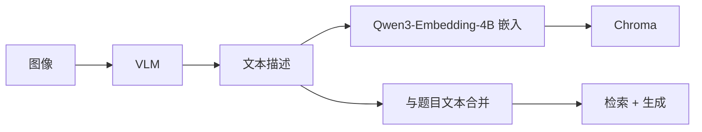

# VLM 图形理解策略

## 概述

VLM（视觉语言模型）是 Gaokao RAG 和 AlgoNotes RAG 拉开差距的核心技术点。高考各科大量依赖图形——数学的几何图、函数图像、立体几何图、统计图，化学的结构式/实验装置，生物的细胞/系谱图——纯文本 RAG 根本处理不了。MVP 聚焦数学图形。

## 能力边界与扩科依据（2026-08 调研结论）

> 本节的结论来自 2026 年 Qwen3-VL 系 benchmark（MathVista、MMMU-Pro、OCRBench）+ 多份独立评测。目的：明确"数学 MVP 为什么稳"以及"未来扩科到理化生的技术前提"。

### 各场景能力评估

| 场景 | 能力等级 | 说明 |
| ------ | --------- | ------ |
| **数学图**（几何/函数/坐标系） | ✅ 强 | 理解准确率 96%+，MathVista 8B 即 79-80 分，无技术风险 |
| **化学图**（结构式/实验装置） | 🟡 中等偏上 | 分子式/装置图可靠（92%+）；键线式/结构式识别 90%+ 但**高风险**——键位看错全题错 |
| **生物图**（细胞/解剖/系谱） | 🟡 中等偏上 | 结构标注识别 95% 左右；小字密集标注在低分辨率下会掉精度 |
| **手写笔记 · 工整** | ✅ 强 | CER < 2%，接近专用 OCR，可支撑"拍照错题/笔记"场景 |
| **手写笔记 · 潦草/连笔/涂改** | ⚠️ 弱 | CER 15-20%；模型可利用上下文推测纠错（"日"→"目"），但不可靠 |
| **手写数学公式** | ✅ 强 | 识别 90%+，可直接转 LaTeX，接上"公式走文本 RAG"管线 |

### 对项目设计的三个影响

1. **数学 MVP 稳了**：图形理解 + 手写公式都在可靠区间，VLM 不是 MVP 风险点
2. **错题录入：VLM 只识别题目，错因靠用户口述**：潦草手写识别不可靠（CER 15-20%），因此设计上**不存手写解题过程**——VLM 仅负责识别题目本身（回显确认），错因由用户口述 + LLM 结构化总结（见 data_model.md `error_summary`），绕开手写识别的准确率瓶颈
3. **扩科（理化生）是"质量工程"而非"换技术"**：
   - 不需要换 VLM 或引入多模态嵌入，沿文本描述管线即可
   - 但需要更高描述质量阈值 + 高风险图类型（键线式/结构式）人工抽查
   - 化学结构式建议直接升级 32B-Thinking（见下文自动升级策略的扩展方向）

### 扩科决策依据（为什么数学先行）

| 因素 | 数学（MVP） | 化学 | 生物 |
| ------ | ------------ | ------ | ------ |
| VLM 图形理解可靠度 | 96%+ | 90%+（结构式有风险） | 95%（小字标注有风险） |
| 数据完整度（ima 知识库） | 试卷+专题+错题完整 | 数据少 | 数据少 |
| 知识点体系 | 树形清晰（8 类一级） | 需另建图谱 | 需另建图谱 |
| 手写公式支撑 | ✅ LaTeX 直接入库 | 化学式有上下标，部分可用 | 一般 |

**结论**：数学是 VLM 能力 + 数据 + 图谱三重条件最成熟的 MVP 切入点（项目愿景全科，数学先行）。理化生扩科技术上可行，但属于 V1.1 之后的质量工程，不进入 MVP。

## 核心策略

### 总体方案：VLM 转文本描述 → 下游全走文本 RAG



**为什么不用多模态嵌入**：

- MVP 阶段最简路径，快速跑通闭环
- VLM 生成的描述比多模态嵌入更可解释、可调试
- 后续可升级为多模态嵌入（如 jina-clip-v2），但文本路径保留

## 模型选型

> 模型中立原则：VLM 走 Qwen 官方 API（阿里云百炼 DashScope，OpenAI 兼容模式）。开发期默认如下，模型名/API Key 走环境变量，不硬编码。

| 模型 | model ID（DashScope 实际值） | 定位 | 使用场景 | 成本 |
| ------ | ------ | ------ | --------- | ------ |
| Qwen3-VL-8B-Instruct | `qwen3-vl-8b-instruct` | 主力 | 常见几何图、函数图像、坐标系 | 低 |
| Qwen3-VL-32B-Thinking | `qwen3-vl-32b-instruct` | 推理增强 | 立体几何、含参数的函数组合图、复杂组合图、化学结构式 | 高 |
| MinerU2.5-Pro | - | PDF 解析 | 复杂版面试卷 PDF 的版面分析 | 按调用计费 |

**注意**：DashScope 的 model ID 是小写格式（`qwen3-vl-8b-instruct`），与文档展示名 `Qwen3-VL-8B-Instruct` 有大小写差异。实现时以百炼控制台列出的 model ID 为准。

Base URL：`https://dashscope.aliyuncs.com/compatible-mode/v1`（OpenAI 兼容端点）。

### 自动升级策略

```python
def select_vlm_model(image_path: str, question_text: str) -> str:
    """
    根据图像特征选择 VLM 模型。
    默认 8B，检测到复杂场景升级 32B。
    """
    # 启发式规则
    complexity_indicators = [
        "立体几何", "三棱锥", "四棱锥", "旋转体",
        "组合", "叠加", "复合",
        "恒成立", "存在性", "存在...",
    ]
    
    for indicator in complexity_indicators:
        if indicator in question_text:
            return "Qwen3-VL-32B-Thinking"
    
    # 图像尺寸启发式：大图可能更复杂
    img_size = get_image_size(image_path)
    if img_size > 500_000:  # 500KB 以上
        return "Qwen3-VL-32B-Thinking"
    
    return "Qwen3-VL-8B-Instruct"
```

## Prompt 设计

### 核心 Prompt

```text
你是一位高中数学教师。请分析这张数学图形，给出结构化描述。

题目文字：{question_text}

请按以下格式描述：

1. 图形类型
   - 选择：函数图像 / 几何图形 / 坐标系 / 立体几何 / 统计图 / 表格 / 其他

2. 关键元素
   - 列出图形中的核心数学对象及其属性
   - 例：椭圆，长轴=2a，焦点在x轴上，A(0,b)在上顶点

3. 数量关系
   - 提取图形中可确定的数学关系
   - 例：椭圆方程 x²/4 + y²/3 = 1，离心率 e = 1/2

4. 与题目的关联
   - 图形提供了什么约束条件？
   - 哪些信息是文字没有但图形提供的？

注意：
- 描述要精确到可用于文本检索（"椭圆""离心率""焦点三角形"等关键词必须出现）
- 不要直接给出题目答案
- 如果图形不清晰或无法识别，明确说明
```

### 描述粒度

这是关键设计决策。以一道椭圆题为例：

**过粗（无检索价值）**：
> 这是一个椭圆的图像。

**过细（过拟合，泛化性差）**：
> 椭圆 x²/4 + y²/3 = 1，左焦点 F₁(-1,0)，右焦点 F₂(1,0)，点 A(0,√3)，B(1, 3/2)。

**合适（有检索价值 + 可泛化）**：
> 椭圆 x²/4 + y²/3 = 1 的图像。长轴在 x 轴上，长半轴 a=2，短半轴 b=√3。焦点在 x 轴上。图中标注了焦点三角形 F₁AF₂，其中 A 为上顶点。已知条件涉及焦点三角形的面积和离心率的最值。

**粒度原则**：

1. 必须包含可检索关键词（知识点名称）
2. 必须包含具体数值（但标注为"已知条件"而非"答案"）
3. 必须描述图形与题目的语义关联
4. 不直接解题

## 上下文关联

### 问题：图像不是孤立的

一道数学题的图必须和题目文字结合才有意义。例如：

- 题目文字："如图，已知椭圆 E 的方程为 x²/a² + y²/b² = 1..."
- 图形：一个椭圆

如果 VLM 只看图，它会描述"一个椭圆，焦点在 x 轴"。
但题目文字提供了 a、b 的具体值和题目要求。

### 解决方案：题目文字 + 图片同时传入 VLM

```python
response = await call_vlm(
    model="Qwen3-VL-8B-Instruct",
    image=image_path,
    prompt=prompt_template.format(question_text=question_text)
)
```

VLM 同时看到题目文字和图形，描述会更精确——知道椭圆的参数，知道题目问什么，描述时能突出相关信息。

## 摄取时 vs 查询时调用

### 摄取时调用（当前方案）

VLM 在摄取阶段调用一次，描述存入数据库，查询时不重复调用。

**优点**：

- 查询时低延迟
- 成本可控（每张图只调用一次）
- 描述质量可提前审核

**缺点**：

- 描述固定，无法适应不同查询意图

### 查询时调用（备选方案）

用户提问涉及特定图形时，实时调用 VLM。

**优点**：

- 描述可以针对用户问题定制

**缺点**：

- 延迟高
- 成本高（重复调用）
- 用户体验差

**决策**：MVP 用摄取时调用。后续如需增强，可以对高频查询的图形做缓存。

## 异常处理

| 场景 | 处理 |
| ------ | ------ |
| VLM 返回空描述 | 降级：用图像文件名 + 题目文字的 OCR 结果作为描述 |
| VLM 返回错误 | 重试 1 次，仍失败则标记 `vlm_status="failed"`，继续处理 |
| 图像损坏/无法读取 | 跳过 VLM 调用，metadata 标记 `has_image=True, vlm_descriptions=[]` |
| VLM 描述包含答案 | Prompt 约束 + 后处理：正则检测"答案""等于""选"等关键词，告警人工审核 |

## 批量处理优化

摄取大量试卷时，VLM 调用是瓶颈。

**策略**：

1. **异步并发**：多张图并行调用 VLM（控制并发数，避免 API 限流）
2. **缓存**：相同图像（hash 一致）不重复调用
3. **分级处理**：先快速扫描所有图像（8B），标记需要复杂推理的，再批量调用 32B
4. **断点续传**：记录已处理的图像路径，中断后从上次位置继续

## 质量评估

### 人工抽样审核

从每份试卷中随机抽取 2-3 题，人工检查 VLM 描述质量：

- 是否包含关键知识点关键词
- 数值是否准确
- 是否泄露答案
- 是否过度泛化

### 自动指标

- **关键词覆盖率**：VLM 描述中是否包含该题标注的知识点关键词
- **检索命中率**：用 VLM 描述做 query 检索，能否命中原始题目
- **下游任务表现**：最终答案生成的准确率（对比有/无 VLM 描述的情况）
